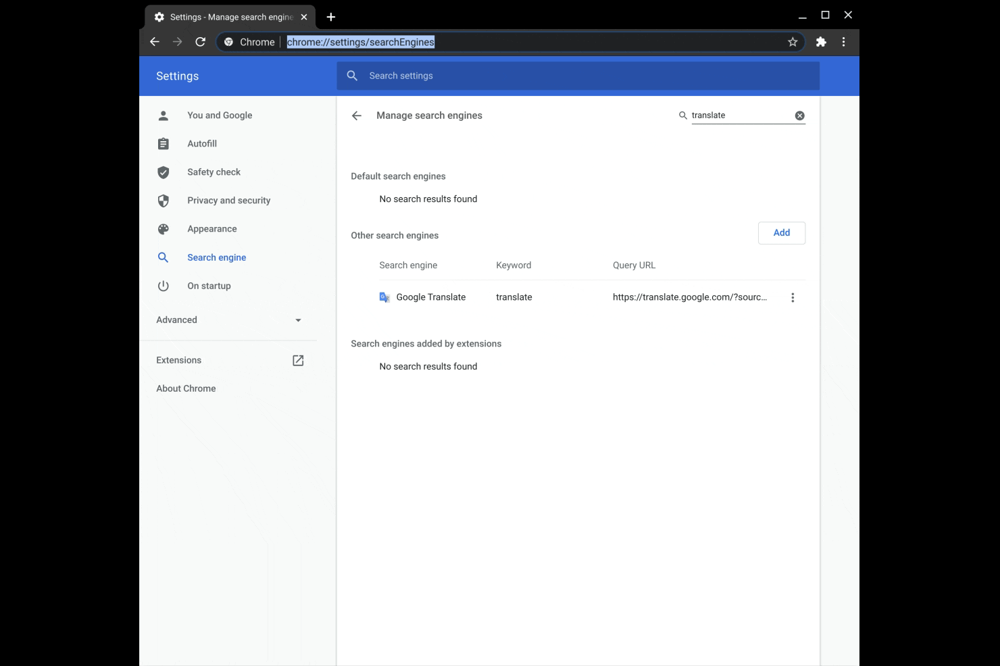

Do you (like me) find yourself frequently searching for information within the same websites over and over? Wouldn't it be great if you could just type your query into your browser's address bar (AKA the Chrome Omnibox) and go straight to the results you need? Well you totally can - and probably already *are* for certain sites which have inserted themselves as search engines.

### The basics
Point your browser to `chrome://settings/searchEngines` to see which sites are registered as Custom Search Engines:


Each of these search engine entries has three parts: a name ("Search engine"), a Keyword, and a Query URL. The "Search engine" title is just what will appear in the Omnibox when the search engine gets triggered, the Keyword is what you'll type in the Omnibox to trigger it, and the Query URL tells Chrome how to handle the search. All you have to do is type the keyword, hit your Tab key to activate the search, input your query, and hit Enter:


For sites which register themselves automatically, the keyword is often set to something like `domain.tld` so it might make sense to assign it as something shorter or more descriptive. 

The Query URL is basically just what appears in the address bar when you search the site directly, with `%s` placed where your query text would normally go. You can view these details for a given search entry by tapping the three-dot menu button and selecting "Edit", and you can manually create new entries by hitting that big friendly "Add" button:


By searching the site directly, you might find that it supports additional search filters which get appended to the URL:


You can add those filters to the Query URL to further customize your Custom Search Engine:


I spend a lot of my free time helping out on Google's support forums as a part of their [Product Experts program](https://productexperts.withgoogle.com/what-it-is), and I often need to quickly look up a Help Center article or previous forum discussion to assist users. I created a set of Custom Search Engines to make that easier:


------

### Creating search where there is none
Even if the site doesn't have a built-in native search, you can leverage Google's `sitesearch` operator to create one. I often want to look up a Linux command's `man` page, so I use this Query URL to search https://www.man7.org/linux/man-pages/:
```
http://google.com/search?q=%s&sitesearch=man7.org%2Flinux%2Fman-pages
```


------

### Speak foreign to me
This works for pretty much any site which parses the URL to render certain content. I use this for getting words/phrases instantly translated:



------

### Shorter shortcuts
Your Query URL doesn't even need to include a query at all! You can use the Custom Search Engines as a sort of hyper-fast shortcut to pages you visit frequently. If I create a new entry with the Keyword `searchax` and `abusing-chromes-custom-search-engines-for-fun-and-profit` as the query URL, I can quickly open to this page by typing `searchax[tab][enter]`:


I use that trick pretty regularly for getting back to vCenter appliance management interfaces without having to type out the full FQDN and port number and all that. 

------

### Scratchpad hack
You can do some other creative stuff too, like speedily accessing a temporary scratchpad for quickly jotting down notes, complete with spellcheck! Just drop this into the Query URL field:
```
data:text/html;charset=utf-8, <title>Scratchpad</title><style>body {padding: 5%; font-size: 1.5em; font-family: Arial; }"></style><link rel="shortcut icon" href="https://ssl.gstatic.com/docs/documents/images/kix-favicon6.ico"/><body OnLoad='document.body.focus();' contenteditable spellcheck="true" >
```
And give it a nice short keyword - like the single letter 's':


------

With just a bit of tweaking, you can really supercharge Chrome's Omnibox capabilities. Let me know if you come across any other clever uses for this!