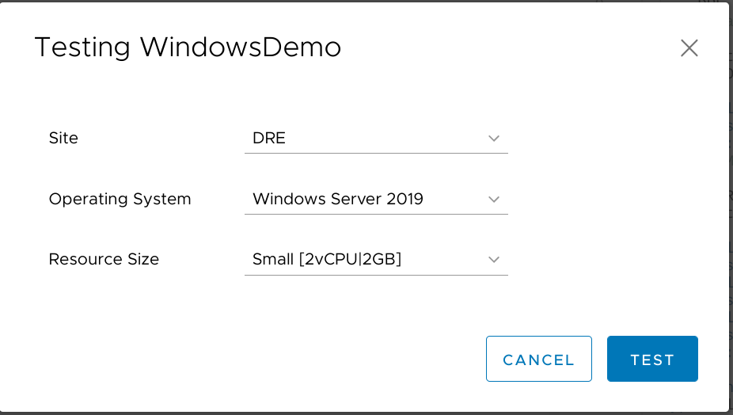

I recently shared [some details about my little self-contained VMware homelab](/vmware-home-lab-on-intel-nuc-9) as well as how I [integrated {php}IPAM into vRealize Automation 8 for assigning IPs to deployed VMs](/integrating-phpipam-with-vrealize-automation-8). For my next trick, I'll be crafting a flexible Cloud Template and accompanying vRealize Orchestrator workflow that will help to deploy and configure virtual machines based on a vRA user's input. Buckle up, this is going to be A Ride.

### Objectives
Before getting into the *how* it would be good to start with the *what* - what exactly are we hoping to accomplish here? For my use case, I'll need a solution which can:
- use a single Cloud Template to provision Windows VMs to one of several designated compute resources across multiple sites.
- generate a unique VM name which matches a defined naming standard.
- allow the requester to specify which site-specific network should be used, and leverage {php}IPAM to assign a static IP.
- pre-stage a computer account in Active Directory in a site-specific Organizational Unit and automatically join the new computer to the domain.
- create a static record in Microsoft DNS for non-domain systems.
- expand the VM's virtual disk *and extend the volume inside the guest* based on request input.
- add specified domain accounts to the guest's local Administrators group based on request input.
- annotate the VM in vCenter with a note to describe the server's purpose and custom attributes to identify the responsible party and originating ticket number.

Looking back, that's kind of a lot. I can see why I've been working on this for months!

### vSphere setup
In production, I'll want to be able to deploy to different computer clusters spanning multiple vCenters. That's a bit difficult to do on a single physical server, but I still wanted to be able to simulate that sort of dynamic resource selection. So for development and testing in my lab, I'll be using two sites - `BOW` and `DRE`. I ditched the complicated "just because I can" vSAN I'd built previously and instead spun up two single-host nested clusters, one for each of my sites:


Those hosts have one virtual NIC each on a standard switch connected to my home network, and a second NIC each connected to the ["isolated" internal lab network](vmware-home-lab-on-intel-nuc-9#networking) with all the VLANs for the guests to run on:


### vRA setup
On the vRA side of things, I logged in to the Cloud Assembly portion and went to the Infrastructure tab. I first created a Project named `LAB`, added the vCenter as a Cloud Account, and then created a Cloud Zone for the vCenter as well. On the Compute tab of the Cloud Zone properties, I manually added both the `BOW` and `DRE` clusters.


I also created a Network Profile and added each of the nested dvPortGroups I had created for this purpose.


Each network also gets associated with the related IP Range which was [imported from {php}IPAM](/integrating-phpipam-with-vrealize-automation-8).


Since each of my hosts only has 100GB of datastore and my Windows template specifies a 60GB VMDK, I went ahead and created a Storage Profile so that deployments would default to being Thin Provisioned.


I created a few Flavor Mappings ranging from `micro` (1vCPU|1GB RAM) to `giant` (8vCPU|16GB) but for this resource-constrained lab I'll stick mostly to the `micro`, `tiny` (1vCPU|2GB), and `small` (2vCPU|2GB) sizes.


And I created an Image Mapping named `ws2019` which points to a Windows Server 2019 Core template I have stored in my lab's Content Library (cleverly-named "LABrary" for my own amusement). 


And with that, my vRA infrastructure is ready for testing a *very* basic deployment.

### My First Cloud Template
Now it's time to leave the Infrastructure tab and visit the Design one, where I'll create a new Cloud Template (what previous versions of vRA called "Blueprints"). I start by dragging one each of the **vSphere > Machine** and **vSphere > Network** entities onto the workspace. I then pop over to the Code tab on the right to throw together some simple YAML statements:


VMware's got a [pretty great document](https://docs.vmware.com/en/vRealize-Automation/8.3/Using-and-Managing-Cloud-Assembly/GUID-6BA1DA96-5C20-44BF-9C81-F8132B9B4872.html#list-of-input-properties-2) describing the syntax for these input properties, plus a lot of it is kind of self-explanatory. Let's step through this real quick:
```yaml
formatVersion: 1
inputs:
  # Image Mapping
  image:
    type: string
    title: Operating System
    oneOf:
      - title: Windows Server 2019
        const: ws2019
    default: ws2019
```
`formatVersion` is always gonna be 1 so we'll skip right past that. 

The first input is going to ask the user to select the desired Operating System for this deployment. The `oneOf` type will be presented as a dropdown (with only one option in this case, but I'll leave it this way for future flexibility); the user will see the friendly "Windows Server 2019" `title` which is tied to the `ws2019` `const` value. For now, I'll also set the `default` value of the field so I don't have to actually click the dropdown each time I test the deployment.

```yaml
  # Flavor Mapping
  size:
    title: Resource Size
    type: string
    oneOf:
      - title: 'Micro [1vCPU|1GB]'
        const: micro
      - title: 'Tiny [1vCPU|2GB]'
        const: tiny
      - title: 'Small [2vCPU|2GB]'
        const: small
    default: small
```

Now I'm asking the user to pick the t-shirt size of the VM. These will correspond to the Flavor Mappings I defined earlier. I again chose to use a `oneOf` data type so that I can show the user more information for each option than is embedded in the name. And I'm setting a `default` value to avoid unnecessary clicking.

The `resources` section is where the data from the inputs gets applied to the deployment:

```yaml
resources:
  Cloud_vSphere_Machine_1:
    type: Cloud.vSphere.Machine
    properties:
      image: '${input.image}'
      flavor: '${input.size}'
      networks:
        - network: '${resource.Cloud_vSphere_Network_1.id}'
          assignment: static
  Cloud_vSphere_Network_1:
    type: Cloud.vSphere.Network
    properties:
      networkType: existing
```

So I'm connecting the selected `input.image` to the Image Mapping configured in vRA, and the selected `input.size` goes back to the Flavor Mapping that will be used for the deployment. I also specify that `Cloud_vSphere_Machine_1` should be connected to `Cloud_vSphere_Network_1` and that it should use a `static` (as opposed to `dynamic`) IP address. Finally, vRA is told that the `Cloud_vSphere_Network_1` should be an existing vSphere network.

All together now:

```yaml
formatVersion: 1
inputs:
  # Image Mapping
  image:
    type: string
    title: Operating System
    oneOf:
      - title: Windows Server 2019
        const: ws2019
    default: ws2019
  # Flavor Mapping
  size:
    title: Resource Size
    type: string
    oneOf:
      - title: 'Micro [1vCPU|1GB]'
        const: micro
      - title: 'Tiny [1vCPU|2GB]'
        const: tiny
      - title: 'Small [2vCPU|2GB]'
        const: small
    default: small
resources:
  Cloud_vSphere_Machine_1:
    type: Cloud.vSphere.Machine
    properties:
      image: '${input.image}'
      flavor: '${input.size}'
      networks:
        - network: '${resource.Cloud_vSphere_Network_1.id}'
          assignment: static
  Cloud_vSphere_Network_1:
    type: Cloud.vSphere.Network
    properties:
      networkType: existing
```

Cool! But does it work? Hitting the **Test** button at the bottom right is a great way to validate a template before actually running a deployment. That will confirm that the template syntax, infrastructure, and IPAM configuration is all set up correctly to support this particular deployment.


Looks good! I like to click on the **Provisioning Diagram** link to see a bit more detail about where components were placed and why. That's also an immensely helpful troubleshooting option if the test *isn't* successful.


And finally, I can hit that **Deploy** button to actually spin up this VM.


Each deployment has to have a *unique* deployment name. I got tired of trying to keep up with what names I had already used so kind of settled on a [DATE]_[TIME] format for my test deployments. I'll automatic this tedious step away in the future.

I then confirm that the (automatically-selected default) inputs are correct and kick it off.


The deployment will take a few minutes. I like to click over to the **History** tab to see a bit more detail as things progress.


It doesn't take too long for activity to show up on the vSphere side of things:


And there's the completed VM - notice the statically-applied IP address courtesy of {php}IPAM!


And I can pop over to the IPAM interface to confirm that the IP has been marked as reserved as well:


Fantastic! But one of my objectives from earlier was to let the user control where a VM gets provisioned. Fortunately it's pretty easy to implement thanks to vRA 8's use of tags.

### Using tags for resource placement
Just about every entity within vRA 8 can have tags applied to it, and you can leverage those tags in some pretty creative and useful ways. For now, I'll start by applying tags to my compute resources; I'll use `comp:bow` for the "BOW Cluster" and `comp:dre` for the "DRE Cluster". 


I'll also use the `net:bow` and `net:dre` tags to logically divide up the networks between my sites:


I can now add an input to the Cloud Template so the user can pick which site they need to deploy to:

```yaml
inputs:
  # Datacenter location
  site:
    type: string
    title: Site
    enum:
      - BOW
      - DRE
  # Image Mapping
```

I'm using the `enum` option now instead of `oneOf` since the site names shouldn't require further explanation.

And then I'll add some `constraints` to the `resources` section, making use of the `to_lower` function from the [cloud template expression syntax](https://docs.vmware.com/en/vRealize-Automation/8.3/Using-and-Managing-Cloud-Assembly/GUID-12F0BC64-6391-4E5F-AA48-C5959024F3EB.html) to automatically convert the selected site name from all-caps to lowercase so it matches the appropriate tag:

```yaml
resources:
  Cloud_vSphere_Machine_1:
    type: Cloud.vSphere.Machine
    properties:
      image: '${input.image}'
      flavor: '${input.size}'
      networks:
        - network: '${resource.Cloud_vSphere_Network_1.id}'
          assignment: static
      constraints:
        - tag: 'comp:${to_lower(input.site)}'
  Cloud_vSphere_Network_1:
    type: Cloud.vSphere.Network
    properties:
      networkType: existing
      constraints:
        - tag: 'net:${to_lower(input.site)}'
```

So the VM will now only be deployed to the compute resource and networks which are tagged to match the selected Site identifier. I ran another test to make sure I didn't break anything:


It came back successful, so I clicked through to see the provisioning diagram. On the network tab, I see that only the last two networks (`d1650-Servers-4` and `d1660-Servers-5`) were considered since the first three didn't match the required `net:dre` tag:


And it's a similar story on the compute tab:


As a final test for this change, I kicked off one deployment to each site to make sure things worked as expected.


Nice!

### Conclusion
This was kind of an easy introduction into what I've been doing with vRA 8 these past several months. The basic infrastructure (both in vSphere and vRA) will support far more interesting and flexible deployments as I dig deeper. For now, being able to leverage vRA tags for placing workloads on specific  compute resources is a great start.

Things will get *much* more interesting in the next post, where I'll dig into how I'm using vRealize Orchestrator to generate unique computer names which fit a defined naming standard.