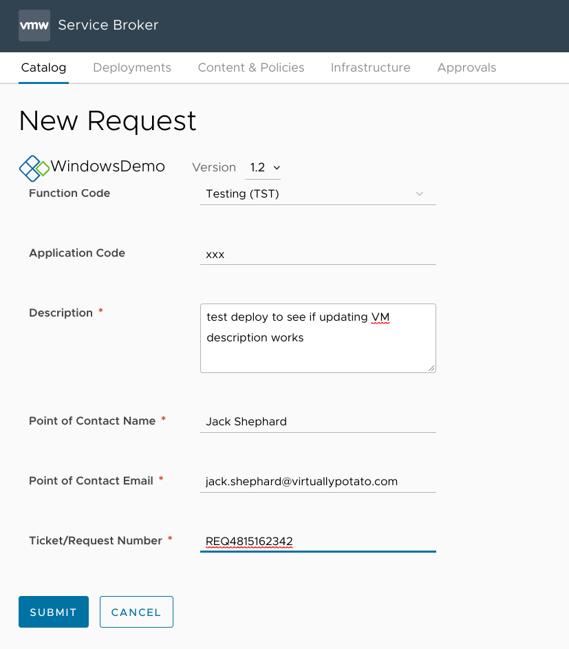

*In [past posts](/series/vra8), I started by [creating a basic deployment infrastructure](/vra8-custom-provisioning-part-one) in Cloud Assembly and using tags to group those resources. I then [wrote an integration](/integrating-phpipam-with-vrealize-automation-8) to let vRA8 use phpIPAM for static address assignments. I [implemented a vRO workflow](/vra8-custom-provisioning-part-two) for generating unique VM names which fit an organization's established naming standard, and then [extended the workflow](/vra8-custom-provisioning-part-three) to avoid any naming conflicts in Active Directory and DNS. And, finally, I [created an intelligent provisioning request form in Service Broker](/vra8-custom-provisioning-part-four) to make it easy for users to get the servers they need. That's got the core functionality pretty well sorted, so moving forward I'll be detailing additions that enable new capabilities and enhance the experience.* 

In this post, I'll describe how to get certain details from the Service Broker request form and into the VM's properties in vCenter. The obvious application of this is adding descriptive notes so I can remember what purpose a VM serves, but I will also be using [Custom Attributes](https://docs.vmware.com/en/VMware-vSphere/7.0/com.vmware.vsphere.vcenterhost.doc/GUID-73606C4C-763C-4E27-A1DA-032E4C46219D.html) to store the server's Point of Contact information and a record of which ticketing system request resulted in the server's creation.

### New inputs
I'll start this by adding a few new inputs to the cloud template in Cloud Assembly.


I'm using a basic regex on the `poc_email` field to make sure that the user's input is *probably* a valid email address in the format `[some string]@[some string].[some string]`. 

```yaml
inputs:
[...]
  description:
    type: string
    title: Description
    description: Server function/purpose
    default: Testing and evaluation
  poc_name:
    type: string
    title: Point of Contact Name
    default: Jack Shephard
  poc_email:
    type: string
    title: Point of Contact Email
    default: jack.shephard@virtuallypotato.com
    pattern: '^[^\s@]+@[^\s@]+\.[^\s@]+$'
  ticket:
    type: string
    title: Ticket/Request Number
    default: 4815162342
[...]
```

I'll also need to add these to the `resources` section of the template so that they will get passed along with the deployment properties.


I'm actually going to combine the `poc_name` and `poc_email` fields into a single `poc` string. 

```yaml
resources:
  Cloud_vSphere_Machine_1:
    type: Cloud.vSphere.Machine
    properties:
      <...>
      poc: '${input.poc_name + " (" + input.poc_email + ")"}'
      ticket: '${input.ticket}'
      description: '${input.description}'
      <...>
```

I'll save this as a new version so that the changes will be available in the Service Broker front-end.


### Service Broker custom form
I can then go to Service Broker and drag the new fields onto the Custom Form canvas. (If the new fields don't show up, hit up the Content Sources section of Service Broker, select the content source, and click the "Save and Import" button to sync the changes.) While I'm at it, I set the Description field to display as a text area (encouraging more detailed input), and I also set all the fields on the form to be required.


### vRO workflow
Okay, so I've got the information I want to pass on to vCenter. Now I need to whip up a new workflow in vRO that will actually do that (after [telling vRO how to connect to the vCenter](/vra8-custom-provisioning-part-two#interlude-connecting-vro-to-vcenter), of course). I'll want to call this after the VM has been provisioned, so I'll cleverly call the workflow "VM Post-Provisioning".


The workflow will have a single input from vRA, `inputProperties` of type `Properties`. 


The first thing this workflow needs to do is parse `inputProperties (Properties)` to get the name of the VM, and it will then use that information to query vCenter and grab the corresponding VM object. So I'll add a scriptable task item to the workflow canvas and call it `Get VM Object`. It will take `inputProperties (Properties)` as its sole input, and output a new variable called `vm` of type `VC:VirtualMachine`.


The script for this task is fairly straightforward:
```js
// JavaScript: Get VM Object
//    Inputs: inputProperties (Properties)
//    Outputs: vm (VC:VirtualMachine)

var name = inputProperties.resourceNames[0]

var vms = VcPlugin.getAllVirtualMachines(null, name)
System.log("Found VM object: " + vms[0])
vm = vms[0]
```

I'll add another scriptable task item to the workflow to actually apply the notes to the VM - I'll call it `Set Notes`, and it will take both `vm (VC:VirtualMachine)` and `inputProperties (Properties)` as its inputs.


The first part of the script creates a new VM config spec, inserts the description into the spec, and then reconfigures the selected VM with the new spec.

The second part uses a built-in action to set the `Point of Contact` and `Ticket` custom attributes accordingly.

```js
// Javascript: Set Notes
//    Inputs: vm (VC:VirtualMachine), inputProperties (Properties)
//    Outputs: None

var notes = inputProperties.customProperties.description
var poc = inputProperties.customProperties.poc
var ticket = inputProperties.customProperties.ticket

var spec = new VcVirtualMachineConfigSpec()
spec.annotation = notes
vm.reconfigVM_Task(spec)

System.getModule("com.vmware.library.vc.customattribute").setOrCreateCustomField(vm,"Point of Contact", poc)
System.getModule("com.vmware.library.vc.customattribute").setOrCreateCustomField(vm,"Ticket", ticket)
```

### Extensibility subscription
Now I need to return to Cloud Assembly and create a new extensibility subscription that will call this new workflow at the appropriate time. I'll call it "VM Post-Provisioning" and attach it to the "Compute Post Provision" topic.


And then I'll link it to my new workflow:


### Testing
And then back to Service Broker to request a VM and see if it works:



It worked!


In the future, I'll be exploring more features that I can add on to this "VM Post-Provisioning" workflow like creating static DNS records as needed.
