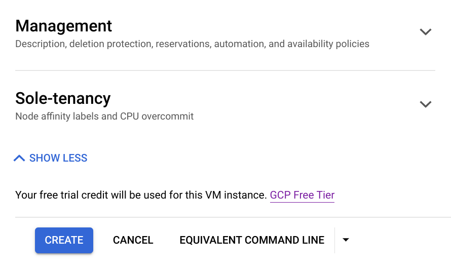

For a while now, I've been using an [OpenVPN Access Server](https://openvpn.net/access-server/) virtual appliance for remotely accessing my [homelab](/vmware-home-lab-on-intel-nuc-9). That's worked _fine_ but it comes with a lot of overhead. It also requires maintaining an SSL certificate and forwarding three ports through my home router, in addition to managing a fairly complex software package and configurations. The free version of the OpenVPN server also only supports a maximum of two simultaneous connections. I recently ran into issues with the `certbot` automated SSL renewal process on my OpenVPN AS VM and decided that it might be time to look for a simpler solution.

I found that solution in [WireGuard](https://www.wireguard.com/), which provides an extremely efficient secure tunnel implemented directly in the Linux kernel. It has a much smaller (and easier-to-audit) codebase, requires minimal configuration, and uses the latest crypto wizardry to securely connect multiple systems. It took me an hour or so of fumbling to get WireGuard deployed and configured on a fresh (and minimal) Ubuntu 20.04 VM running on my ESXi 7 homelab host, and I was pretty happy with the performance, stability, and resource usage of the new setup. That new VM idled at a full _tenth_ of the memory usage of my OpenVPN AS, and it only required a single port to be forwarded into my home network.

Of course, I soon realized that the setup could be _even better:_ I'm now running a WireGuard server on the Google Cloud free tier, and I've configured the [VyOS virtual router I use for my homelab stuff](/vmware-home-lab-on-intel-nuc-9#networking) to connect to that cloud-hosted server to create a secure tunnel between the two without needing to punch any holes in my local network (or consume any additional resources). I can then connect my client devices to the WireGuard server in the cloud. From there, traffic intended for my home network gets relayed to the VyOS router, and internet-bound traffic leaves Google Cloud directly. So my self-managed VPN isn't just good for accessing my home lab remotely, but also more generally for encrypting traffic when on WiFi networks I don't control - allowing me to replace the paid ProtonVPN subscription I had been using for that purpose.

It's a pretty slick setup, if I do say so myself. Anyway, this post will discuss how I implemented this, and what I learned along the way.

### WireGuard Concepts, in Brief
WireGuard does things a bit differently from other VPN solutions I've used in the past. For starters, there aren't any user accounts to manage, and in fact users don't really come into the picture at all. WireGuard also doesn't really distinguish between _client_ and _server_; the devices on both ends of a tunnel connection are _peers_, and they use the same software package and very similar configurations. Each WireGuard peer is configured with a virtual network interface with a private IP address used for the tunnel network, and a configuration file tells it which tunnel IP(s) will be used by the other peer(s). Each peer has its own cryptographic _private_ key, and the other peers get a copy of the corresponding _public_ key added to their configuration so that all the peers can recognize each other and encrypt/decrypt traffic appropriately. This mapping of peer addresses to public keys facilitates what WireGuard calls [Cryptokey Routing](https://www.wireguard.com/#cryptokey-routing).

Once the peers are configured, all it takes is bringing up the WireGuard virtual interface on each peer to establish the tunnel and start passing secure traffic. 

You can read a lot more fascinating details about how this all works back on the [WireGuard homepage](https://www.wireguard.com/#conceptual-overview) (and even more in this [protocol description](https://www.wireguard.com/protocol/)) but this at least covers the key points I needed to grok prior to a successful initial deployment.

For my hybrid cloud solution, I also leaned heavily upon [this write-up of a WireGuard Site-to-Site configuration](https://gist.github.com/insdavm/b1034635ab23b8839bf957aa406b5e39) for how to get traffic flowing between my on-site environment, cloud-hosted WireGuard server, and "Road Warrior" client devices, and drew from [this documentation on implementing WireGuard in GCP](https://github.com/agavrel/wireguard_google_cloud) as well. The [VyOS documentation for configuring the built-in WireGuard interface](https://docs.vyos.io/en/latest/configuration/interfaces/wireguard.html) was also quite helpful to me. 

Okay, enough background; let's get this thing going.

### Google Cloud Setup
#### Instance Deployment
I started by logging into my Google Cloud account at https://console.cloud.google.com, and proceeded to create a new project (named `wireguard`) to keep my WireGuard-related resources together. I then navigated to **Compute Engine** and [created a new instance](https://console.cloud.google.com/compute/instancesAdd) inside that project. The basic setup is:

| Attribute | Value |
| --- | --- |
| Name | `wireguard` |
| Region | `us-east1` (or whichever [free-tier-eligible region](https://cloud.google.com/free/docs/gcp-free-tier/#compute) is closest) |
| Machine Type | `e2-micro` |
| Boot Disk Size | 10 GB |
| Boot Disk Image | Ubuntu 20.04 LTS |


The other defaults are fine, but I'll holding off on clicking the friendly blue "Create" button at the bottom and instead click to expand the **Networking, Disks, Security, Management, Sole-Tenancy** sections to tweak a few more things.


##### Network Configuration
Expanding the **Networking** section of the request form lets me add a new `wireguard` network tag, which will make it easier to target the instance with a firewall rule later. I also want to enable the _IP Forwarding_ option so that the instance will be able to do router-like things. 

By default, the new instance will get assigned a public IP address that I can use to access it externally - but this address is _ephemeral_ so it will change periodically. Normally I'd overcome this by [using ddclient to manage its dynamic DNS record](/bitwarden-password-manager-self-hosted-on-free-google-cloud-instance#configure-dynamic-dns), but (looking ahead) [VyOS's WireGuard interface configuration](https://docs.vyos.io/en/latest/configuration/interfaces/wireguard.html#interface-configuration) unfortunately only supports connecting to an IP rather than a hostname. That means I'll need to reserve a _static_ IP address for my instance. 

I can do that by clicking on the _Default_ network interface to expand the configuration. While I'm here, I'll first change the **Network Service Tier** from _Premium_ to _Standard_ to save a bit of money on network egress fees. _(This might be a good time to mention that while the compute instance itself is free, I will have to spend [about $3/mo for the public IP](https://cloud.google.com/vpc/network-pricing#:~:text=internal%20IP%20addresses.-,External%20IP%20address%20pricing,-You%20are%20charged), as well as [$0.085/GiB for internet egress via the Standard tier](https://cloud.google.com/vpc/network-pricing#:~:text=or%20Cloud%20Interconnect.-,Standard%20Tier%20pricing,-Egress%20pricing%20is) (versus [$0.12/GiB on the Premium tier](https://cloud.google.com/vpc/network-pricing#:~:text=Premium%20Tier%20pricing)). So not entirely free, but still pretty damn cheap for a cloud-hosted VPN that I control completely.)_

Anyway, after switching to the cheaper Standard tier I can click on the **External IP** dropdown and select the option to _Create IP Address_. I give it the same name as my instance to make it easy to keep up with.


##### Security Configuration
The **Security** section lets me go ahead and upload an SSH public key that I can then use for logging into the instance once it's running. Of course, that means I'll first need to generate a key pair for this purpose:
```sh
ssh-keygen -t ed25519 -f ~/.ssh/id_ed25519_wireguard
```

Okay, now that I've got my keys, I can click the **Add Item** button and paste in the contents of `~/.ssh/id_ed25519_wireguard.pub`.


And that's it for the pre-deploy configuration! Time to hit **Create** to kick it off. 



The instance creation will take a couple of minutes but I can go ahead and get the firewall sorted while I wait.

#### Firewall 
Google Cloud's default firewall configuration will let me reach my new server via SSH without needing to configure anything, but I'll need to add a new rule to allow the WireGuard traffic. I do this by going to **VPC > Firewall** and clicking the button at the top to **[Create Firewall Rule](https://console.cloud.google.com/networking/firewalls/add)**. I give it a name (`allow-wireguard-ingress`), select the rule target by specifying the `wireguard` network tag I had added to the instance, and set the source range to `0.0.0.0/0`. I'm going to use the default WireGuard port so select the _udp:_ checkbox and enter `51820`. 


I'll click **Create** and move on.

#### WireGuard Server Setup
Once the **Compute Engine > Instances** [page](https://console.cloud.google.com/compute/instances) indicates that the instance is ready, I can make a note of the listed public IP and then log in via SSH:
```sh 
ssh -i ~/.ssh/id_25519_wireguard {PUBLIC_IP}
```

##### Preparation
And, as always, I'll first make sure the OS is fully updated before doing anything else:
```sh
sudo apt update
sudo apt upgrade
```

Then I'll install `ufw` to easily manage the host firewall, `qrencode` to make it easier to generate configs for mobile clients, `openresolv` to avoid [this issue](https://superuser.com/questions/1500691/usr-bin-wg-quick-line-31-resolvconf-command-not-found-wireguard-debian/1500896), and `wireguard` to, um, guard the wires:
```sh
sudo apt install ufw qrencode openresolv wireguard
```

Configuring the host firewall with `ufw` is very straight forward:
```sh
# First, SSH:
sudo ufw allow 22/tcp
# and WireGuard:
sudo ufw allow 51820/udp
# Then turn it on:
sudo ufw enable
```

The last preparatory step is to enable packet forwarding in the kernel so that the instance will be able to route traffic between the remote clients and my home network (once I get to that point). I can configure that on-the-fly with:
```sh
sudo sysctl -w net.ipv4.ip_forward=1
```

To make it permanent, I'll edit `/etc/sysctl.conf` and uncomment the same line:
```sh
$ sudo vi /etc/sysctl.conf
# Uncomment the next line to enable packet forwarding for IPv4
net.ipv4.ip_forward=1
```

##### WireGuard Interface Config
I'll switch to the root user, move into the `/etc/wireguard` directory, and issue `umask 077` so that the files I'm about to create will have a very limited permission set (to be accessible by root, and _only_ root):
```sh
sudo -i
cd /etc/wireguard
umask 077
```

Then I can use the `wg genkey` command to generate the server's private key, save it to a file called `server.key`, pass it through `wg pubkey` to generate the corresponding public key, and save that to `server.pub`:
```sh
wg genkey | tee server.key | wg pubkey > server.pub
```

As I mentioned earlier, WireGuard will create a virtual network interface using an internal network to pass traffic between the WireGuard peers. By convention, that interface is `wg0` and it draws its configuration from a file in `/etc/wireguard` named `wg0.conf`. I could create a configuration file with a different name and thus wind up with a different interface name as well, but I'll stick with tradition to keep things easy to follow. 

The format of the interface configuration file will need to look something like this:
```
[Interface]     # this section defines the local WireGuard interface
Address =       # CIDR-format IP address of the virtual WireGuard interface
ListenPort =    # WireGuard listens on this port for incoming traffic (randomized if not specified)
PrivateKey =    # private key used to encrypt traffic sent to other peers
MTU =           # packet size
DNS =           # optional DNS server(s) and search domain(s) used for the VPN
PostUp =        # command executed by wg-quick wrapper when the interface comes up
PostDown =      # command executed by wg-quick wrapper when the interface goes down

[Peer]          # now we're talking about the other peers connecting to this instance
PublicKey =     # public key used to decrypt traffic sent by this peer
AllowedIPs =    # which IPs will be routed to this peer
```

There will be a single `[Interface]` section in each peer's configuration file, but they may include multiple `[Peer]` sections. For my config, I'll use the `10.200.200.0/24` network for WireGuard, and let this server be `10.200.200.1`, the VyOS router in my home lab `10.200.200.2`, and I'll assign IPs to the other peers from there. I found a note that Google Cloud uses an MTU size of `1460` bytes so that's what I'll set on this end. I'm going to configure WireGuard to use the VyOS router as the DNS server, and I'll specify my internal `lab.bowdre.net` search domain. Finally, I'll leverage the `PostUp` and `PostDown` directives to enable and disable NAT so that the server will be able to forward traffic between networks for me.

So here's the start of my GCP WireGuard server's `/etc/wireguard/wg0.conf`:
```sh
# /etc/wireguard/wg0.conf
[Interface]
Address = 10.200.200.1/24
ListenPort = 51820
PrivateKey = {GCP_PRIVATE_KEY}
MTU = 1460
DNS = 10.200.200.2, lab.bowdre.net
PostUp = iptables -A FORWARD -i wg0 -j ACCEPT; iptables -t nat -A POSTROUTING -o ens4 -j MASQUERADE; ip6tables -A FORWARD -i wg0 -j ACCEPT; ip6tables -t nat -A POSTROUTING -o ens4 -j MASQUERADE
PostDown = iptables -D FORWARD -i wg0 -j ACCEPT; iptables -t nat -D POSTROUTING -o ens4 -j MASQUERADE; ip6tables -D FORWARD -i wg0 -j ACCEPT; ip6tables -t nat -D POSTROUTING -o ens4 -j MASQUERADE
```

I don't have any other peers ready to add to this config yet, but I can go ahead and bring up the interface all the same. I'm going to use the `wg-quick` wrapper instead of calling `wg` directly since it simplifies a bit of the configuration, but first I'll need to enable the `wg-quick@{INTERFACE}` service so that it will run automatically at startup:
```sh
systemctl enable wg-quick@wg0
systemctl start wg-quick@wg0
```

I can now bring up the interface with `wg-quick up wg0` and check the status with `wg show`:
```
root@wireguard:~# wg-quick up wg0
[#] ip link add wg0 type wireguard
[#] wg setconf wg0 /dev/fd/63
[#] ip -4 address add 10.200.200.1/24 dev wg0
[#] ip link set mtu 1460 up dev wg0
[#] resolvconf -a wg0 -m 0 -x
[#] iptables -A FORWARD -i wg0 -j ACCEPT; iptables -t nat -A POSTROUTING -o ens4 -j MASQUERADE; ip6tables -A FORWARD -i wg0 -j ACCEPT; ip6tables -t nat -A POSTROUTING -o ens4 -j MASQUERADE
root@wireguard:~# wg show
interface: wg0
  public key: {GCP_PUBLIC_IP}
  private key: (hidden)
  listening port: 51820
```

I'll come back here once I've got a peer config to add.

### Configure VyoS Router as WireGuard Peer
Comparatively, configuring WireGuard on VyOS is a bit more direct. I'll start by entering configuration mode and generating and binding a key pair for this interface:
```sh
configure
run generate pki wireguard key-pair install interface wg0
```

And then I'll configure the rest of the options needed for the interface:
```sh
set interfaces wireguard wg0 address '10.200.200.2/24'
set interfaces wireguard wg0 description 'VPN to GCP'
set interfaces wireguard wg0 peer wireguard-gcp address '{GCP_PUBLIC_IP}'
set interfaces wireguard wg0 peer wireguard-gcp allowed-ips '0.0.0.0/0'
set interfaces wireguard wg0 peer wireguard-gcp persistent-keepalive '25'
set interfaces wireguard wg0 peer wireguard-gcp port '51820'
set interfaces wireguard wg0 peer wireguard-gcp public-key '{GCP_PUBLIC_KEY}'
```

Note that this time I'm allowing all IPs (`0.0.0.0/0`) so that this WireGuard interface will pass traffic intended for any destination (whether it's local, remote, or on the Internet). And I'm specifying a [25-second `persistent-keepalive` interval](https://www.wireguard.com/quickstart/#nat-and-firewall-traversal-persistence) to help ensure that this NAT-ed tunnel stays up even when it's not actively passing traffic - after all, I'll need the GCP-hosted peer to be able to initiate the connection so I can access the home network remotely.

While I'm at it, I'll also add a static route to ensure traffic for the WireGuard tunnel finds the right interface:
```sh
set protocols static route 10.200.200.0/24 interface wg0
```

And I'll add the new `wg0` interface as a listening address for the VyOS DNS forwarder:
```sh
set service dns forwarding listen-address '10.200.200.2'
```

I can use the `compare` command to verify the changes I've made, and then apply and save the updated config:
```sh
compare
commit
save
```

I can check the status of WireGuard on VyOS (and view the public key!) like so:
```sh
$ show interfaces wireguard wg0 summary 
interface: wg0
  public key: {VYOS_PUBLIC_KEY}
  private key: (hidden)
  listening port: 43543

peer: {GCP_PUBLIC_KEY}
  endpoint: {GCP_PUBLIC_IP}:51820
  allowed ips: 0.0.0.0/0
  transfer: 0 B received, 592 B sent
  persistent keepalive: every 25 seconds
```

See? That part was much easier to set up! But it doesn't look like it's actually passing traffic yet... because while the VyOS peer has been configured with the GCP peer's public key, the GCP peer doesn't know anything about the VyOS peer yet.

So I'll copy `{VYOS_PUBLIC_KEY}` and SSH back to the GCP instance to finish that configuration. Once I'm there, I can edit `/etc/wireguard/wg0.conf` as root and add in a new `[Peer]` section at the bottom, like this:
```
[Peer]
# VyOS
PublicKey = {VYOS_PUBLIC_KEY}
AllowedIPs = 10.200.200.2/32, 192.168.1.0/24, 172.16.0.0/16
```

This time, I'm telling WireGuard that the new peer has IP `10.200.200.2` but that it should also get traffic destined for the `192.168.1.0/24` and `172.16.0.0/16` networks, my home and lab networks. Again, the `AllowedIPs` parameter is used for WireGuard's Cryptokey Routing so that it can keep track of which traffic goes to which peers (and which key to use for encryption). 

After saving the file, I can either restart WireGuard by bringing the interface down and back up (`wg-quick down wg0 && wg-quick up wg0`), or I can reload it on the fly with:
```sh
sudo -i
wg syncconf wg0 <(wg-quick strip wg0)
```

(I can't just use `wg syncconf wg0` directly since `/etc/wireguard/wg0.conf` includes the `PostUp`/`PostDown` commands which can only be parsed by the `wg-quick` wrapper, so I'm using `wg-quick strip {INTERFACE}` to grab the contents of the config file, remove the problematic bits, and then pass what's left to the `wg syncconf {INTERFACE}` command to update the current running config.)

Now I can check the status of WireGuard on the GCP end:
```sh
root@wireguard:~# wg show
interface: wg0
  public key: {GCP_PUBLIC_KEY}
  private key: (hidden)
  listening port: 51820

peer: {VYOS_PUBLIC_KEY}
  endpoint: {VYOS_PUBLIC_IP}:43990
  allowed ips: 10.200.200.2/32, 192.168.1.0/24, 172.16.0.0/16
  latest handshake: 55 seconds ago
  transfer: 1.23 KiB received, 368 B sent
```

Hey, we're passing traffic now! And I can verify that I can ping stuff on my home and lab networks from the GCP instance:
```sh
john@wireguard:~$ ping -c 1 192.168.1.5
PING 192.168.1.5 (192.168.1.5) 56(84) bytes of data.
64 bytes from 192.168.1.5: icmp_seq=1 ttl=127 time=35.6 ms

--- 192.168.1.5 ping statistics ---
1 packets transmitted, 1 received, 0% packet loss, time 0ms
rtt min/avg/max/mdev = 35.598/35.598/35.598/0.000 ms

john@wireguard:~$ ping -c 1 172.16.10.1
PING 172.16.10.1 (172.16.10.1) 56(84) bytes of data.
64 bytes from 172.16.10.1: icmp_seq=1 ttl=64 time=35.3 ms

--- 172.16.10.1 ping statistics ---
1 packets transmitted, 1 received, 0% packet loss, time 0ms
rtt min/avg/max/mdev = 35.275/35.275/35.275/0.000 ms
```

Cool!

### Adding Additional Peers
So my GCP and VyOS peers are talking, but the ultimate goals here are for my Chromebook to have access to my homelab resources while away from home, and for my phones to have secure internet access when connected to WiFi networks I don't control. That means adding at least two more peers to the GCP server. WireGuard [offers downloads](https://www.wireguard.com/install/) for just about every operating system you can imagine, but I'll be using the [Android app](https://play.google.com/store/apps/details?id=com.wireguard.android) for both the Chromebook and phones.

#### Chromebook
The first step is to install the WireGuard Android app.

_Note: the version of the WireGuard app currently available on the Play Store (v1.0.20210926) [has an issue](https://www.reddit.com/r/WireGuard/comments/q11rt9/wireguard_1020210926_and_chromeos/) on Chrome OS that causes it to not pass traffic after the Chromebook has resumed from sleep. The workaround for this is to install an older version of the app (1.0.20210506) which can be obtained from [F-Droid](https://f-droid.org/en/packages/com.wireguard.android/). Doing so requires having the Linux environment enabled on Chrome OS and the **Develop Android Apps > Enable ADB Debugging** option enabled in the Chrome OS settings. The process for sideloading apps is [detailed here](https://developer.android.com/topic/arc/development-environment)._

Once it's installed, I open the app and click the "Plus" button to create a new tunnel, and select the _Create from scratch_ option. I click the circle-arrows icon at the right edge of the _Private key_ field, and that automatically generates this peer's private and public key pair. Simply clicking on the _Public key_ field will automatically copy the generated key to my clipboard, which will be useful for sharing it with the server. Otherwise I fill out the **Interface** section similarly to what I've done already:

| Parameter | Value |
| --- | --- |
| Name | `wireguard-gcp` |
| Private key | `{CB_PRIVATE_KEY}` |
| Public key | `{CB_PUBLIC_KEY}` |
| Addresses | `10.200.200.3/24` |
| Listen port |  |
| DNS servers | `10.200.200.2` |
| MTU |  |

I then click the **Add Peer** button to tell this client about the peer it will be connecting to - the GCP-hosted instance:

| Parameter | Value |
| --- | --- |
| Public key | `{GCP_PUBLIC_KEY}` |
| Pre-shared key | |
| Persistent keepalive | |
| Endpoint | `{GCP_PUBLIC_IP}:51820` |
| Allowed IPs | `0.0.0.0/0` |

I _shouldn't_ need the keepalive for the "Road Warrior" peers connecting to the GCP peer, but I can always set that later if I run into stability issues.

Now I can go ahead and save this configuration, but before I try (and fail) to connect I first need to tell the cloud-hosted peer about the Chromebook. So I fire up an SSH session to my GCP instance, become root, and edit the WireGuard configuration to add a new `[Peer]` section.

```sh
sudo -i
vi /etc/wireguard/wg0.conf
```

Here's the new section that I'll add to the bottom of the config:

```sh
[Peer]
# Chromebook
PublicKey = {CB_PUBLIC_KEY}
AllowedIPs = 10.200.200.3/32
```

This one is acting as a single-node endpoint (rather than an entryway into other networks like the VyOS peer) so setting `AllowedIPs` to only the peer's IP makes sure that WireGuard will only send it traffic specifically intended for this peer.

So my complete `/etc/wireguard/wg0.conf` looks like this so far:
```sh
# /etc/wireguard/wg0.conf
[Interface]
Address = 10.200.200.1/24
ListenPort = 51820
PrivateKey = {GCP_PRIVATE_KEY}
MTU = 1460
DNS = 10.200.200.2, lab.bowdre.net
PostUp = iptables -A FORWARD -i wg0 -j ACCEPT; iptables -t nat -A POSTROUTING -o ens4 -j MASQUERADE; ip6tables -A FORWARD -i wg0 -j ACCEPT; ip6tables -t nat -A POSTROUTING -o ens4 -j MASQUERADE
PostDown = iptables -D FORWARD -i wg0 -j ACCEPT; iptables -t nat -D POSTROUTING -o ens4 -j MASQUERADE; ip6tables -D FORWARD -i wg0 -j ACCEPT; ip6tables -t nat -D POSTROUTING -o ens4 -j MASQUERADE

[Peer]
# VyOS
PublicKey = {VYOS_PUBLIC_KEY}
AllowedIPs = 10.200.200.2/32, 192.168.1.0/24, 172.16.0.0/16

[Peer]
# Chromebook
PublicKey = {CB_PUBLIC_KEY}
AllowedIPs = 10.200.200.3/32
```

Now to save the file and reload the WireGuard configuration again:
```sh
wg syncconf wg0 <(wg-quick strip wg0)
```

At this point I can activate the connection in the WireGuard Android app, wait a few seconds, and check with `wg show` to confirm that the tunnel has been established successfully:

```sh
root@wireguard:~# wg show
interface: wg0
  public key: {GCP_PUBLIC_KEY}
  private key: (hidden)
  listening port: 51820

peer: {VYOS_PUBLIC_KEY}
  endpoint: {VYOS_PUBLIC_IP}:43990
  allowed ips: 10.200.200.2/32, 192.168.1.0/24, 172.16.0.0/16
  latest handshake: 1 minute, 55 seconds ago
  transfer: 200.37 MiB received, 16.32 MiB sent

peer: {CB_PUBLIC_KEY}
  endpoint: {CB_PUBLIC_IP}:33752
  allowed ips: 10.200.200.3/32
  latest handshake: 48 seconds ago
  transfer: 169.17 KiB received, 808.33 KiB sent
```

And I can even access my homelab when not at home!


#### Android Phone
Being able to copy-and-paste the required public keys between the WireGuard app and the SSH session to the GCP instance made it relatively easy to set up the Chromebook, but things could be a bit trickier on a phone without that kind of access. So instead I will create the phone's configuration on the WireGuard server in the cloud, render that config file as a QR code, and simply scan that through the phone's WireGuard app to import the settings.

I'll start by SSHing to the GCP instance, elevating to root, setting the restrictive `umask` again, and creating a new folder to store client configurations.
```sh
sudo -i
umask 077
mkdir /etc/wireguard/clients
cd /etc/wireguard/clients
```

As before, I'll use the built-in `wg` commands to generate the private and public key pair:
```sh
wg genkey | tee phone1.key | wg pubkey > phone1.pub
```

I can then use those keys to assemble the config for the phone:
```sh
# /etc/wireguard/clients/phone1.conf
[Interface]
PrivateKey = {PHONE1_PRIVATE_KEY}
Address = 10.200.200.4/24
DNS = 10.200.200.2, lab.bowdre.net

[Peer]
PublicKey = {GCP_PUBLIC_KEY}
AllowedIPs = 0.0.0.0/0
Endpoint = {GCP_PUBLIC_IP}:51820
```

I'll also add the interface address and corresponding public key to a new `[Peer]` section of `/etc/wireguard/wg0.conf`:
```sh
[Peer]
PublicKey = {PHONE1_PUBLIC_KEY}
AllowedIPs = 10.200.200.4/32
```

And reload the WireGuard config:
```sh
wg syncconf wg0 <(wg-quick strip wg0)
```

Back in the `clients/` directory, I can use `qrencode` to render the phone configuration file (keys and all!) as a QR code:
```sh
qrencode -t ansiutf8 < phone1.conf 
```


And then I just open the WireGuard app on my phone and use the **Scan from QR Code** option. After a successful scan, it'll prompt me to name the new tunnel, and then I should be able to connect right away.


I can even access my vSphere lab environment - not that it offers a great mobile experience...


Before moving on too much further, though, I'm going to clean up the keys and client config file that I generated on the GCP instance. It's not great hygiene to keep a private key stored on the same system it's used to access.

```sh
rm -f /etc/wireguard/clients/*
```

##### Bonus: Automation!
I've [written before](auto-connect-to-protonvpn-on-untrusted-wifi-with-tasker) about a set of [Tasker](https://play.google.com/store/apps/details?id=net.dinglisch.android.taskerm) profiles I put together so that my phone would automatically connect to a VPN whenever it connects to a WiFi network I don't control. It didn't take much effort at all to adapt the profile to work with my new WireGuard setup.

Two quick pre-requisites first:
1. Open the WireGuard Android app, tap the three-dot menu button at the top right, expand the Advanced section, and enable the _Allow remote control apps_ so that Tasker will be permitted to control WireGuard.
2. Exclude the WireGuard app from Android's battery optimization so that it doesn't have any problems running in the background. On (Pixel-flavored) Android 12, this can be done by going to **Settings > Apps > See all apps > WireGuard > Battery** and selecting the _Unrestricted_ option.

On to the Tasker config. The only changes will be in the [VPN on Strange Wifi](/auto-connect-to-protonvpn-on-untrusted-wifi-with-tasker#vpn-on-strange-wifi) profile. I'll remove the OpenVPN-related actions from the Enter and Exit tasks and replace them with the built-in **Tasker > Tasker Function WireGuard Set Tunnel** action.

For the Enter task, I'll set the tunnel status to `true` and specify the name of the tunnel as configured in the WireGuard app; the Exit task gets the status set to `false` to disable the tunnel. Both actions will be conditional upon the `%TRUSTED_WIFI` variable being unset.


```
Profile: VPN on Strange WiFi
    Settings: Notification: no
     State: Wifi Connected [ SSID:* MAC:* IP:* Active:Any ]

    Enter Task: ConnectVPN
    A1: Tasker Function [
         Function: WireGuardSetTunnel(true,wireguard-gcp) ]
        If [ %TRUSTED_WIFI !Set ]
     
    Exit Task: DisconnectVPN
    A1: Tasker Function [
         Function: WireGuardSetTunnel(false,wireguard-gcp) ]
        If [ %TRUSTED_WIFI !Set ]
```

_Automagic!_

#### Other Peers
Any additional peers that need to be added in the future will likely follow one of the above processes. The steps are always to generate the peer's key pair, use the private key to populate the `[Interface]` portion of the peer's config, configure the `[Peer]` section with the _public_ key, allowed IPs, and endpoint address of the peer it will be connecting to, and then to add the new peer's _public_ key and internal WireGuard IP to a new `[Peer]` section of the existing peer's config. 

