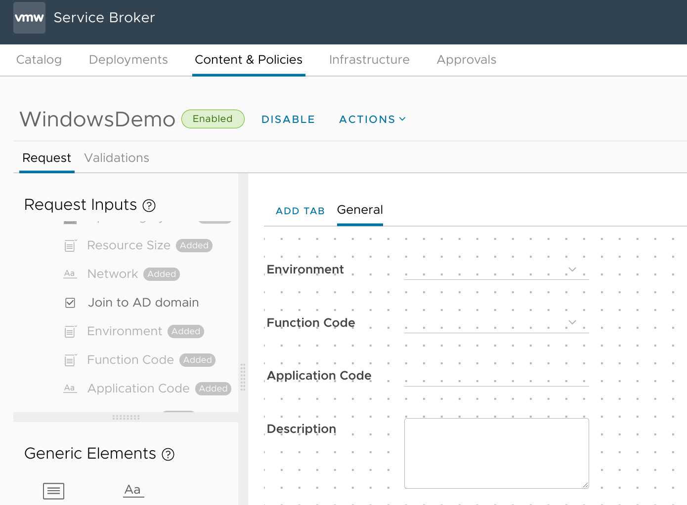

Connecting a deployed Windows VM to an Active Directory domain is pretty easy; just apply an appropriately-configured [customization spec](https://docs.vmware.com/en/VMware-vSphere/7.0/com.vmware.vsphere.vm_admin.doc/GUID-CAEB6A70-D1CF-446E-BC64-EC42CDB47117.html) and vCenter will take care of it for you. Of course, you'll likely then need to move the newly-created computer object to the correct Organizational Unit so that it gets all the right policies and such. 

Fortunately, vRA 8 supports adding an Active Directory integration to handle staging computer objects in a designated OU. And vRA 8.3 even [introduced the ability](https://blogs.vmware.com/management/2021/02/whats-new-with-vrealize-automation-8-3-technical-overview.html#:~:text=New%20Active%20Directory%20Cloud%20Template%20Properties) to let blueprints override the relative DN path. That will be helpful in my case since I'll want the servers to be placed in different OUs depending on which site they get deployed to:

| **Site** | **OU** |
| --- | --- |
| `BOW` | `lab.bowdre.net/LAB/BOW/Computers/Servers` |
| `DRE` | `lab.bowre.net/LAB/DRE/Computers/Servers` |


I didn't find a lot of documentation on how make this work, though, so here's how I've implemented it in my lab (now [running vRA 8.4.2](https://twitter.com/johndotbowdre/status/1416037317052178436)).

### Adding the AD integration
First things first: connecting vRA to AD. I do this by opening the Cloud Assembly interface, navigating to **Infrastructure > Connections > Integrations**, and clicking the **Add Integration** button. I'm then prompted to choose the integration type so I select the **Active Directory** one, and then I fill in the required information: a name (`Lab AD` seems appropriate), my domain controller as the LDAP host (`ldap://win01.lab.bowdre.net:389`), credentials for an account with sufficient privileges to create and delete computer objects (`lab\vra`), and finally the base DN to be used for the LDAP connection (`DC=lab,DC=bowdre,DC=net`).


Clicking the **Validate** button quickly confirms that I've entered the information correctly, and then I can click **Add** to save my work.

I'll then need to associate the integration with a project by opening the new integration, navigating to the **Projects** tab, and clicking **Add Project**. Now I select the project name from the dropdown, enter a valid relative OU (`OU=LAB`), and enable the options to let me override the relative OU and optionally skip AD actions from the cloud template.


### Customization specs
As mentioned above, I'll leverage the customization specs in vCenter to handle the actual joining of a computer to the domain. I maintain two specs for Windows deployments (one to join the domain and one to stay on the workgroup), and I can let the vRA cloud template decide which should be applied to a given deployment.

First, the workgroup spec, appropriately called `vra-win-workgroup`:


It's about as basic as can be, including using DHCP for the network configuration (which doesn't really matter since the VM will eventually get a [static IP assigned from {php}IPAM](integrating-phpipam-with-vrealize-automation-8)). 

`vra-win-domain` is basically the same, with one difference:

 
Now to reference these specs from a cloud template...

### Cloud template
I want to make sure that users requesting a deployment are able to pick whether or not a system should be joined to the domain, so I'm going to add that as an input option on the template:

```yaml
inputs:
  [...]
  adJoin:
    title: Join to AD domain
    type: boolean
    default: true
  [...]
```

This new `adJoin` input is a boolean so it will appear on the request form as a checkbox, and it will default to `true`; we'll assume that any Windows deployment should be automatically joined to AD unless this option gets unchecked. 

In the `resources` section of the template, I'll set a new property called `ignoreActiveDirectory` to be the inverse of the `adJoin` input; that will tell the AD integration not to do anything if the box to join the VM to the domain is unchecked. I'll also use `activeDirectory: relativeDN` to insert the appropriate site code into the DN where the computer object will be created. And, finally, I'll reference the `customizationSpec` and use [cloud template conditional syntax](https://docs.vmware.com/en/vRealize-Automation/8.4/Using-and-Managing-Cloud-Assembly/GUID-12F0BC64-6391-4E5F-AA48-C5959024F3EB.html#conditions-4) to apply the correct spec based on whether it's a domain or workgroup deployment. (These conditionals take the pattern `'${conditional-expresion ? true-value : false-value}'`).

```yaml
resources:
  Cloud_vSphere_Machine_1:
    type: Cloud.vSphere.Machine
    properties:
      [...]
      ignoreActiveDirectory: '${!input.adJoin}'
      activeDirectory:
        relativeDN: '${"OU=Servers,OU=Computers,OU=" + input.site + ",OU=LAB"}'
      customizationSpec: '${input.adJoin ? "vra-win-domain" : "vra-win-workgroup"}'
      [...]
```

Here's the current cloud template in its entirety:

```yaml
formatVersion: 1
inputs:
  site:
    type: string
    title: Site
    enum:
      - BOW
      - DRE
  image:
    type: string
    title: Operating System
    oneOf:
      - title: Windows Server 2019
        const: ws2019
    default: ws2019
  size:
    title: Resource Size
    type: string
    oneOf:
      - title: 'Micro [1vCPU|1GB]'
        const: micro
      - title: 'Tiny [1vCPU|2GB]'
        const: tiny
      - title: 'Small [2vCPU|2GB]'
        const: small
    default: small
  network:
    title: Network
    type: string
  adJoin:
    title: Join to AD domain
    type: boolean
    default: true
  environment:
    type: string
    title: Environment
    oneOf:
      - title: Development
        const: D
      - title: Testing
        const: T
      - title: Production
        const: P
    default: D
  function:
    type: string
    title: Function Code
    oneOf:
      - title: Application (APP)
        const: APP
      - title: Desktop (DSK)
        const: DSK
      - title: Network (NET)
        const: NET
      - title: Service (SVS)
        const: SVS
      - title: Testing (TST)
        const: TST
    default: TST
  app:
    type: string
    title: Application Code
    minLength: 3
    maxLength: 3
    default: xxx
  description:
    type: string
    title: Description
    description: Server function/purpose
    default: Testing and evaluation
  poc_name:
    type: string
    title: Point of Contact Name
    default: Jack Shephard
  poc_email:
    type: string
    title: Point of Contact Email
    default: jack.shephard@virtuallypotato.com
    pattern: '^[^\s@]+@[^\s@]+\.[^\s@]+$'
  ticket:
    type: string
    title: Ticket/Request Number
    default: 4815162342
resources:
  Cloud_vSphere_Machine_1:
    type: Cloud.vSphere.Machine
    properties:
      image: '${input.image}'
      flavor: '${input.size}'
      site: '${input.site}'
      environment: '${input.environment}'
      function: '${input.function}'
      app: '${input.app}'
      ignoreActiveDirectory: '${!input.adJoin}'
      activeDirectory:
        relativeDN: '${"OU=Servers,OU=Computers,OU=" + input.site + ",OU=LAB"}'
      customizationSpec: '${input.adJoin ? "vra-win-domain" : "vra-win-workgroup"}'
      dnsDomain: lab.bowdre.net
      poc: '${input.poc_name + " (" + input.poc_email + ")"}'
      ticket: '${input.ticket}'
      description: '${input.description}'
      networks:
        - network: '${resource.Cloud_vSphere_Network_1.id}'
          assignment: static
      constraints:
        - tag: 'comp:${to_lower(input.site)}'
  Cloud_vSphere_Network_1:
    type: Cloud.vSphere.Network
    properties:
      networkType: existing
      constraints:
        - tag: 'net:${input.network}'
```

The last thing I need to do before leaving the Cloud Assembly interface is smash that **Version** button at the bottom of the cloud template editor so that the changes will be visible to Service Broker:


### Service Broker custom form updates
... and the *first* thing to do after entering the Service Broker UI is to navigate to **Content Sources**, click on my Lab content source, and then click **Save & Import** to bring in the new version. I can then go to **Content**, click the little three-dot menu icon next to my `WindowsDemo` cloud template, and pick the **Customize form** option.

This bit will be pretty quick. I just need to look for the new `Join to AD domain` element on the left:


And drag-and-drop it onto the canvas in the middle. I'll stick it directly after the `Network` field:


I don't need to do anything else here since I'm not trying to do any fancy logic or anything, so I'll just hit **Save** and move on to...

### Testing
Now to submit the request through Service Broker to see if this actually works:


After a few minutes, I can go into Cloud Assembly and navigate to **Extensibility > Activity > Actions Runs** and look at the **Integration Runs** to see if the `ad_machine` action has completed yet. 


Looking good! And once the deployment completes, I can look at the VM in vCenter to see that it has registered a fully-qualified DNS name since it was automatically joined to the domain:


I can also repeat the test for a VM deployed to the `DRE` site just to confirm that it gets correctly placed in that site's OU:


And I'll fire off another deployment with the `adJoin` box *unchecked* to test that I can also skip the AD configuration completely:
 

### Conclusion
Confession time: I had actually started writing this posts weeks ago. At that point, my efforts to bend the built-in AD integration to my will had been fairly unsuccessful, so I was instead working on a custom vRO workflow to accomplish the same basic thing. I circled back to try the AD integration again after upgrading the vRA environment to the latest 8.4.2 release, and found that it actually works quite well now. So I happily scrapped my ~50 lines of messy vRO JavaScript in favor of *just three lines* of YAML in the cloud template. 

I love it when things work out!