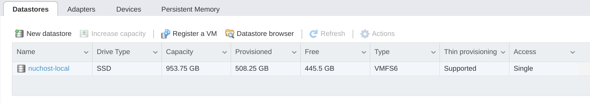
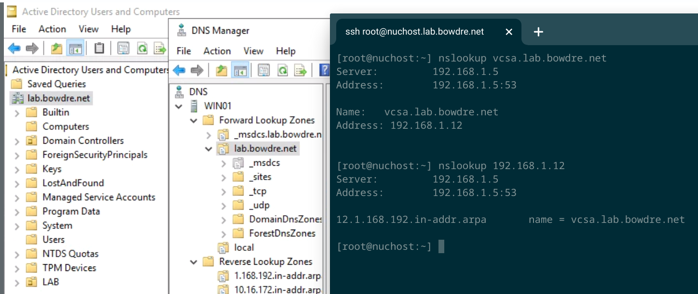
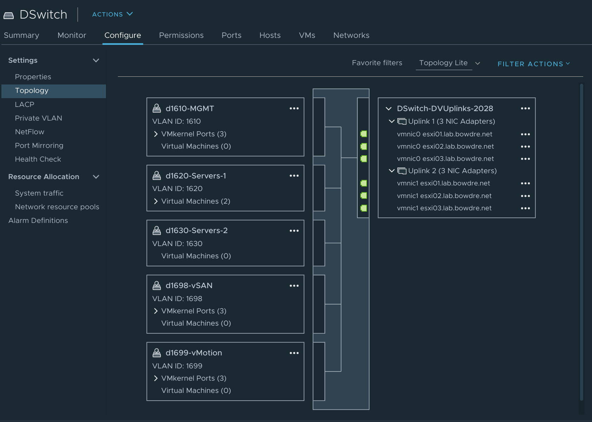

I picked up an Intel NUC 9 Extreme kit a few months back (thanks, VMware!) and have been slowly tinkering with turning it into an extremely capable self-contained home lab environment. I'm pretty happy with where things sit right now so figured it was about time to start documenting and sharing what I've done. 


### Hardware
*(Caution: here be affiliate links)*
- [Intel NUC 9 Extreme (NUC9i9QNX)](https://amzn.to/2JezeEH)
- [Crucial 64GB DDR4 SO-DIMM kit (CT2K32G4SFD8266)](https://amzn.to/34BtPPy)
- [Intel 665p 1TB NVMe SSD (SSDPEKNW010T9X1)](https://amzn.to/3nMi5kW)
- Random 8GB USB thumbdrive I found in a drawer somewhere

The NUC runs ESXi 7.0u1 and currently hosts the following:
- vCenter Server 7.0u1
- Windows 2019 domain controller
-  [VyOS router](https://vyos.io/) 
- [Home Assistant OS 5.9](https://www.home-assistant.io/hassio/installation/)
- vRealize Lifecycle Manager 8.2
- vRealize Identity Manager 3.3.2
- vRealize Automation 8.2
- 3-node [nested ESXi 7.0u1](https://williamlam.com/nested-virtualization/nested-esxi-virtual-appliance) vSAN cluster

I'm leveraging my $200 [vMUG Advantage subscription](https://www.vmug.com/membership/vmug-advantage-membership) to provide 365-day licenses for all the VMware bits (particularly vRA, which doesn't come with a built-in evaluation option).

### Basic Infrastructure
#### Setting up the NUC
The NUC connects to my home network through its onboard gigabit Ethernet interface (`vmnic0`). (The NUC does have a built-in WiFi adapter but for some reason VMware hasn't yet allowed their hypervisor to connect over WiFi - weird, right?) I wanted to use a small 8GB thumbdrive as the host's boot device so I installed that in one of the NUC's internal USB ports. For the purpose of installation, I connected a keyboard and monitor to the NUC, and I configured the BIOS to automatically boot up when power is restored after a power failure.

I used the Chromebook Recovery Utility to write the ESXi installer ISO to *another* USB drive (how-to [here](/burn-an-iso-to-usb-with-the-chromebook-recovery-utility)), inserted that bootable drive to a port on the front of the NUC, and booted the NUC from the drive. Installing ESXi 7.0u1 was as easy as it could possibly be. All hardware was automatically detected and the appropriate drivers loaded. Once the host booted up, I used the DCUI to configure a static IP address (`192.168.1.11`). I then shut down the NUC, disconnected the keyboard and monitor, and moved it into the cabinet where it will live out its headless existence.

I was then able to point my web browser to `https://192.168.1.11/ui/` to log in to the host and get down to business. First stop: networking. For now, I only need a single standard switch (`vSwitch0`) with two portgroups: one for the host's vmkernel interface, and the other for the VMs (including the nested ESXi appliances) that are going to run directly on this physical host. The one "gotcha" when working with a nested environment is that you'll need to edit the virtual switch's security settings to "Allow promiscuous mode" and "Allow forged transmits" (for reasons described [here](https://williamlam.com/2013/11/why-is-promiscuous-mode-forged.html)). 


I created a single datastore to span the entirety of that 1TB NVMe drive. The nested ESXi hosts will use VMDKs stored here to provide storage to the nested VMs.


#### Domain Controller
I created a new Windows VM with 2 vCPUs, 4GB of RAM, and a 90GB virtual hard drive, and I booted it off a [Server 2019 evaluation ISO](https://www.microsoft.com/en-US/evalcenter/evaluate-windows-server-2019?filetype=ISO). I gave it a name, a static IP address, and proceeded to install and configure the Active Directory Domain Services and DNS Server roles. I created static A and PTR records for the vCenter Server Appliance I'd be deploying next (`vcsa.`) and the physical host (`nuchost.`). I configured ESXi to use this new server for DNS resolutions, and confirmed that I could resolve the VCSA's name from the host.



Before moving on, I installed the Chrome browser on this new Windows VM and also set up remote access via [Chrome Remote Desktop](https://remotedesktop.google.com/access/). This will let me remotely access and manage my lab environment without having to punch holes in the router firewall (or worry about securing said holes). And it's got "chrome" in the name so it will work just fine from my Chromebooks!

#### vCenter
I attached the vCSA installation ISO to the Windows VM and performed the vCenter deployment from there. (See, I told you that Chrome Remote Desktop would come in handy!)


After the vCenter was deployed and the basic configuration completed, I created a new cluster to contain the physical host. There's likely only ever going to be the one physical host but I like being able to logically group hosts in this way, particularly when working with PowerCLI. I then added the host to the vCenter by its shiny new FQDN.


I've now got a fully-functioning VMware lab, complete with a physical hypervisor to run the workloads, a vCenter server to manage the workloads, and a Windows DNS server to tell the workloads how to talk to each other. Since the goal is to ultimately simulate a (small) production environment, let's set up some additional networking before we add anything else.

### Networking
#### Overview
My home network uses the generic `192.168.1.0/24` address space, with internet router providing DHCP addresses in the range `.100-.250`. I'm using the range `192.168.1.2-.99` for statically-configured IPs, particularly those within my lab environment. Here are the addresses being used by the lab so far:

| IP Address | Hostname | Purpose |
| ---- | ---- | ---- |
| `192.168.1.1` |  | Gateway |
| `192.168.1.5` | `win01` | AD DC, DNS |
| `192.168.1.11` | `nuchost` | Physical ESXi host |
| `192.168.1.12` | `vcsa` | vCenter Server |

Of course, not everything that I'm going to deploy in the lab will need to be accessible from outside the lab environment. This goes for obvious things like the vMotion and vSAN networks of the nested ESXi hosts, but it will also be useful to have internal networks that can be used by VMs provisioned by vRA. So I'll be creating these networks:

| VLAN ID | Network | Purpose |
| ---- | ---- | ---- | 
| 1610 | `172.16.10.0/24` | Management |
| 1620 | `172.16.20.0/24` | Servers-1 |
| 1630 | `172.16.30.0/24` | Servers-2 |
| 1698 | `172.16.98.0/24` | vSAN |
| 1699 | `172.16.99.0/24` | vMotion |

#### vSwitch1
I'll start by adding a second vSwitch to the physical host. It doesn't need a physical adapter assigned since this switch will be for internal traffic. I create two port groups: one tagged for the VLAN 1610 Management traffic, which will be useful for attaching VMs on the physical host to the internal network; and the second will use VLAN 4095 to pass all VLAN traffic to the nested ESXi hosts. And again, this vSwitch needs to have its security policy set to allow Promiscuous Mode and Forged Transmits. I also set the vSwitch to support an MTU of 9000 so I can use Jumbo Frames on the vMotion and vSAN networks. 


#### VyOS
Wouldn't it be great if the VMs that are going to be deployed on those `1610`, `1620`, and `1630` VLANs could still have their traffic routed out of the internal networks? But doing routing requires a router (or so my network friends tell me)... so I deployed a VM running the open-source VyOS router platform. I used [William Lam's instructions for installing VyOS](https://williamlam.com/2020/02/how-to-automate-the-creation-multiple-routable-vlans-on-single-l2-network-using-vyos.html), making sure to attach the first network interface to the Home-Network portgroup and the second to the Isolated portgroup (VLAN 4095). I then set to work [configuring the router](https://docs.vyos.io/en/latest/quick-start.html).

After logging in to the VM, I entered the router's configuration mode:

```shell
vyos@vyos:~$ configure
[edit]
vyos@vyos# 
```

I then started with setting up the interfaces - `eth0` for the `192.168.1.0/24` network, `eth1` on the trunked portgroup, and a number of VIFs on `eth1` to handle the individual VLANs I'm interested in using. 

```shell
set interfaces ethernet eth0 address '192.168.1.8/24'
set interfaces ethernet eth0 description 'Outside'
set interfaces ethernet eth1 mtu '9000'
set interfaces ethernet eth1 vif 1610 address '172.16.10.1/24'
set interfaces ethernet eth1 vif 1610 description 'VLAN 1610 for Management'
set interfaces ethernet eth1 vif 1610 mtu '1500'
set interfaces ethernet eth1 vif 1620 address '172.16.20.1/24'
set interfaces ethernet eth1 vif 1620 description 'VLAN 1620 for Servers-1'
set interfaces ethernet eth1 vif 1620 mtu '1500'
set interfaces ethernet eth1 vif 1630 address '172.16.30.1/24'
set interfaces ethernet eth1 vif 1630 description 'VLAN 1630 for Servers-2'
set interfaces ethernet eth1 vif 1630 mtu '1500'
set interfaces ethernet eth1 vif 1698 description 'VLAN 1698 for vSAN'
set interfaces ethernet eth1 vif 1698 mtu '9000'
set interfaces ethernet eth1 vif 1699 description 'VLAN 1699 for vMotion'
set interfaces ethernet eth1 vif 1699 mtu '9000'
```

I also set up NAT for the networks that should be routable:

```shell
set nat source rule 10 outbound-interface 'eth0'
set nat source rule 10 source address '172.16.10.0/24'
set nat source rule 10 translation address 'masquerade'
set nat source rule 20 outbound-interface 'eth0'
set nat source rule 20 source address '172.16.20.0/24'
set nat source rule 20 translation address 'masquerade'
set nat source rule 30 outbound-interface 'eth0'
set nat source rule 30 source address '172.16.30.0/24'
set nat source rule 30 translation address 'masquerade'
set nat source rule 100 outbound-interface 'eth0'
set nat source rule 100 translation address 'masquerade'
set protocols static route 0.0.0.0/0 next-hop 192.168.1.1
```

And I configured DNS forwarding:

```shell
set service dns forwarding allow-from '0.0.0.0/0'
set service dns forwarding domain 10.16.172.in-addr.arpa. server '192.168.1.5'
set service dns forwarding domain 20.16.172.in-addr.arpa. server '192.168.1.5'
set service dns forwarding domain 30.16.172.in-addr.arpa. server '192.168.1.5'
set service dns forwarding domain lab.bowdre.net server '192.168.1.5'
set service dns forwarding listen-address '172.16.10.1'
set service dns forwarding listen-address '172.16.20.1'
set service dns forwarding listen-address '172.16.30.1'
set service dns forwarding name-server '192.168.1.1'
```

Finally, I also configured VyOS's DHCP server so that I won't have to statically configure the networking for VMs deployed from vRA:

```shell
set service dhcp-server shared-network-name SCOPE_10_MGMT authoritative
set service dhcp-server shared-network-name SCOPE_10_MGMT subnet 172.16.10.0/24 default-router '172.16.10.1'
set service dhcp-server shared-network-name SCOPE_10_MGMT subnet 172.16.10.0/24 dns-server '192.168.1.5'
set service dhcp-server shared-network-name SCOPE_10_MGMT subnet 172.16.10.0/24 domain-name 'lab.bowdre.net'
set service dhcp-server shared-network-name SCOPE_10_MGMT subnet 172.16.10.0/24 lease '86400'
set service dhcp-server shared-network-name SCOPE_10_MGMT subnet 172.16.10.0/24 range 0 start '172.16.10.100'
set service dhcp-server shared-network-name SCOPE_10_MGMT subnet 172.16.10.0/24 range 0 stop '172.16.10.200'
set service dhcp-server shared-network-name SCOPE_20_SERVERS authoritative
set service dhcp-server shared-network-name SCOPE_20_SERVERS subnet 172.16.20.0/24 default-router '172.16.20.1'
set service dhcp-server shared-network-name SCOPE_20_SERVERS subnet 172.16.20.0/24 dns-server '192.168.1.5'
set service dhcp-server shared-network-name SCOPE_20_SERVERS subnet 172.16.20.0/24 domain-name 'lab.bowdre.net'
set service dhcp-server shared-network-name SCOPE_20_SERVERS subnet 172.16.20.0/24 lease '86400'
set service dhcp-server shared-network-name SCOPE_20_SERVERS subnet 172.16.20.0/24 range 0 start '172.16.20.100'
set service dhcp-server shared-network-name SCOPE_20_SERVERS subnet 172.16.20.0/24 range 0 stop '172.16.20.200'
set service dhcp-server shared-network-name SCOPE_30_SERVERS authoritative
set service dhcp-server shared-network-name SCOPE_30_SERVERS subnet 172.16.30.0/24 default-router '172.16.30.1'
set service dhcp-server shared-network-name SCOPE_30_SERVERS subnet 172.16.30.0/24 dns-server '192.168.1.5'
set service dhcp-server shared-network-name SCOPE_30_SERVERS subnet 172.16.30.0/24 domain-name 'lab.bowdre.net'
set service dhcp-server shared-network-name SCOPE_30_SERVERS subnet 172.16.30.0/24 lease '86400'
set service dhcp-server shared-network-name SCOPE_30_SERVERS subnet 172.16.30.0/24 range 0 start '172.16.30.100'
set service dhcp-server shared-network-name SCOPE_30_SERVERS subnet 172.16.30.0/24 range 0 stop '172.16.30.200'
```

Satisfied with my work, I ran the `commit` and `save` commands. BOOM, this server jockey just configured a router!

### Nested vSAN Cluster
Alright, it's time to start building up the nested environment. To start, I grabbed the latest [Nested ESXi Virtual Appliance .ova](https://williamlam.com/nested-virtualization/nested-esxi-virtual-appliance), courtesy of William Lam. I went ahead and created DNS records for the hosts I'd be deploying, and I mapped out what IPs would be used on each VLAN:

|Hostname|1610-Management|1698-vSAN|1699-vMotion|
|----|----|----|----|
|`esxi01.lab.bowdre.net`|`172.16.10.21`|`172.16.98.21`|`172.16.99.21`|
|`esxi02.lab.bowdre.net`|`172.16.10.22`|`172.16.98.22`|`172.16.99.22`|
|`esxi03.lab.bowdre.net`|`172.16.10.23`|`172.16.98.23`|`172.16.99.23`|

Deploying the virtual appliances is just like any other "Deploy OVF Template" action. I placed the VMs on the `physical-cluster` compute resource, and selected to thin provision the VMDKs on the local datastore. I chose the "Isolated" VM network which uses VLAN 4095 to make all the internal VLANs available on a single portgroup.


And I set the networking properties accordingly:


These virtual appliances come with 3 hard drives. The first will be used as the boot device, the second for vSAN caching, and the third for vSAN capacity. I doubled the size of the second and third drives, to 8GB and 16GB respectively:


After booting the new host VMs, I created a new cluster in vCenter and then added the nested hosts:


Next, I created a new Distributed Virtual Switch to break out the VLAN trunk on the nested host "physical" adapters into the individual VLANs I created on the VyOS router. Again, each port group will need to allow Promiscuous Mode and Forged Transmits, and I set the dvSwitch MTU size to 9000 (to support Jumbo Frames on the vSAN and vMotion portgroups).


I migrated the physical NICs and `vmk0` to the new dvSwitch, and then created new vmkernel interfaces for vMotion and vSAN traffic on each of the nested hosts:


I then ssh'd into the hosts and used `vmkping` to make sure they could talk to each other over these interfaces. I changed the vMotion interface to use the vMotion TCP/IP stack so needed to append the `-S vmotion` flag to the command:

```shell
[root@esxi01:~] vmkping -I vmk1 172.16.98.22
PING 172.16.98.22 (172.16.98.22): 56 data bytes
64 bytes from 172.16.98.22: icmp_seq=0 ttl=64 time=0.243 ms
64 bytes from 172.16.98.22: icmp_seq=1 ttl=64 time=0.260 ms
64 bytes from 172.16.98.22: icmp_seq=2 ttl=64 time=0.262 ms

--- 172.16.98.22 ping statistics ---
3 packets transmitted, 3 packets received, 0% packet loss
round-trip min/avg/max = 0.243/0.255/0.262 ms

[root@esxi01:~] vmkping -I vmk2 172.16.99.22 -S vmotion
PING 172.16.99.22 (172.16.99.22): 56 data bytes
64 bytes from 172.16.99.22: icmp_seq=0 ttl=64 time=0.202 ms
64 bytes from 172.16.99.22: icmp_seq=1 ttl=64 time=0.312 ms
64 bytes from 172.16.99.22: icmp_seq=2 ttl=64 time=0.242 ms

--- 172.16.99.22 ping statistics ---
3 packets transmitted, 3 packets received, 0% packet loss
round-trip min/avg/max = 0.202/0.252/0.312 ms
```

Okay, time to throw some vSAN on these hosts. Select the cluster object, go to the configuration tab, scroll down to vSAN, and click "Turn on vSAN". This will be a single site cluster, and I don't need to enable any additional services. When prompted, I claim the 8GB drives for the cache tier and the 16GB drives for capacity.


It'll take a few minutes for vSAN to get configured on the cluster.


Huzzah! Next stop:

### vRealize Automation 8.2
The [vRealize Easy Installer](https://docs.vmware.com/en/vRealize-Automation/8.2/installing-vrealize-automation-easy-installer/GUID-CEF1CAA6-AD6F-43EC-B249-4BA81AA2B056.html) makes it, well, *easy* to install vRealize Automation (and vRealize Orchestrator, on the same appliance) and its prerequisites, vRealize Suite Lifecycle Manager (LCM) and Workspace ONE Access (formerly VMware Identity Manager) - provided that you've got enough resources. The vRA virtual appliance deploys with a whopping **40GB** of memory allocated to it. Post-deployment, I found that I was able to trim that down to 30GB without seeming to break anything, but going much lower than that would result in services failing to start.

Anyhoo, each of these VMs will need to be resolvable in DNS so I started by creating some A records:

|FQDN|IP|
|----|----|
|`lcm.lab.bowdre.net`|`192.168.1.40`|
|`idm.lab.bowdre.net`|`192.168.1.41`|
|`vra.lab.bowdre.net`|`192.168.1.42`|

I then attached the installer ISO to my Windows VM and ran through the installation from there. 


Similar to the vCenter deployment process, this one prompts you for all the information it needs up front and then takes care of everything from there. That's great news because this is a pretty long deployment; it took probably two hours from clicking the final "Okay, do it" button to being able to log in to my shiny new vRealize Automation environment.

### Wrap-up
So that's a glimpse into how I built my nested ESXi lab - all for the purpose of being able to develop and test vRealize Automation templates and vRealize Orchestrator workflows in a semi-realistic environment. I've used this setup to write a [vRA integration for using phpIPAM](https://github.com/jbowdre/phpIPAM-for-vRA8) to assign static IP addresses to deployed VMs. I wrote a complicated vRO workflow for generating unique hostnames which fit a corporate naming standard *and* don't conflict with any other names in vCenter, Active Directory, or DNS. I also developed a workflow for (optionally) creating AD objects under appropriate OUs based on properties generated on the cloud template; VMware [just announced](https://blogs.vmware.com/management/2021/02/whats-new-with-vrealize-automation-8-3-technical-overview.html#:~:text=New%20Active%20Directory%20Cloud%20Template%20Properties) similar functionality with vRA 8.3 and, honestly, my approach works much better for my needs anyway. And, most recently, I put the finishing touches on a solution for (optionally) creating static records in a Microsoft DNS server from vRO.

I'll post more about all that work soon but this post has already gone on long enough. Stay tuned!
