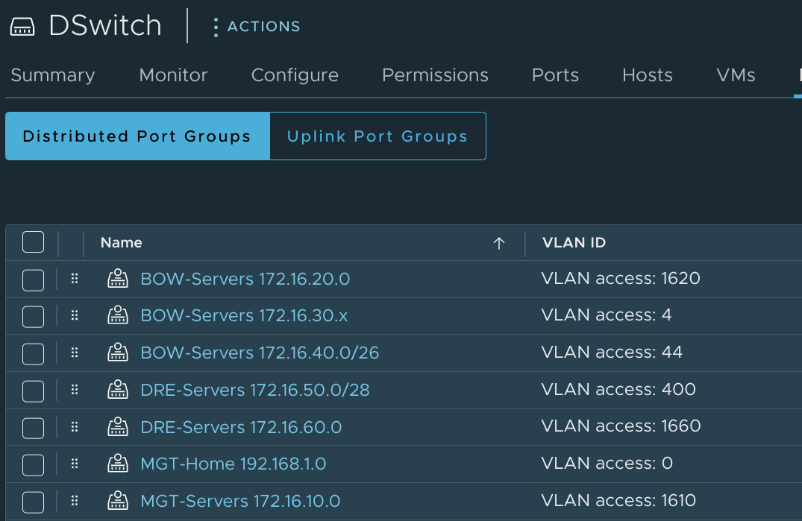

I [recently wrote](tanzu-community-edition-k8s-homelab/#a-real-workload---phpipam) about getting started with VMware's [Tanzu Community Edition](https://tanzucommunityedition.io/) and deploying [phpIPAM](https://phpipam.net/) as my first real-world Kubernetes workload. Well I've spent much of my time since then working on a script which would help to populate my phpIPAM instance with a list of networks to monitor.

### Planning and Exporting
The first step in making this work was to figure out which networks I wanted to import. We've got hundreds of different networks in use across our production vSphere environments. I focused only on those which are portgroups on distributed virtual switches since those configurations are pretty standardized (being vCenter constructs instead of configured on individual hosts). These dvPortGroups bear a naming standard which conveys all sorts of useful information, and it's easy and safe to rename any dvPortGroups which _don't_ fit the standard (unlike renaming portgroups on a standard virtual switch). 

The standard naming convention is `[Site]-[Description] [Network Address]{/[Mask]}`. So the networks look something like this:


Some networks have masks in the name, some don't. Most networks correctly include the network address with a `0` in the last octet, but some use an `x` instead. And the VLANs associated with the networks have a varying number of digits. These are all things that I needed to keep in mind as I worked on a solution which would make a true best effort at importing all of these. 

As long as the dvPortGroup names stick to this format I can parse the name to come up with the site/location as well as the IP space of the network. The dvPortGroup also carries information about the associated VLAN, which is useful information to have. And I can easily export this information with a simple PowerCLI query:

```powershell
PS /home/john> get-vdportgroup | select Name, VlanConfiguration

Name                       VlanConfiguration
----                       -----------------

MGT-Home 192.168.1.0
MGT-Servers 172.16.10.0    VLAN 1610
BOW-Servers 172.16.20.0    VLAN 1620
BOW-Servers 172.16.30.x    VLAN 4
BOW-Servers 172.16.40.0/26 VLAN 44
DRE-Servers 172.16.50.0/28 VLAN 400
DRE-Servers 172.16.60.0    VLAN 1660
```

In my [homelab](/vmware-home-lab-on-intel-nuc-9/), I only have a single vCenter. In production, we've got a handful of vCenters, and each manages the hosts in a given region. So I can use information about which vCenter hosts a dvPortGroup to figure out which region a network is in. When I import this data into phpIPAM, I can use the vCenter name to assign [remote scan agents](https://github.com/jbowdre/phpipam-agent-docker) to networks based on the region that they're in. 

The vCenter can be found in the `Uid` property returned by `get-vdportgroup`:
```powershell
PS /home/john> get-vdportgroup | select Name, VlanConfiguration, UID

Name                       VlanConfiguration      Uid
----                       -----------------      ---
MGT-Home 192.168.1.0                              /VIServer=lab\john@vcsa.lab.bowdre.net:443/DistributedPortgroup=DistributedVirtualPortgroup-dvportgroup-27015/
MGT-Servers 172.16.10.0    VLAN 1610              /VIServer=lab\john@vcsa.lab.bowdre.net:443/DistributedPortgroup=DistributedVirtualPortgroup-dvportgroup-27017/
BOW-Servers 172.16.20.0    VLAN 1620              /VIServer=lab\john@vcsa.lab.bowdre.net:443/DistributedPortgroup=DistributedVirtualPortgroup-dvportgroup-28010/
BOW-Servers 172.16.30.x    VLAN 4                 /VIServer=lab\john@vcsa.lab.bowdre.net:443/DistributedPortgroup=DistributedVirtualPortgroup-dvportgroup-28011/
BOW-Servers 172.16.40.0/26 VLAN 44                /VIServer=lab\john@vcsa.lab.bowdre.net:443/DistributedPortgroup=DistributedVirtualPortgroup-dvportgroup-28012/
DRE-Servers 172.16.50.0/28 VLAN 400               /VIServer=lab\john@vcsa.lab.bowdre.net:443/DistributedPortgroup=DistributedVirtualPortgroup-dvportgroup-28013/
DRE-Servers 172.16.60.0    VLAN 1660              /VIServer=lab\john@vcsa.lab.bowdre.net:443/DistributedPortgroup=DistributedVirtualPortgroup-dvportgroup-28014/
```

It's not pretty, but it'll do the trick. All that's left is to export this data into a handy-dandy CSV-formatted file that I can easily parse for import:

```powershell
get-vdportgroup | select Name, VlanConfiguration, Uid | export-csv -NoTypeInformation ./networks.csv
```


### Setting up phpIPAM
There are a few additional steps needed to enable API access to a freshly-installed phpIPAM installation. To start, I log in to my phpIPAM instance and navigate to the **Administration > Server Management > phpIPAM Settings** page, where I enabled both the *Prettify links* and *API* feature settings - making sure to hit the **Save** button at the bottom of the page once I do so.


Then I need to head to the **User Management** page to create a new user that will be used to authenticate against the API:


And finally, I head to the **API** section to create a new API key with Read/Write permissions:


### Script time
Well that's enough prep work; now it's time for the script. It's going to start by prompting the user to input required details like the fully-qualified host name of the phpIPAM server, the credentials and API key to use for the connection, and the CSV file from which to import the networks.


Notice that the script also prompts for a default set of DNS nameservers to be used. It will create a nameserver set in phpIPAM for each region (based on the vCenter) using these IPs. 

```python
# The latest version of this script can be found on Github:
# https://github.com/jbowdre/misc-scripts/blob/main/Python/phpipam-bulk-import.py

import requests
from collections import namedtuple

check_cert = True
created = 0
remote_agent = False
mapping_set = namedtuple('mapping_set', ['name', 'id'])

#for testing only
# from requests.packages.urllib3.exceptions import InsecureRequestWarning
# requests.packages.urllib3.disable_warnings(InsecureRequestWarning)
# check_cert = False

def validate_input_is_not_empty(field, prompt):
  while True:
    user_input = input(f'\n{prompt}:\n')
    if len(user_input) == 0:
      print(f'[ERROR] {field} cannot be empty!')
      continue
    else:
      return user_input


def get_unique_values_for_key(key, list_of_dict):
  return set(sub[key] for sub in list_of_dict)


def get_id_from_sets(name, sets):
  return [item.id for item in sets if name == item.name][0]


def auth_session(uri, auth):
  # authenticate to the API endpoint and retrieve an auth token
  print(f'Authenticating to {uri}...')
  try:
    req = requests.post(f'{uri}/user/', auth=auth, verify=check_cert)
  except:
    raise requests.exceptions.RequestException
  if req.status_code != 200:
    print(f'[ERROR] Authentication failure: {req.json()}')
    raise requests.exceptions.RequestException
  token = {"token": req.json()['data']['token']}
  print('\n[AUTH_SUCCESS] Authenticated successfully!')
  return token


def get_agent_sets(uri, token, vcenters):
  # check for and create missing remote scan agents, and return 
  # a list of namedTuples  mapping the names to IDs
  agent_sets = []

  def create_agent_set(uri, token, agentName):
    import secrets
    payload = {
      'name': agentName,
      'type': 'mysql',
      'code': secrets.base64.urlsafe_b64encode(secrets.token_bytes(24)).decode("utf-8")
    }
    req = requests.post(f'{uri}/tools/scanagents/', data=payload, headers=token, verify=check_cert)
    id = req.json()['id']
    agent_set = mapping_set(agentName, id)
    print(f'[AGENT_CREATE] Remote scan agent {agentName} created.')
    return agent_set

  for vcenter in vcenters:
    agentName = f'{vcenter}-agent'
    req = requests.get(f'{uri}/tools/scanagents/?filter_by=name&filter_value={agentName}', headers=token, verify=check_cert)
    if req.status_code == 200:
      id = req.json()['data'][0]['id']
      print(f'[AGENT_FOUND] Remote scan agent {agentName} found.')
      agent_set = mapping_set(agentName, id)
    else:
      agent_set = create_agent_set(uri, token, agentName)
    agent_sets.append(agent_set)
  return agent_sets


def get_section_sets(uri, token, sections, topSectionId):
  # check for and create missing sections, and return a list of 
  # namedTuples mapping the names to IDs
  section_sets = []

  def create_section_set(uri, token, section, topSectionId):
    payload = {
      'name': section,
      'masterSection': topSectionId,
      'permissions': '{"2":"2"}',
      'showVLAN': '1'
    }
    req = requests.post(f'{uri}/sections/', data=payload, headers=token, verify=check_cert)
    id = req.json()['id']
    section_set = mapping_set(section, id)
    print(f'[SECTION_CREATE] Section {section} created.')
    return section_set

  for section in sections:
    req = requests.get(f'{uri}/sections/{section}/', headers=token, verify=check_cert)
    if req.status_code == 200:
      id = req.json()['data']['id']
      print(f'[SECTION_FOUND] Section {section} found.')
      section_set = mapping_set(section, id)
    else:
      section_set = create_section_set(uri, token, section, topSectionId)
    section_sets.append(section_set)
  return section_sets


def get_vlan_sets(uri, token, vlans):
  # check for and create missing VLANs, and return a list of
  # namedTuples mapping the VLAN numbers to IDs
  vlan_sets = []

  def create_vlan_set(uri, token, vlan):
    payload = {
      'name': f'VLAN {vlan}',
      'number': vlan
    }
    req = requests.post(f'{uri}/vlan/', data=payload, headers=token, verify=check_cert)
    id = req.json()['id']
    vlan_set = mapping_set(vlan, id)
    print(f'[VLAN_CREATE] VLAN {vlan} created.')
    return vlan_set

  for vlan in vlans:
    if vlan is not '':
      req = requests.get(f'{uri}/vlan/?filter_by=number&filter_value={vlan}', headers=token, verify=check_cert)
      if req.status_code == 200:
        id = req.json()['data'][0]['vlanId']
        print(f'[VLAN_FOUND] VLAN {vlan} found.')
        vlan_set = mapping_set(vlan, id)
      else:
        vlan_set = create_vlan_set(uri, token, vlan)
      vlan_sets.append(vlan_set)
  return vlan_sets


def get_nameserver_sets(uri, token, vcenters, ips):
  # check for and create missing nameservers, and return a list
  # of namedTuples mapping the names to IDs
  nameserver_sets = []

  def create_nameserver_set(uri, token, ips, vcenter):
    name = f'{vcenter}-nameserver'
    payload = {
      'name': name,
      'namesrv1': ips,
      'description': f'Nameserver created for {vcenter}'
    }
    req = requests.post(f'{uri}/tools/nameservers/', data=payload, headers=token, verify=check_cert)
    id = req.json()['id']
    nameserver_set = mapping_set(name, id)
    print(f'[NAMESERVER_CREATE] Nameserver {name} created.')
    return nameserver_set

  for vcenter in vcenters:
    name = f'{vcenter}-nameserver'
    req = requests.get(f'{uri}/tools/nameservers/?filter_by=name&filter_value={name}', headers=token, verify=check_cert)
    if req.status_code == 200:
      id = req.json()['data'][0]['id']
      print(f'[NAMESERVER_FOUND] Nameserver {name} found.')
      nameserver_set = mapping_set(name, id)
    else:
      nameserver_set = create_nameserver_set(uri, token, ips, vcenter)
    nameserver_sets.append(nameserver_set)
  return nameserver_sets


def create_subnet(uri, token, network):
  # create new subnets

  def update_nameserver_permissions(uri, token, network):
    # update nameserver permissions so a subnet's parent section
    # has access to the nameserver
    nameserverId = network['nameserverId']
    sectionId = network['sectionId']
    req = requests.get(f'{uri}/tools/nameservers/{nameserverId}/', headers=token, verify=check_cert)
    permissions = req.json()['data']['permissions']
    permissions = str(permissions).split(';')
    if not sectionId in permissions:
      permissions.append(sectionId)
      if 'None' in permissions:
        permissions.remove('None')
      permissions = ';'.join(permissions)
      payload = {
        'permissions': permissions
      }
      req = requests.patch(f'{uri}/tools/nameservers/{nameserverId}/', data=payload, headers=token, verify=check_cert)

  payload = {
    'subnet': network['subnet'],
    'mask': network['mask'],
    'description': network['name'],
    'sectionId': network['sectionId'],
    'scanAgent': network['agentId'],
    'nameserverId': network['nameserverId'],
    'vlanId': network['vlanId'],
    'pingSubnet': '1',
    'discoverSubnet': '1',
    'resolveDNS': '1',
    'DNSrecords': '1'
  }
  req = requests.post(f'{uri}/subnets/', data=payload, headers=token, verify=check_cert)
  if req.status_code == 201:
    network['subnetId'] = req.json()['id']
    update_nameserver_permissions(uri, token, network)
    print(f"[SUBNET_CREATE] Created subnet {req.json()['data']}")
    global created
    created += 1
  elif req.status_code == 409:
    print(f"[SUBNET_EXISTS] Subnet {network['subnet']}/{network['mask']} already exists.")
  else:
    print(f"[ERROR] Problem creating subnet {network['name']}: {req.json()}")


def import_networks(filepath):
  # import the list of networks from the specified csv file
  print(f'Importing networks from {filepath}...')
  import csv
  import re
  ipPattern = re.compile('\d{1,3}\.\d{1,3}\.\d{1,3}\.[0-9xX]{1,3}')
  networks = []
  with open(filepath) as csv_file:
    reader = csv.DictReader(csv_file)
    line_count = 0
    for row in reader:
      network = {}
      if line_count > 0:
        if(re.search(ipPattern, row['Name'])):
          network['subnet'] = re.findall(ipPattern, row['Name'])[0]
          if network['subnet'].split('.')[-1].lower() == 'x':
            network['subnet'] = network['subnet'].lower().replace('x', '0')
          network['name'] = row['Name']
          network['section'] = row['Name'].split('-')[0]
          if '/' in row['Name'][-3]:
            network['mask'] = row['Name'].split('/')[-1]
          else:
            network['mask'] = '24'
          try:
            network['vlan'] = row['VlanConfiguration'].split('VLAN ')[1]
          except:
            network['vlan'] = ''
          network['vcenter'] = f"{(row['Uid'].split('@'))[1].split(':')[0].split('.')[0]}"
          networks.append(network)
      line_count += 1
    print(f'\nProcessed {line_count} lines.')
  print(f'Found {len(networks)} networks:\n')
  print(networks)
  return networks


def main():
  # gather inputs
  import socket
  import getpass
  import os.path

  print("""\n\n
  This script helps to add vSphere networks to phpIPAM for IP address management. It is expected
  that the vSphere networks are configured as portgroups on distributed virtual switches and 
  named like '[Site]-[Purpose] [Subnet IP]{/[mask]}' (ex: 'LAB-Servers 192.168.1.0'). The following PowerCLI
  command can be used to export the networks from vSphere:

    Get-VDPortgroup | Select Name, VlanConfiguration, Uid | Export-Csv -NoTypeInformation ./networks.csv

  Subnets added to phpIPAM will be automatically configured for monitoring either using the built-in
  scan agent (default) or a new remote scan agent named for the source vCenter ('vcenter_name-agent').
  """)
  input('Press enter to continue...')

  # make sure hostname resolves
  while True:
    hostname = input('\nFully-qualified domain name of the phpIPAM host:\n')
    if len(hostname) == 0:
      print('[ERROR] Hostname cannot be empty.')
      continue
    try:
      test = socket.gethostbyname(hostname)
    except:
      print(f'[ERROR] Unable to resolve {hostname}.')
      continue
    else:
      del test
      break
  
  username = validate_input_is_not_empty('Username', f'Username with read/write access to {hostname}')
  password = getpass.getpass(f'Password for {username}:\n')
  apiAppId = validate_input_is_not_empty('App ID', f'App ID for API key (from https://{hostname}/administration/api/)')
  topSectionName = validate_input_is_not_empty('Top-level Section Name', f'Top-level Section name (from https://{hostname}/administration/sections/)')
  nameserver_ips = validate_input_is_not_empty('Nameserver IPs', f'Comma-separated list default nameserver IPs for DNS lookups from {hostname}')
  
  # make sure filepath is a path to an actual file
  while True:
    filepath = validate_input_is_not_empty('Filepath', 'Path to CSV-formatted export from vCenter')
    if os.path.isfile(filepath):
      break
    else:
      print(f'[ERROR] Unable to find file at {filepath}.')
      continue
  
  agent = input('\nUse per-vCenter remote scan agents instead of a single local scanner? (y/N):\n')
  try:
    if agent.lower()[0] == 'y':
      global remote_agent
      remote_agent = True
  except:
    pass

  proceed = input(f'\n\nProceed with importing networks from {filepath} to {hostname}? (y/N):\n')
  try:
    if proceed.lower()[0] == 'y':
      pass
    else:
      import sys
      sys.exit("Operation aborted.")
  except:
    import sys
    sys.exit("Operation aborted.")
  del proceed

  # get collection of networks to import
  networks = import_networks(filepath)
  vcenters = get_unique_values_for_key('vcenter', networks)
  sections = get_unique_values_for_key('section', networks)
  vlans = get_unique_values_for_key('vlan', networks)

  # assemble variables
  nameserver_ips = nameserver_ips.replace(',',';').replace(' ','')
  uri = f'https://{hostname}/api/{apiAppId}'
  auth = (username, password)
  topSectionName = [topSectionName]

  # auth to phpIPAM
  token = auth_session(uri, auth)

  # get lists of dictionaries matching names to IDs
  nameserver_sets = get_nameserver_sets(uri, token, vcenters, nameserver_ips)
  vlan_sets = get_vlan_sets(uri, token, vlans)
  topSection_sets = get_section_sets(uri, token, topSectionName, None)
  topSectionId = topSection_sets[0].id
  section_sets = get_section_sets(uri, token, sections, topSectionId)
  if remote_agent:
    agent_sets = get_agent_sets(uri, token, vcenters)
  
  # create the networks
  for network in networks:
    network['nameserverId'] = get_id_from_sets(f"{network['vcenter']}-nameserver", nameserver_sets)
    network['sectionId'] = get_id_from_sets(network['section'], section_sets)
    network['topSectionId'] = topSectionId
    if network['vlan'] is '':
      network['vlanId'] = None
    else:
      network['vlanId'] = get_id_from_sets(network['vlan'], vlan_sets) 
    if remote_agent:
      network['agentId'] = get_id_from_sets(f"{network['vcenter']}-agent", agent_sets)
    else:
      network['agentId'] = '1'
    create_subnet(uri, token, network)

  print(f'\n[FINISH] Created {created} of {len(networks)} networks.')


if __name__ == "__main__":
  main()
```
