I've been doing a bit of work lately to make my vRealize Automation setup more flexible and dynamic and less dependent upon hardcoded values. To that end, I thought it was probably about time to learn how to interact with the vRA REST API. I wrote this post to share what I've learned and give a quick crash course on how to start doing things with the API.

### Exploration Toolkit
#### Swagger
It can be difficult to figure out where to start when learning a new API. Fortunately, VMware thoughtfully included a [Swagger](https://swagger.io/) specification for the API so that we can explore it in an interactive way. This is available for on-prem vRA environments at `https://{vra-fqdn}/automation-ui/api-docs/` (so `https://vra.lab.bowdre.net/automation-ui/api-docs/` in my case). You can also browse most of it online at [www.mgmt.cloud.vmware.com/automation-ui/api-docs/](https://www.mgmt.cloud.vmware.com/automation-ui/api-docs/)[^vracloud]. Playing with Swagger on your on-prem instance will even let you perform requests straight from the browser, which can be a great way to gain familiarity with how requests should be structured.


I'm ultimately going to be working with the Infrastructure as a Service API but before I can do that I'll need to talk to the Identity API to log in. So let's start the exploration there, with the Login Controller.


That tells me that I'll need to send a `POST` request to the endpoint at `/csp/gateway/am/api/login`, and I'll need to include `username`, `password`, `domain`, and `scope` in the request body. I can click the **Try it out** button to take this endpoint for a spin and just insert appropriate values in the request:[^password]
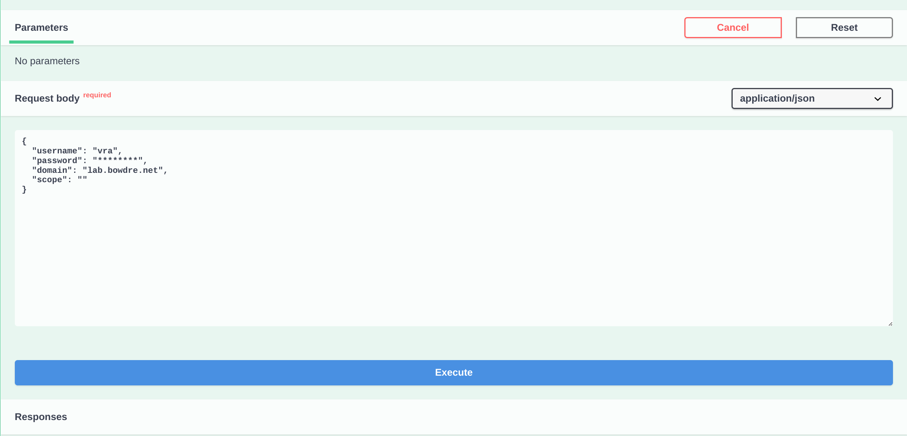

After hitting **Execute**, the Swagger UI will populate the *Responses* section with some useful information, like how the request would be formatted for use with `curl`:
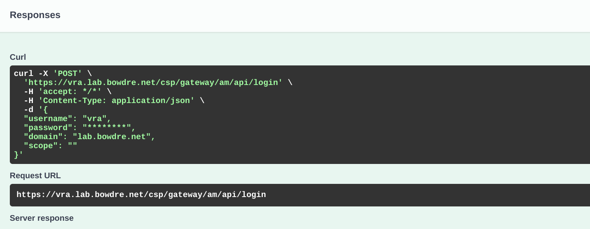

So I could easily replicate this using the `curl` utility by just copying and pasting the following into a shell:
```shell
curl -X 'POST' \
  'https://vra.lab.bowdre.net/csp/gateway/am/api/login' \
  -H 'accept: */*' \
  -H 'Content-Type: application/json' \
  -d '{
  "username": "vra",
  "password": "********",
  "domain": "lab.bowdre.net",
  "scope": ""
}'
```

Scrolling further reveals the authentication token returned by the identity service:
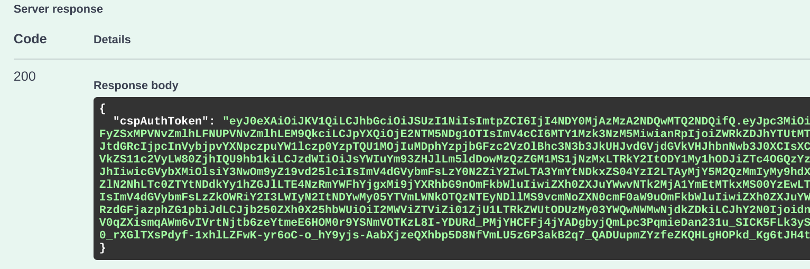

I can copy the contents of that `cspAuthToken` field and use it for authenticating other API operations. For instance, I'll go to the Infrastructure as a Service API Swagger UI and click the **Authorize** button at the top of the screen:
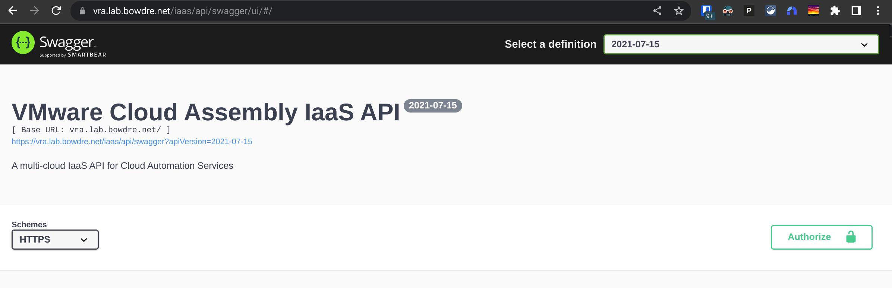
And then paste the token into the header as `Bearer [token]`:


Now I can go find an IaaS API that I'm interested in querying (like `/iaas/api/flavor-profiles` to see which flavor mappings are defined in vRA), and hit **Try it out** and then **Execute**:


And here's the result:
```json {hl_lines=[6,10,14,44,48,52,56,60,64]}
{
  "content": [
    {
      "flavorMappings": {
        "mapping": {
          "1vCPU | 2GB [tiny]": {
            "cpuCount": 1,
            "memoryInMB": 2048
          },
          "1vCPU | 1GB [micro]": {
            "cpuCount": 1,
            "memoryInMB": 1024
          },
          "2vCPU | 4GB [small]": {
            "cpuCount": 2,
            "memoryInMB": 4096
          }
        },
        "_links": {
          "region": {
            "href": "/iaas/api/regions/3617c011-39db-466e-a7f3-029f4523548f"
          }
        }
      },
      "externalRegionId": "Datacenter:datacenter-39056",
      "cloudAccountId": "75d29635-f128-4b85-8cf9-95a9e5981c68",
      "name": "",
      "id": "61ebe5bf-5f55-4dee-8533-7ad05c067dd9-3617c011-39db-466e-a7f3-029f4523548f",
      "updatedAt": "2022-05-05",
      "organizationId": "61ebe5bf-5f55-4dee-8533-7ad05c067dd9",
      "orgId": "61ebe5bf-5f55-4dee-8533-7ad05c067dd9",
      "_links": {
        "self": {
          "href": "/iaas/api/flavor-profiles/61ebe5bf-5f55-4dee-8533-7ad05c067dd9-3617c011-39db-466e-a7f3-029f4523548f"
        },
        "region": {
          "href": "/iaas/api/regions/3617c011-39db-466e-a7f3-029f4523548f"
        }
      }
    },
    {
      "flavorMappings": {
        "mapping": {
          "2vCPU | 8GB [medium]": {
            "cpuCount": 2,
            "memoryInMB": 8192
          },
          "1vCPU | 2GB [tiny]": {
            "cpuCount": 1,
            "memoryInMB": 2048
          },
          "8vCPU | 16GB [giant]": {
            "cpuCount": 8,
            "memoryInMB": 16384
          },
          "1vCPU | 1GB [micro]": {
            "cpuCount": 1,
            "memoryInMB": 1024
          },
          "2vCPU | 4GB [small]": {
            "cpuCount": 2,
            "memoryInMB": 4096
          },
          "4vCPU | 12GB [large]": {
            "cpuCount": 4,
            "memoryInMB": 12288
          }
        },
        "_links": {
          "region": {
            "href": "/iaas/api/regions/c0d2a662-9ee5-4a27-9a9e-e92a72668136"
          }
        }
      },
      "externalRegionId": "Datacenter:datacenter-1001",
      "cloudAccountId": "75d29635-f128-4b85-8cf9-95a9e5981c68",
      "name": "",
      "id": "61ebe5bf-5f55-4dee-8533-7ad05c067dd9-c0d2a662-9ee5-4a27-9a9e-e92a72668136",
      "updatedAt": "2022-05-05",
      "organizationId": "61ebe5bf-5f55-4dee-8533-7ad05c067dd9",
      "orgId": "61ebe5bf-5f55-4dee-8533-7ad05c067dd9",
      "_links": {
        "self": {
          "href": "/iaas/api/flavor-profiles/61ebe5bf-5f55-4dee-8533-7ad05c067dd9-c0d2a662-9ee5-4a27-9a9e-e92a72668136"
        },
        "region": {
          "href": "/iaas/api/regions/c0d2a662-9ee5-4a27-9a9e-e92a72668136"
        }
      }
    }
  ],
  "totalElements": 2,
  "numberOfElements": 2
}
```
So that API call will tell me about the Flavor Profiles as well as which Region the profiles belong to.

As you can see, Swagger can really help to jump-start the exploration of a new API, but it can get a bit clumsy for repeated queries. And while I _could_ just use `curl` for further API exercises, I'd rather use a tool built specifically for API tomfoolery:

[^vracloud]: The online version is really intended for the vRealize Automation Cloud hosted solution. It can be a useful reference but some APIs are missing.
[^password]: This request form is pure plaintext so you'd never have known that my password is actually `********` if I hadn't mentioned it. Whoops!
#### HTTPie
[HTTPie](https://httpie.io/) is a handy command-line utility optimized for interacting with web APIs. This will make things easier as I dig deeper. 

Installing the [Debian package](https://httpie.io/docs/cli/debian-and-ubuntu) is a piece of ~~cake~~ _pie_[^pie]:
```shell
curl -SsL https://packages.httpie.io/deb/KEY.gpg | sudo apt-key add -
sudo curl -SsL -o /etc/apt/sources.list.d/httpie.list https://packages.httpie.io/deb/httpie.list
sudo apt update
sudo apt install httpie
```

Once installed, running `http` will give me a quick overview of how to use this new tool:
```shell {hl_lines=[3]}
; http
usage:
    http [METHOD] URL [REQUEST_ITEM ...]

error:
    the following arguments are required: URL

for more information:
    run 'http --help' or visit https://httpie.io/docs/cli
```
HTTPie cleverly interprets anything passed after the URL as a [request item](https://httpie.io/docs/cli/request-items), and it determines the item type based on a simple key/value syntax:
> Each request item is simply a key/value pair separated with the following characters: `:` (headers), `=` (data field, e.g., JSON, form), `:=` (raw data field), `==` (query parameters), `@` (file upload).

So my earlier request for an authentication token becomes:
```shell
https POST vra.lab.bowdre.net/csp/gateway/am/api/login username='vra' password='********' domain='lab.bowdre.net'
```
{}
If your vRA endpoint is using a self-signed or otherwise untrusted certificate, pass the HTTPie option `--verify=no` to ignore certificate errors:
```
https --verify=no POST [URL] [REQUEST_ITEMS]
```
{}

Running that will return a bunch of interesting headers but I'm mainly interested in the response body:
```json
{
    "cspAuthToken": "eyJ0eXAiOiJKV1QiLCJhbGciOiJSUzI1NiIsImtpZCI6IjI4NDY0MjAzMzA2NDQwMTQ2NDQifQ.eyJpc3MiOiJDTj1QcmVsdWRlIElkZW50aXR5IFNlcnZpY2UsT1U9Q01CVSxPPVZNd2FyZSxMPVNvZmlhLFNUPVNvZmlhLEM9QkciLCJpYXQiOjE2NTQwMjQw[...]HBOQQwEepXTNAaTv9gWMKwvPzktmKWyJFmC64FGomRyRyWiJMkLy3xmvYQERwxaDj_15-ErjC6F3c2mV1qIqES2oZbEpjxar16ZVSPshIaOoWRXe5uZB21tkuwVMgZuuwgmpliG_JBa1Y6Oh0FZBbI7o0ERro9qOW-s2npz4Csv5FwcXt0fa4esbXXIKINjqZMh9NDDb23bUabSag"
}
```

There's the auth token[^token] that I'll need for subsequent requests. I'll store that in a variable so that it's easier to wield:
```shell
token=eyJ0eXAiOiJKV1QiLCJhbGciOiJSUzI1NiIsImtpZCI6IjI4NDY0MjAzMzA2NDQwMTQ2NDQifQ.eyJpc3MiOiJDTj1QcmVsdWRlIElkZW50aXR5IFNlcnZpY2UsT1U9Q01CVSxPPVZNd2FyZSxMPVNvZmlhLFNUPVNvZmlhLEM9QkciLCJpYXQiOjE2NTQwMjQw[...]HBOQQwEepXTNAaTv9gWMKwvPzktmKWyJFmC64FGomRyRyWiJMkLy3xmvYQERwxaDj_15-ErjC6F3c2mV1qIqES2oZbEpjxar16ZVSPshIaOoWRXe5uZB21tkuwVMgZuuwgmpliG_JBa1Y6Oh0FZBbI7o0ERro9qOW-s2npz4Csv5FwcXt0fa4esbXXIKINjqZMh9NDDb23bUabSag
```

So now if I want to find out which images have been configured in vRA, I can ask:
```shell
https GET vra.lab.bowdre.net/iaas/api/images "Authorization: Bearer $token"
```
{}
Remember from above that HTTPie will automatically insert key/value pairs separated by a colon into the request header.
{}

And I'll get back some headers followed by an JSON object detailing the defined image mappings broken up by region:
```json {hl_lines=[11,14,37,40,53,56]}
{
    "content": [
        {
            "_links": {
                "region": {
                    "href": "/iaas/api/regions/3617c011-39db-466e-a7f3-029f4523548f"
                }
            },
            "externalRegionId": "Datacenter:datacenter-39056",
            "mapping": {
                "Photon 4": {
                    "_links": {
                        "region": {
                            "href": "/iaas/api/regions/3617c011-39db-466e-a7f3-029f4523548f"
                        }
                    },
                    "cloudConfig": "",
                    "constraints": [],
                    "description": "photon-arm",
                    "externalId": "50023810-ae56-3c58-f374-adf6e0645886",
                    "externalRegionId": "Datacenter:datacenter-39056",
                    "id": "8885e87d8a5898cf12b5abc3e5c715e5a65f7179",
                    "isPrivate": false,
                    "name": "photon-arm",
                    "osFamily": "LINUX"
                }
            }
        },
        {
            "_links": {
                "region": {
                    "href": "/iaas/api/regions/c0d2a662-9ee5-4a27-9a9e-e92a72668136"
                }
            },
            "externalRegionId": "Datacenter:datacenter-1001",
            "mapping": {
                "Photon 4": {
                    "_links": {
                        "region": {
                            "href": "/iaas/api/regions/c0d2a662-9ee5-4a27-9a9e-e92a72668136"
                        }
                    },
                    "cloudConfig": "",
                    "constraints": [],
                    "description": "photon",
                    "externalId": "50028cf1-88b8-52e8-58a1-b8354d4207b0",
                    "externalRegionId": "Datacenter:datacenter-1001",
                    "id": "d417648249e9740d7561188fa2a3a3ab4e8ccf85",
                    "isPrivate": false,
                    "name": "photon",
                    "osFamily": "LINUX"
                },
                "Windows Server 2019": {
                    "_links": {
                        "region": {
                            "href": "/iaas/api/regions/c0d2a662-9ee5-4a27-9a9e-e92a72668136"
                        }
                    },
                    "cloudConfig": "",
                    "constraints": [],
                    "description": "ws2019",
                    "externalId": "500235ad-1022-fec3-8ad1-00433beee103",
                    "externalRegionId": "Datacenter:datacenter-1001",
                    "id": "7e05f4e57ac55135cf7a7f8b951aa8ccfcc335d8",
                    "isPrivate": false,
                    "name": "ws2019",
                    "osFamily": "WINDOWS"
                }
            }
        }
    ],
    "numberOfElements": 2,
    "totalElements": 2
}
```
This doesn't give me the *name* of the regions, but I could use the `_links.region.href` data to quickly match up images which exist in a given region.[^foreshadowing] 

You'll notice that HTTPie also prettifies the JSON response to make it easy for humans to parse. This is great for experimenting with requests against different API endpoints and getting a feel for what data can be found where. And firing off tests in HTTPie can be a lot quicker (and easier to format) than with other tools.

Now let's take what we've learned and see about implementing it as vRO actions.
[^pie]: 
[^token]: Well, most of it.
[^foreshadowing]: That knowledge will come in handy later.
### vRealize Orchestrator actions
My immediate goal for this exercise is create a set of vRealize Orchestrator actions which take in a zone/location identifier from the Cloud Assembly request and return a list of images which are available for deployment there. I'll start with some utility actions to do the heavy lifting, and  then I'll be able to call them from other actions as things get more complicated/interesting. Before I can do that, though, I'll need to add the vRA instance as an HTTP REST endpoint in vRO.

{}
A lot of what follows was borrowed *heavily* from a [very helpful post by Oktawiusz Poranski over at Automate Clouds](https://automateclouds.com/2021/vrealize-automation-8-rest-api-how-to/) so be sure to check out that site for more great tips on working with APIs!
{}

#### Creating the endpoint
I can use the predefined **Add a REST host** workflow to create the needed endpoint.


Configuring the host properties here is very simple: just give it a name and the URL of the vRA instance.

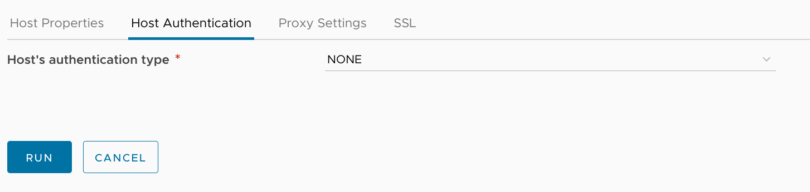
On the Authentication tab, I set the auth type to `NONE`; I'll handle the authentication steps directly.

With those parameters in place I can kick off the workflow. Once it completes, I can check **Administration > Inventory > HTTP-REST** to see the newly-created endpoint:
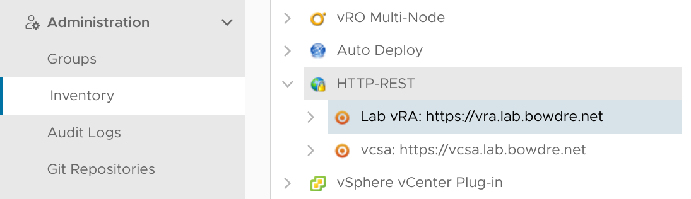

#### Creating a Configuration for the endpoint
I don't want to hardcode any endpoints or credentials into my vRO actions so I'm also going to create a Configuration to store those details. This will make it easy to reference those same details from multiple actions as well.

To create a new Configuration, I'll head to **Assets > Configurations**, select a folder (or create a new one) where I want the Configuration to live, and then click the **New Configuration** button.


I'm going to call this new Configuration `Endpoints` since I plan to use it for holding host/credentials for additional endpoints in the future. After giving it a name, I'll go ahead and click **Save** to preserve my efforts thus far.


I'll then click over to the **Variables** tab and create a new variable to store my vRA endpoint details; I'll call it `vRAHost`, and hit the *Type* dropdown and select **New Composite Type**. 


This new composite type will let me use a single variable to store multiple values - basically everything I'll need to interact with a single REST endpoint:

| Variable | Type |
|:--- |:--- |
| `host` | `REST:RESTHost` |
| `username` | `string` |
| `domain` | `string` |
| `password` | `SecureString` |

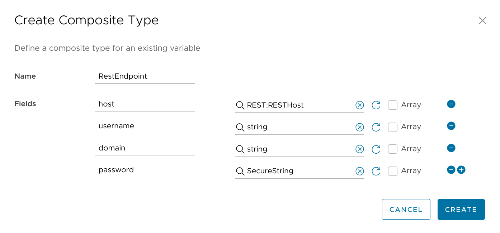

I can then map the appropriate values for this new variable and hit **Create**.
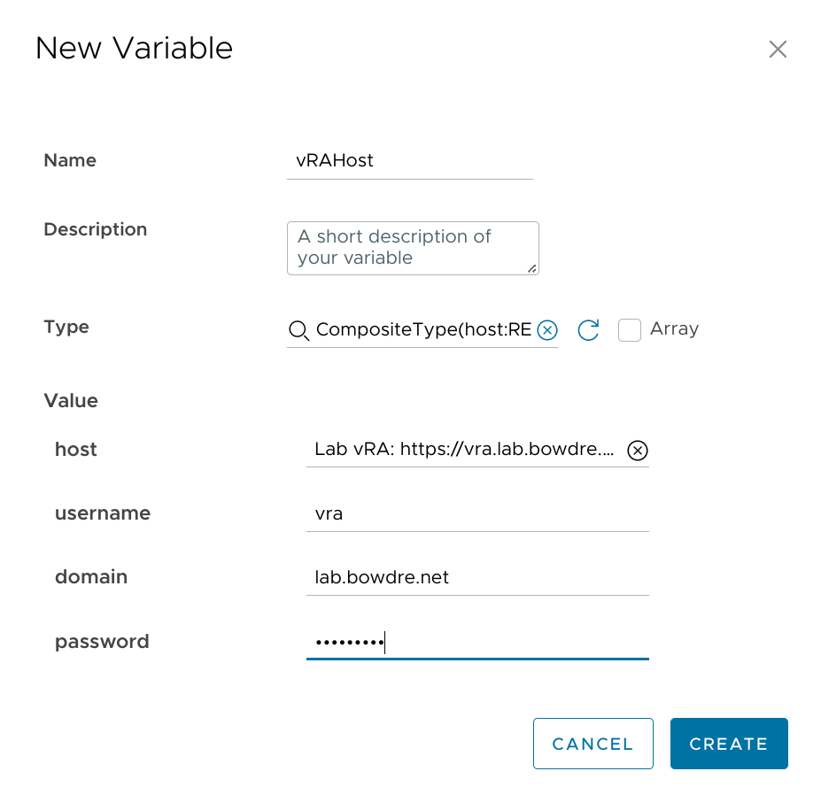

I make sure to **Save** my work and then gaze at the new Configuration's majesty:
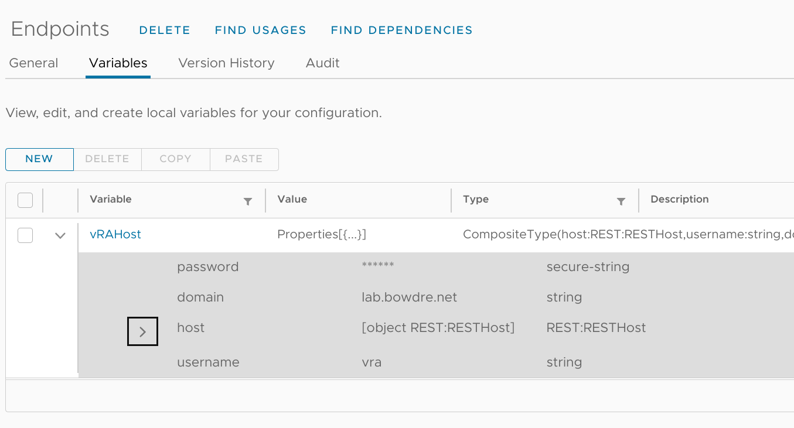

Okay, enough prep work - let's get into some Actions!
#### Utility actions
##### `getConfigValue` action
I'll head into **Library > Actions** to create a new action inside my `com.virtuallypotato.utility` module. This action's sole purpose will be to extract the details out of the configuration element I just created. Right now I'm only concerned with retrieving the one `vRAHost` configuration but I'm a fan of using generic pluggable modules where possible. This one will work to retrieve the value of *any* variable defined in *any* configuration element so I'll call it `getConfigValue`.


| Input | Type | Description |
|:--- |:--- |:--- |
| `path` | `string` | Path to Configuration folder |
| `configurationName` | `string` | Name of Configuration |
| `variableName` | `string` | Name of desired variable inside Configuration |

```javascript
/*  
JavaScript: getConfigValue action
    Inputs: path (string), configurationName (string), variableName (string)
    Return type: string
*/

var configElement = null;
for each (configElement in Server.getConfigurationElementCategoryWithPath(path).configurationElements) {
    if (configElement.name.indexOf(configurationName) === 0) { break; };
}
var attribValue = configElement.getAttributeWithKey(variableName).value;
return attribValue;
```

##### `vraLogin` action
Next, I'll create another action in my `com.virtuallypotato.utility` module which will use the `getConfigValue` action to retrieve the endpoint details. It will then submit a `POST` request to that endpoint to log in, and it will return the authentication token. Later actions will be able to call upon `vraLogin` to grab a token and then pass that back to the IaaS API in the request headers - but I'm getting ahead of myself. Let's get the login sorted:

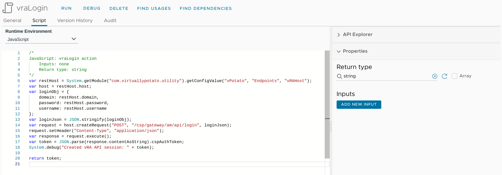

```javascript
/*  
JavaScript: vraLogin action
    Inputs: none
    Return type: string
*/
var restHost = System.getModule("com.virtuallypotato.utility").getConfigValue("vPotato", "Endpoints", "vRAHost");
var host = restHost.host;
var loginObj = {
    domain: restHost.domain,
    password: restHost.password,
    username: restHost.username
};
var loginJson = JSON.stringify(loginObj);
var request = host.createRequest("POST", "/csp/gateway/am/api/login", loginJson);
request.setHeader("Content-Type", "application/json");
var response = request.execute();
var token = JSON.parse(response.contentAsString).cspAuthToken;
System.debug("Created vRA API session: " + token);

return token;
```

##### `vraLogout` action
I like to clean up after myself so I'm also going to create a `vraLogout` action in my `com.virtuallypotato.utility` module to tear down the API session when I'm finished with it.


| Input | Type | Description |
|:--- |:--- |:--- |
| `token` | `string` | Auth token of the session to destroy |

```javascript
/*  
JavaScript: vraLogout action
    Inputs: token (string)
    Return type: string
*/
var host = System.getModule("com.virtuallypotato.utility").getConfigValue("vPotato", "Endpoints", "vRAHost").host;
var logoutObj = {
    idToken: token
};
var logoutJson = JSON.stringify(logoutObj);

var request = host.createRequest("POST", "/csp/gateway/am/api/auth/logout", logoutJson);
request.setHeader("Content-Type", "application/json");
request.execute().statusCode;
System.debug("Terminated vRA API session: " + token);
```

##### `vraExecute` action
My final "utility" action for this effort will run in between `vraLogin` and `vraLogout`, and it will handle making the actual API call and returning the results. This way I won't have to implement the API handler in every single action which needs to talk to the API - they can just call my new action, `vraExecute`.  

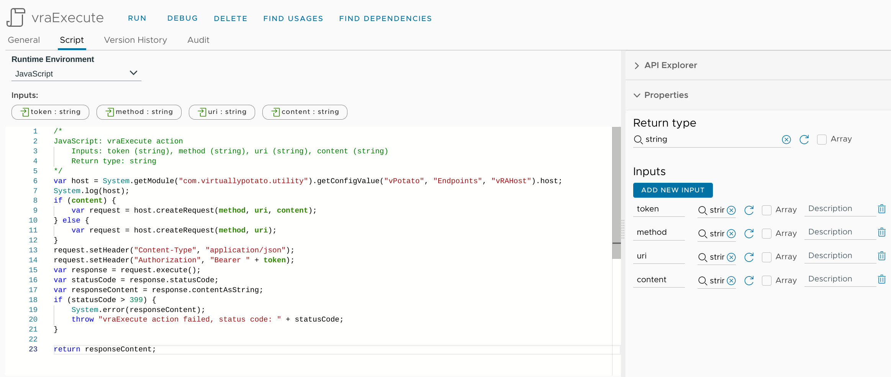

| Input | Type | Description |
|:--- |:--- |:--- |
|`token`|`string`|Auth token from `vraLogin`|
|`method`|`string`|REST Method (`GET`, `POST`, etc.)|
|`uri`|`string`|Path to API controller (`/iaas/api/flavor-profiles`)|
|`content`|`string`|Any additional data to pass with the request|

```javascript
/*
JavaScript: vraExecute action
    Inputs: token (string), method (string), uri (string), content (string)
    Return type: string
*/
var host = System.getModule("com.virtuallypotato.utility").getConfigValue("vPotato", "Endpoints", "vRAHost").host;
System.log(host);
if (content) {
    var request = host.createRequest(method, uri, content);
} else {
    var request = host.createRequest(method, uri);
}
request.setHeader("Content-Type", "application/json");
request.setHeader("Authorization", "Bearer " + token);
var response = request.execute();
var statusCode = response.statusCode;
var responseContent = response.contentAsString;
if (statusCode > 399) {
    System.error(responseContent);
    throw "vraExecute action failed, status code: " + statusCode;
}

return responseContent;
```

##### Bonus: `vraTester` action
That's it for the core utility actions - but wouldn't it be great to know that this stuff works before moving on to handling the request input? Enter `vraTester`! It will be handy to have an action I can test vRA REST requests in before going all-in on a solution. 

This action will:
1. Call `vraLogin` to get an API token.
2. Call `vraExecute` with that token, a REST method, and an API endpoint to retrieve some data.
3. Call `vraLogout` to terminate the API session.
4. Return the data so we can see if it worked.

Other actions wanting to interact with the vRA REST API will follow the same basic formula, though with some more logic and capability baked in. 

Anyway, here's my first swing:
```JavaScript
/*
JavaScript: vraTester action
    Inputs: none
    Return type: string
*/
var token = System.getModule('com.virtuallypotato.utility').vraLogin();
var result = JSON.parse(System.getModule('com.virtuallypotato.utility').vraExecute(token, 'GET', '/iaas/api/zones')).content;
System.log(JSON.stringify(result));
System.getModule('com.virtuallypotato.utility').vraLogout(token);
return JSON.stringify(result);
```

Pretty simple, right? Let's see if it works:


It did! Though that result is a bit hard to parse visually, so I'm going to prettify it a bit:
```json {hl_lines=[17,35,56,74]}
[
  {
    "tags": [],
    "tagsToMatch": [
      {
        "key": "compute",
        "value": "nuc"
      }
    ],
    "placementPolicy": "DEFAULT",
    "customProperties": {
      "zone_overlapping_migrated": "true"
    },
    "folder": "vRA_Deploy",
    "externalRegionId": "Datacenter:datacenter-1001",
    "cloudAccountId": "75d29635-f128-4b85-8cf9-95a9e5981c68",
    "name": "NUC",
    "id": "3d4f048a-385d-4759-8c04-117a170d060c",
    "updatedAt": "2022-06-02",
    "organizationId": "61ebe5bf-5f55-4dee-8533-7ad05c067dd9",
    "orgId": "61ebe5bf-5f55-4dee-8533-7ad05c067dd9",
    "_links": {
      "projects": {
        "hrefs": [
          "/iaas/api/projects/9c3d1e73-1276-42e7-8d8e-cac40251a29e"
        ]
      },
      "computes": {
        "href": "/iaas/api/zones/3d4f048a-385d-4759-8c04-117a170d060c/computes"
      },
      "self": {
        "href": "/iaas/api/zones/3d4f048a-385d-4759-8c04-117a170d060c"
      },
      "region": {
        "href": "/iaas/api/regions/c0d2a662-9ee5-4a27-9a9e-e92a72668136"
      },
      "cloud-account": {
        "href": "/iaas/api/cloud-accounts/75d29635-f128-4b85-8cf9-95a9e5981c68"
      }
    }
  },
  {
    "tags": [],
    "tagsToMatch": [
      {
        "key": "compute",
        "value": "qtz"
      }
    ],
    "placementPolicy": "DEFAULT",
    "customProperties": {
      "zone_overlapping_migrated": "true"
    },
    "externalRegionId": "Datacenter:datacenter-39056",
    "cloudAccountId": "75d29635-f128-4b85-8cf9-95a9e5981c68",
    "name": "QTZ",
    "id": "84470591-74a2-4659-87fd-e5d174a679a2",
    "updatedAt": "2022-06-02",
    "organizationId": "61ebe5bf-5f55-4dee-8533-7ad05c067dd9",
    "orgId": "61ebe5bf-5f55-4dee-8533-7ad05c067dd9",
    "_links": {
      "projects": {
        "hrefs": [
          "/iaas/api/projects/9c3d1e73-1276-42e7-8d8e-cac40251a29e"
        ]
      },
      "computes": {
        "href": "/iaas/api/zones/84470591-74a2-4659-87fd-e5d174a679a2/computes"
      },
      "self": {
        "href": "/iaas/api/zones/84470591-74a2-4659-87fd-e5d174a679a2"
      },
      "region": {
        "href": "/iaas/api/regions/3617c011-39db-466e-a7f3-029f4523548f"
      },
      "cloud-account": {
        "href": "/iaas/api/cloud-accounts/75d29635-f128-4b85-8cf9-95a9e5981c68"
      }
    }
  }
]
```

I can see that it returned two Cloud Zones, named `NUC` (for my [NUC 9 host](/vmware-home-lab-on-intel-nuc-9/)) and `QTZ` (for my [Quartz64 SBC running ESXi-ARM](/esxi-arm-on-quartz64/)). Each Zone also includes data about other objects associated with the Zone, such as that `_links.region.href` property I mentioned earlier.

My compute targets live at the Zone level, each Zone lives inside a given Region, and the Image Profiles reside within a Region. See where this is going? I now have the information I need to link a Zone to the Image Profiles available within that Zone.

#### Input actions
So now I'm ready to work on the actions that will handle passing information between the vRA REST API and the Cloud Assembly deployment request form. For organization purposes, I'll stick them in a new module which I'll call `com.virtuallypotato.inputs`. And for the immediate purposes, I'm going to focus on just two fields in the request form: `Zone` (for where the VM should be created) and `Image` (for what VM template it will be spawned from). The `Zone` dropdown will be automatically populated when the form loads, and `Image` options will show up as soon as a the user has selected a Zone.

##### `vraGetZones` action
This action will basically just repeat the call that I tested above in `vraTester`, but parse the result to extract just the Zone names. It will pop those into an array of strings which can be rendered as a dropdown on the Cloud Assembly side.

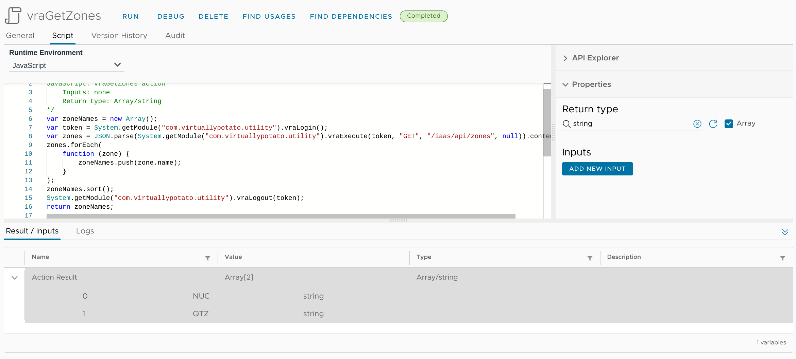

```javascript
/*
JavaScript: vraGetZones action
    Inputs: none
    Return type: Array/string
*/
var zoneNames = new Array();
var token = System.getModule("com.virtuallypotato.utility").vraLogin();
var zones = JSON.parse(System.getModule("com.virtuallypotato.utility").vraExecute(token, "GET", "/iaas/api/zones", null)).content;
zones.forEach(
    function (zone) {
        zoneNames.push(zone.name);
    }
);
zoneNames.sort();
System.getModule("com.virtuallypotato.utility").vraLogout(token);
return zoneNames;
```

##### `vraGetImages` action
Once the user has selected a Zone from the dropdown, the `vraGetImages` action will first contact the same `/iaas/api/zones` API to get the same list of available Zones. It will look through that list to find the one with the matching name, and then extract the `._links.region.href` URI for the Zone.

Next it will reach out to `/iaas/api/images` to retrieve all the available images. For each image, it will compare its associated `._links.region.href` URI to that of the designated Zone; if there's a match, the action will add the image to an array of strings which will then be returned back to the request form.

Oh, and the whole thing is wrapped in a conditional so that the code only executes when `zoneName` has been set on the request form; otherwise it simply returns an empty string.

| Input | Type | Description |
|:--- |:--- |:--- |
| `zoneName` | `string` | The name of the Zone selected in the request form |

```javascript
/* JavaScript: vraGetImages action
    Inputs: zoneName (string)
    Return type: array/string
*/
if (!(zoneName == "" || zoneName == null)) {
    var arrImages = new Array();
    var regionUri = null;
    var token = System.getModule("com.virtuallypotato.utility").vraLogin();
    var zones = JSON.parse(System.getModule("com.virtuallypotato.utility").vraExecute(token, "GET", "/iaas/api/zones", null)).content;
    System.debug("Zones: " + JSON.stringify(zones));
    for each (zone in zones) {
        if (zone.name === zoneName) {
            System.debug("Matching zone: " + zone.name);
            regionUri = zone._links.region.href;
        }
        if (regionUri != null) { break; };
    }
    System.debug("Matching region URI: " + regionUri);
    var images = JSON.parse(System.getModule("com.virtuallypotato.utility").vraExecute(token, "GET", "/iaas/api/images", null)).content;
    System.debug("Images: " + JSON.stringify(images));
    images.forEach(
        function (image) {
            if (image._links.region.href === regionUri) {
                System.debug("Images in region: " + JSON.stringify(image.mapping));
                for (var i in image.mapping) {
                    System.debug("Image: " + i);
                    arrImages.push(i);
                }
            }
        }
    );
    arrImages.sort();
    System.getModule("com.virtuallypotato.utility").vraLogout(token);
    return arrImages;
} else {
    return [""];
}
```

I'll use the **Debug** button to test this action real quick-like, providing the `NUC` Zone as the input:
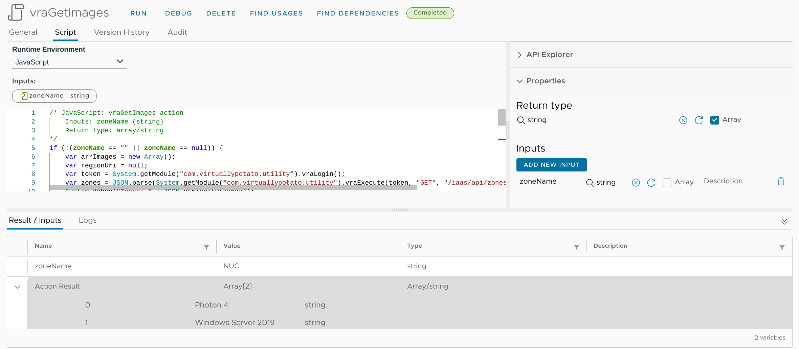

It works! Well, at least when called directly. Let's see how it does when called from Cloud Assembly.

### Cloud Assembly request
For now I'm really only testing using my new vRO actions so my Cloud Template is going to be pretty basic. I'm not even going to add any resources to the template; I don't even need it to be deployable. 

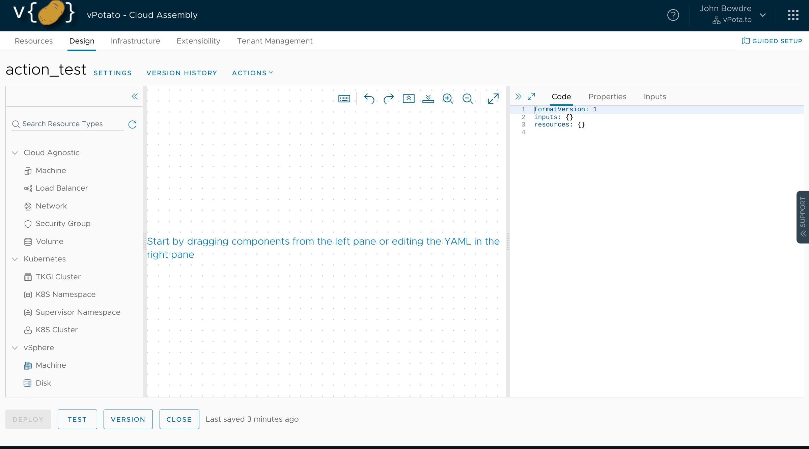

What I do need are two inputs. I'd normally just write the inputs directly as YAML, but the syntax for referencing vRO actions can be a bit tricky and I don't want to mess it up. So I pop over to the **Inputs** tab in the editor pane on the right and click the **New Cloud Template Input** button.

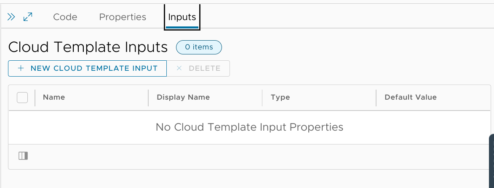

I'll start with an input called `zoneName`, which will be a string:
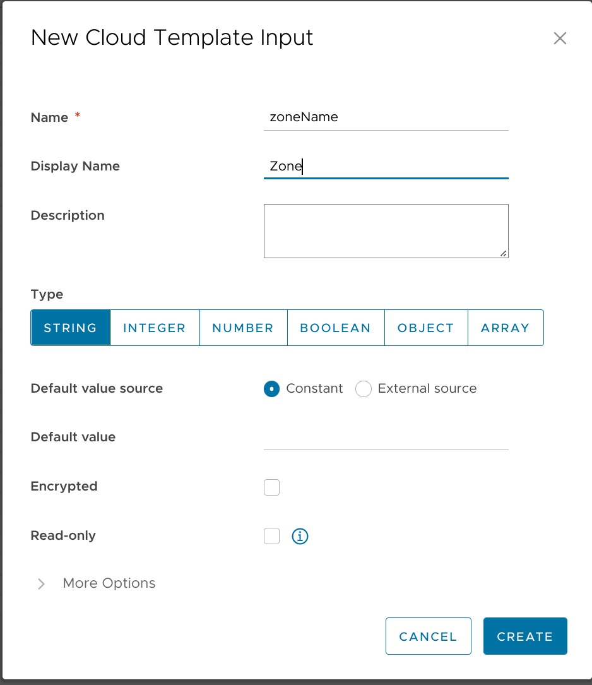

I'll then click on **More Options** and scroll to the bottom to select that the field data should come from an *External Source*:
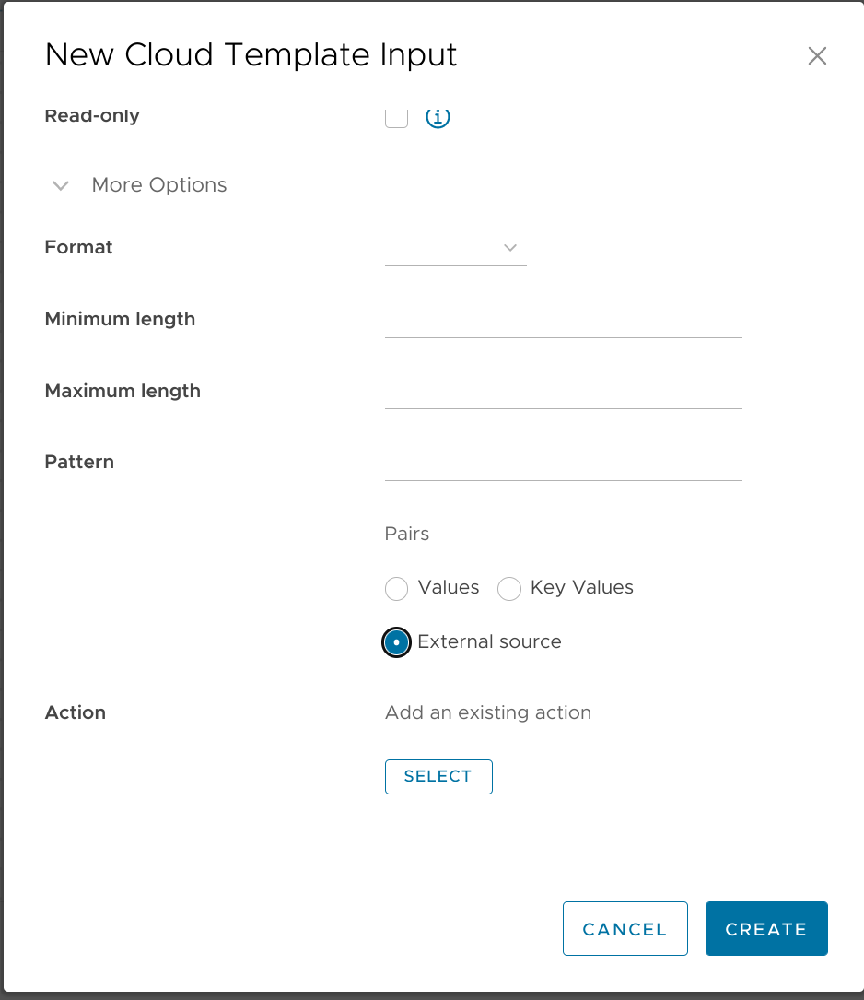

I click the **Select** button and can then search for the `vraGetZones` action I wish to use:


And then hit **Create** to add the new input to the template.

Next I'll repeat the same steps to create a new `image` input. This time, though, when I select the `vraGetImages` action I'll also need to select another input to bind to the `zoneName` parameter:
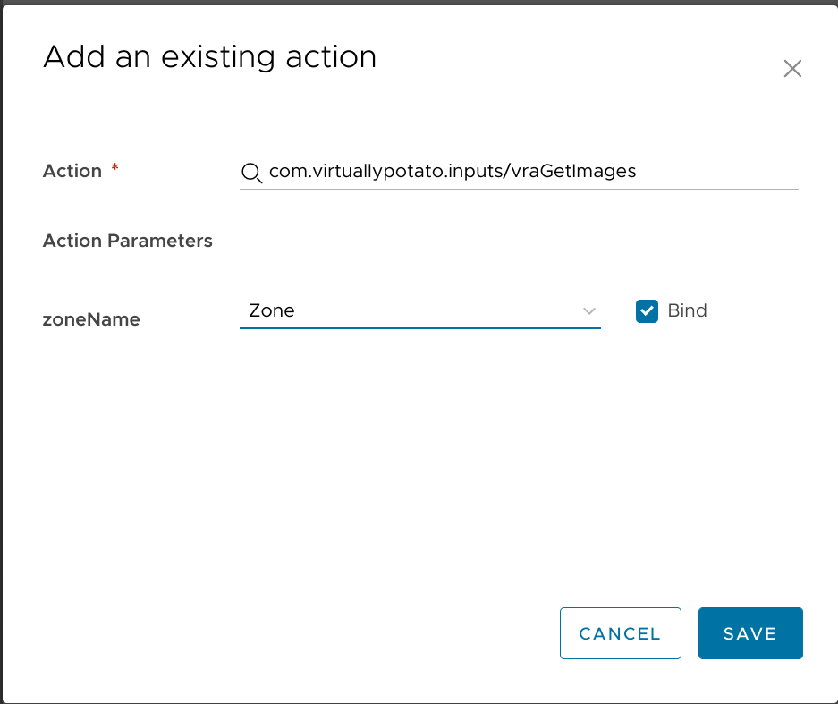

The full code for my template now looks like this:
```yaml
formatVersion: 1
inputs:
  zoneName:
    type: string
    title: Zone
    $dynamicEnum: /data/vro-actions/com.virtuallypotato.inputs/vraGetZones
  image:
    type: string
    title: Image
    $dynamicEnum: /data/vro-actions/com.virtuallypotato.inputs/vraGetImages?zoneName={{zoneName}}
resources: {}
```
And I can use the **Test** button at the bottom of the Cloud Assembly template editor to confirm that everything works:

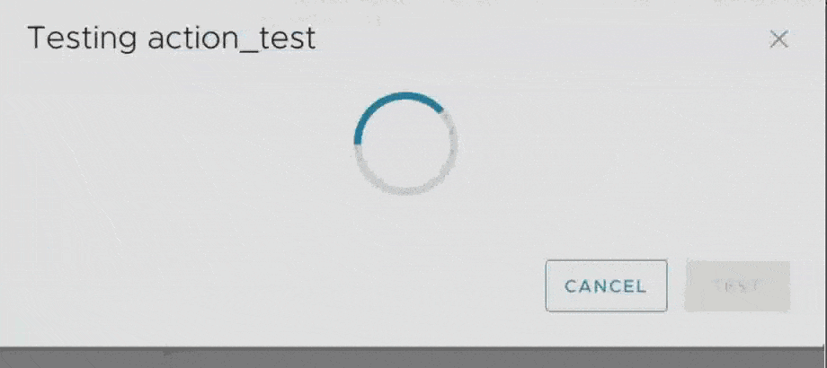

It does!

### Conclusion
This has been a very quick introduction on how to start pulling data from the vRA APIs, but it (hopefully) helps to consolidate all the knowledge and information I had to find when I started down this path - and maybe it will give you some ideas on how you can use this ability within your own vRA environment. 

In the near future, I'll also have a post on how to do the same sort of things with the vCenter REST API, and I hope to follow that up with a deeper dive on all the tricks I've used to make my request forms as dynamic as possible with the absolute minimum of hardcoded data in the templates. Let me know in the comments if there are any particular use cases you'd like me to explore further.

Until next time!