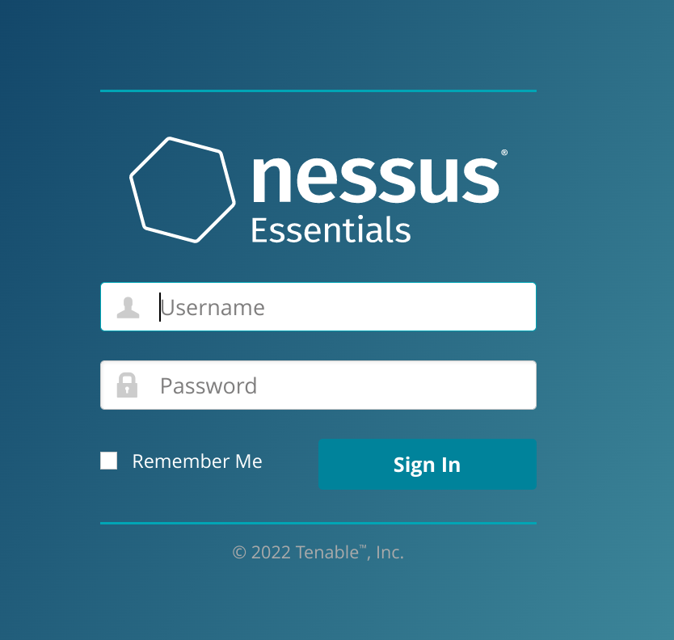
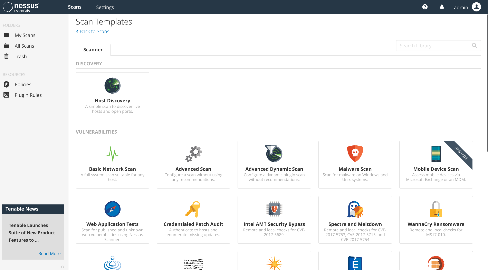
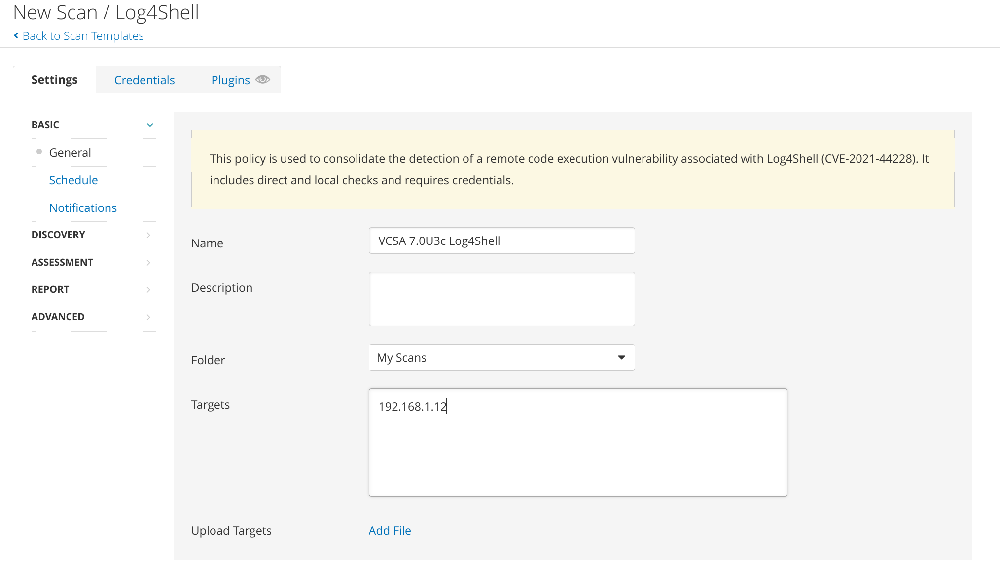
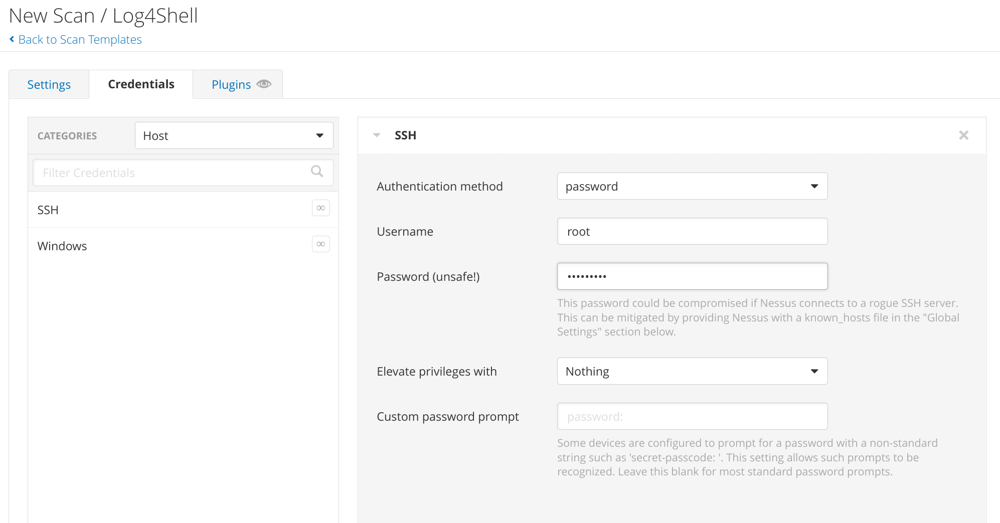
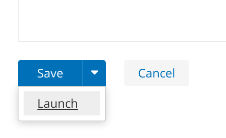
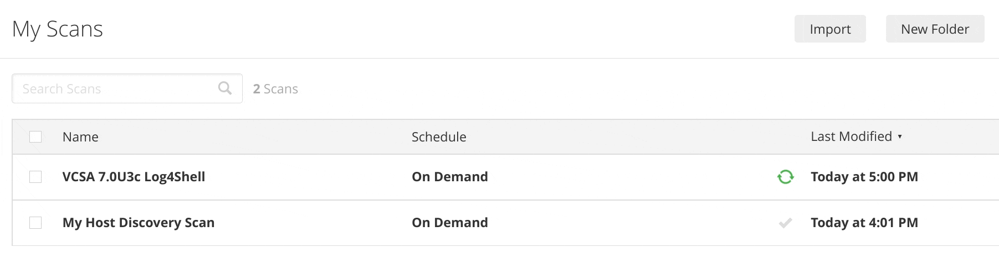

Now that VMware [has released](https://blogs.vmware.com/vsphere/2022/01/announcing-availability-of-vsphere-7-update-3c.html) [vCenter 7.0U3c](https://docs.vmware.com/en/VMware-vSphere/7.0/rn/vsphere-vcenter-server-70u3c-release-notes.html) to resolve the Log4Shell vulnerabilities I thought it might be fun to run a security scan against the upgraded VCSA in my homelab to see how it looks. Of course, I don't actually have a security scanner in that environment so I'll need to deploy one.

I start off by heading to [tenable.com/products/nessus/nessus-essentials](https://www.tenable.com/products/nessus/nessus-essentials) to register for a (free!) license key which will let me scan up to 16 hosts. I'll receive the key and download link in an email, but I'm not actually going to use that link to download the Nessus binary. I've got this shiny-and-new [Tanzu Community Edition Kubernetes cluster](/tanzu-community-edition-k8s-homelab/) that could use some more real workloads so I'll instead opt for the [Docker version](https://hub.docker.com/r/tenableofficial/nessus).

Tenable provides an [example `docker-compose.yml`](https://community.tenable.com/s/article/Deploy-Nessus-docker-image-with-docker-compose) to make it easy to get started:
```yaml
version: '3.1'

services:

  nessus:
    image: tenableofficial/nessus
    restart: always
    container_name: nessus
    environment:
      USERNAME: <user>
      PASSWORD: <password>
      ACTIVATION_CODE: <code>
    ports:
      - 8834:8834
```

I can use that knowledge to craft something I can deploy on Kubernetes:
```yaml
apiVersion: v1
kind: Service
metadata:
  name: nessus
  labels:
    app: nessus
spec:
  type: LoadBalancer
  ports:
  - name: nessus-web
    port: 443
    protocol: TCP
    targetPort: 8834
  selector:
    app: nessus
---
apiVersion: apps/v1
kind: Deployment
metadata:
  name: nessus
spec:
  selector:
    matchLabels:
      app: nessus
  replicas: 1
  template:
    metadata:
      labels:
        app: nessus
    spec:
      containers:
      - name: nessus
        image: tenableofficial/nessus
        env:
        - name: ACTIVATION_CODE
          value: "ABCD-1234-EFGH-5678-IJKL"
        - name: USERNAME
          value: "admin"
        - name: PASSWORD
          value: "VMware1!"
        ports:
        - name: nessus-web
          containerPort: 8834
```

Note that I'm configuring the `LoadBalancer` to listen on port `443` and route traffic to the pod on port `8834` so that I don't have to remember to enter an oddball port number when I want to connect to the web interface. 

And now I can just apply the file:
```bash
❯ kubectl apply -f nessus.yaml
service/nessus created
deployment.apps/nessus created
```

I'll give it a moment or two to deploy and then check on the service to figure out what IP I need to use to connect:
```bash
❯ kubectl get svc/nessus
NAME     TYPE           CLUSTER-IP     EXTERNAL-IP    PORT(S)         AGE
nessus   LoadBalancer   100.67.16.51   192.168.1.79   443:31260/TCP   57s
```

I point my browser to `https://192.168.1.79` and see that it's a great time for a quick coffee break since it will take a few minutes for Nessus to initialize itself:


Eventually that gets replaced with a login screen, where I can authenticate using the username and password specified earlier in the YAML.


After logging in, I get prompted to run a discovery scan to identify hosts on the network. There's a note that hosts revealed by the discovery scan will *not* count against my 16-host limit unless/until I select individual hosts for more detailed scans. That's good to know for future efforts, but for now I'm focused on just scanning my one vCenter server so I dismiss the prompt. 

 What I *am* interested in is scanning my vCenter for the Log4Shell vulnerability so I'll hit the friendly blue **New Scan** button at the top of the *Scans* page to create my scan. That shows me a list of *Scan Templates*:


I'll scroll down a bit and pick the first *Log4Shell* template:


I plug in a name for the scan and enter my vCenter IP (`192.168.1.12`) as the lone scan target:


There's a note there that I'll also need to include credentials so that the Nessus scanner can log in to the target in order to conduct the scan, so I pop over to the aptly-named *Credentials* tab to add some SSH credentials. This is just my lab environment so I'll give it the `root` credentials, but if I were running Nessus in a real environment I'd probably want to use a dedicated user account just for scans.


Now I can scroll to the bottom of the page, click the down-arrow next to the *Save* button and select the **Launch** option to kick off the scan:


That drops me back to the *My Scans* view where I can see the status of my scan. I'll grab another coffee while I stare at the little green spinny thing.


Okay, break's over - and so is the scan! Now I can click on the name of the scan to view the results:


And I can drill down into the vulnerability details:


This reveals a handful of findings related to old 1.x versions of Log4j (which went EOL in 2015 - yikes!) as well as [CVE-2021-44832](https://nvd.nist.gov/vuln/detail/CVE-2021-44832) Remote Code Execution vulnerability (which is resolved in Log4j 2.17.1), but the inclusion of Log4j 2.17.0 in vCenter 7.0U3c *was* sufficient to close the highly-publicized [CVE-2021-44228](https://nvd.nist.gov/vuln/detail/CVE-2021-44228) Log4Shell vulnerability. Hopefully VMware can get these other Log4j vulnerabilities taken care of in another upcoming vCenter release.

So there's that curiosity satisfied, and now I've got a handy new tool to play with in my lab. 