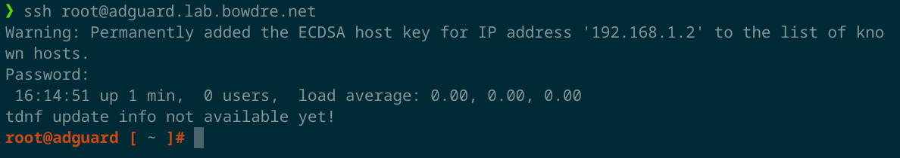
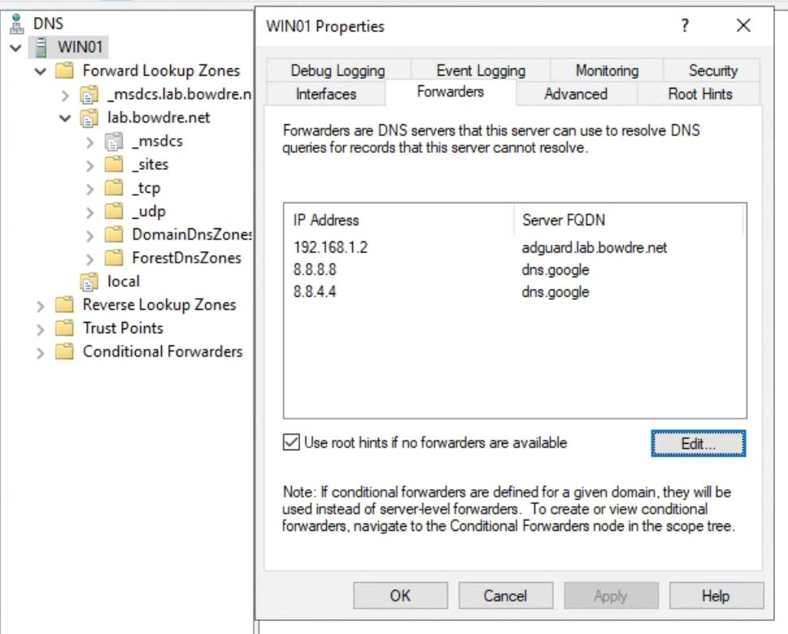

I was recently introduced to [AdGuard Home](https://adguard.com/en/adguard-home/overview.html) by way of its very slick [Home Assistant Add-On](https://github.com/hassio-addons/addon-adguard-home/blob/main/adguard/DOCS.md). Compared to the relatively-complicated [Pi-hole](https://pi-hole.net/) setup that I had implemented several months back, AdGuard Home was *much* simpler to deploy (particularly since I basically just had to click the "Install" button from the Home Assistant add-ons manage). It also has a more modern UI with options arranged more logically (to me, at least), and it just feels easier to use overall. It worked great for a time... until my Home Assistant instance crashed, taking down AdGuard Home (and my internet access) with it. Maybe bundling these services isn't the best move. 

I'd like to use AdGuard Home, but the system it runs on needs to be rock-solid. With that in mind, I thought it might be fun to instead run AdGuard Home in a Docker container on a VM running VMware's container-optimized [Photon OS](https://github.com/vmware/photon), primarily because I want an excuse to play more with Docker and Photon (but also the thing I just mentioned about stability). So here's what it took to get that running.

### Deploy Photon
First, up: getting Photon. There are a variety of delivery formats available [here](https://github.com/vmware/photon/wiki/Downloading-Photon-OS), and I opted for the HW13 OVA version. I copied that download URL:
```
https://packages.vmware.com/photon/4.0/GA/ova/photon-hw13-uefi-4.0-1526e30ba0.ova
```

Then I went into vCenter, hit the **Deploy OVF Template** option, and pasted in the URL:

This lets me skip the kind of tedious "download file from internet and then upload file to vCenter" dance, and I can then proceed to click through the rest of the deployment options.


Once the VM is created, I power it on and hop into the web console. The default root username is `changeme`, and I'll of course be forced to change that the first time I log in.


### Configure Networking
My next step was to configure a static IP address by creating `/etc/systemd/network/10-static-en.network` and entering the following contents:

```conf
[Match]
Name=eth0

[Network]
Address=192.168.1.2/24
Gateway=192.168.1.1
DNS=192.168.1.5
```

By the way, that `192.168.1.5` address is my Windows DC/DNS server that I use for [my homelab environment](/vmware-home-lab-on-intel-nuc-9#basic-infrastructure). That's the DNS server that's configured on my Google Wifi router, and it will continue to handle resolution for local addresses.

I also disabled DHCP by setting `DHCP=no` in `/etc/systemd/network/99-dhcp-en.network`:

```conf
[Match]
Name=e*

[Network]
DHCP=no
IPv6AcceptRA=no
```

I set the required permissions on my new network configuration file with `chmod 644 /etc/systemd/network/10-static-en.network` and then restarted `networkd` with `systemctl restart systemd-networkd`. 

I then ran `networkctl` a couple of times until the `eth0` interface went fully green, and did an `ip a` to confirm that the address had been applied.


One last little bit of housekeeping is to change the hostname with `hostnamectl set-hostname adguard` and then reboot for good measure. I can then log in via SSH to continue the setup.


Now that I'm in, I run `tdnf update` to make sure the VM is fully up to date.

### Install docker-compose
Photon OS ships with Docker preinstalled, but I need to install `docker-compose` on my own to simplify container deployment. Per the [install instructions](https://docs.docker.com/compose/install/#install-compose), I run:

```shell
curl -L "https://github.com/docker/compose/releases/download/1.29.2/docker-compose-$(uname -s)-$(uname -m)" -o /usr/local/bin/docker-compose
chmod +x /usr/local/bin/docker-compose
```

And then verify that it works:
```shell
root@adguard [ ~]# docker-compose --version
docker-compose version 1.29.2, build 5becea4c
```

I'll also want to enable and start Docker:
```shell
systemctl enable docker
systemctl start docker
```

### Disable DNSStubListener
By default, the `resolved` daemon is listening on `127.0.0.53:53` and will prevent docker from binding to that port. Fortunately it's [pretty easy](https://github.com/pi-hole/docker-pi-hole#installing-on-ubuntu) to disable the `DNSStubListener` and free up the port:
```shell
sed -r -i.orig 's/#?DNSStubListener=yes/DNSStubListener=no/g' /etc/systemd/resolved.conf
rm /etc/resolv.conf && ln -s /run/systemd/resolve/resolv.conf /etc/resolv.conf
systemctl restart systemd-resolved
```

### Deploy AdGuard Home container
Okay, now for the fun part. 

I create a directory for AdGuard to live in, and then create a `docker-compose.yaml` therein:
```shell
mkdir ~/adguard
cd ~/adguard
vi docker-compose.yaml
```

And I define the container:
```yaml
version: "3"

services:
  adguard:
    container_name: adguard
    restart: unless-stopped
    image: adguard/adguardhome:latest
    ports:
      - "53:53/tcp"
      - "53:53/udp"
      - "67:67/udp"
      - "68:68/tcp"
      - "68:68/udp"
      - "80:80/tcp"
      - "443:443/tcp"
      - "853:853/tcp"
      - "3000:3000/tcp"
    volumes:
      - './workdir:/opt/adguardhome/work'
      - './confdir:/opt/adguardhome/conf'
    cap_add:
      - NET_ADMIN
```

Then I can fire it up with `docker-compose up --detach`:

```shell
root@adguard [ ~/adguard ]# docker-compose up --detach
Creating network "adguard_default" with the default driver
Pulling adguard (adguard/adguardhome:latest)...
latest: Pulling from adguard/adguardhome
339de151aab4: Pull complete
4db4be09618a: Pull complete
7e918e810e4e: Pull complete
bfad96428d01: Pull complete
Digest: sha256:de7d791b814560663fe95f9812fca2d6dd9d6507e4b1b29926cc7b4a08a676ad
Status: Downloaded newer image for adguard/adguardhome:latest
Creating adguard ... done
```


### Post-deploy configuration
Next, I point a web browser to `http://adguard.lab.bowdre.net:3000` to perform the initial (minimal) setup:


Once that's done, I can log in to the dashboard at `http://adguard.lab.bowdre.net/login.html`:


AdGuard Home ships with pretty sensible defaults so there's not really a huge need to actually do a lot of configuration. Any changes that I *do* do will be saved in `~/adguard/confdir/AdGuardHome.yaml` so they will be preserved across container changes.


### Getting requests to AdGuard Home
Normally, you'd tell your Wifi router what DNS server you want to use, and it would relay that information to the connected DHCP clients. Google Wifi is a bit funny, in that it wants to function as a DNS proxy for the network. When you configure a custom DNS server for Google Wifi, it still tells the DHCP clients to send the requests to the router, and the router then forwards the queries on to the configured DNS server. 

I already have Google Wifi set up to use my Windows DC (at `192.168.1.5`) for DNS. That lets me easily access systems on my internal `lab.bowdre.net` domain without having to manually configure DNS, and the DC forwards resolution requests it can't handle on to the upstream (internet) DNS servers. 

To easily insert my AdGuard Home instance into the flow, I pop in to my Windows DC and configure the AdGuard Home address (`192.168.1.2`) as the primary DNS forwarder. The DC will continue to handle internal resolutions, and anything it can't handle will now get passed up the chain to AdGuard Home. And this also gives me a bit of a failsafe, in that queries will fail back to the previously-configured upstream DNS if AdGuard Home doesn't respond within a few seconds.


It's working!


### Caveat
Chaining my DNS configurations in this way (router -> DC -> AdGuard Home -> internet) does have a bit of a limitation, in that all queries will appear to come from the Windows server:

I won't be able to do any per-client filtering as a result, but honestly I'm okay with that as I already use the "Pause Internet" option in Google Wifi to block outbound traffic from certain devices anyway. And using the Windows DNS as an intermediary makes it significantly quicker and easier to switch things up if I run into problems later; changing the forwarder here takes effect instantly rather than having to manually update all of my clients or wait for DHCP to distribute the change.

I have worked around this in the past by [bypassing Google Wifi's DHCP](https://www.mbreviews.com/pi-hole-google-wifi-raspberry-pi/) but I think it was actually more trouble than it was worth to me.


### One last thing...
I'm putting a lot of responsibility on both of these VMs, my Windows DC and my new AdGuard Home instance. If they aren't up, I won't have internet access, and that would be a shame. I already have my ESXi host configured to automatically start up when power is (re)applied, so I also adjust the VM Startup/Shutdown Configuration so that AdGuard Home will automatically boot after ESXi is loaded, followed closely by the Windows DC (and the rest of my virtualized infrastructure):


So there you have it. Simple DNS-based ad-blocking running on a minimal container-optimized VM that *should* be more stable than the add-on tacked on to my Home Assistant instance. Enjoy!