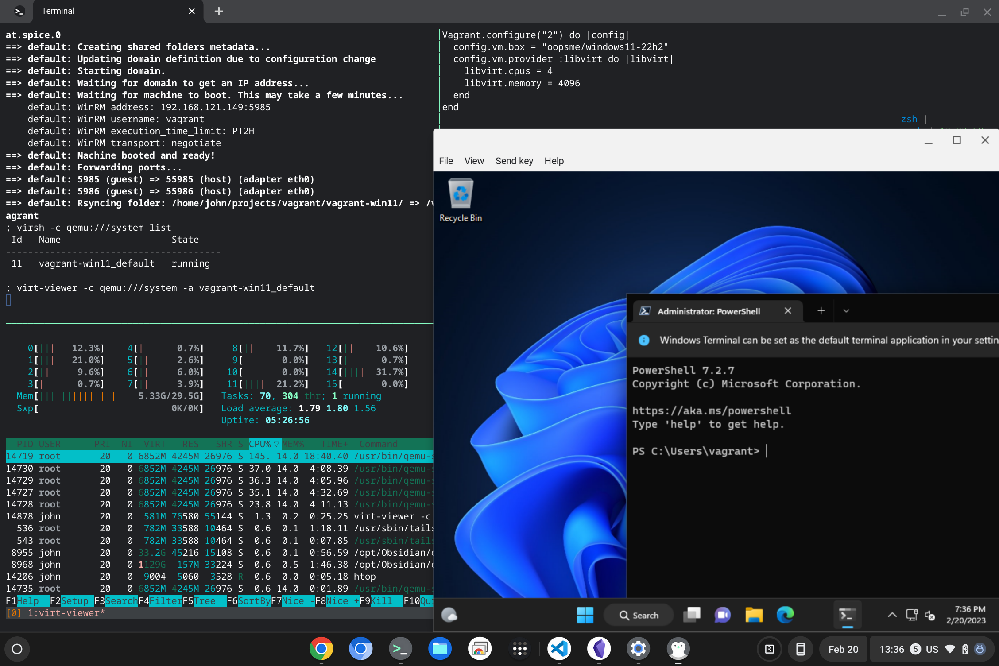

I've lately been trying to do more with [Salt](https://saltproject.io/) at work, but I'm still very much a novice with that tool. I thought it would be great to have a nice little portable lab environment where I could deploy a few lightweight VMs and practice managing them with Salt - without impacting any systems that are actually being used for anything. Along the way, I figured I'd leverage [HashiCorp Vagrant](https://www.vagrantup.com/) to create and manage the VMs, which would provide a declarative way to define what the VMs should look like. The VM (or even groups of VMs) would be specified in a single file, and I'd bypass all the tedious steps of creating the virtual hardware, attaching the installation media, installing the OS, and performing the initial configuration. Vagrant will help me build up, destroy, and redeploy a development environment in a simple and repeatable way.

Also, because I'm a bit of a sadist, I wanted to do this all on my new [Framework Chromebook](https://frame.work/laptop-chromebook-12-gen-intel). I might as well put my 32GB of RAM to good use, right?

It took a bit of fumbling, but this article describes what it took to get a Vagrant-powered VM up and running in the [Linux Development Environment](https://chromeos.dev/en/linux) on my Chromebook (which is currently running ChromeOS v111 beta).

### Install the prerequisites
There are are a few packages which need to be installed before we can move on to the Vagrant-specific stuff. It's quite possible that these are already on your system.... but if they *aren't* already present you'll have a bad problem[^problem].

```shell
sudo apt update
sudo apt install \
  build-essential \
  gpg \
  lsb-release \
  wget
```

[^problem]: and [will not go to space today](https://xkcd.com/1133/).

I'll be configuring Vagrant to use [`libvirt`](https://libvirt.org/) to interface with the [Kernel Virtual Machine (KVM)](https://www.linux-kvm.org/page/Main_Page) virtualization solution (rather than something like VirtualBox that would bring more overhead) so I'll need to install some packages for that as well:
```shell
sudo apt install virt-manager libvirt-dev
```

And to avoid having to `sudo` each time I interact with `libvirt` I'll add myself to that group:
```shell
sudo gpasswd -a $USER libvirt ; newgrp libvirt
```

And to avoid [this issue](https://github.com/virt-manager/virt-manager/issues/333) I'll make a tweak to the `qemu.conf` file:
```shell
echo "remember_owner = 0" | sudo tee -a /etc/libvirt/qemu.conf
sudo systemctl restart libvirtd
```

I'm also going to use `rsync` to share a [synced folder](https://developer.hashicorp.com/vagrant/docs/synced-folders/basic_usage) between the host and the VM guest so I'll need to make sure that's installed too:
```shell
sudo apt install rsync
```

### Install Vagrant
With that out of the way, I'm ready to move on to the business of installing Vagrant. I'll start by adding the HashiCorp repository:
```shell
wget -O- https://apt.releases.hashicorp.com/gpg | gpg --dearmor | sudo tee /usr/share/keyrings/hashicorp-archive-keyring.gpg
echo "deb [signed-by=/usr/share/keyrings/hashicorp-archive-keyring.gpg] https://apt.releases.hashicorp.com $(lsb_release -cs) main" | sudo tee /etc/apt/sources.list.d/hashicorp.list
```

I'll then install the Vagrant package:
```shell
sudo apt update
sudo apt install vagrant
```

I also need to install the [`vagrant-libvirt` plugin](https://github.com/vagrant-libvirt/vagrant-libvirt) so that Vagrant will know how to interact with `libvirt`:
```shell
vagrant plugin install vagrant-libvirt
```

### Create a lightweight VM
Now I can get to the business of creating my first VM with Vagrant!

Vagrant VMs are distributed as Boxes, and I can browse some published Boxes at [app.vagrantup.com/boxes/search?provider=libvirt](https://app.vagrantup.com/boxes/search?provider=libvirt) (applying the `provider=libvirt` filter so that I only see Boxes which will run on my chosen virtualization provider). For my first VM, I'll go with something light and simple: [`generic/alpine38`](https://app.vagrantup.com/generic/boxes/alpine38).

So I'll create a new folder to contain the Vagrant configuration:
```shell
mkdir vagrant-alpine
cd vagrant-alpine
```

And since I'm referencing a Vagrant Box which is published on Vagrant Cloud, downloading the config is as simple as:
```shell
vagrant init generic/alpine38
```

That lets me know that
```text
A `Vagrantfile` has been placed in this directory. You are now
ready to `vagrant up` your first virtual environment! Please read
the comments in the Vagrantfile as well as documentation on
`vagrantup.com` for more information on using Vagrant.
```

Before I `vagrant up` the joint, I do need to make a quick tweak to the default Vagrantfile, which is what tells Vagrant how to configure the VM. By default, Vagrant will try to create a synced folder using NFS and will throw a nasty error when that (inevitably[^inevitable]) fails. So I'll open up the Vagrantfile to review and edit it:
```shell
vim Vagrantfile
```

Most of the default Vagrantfile is commented out. Here's the entirey of the configuration *without* the comments:
```ruby
Vagrant.configure("2") do |config|
  config.vm.box = "generic/alpine38"
end
```

There's not a lot there, is there? Well I'm just going to add these two lines somewhere between the `Vagrant.configure()` and `end` lines:
```ruby
  config.nfs.verify_installed = false
  config.vm.synced_folder '.', '/vagrant', type: 'rsync'
```

The first line tells Vagrant not to bother checking to see if NFS is installed, and will use `rsync` to share the local directory with the VM guest, where it will be mounted at `/vagrant`.

So here's the full Vagrantfile (sans-comments[^magic], again):
```ruby
Vagrant.configure("2") do |config|
  config.vm.box = "generic/alpine38"
  config.nfs.verify_installed = false
  config.vm.synced_folder '.', '/vagrant', type: 'rsync'
end
```

With that, I'm ready to fire up this VM with `vagrant up`! Vagrant will look inside `Vagrantfile` to see the config, pull down the `generic/alpine38` Box from Vagrant Cloud, boot the VM, configure it so I can SSH in to it, and mount the synced folder:
```shell
; vagrant up
Bringing machine 'default' up with 'libvirt' provider...
==> default: Box 'generic/alpine38' could not be found. Attempting to find and install...
    default: Box Provider: libvirt
    default: Box Version: >= 0
==> default: Loading metadata for box 'generic/alpine38'
    default: URL: https://vagrantcloud.com/generic/alpine38
==> default: Adding box 'generic/alpine38' (v4.2.12) for provider: libvirt
    default: Downloading: https://vagrantcloud.com/generic/boxes/alpine38/versions/4.2.12/providers/libvirt.box
    default: Calculating and comparing box checksum...
==> default: Successfully added box 'generic/alpine38' (v4.2.12) for 'libvirt'!
==> default: Uploading base box image as volume into Libvirt storage...
[...]
==> default: Waiting for domain to get an IP address...
==> default: Waiting for machine to boot. This may take a few minutes...
    default: SSH address: 192.168.121.41:22
    default: SSH username: vagrant
    default: SSH auth method: private key
[...]
    default: Key inserted! Disconnecting and reconnecting using new SSH key...
==> default: Machine booted and ready!
==> default: Rsyncing folder: /home/john/projects/vagrant-alpine/ => /vagrant
```

And then I can use `vagrant ssh` to log in to the new VM:
```shell
; vagrant ssh
alpine38:~$ cat /etc/os-release
NAME="Alpine Linux"
ID=alpine
VERSION_ID=3.8.5
PRETTY_NAME="Alpine Linux v3.8"
HOME_URL="http://alpinelinux.org"
BUG_REPORT_URL="http://bugs.alpinelinux.org"
```

I can also verify that the synced folder came through as expected:
```shell
alpine38:~$ ls -l /vagrant
total 4
-rw-r--r--    1 vagrant  vagrant       3117 Feb 20 15:51 Vagrantfile
```

Once I'm finished poking at this VM, shutting it down is as easy as:
```shell
vagrant halt
```

And if I want to clean up and remove all traces of the VM, that's just:
```shell
vagrant destroy
```

[^inevitable]: NFS doesn't work properly from within an LXD container, like the ChromeOS Linux development environment.
[^magic]: Through the magic of `egrep -v "^\s*(#|$)" $file`.


### Create a heavy VM, as a treat
Having proven to myself that Vagrant does work on a Chromebook, let's see how it does with a slightly-heavier VM.... like [Windows 11](https://app.vagrantup.com/oopsme/boxes/windows11-22h2).

{}
Windows 11 makes for a pretty hefty VM which will require significant storage space. My Chromebook's Linux environment ran out of storage space the first time I attempted to deploy this guy. Fortunately ChromeOS makes it easy to allocate more space to Linux (**Settings > Advanced > Developers > Linux development environment > Disk size**). You'll probably need at least 30GB free to provision this VM.
{}

Again, I'll create a new folder to hold the Vagrant configuration and do a `vagrant init`:
```shell
mkdir vagrant-win11
cd vagrant-win11
vagrant init oopsme/windows11-22h2
```

And, again, I'll edit the Vagrantfile before starting the VM. This time, though, I'm adding a few configuration options to tell `libvirt` that I'd like more compute resources than the default 1 CPU and 512MB RAM[^ram]:
```ruby
Vagrant.configure("2") do |config|
  config.vm.box = "oopsme/windows11-22h2"
  config.vm.provider :libvirt do |libvirt|
    libvirt.cpus = 4
    libvirt.memory = 4096
  end
end
```

[^ram]: Note here that `libvirt.memory` is specified in MB. Windows 11 boots happily with 4096 MB of RAM.... and somewhat less so with just 4 MB. *Ask me how I know...*

Now it's time to bring it up. This one's going to take A While as it syncs the ~12GB Box first.
```shell
vagrant up
```

Eventually it should spit out that lovely **Machine booted and ready!** message and I can log in! I *can* do a `vagrant ssh` again to gain a shell in the Windows environment, but I'll probably want to interact with those sweet sweet graphics. That takes a little bit more effort.

First, I'll use `virsh -c qemu:///system list` to see the running VM(s):
```shell
; virsh -c qemu:///system list
 Id   Name                    State
---------------------------------------
 10   vagrant-win11_default   running
```

Then I can tell `virt-viewer` that I'd like to attach a session there:
```shell
virt-viewer -c qemu:///system -a vagrant-win11_default
```

I log in with the default password `vagrant`, and I'm in Windows 11 land!


### Next steps
Well that about does it for a proof-of-concept. My next steps will be exploring [multi-machine Vagrant environments](https://developer.hashicorp.com/vagrant/docs/multi-machine) to create a portable lab environment including machines running several different operating systems so that I can learn how to manage them effectively with Salt. It should be fun!

