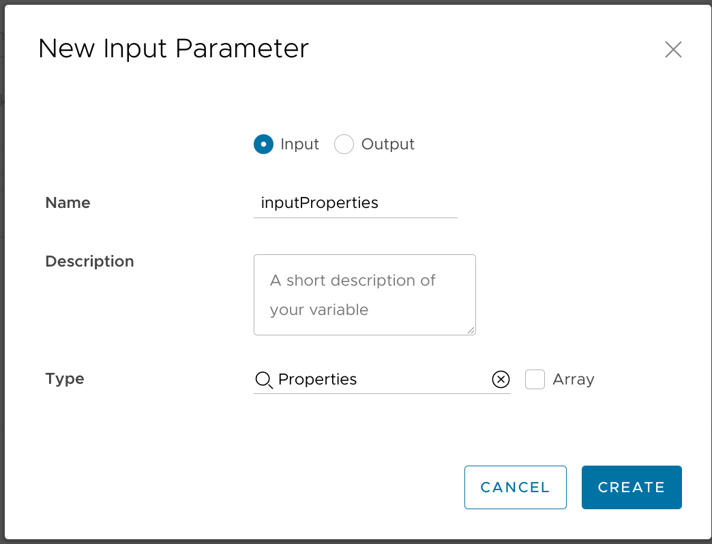

One of the requirements for my vRA deployments is the ability to automatically create a static `A` records for non-domain-joined systems so that users can connect without needing to know the IP address. The organization uses Microsoft DNS servers to provide resolution on the internal domain. At first glance, this shouldn't be too much of a problem: vRealize Orchestrator 8.x can run PowerShell scripts, and PowerShell can use the [`Add-DnsServerResourceRecord` cmdlet](https://docs.microsoft.com/en-us/powershell/module/dnsserver/add-dnsserverresourcerecord?view=windowsserver2019-ps) to create the needed records.

Not so fast, though. That cmdlet is provided through the [Remote Server Administration Tools](https://docs.microsoft.com/en-us/troubleshoot/windows-server/system-management-components/remote-server-administration-tools) package so it won't be available within the limited PowerShell environment inside of vRO. A workaround might be to add a Windows machine to vRO as a remote PowerShell host, but then you run into [issues of credential hopping](https://communities.vmware.com/t5/vRealize-Orchestrator/unable-to-run-get-DnsServerResourceRecord-via-vRO-Powershell-wf/m-p/2286685).

I eventually came across [this blog post](https://www.virtualnebula.com/blog/2017/7/14/microsoft-ad-dns-integration-over-ssh) which described adding a Windows machine as a remote *SSH* host instead. I'll deviate a bit from the described configuration, but that post did at least get me pointed in the right direction. This approach would get around the complicated authentication-tunneling business while still being pretty easy to set up. So let's go!

### Preparing the SSH host
I deployed a Windows Server 2019 Core VM to use as my SSH host, and I joined it to my AD domain as `win02.lab.bowdre.net`. Once that's taken care of, I need to install the RSAT DNS tools so that I can use the `Add-DnsServerResourceRecord` and associated cmdlets. I can do that through PowerShell like so:
```powershell
# Install RSAT DNS tools
Add-WindowsCapability -online -name Rsat.Dns.Tools~~~~0.0.1.0
```

Instead of using a third-party SSH server, I'll use the OpenSSH Server that's already available in Windows 10 (1809+) and Server 2019:
```powershell 
# Install OpenSSH Server
Add-WindowsCapability -Online -Name OpenSSH.Server~~~~0.0.1.0
```

I'll also want to set it so that the default shell upon SSH login is PowerShell (rather than the standard Command Prompt) so that I can have easy access to those DNS cmdlets:
```powershell 
# Set PowerShell as the default Shell (for access to DNS cmdlets)
New-ItemProperty -Path "HKLM:\SOFTWARE\OpenSSH" -Name DefaultShell -Value "C:\Windows\System32\WindowsPowerShell\v1.0\powershell.exe" -PropertyType String -Force
```

I'll be using my `lab\vra` service account for managing DNS. I've already given it the appropriate rights on the DNS server, but I'll also add it to the Administrators group on my SSH host:
```powershell
# Add the service account as a local administrator
Add-LocalGroupMember -Group Administrators -Member "lab\vra"
```

And I'll modify the OpenSSH configuration so that only members of that Administrators group are permitted to log into the server via SSH:
```powershell 
# Restrict SSH access to members in the local Administrators group
(Get-Content "C:\ProgramData\ssh\sshd_config") -Replace "# Authentication:", "$&`nAllowGroups Administrators" | Set-Content "C:\ProgramData\ssh\sshd_config"
```

Finally, I'll start the `sshd` service and set it to start up automatically:
```powershell 
# Start service and set it to automatic
Set-Service -Name sshd -StartupType Automatic -Status Running
```

#### A quick test
At this point, I can log in to the server via SSH and confirm that I can create and delete records in my DNS zone:
```powershell
$ ssh vra@win02.lab.bowdre.net
vra@win02.lab.bowdre.net's password: 

Windows PowerShell
Copyright (C) Microsoft Corporation. All rights reserved.

PS C:\Users\vra> Add-DnsServerResourceRecordA -ComputerName win01.lab.bowdre.net -Name testy -ZoneName lab.bowdre.net -AllowUpdateAny -IPv4Address 172.16.99.99       

PS C:\Users\vra> nslookup testy
Server:  win01.lab.bowdre.net
Address:  192.168.1.5

Name:    testy.lab.bowdre.net
Address:  172.16.99.99

PS C:\Users\vra> Remove-DnsServerResourceRecord -ComputerName win01.lab.bowdre.net -Name testy -ZoneName lab.bowdre.net -RRType A -Force

PS C:\Users\vra> nslookup testy
Server:  win01.lab.bowdre.net
Address:  192.168.1.5

*** win01.lab.bowdre.net can't find testy: Non-existent domain
```

Cool! Now I just need to do that same thing, but from vRealize Orchestrator. First, though, I'll update the template so the requester can choose whether or not a static record will get created.

### Template changes
#### Cloud Template
Similar to the template changes I made for [optionally joining deployed servers to the Active Directory domain](/joining-vms-to-active-directory-in-site-specific-ous-with-vra8#cloud-template), I'll just be adding a simple boolean checkbox to the `inputs` section of the template in Cloud Assembly:
```yaml
formatVersion: 1
inputs:
  [...]
  staticDns:
    title: Create static DNS record
    type: boolean
    default: false
  [...]
```

*Unlike* the AD piece, in the `resources` section I'll just bind a custom property called `staticDns` to the input with the same name:
```yaml
resources:
  Cloud_vSphere_Machine_1:
    type: Cloud.vSphere.Machine
    properties:
      [...]
      staticDns: '${input.staticDns}'
      [...]
```

So here's the complete cloud template that I've been working on:
```yaml
formatVersion: 1
inputs:
  site:
    type: string
    title: Site
    enum:
      - BOW
      - DRE
  image:
    type: string
    title: Operating System
    oneOf:
      - title: Windows Server 2019
        const: ws2019
    default: ws2019
  size:
    title: Resource Size
    type: string
    oneOf:
      - title: 'Micro [1vCPU|1GB]'
        const: micro
      - title: 'Tiny [1vCPU|2GB]'
        const: tiny
      - title: 'Small [2vCPU|2GB]'
        const: small
    default: small
  network:
    title: Network
    type: string
  adJoin:
    title: Join to AD domain
    type: boolean
    default: true
  staticDns:
    title: Create static DNS record
    type: boolean
    default: false
  environment:
    type: string
    title: Environment
    oneOf:
      - title: Development
        const: D
      - title: Testing
        const: T
      - title: Production
        const: P
    default: D
  function:
    type: string
    title: Function Code
    oneOf:
      - title: Application (APP)
        const: APP
      - title: Desktop (DSK)
        const: DSK
      - title: Network (NET)
        const: NET
      - title: Service (SVS)
        const: SVS
      - title: Testing (TST)
        const: TST
    default: TST
  app:
    type: string
    title: Application Code
    minLength: 3
    maxLength: 3
    default: xxx
  description:
    type: string
    title: Description
    description: Server function/purpose
    default: Testing and evaluation
  poc_name:
    type: string
    title: Point of Contact Name
    default: Jack Shephard
  poc_email:
    type: string
    title: Point of Contact Email
    default: jack.shephard@virtuallypotato.com
    pattern: '^[^\s@]+@[^\s@]+\.[^\s@]+$'
  ticket:
    type: string
    title: Ticket/Request Number
    default: 4815162342
resources:
  Cloud_vSphere_Machine_1:
    type: Cloud.vSphere.Machine
    properties:
      image: '${input.image}'
      flavor: '${input.size}'
      site: '${input.site}'
      environment: '${input.environment}'
      function: '${input.function}'
      app: '${input.app}'
      ignoreActiveDirectory: '${!input.adJoin}'
      activeDirectory:
        relativeDN: '${"OU=Servers,OU=Computers,OU=" + input.site + ",OU=LAB"}'
      customizationSpec: '${input.adJoin ? "vra-win-domain" : "vra-win-workgroup"}'
      staticDns: '${input.staticDns}'
      dnsDomain: lab.bowdre.net
      poc: '${input.poc_name + " (" + input.poc_email + ")"}'
      ticket: '${input.ticket}'
      description: '${input.description}'
      networks:
        - network: '${resource.Cloud_vSphere_Network_1.id}'
          assignment: static
      constraints:
        - tag: 'comp:${to_lower(input.site)}'
  Cloud_vSphere_Network_1:
    type: Cloud.vSphere.Network
    properties:
      networkType: existing
      constraints:
        - tag: 'net:${input.network}'
```
I save the template, and then also hit the "Version" button to publish a new version to the catalog:


#### Service Broker Custom Form
I switch over to the Service Broker UI to update the custom form - but first I stop off at **Content & Policies > Content Sources**, select my Content Source, and hit the **Save & Import** button to force a sync of the cloud templates. I can then move on to the **Content & Policies > Content** section, click the 3-dot menu next to my template name, and select the option to **Customize Form**.

I'll just drag the new Schema Element called `Create static DNS record` from the Request Inputs panel and on to the form canvas. I'll drop it right below the `Join to AD domain` field:


And then I'll hit the **Save** button so that my efforts are preserved.

That should take care of the front-end changes. Now for the back-end stuff: I need to teach vRO how to connect to my SSH host and run the PowerShell commands, [just like I tested earlier](#a-quick-test).


### The vRO solution
I will be adding the DNS action on to my existing "VM Post-Provisioning" workflow (described [here](/adding-vm-notes-and-custom-attributes-with-vra8), which gets triggered after the VM has been successfully deployed. 

#### Configuration Element
But first, I'm going to go to the **Assets > Configurations** section of the Orchestrator UI and create a new Configuration Element to store variables related to the SSH host and DNS configuration.


I'll call it `dnsConfig` and put it in my `CustomProvisioning` folder.


And then I create the following variables:

| Variable | Value | Type |
| --- | --- | --- |
| `sshHost` | `win02.lab.bowdre.net` | string | 
| `sshUser` | `vra` | string |
| `sshPass` | `*****` | secureString |
| `dnsServer` | `[win01.lab.bowdre.net]` | Array/string |
| `supportedDomains` | `[lab.bowdre.net]` | Array/string |

`sshHost` is my new `win02` server that I'm going to connect to via SSH, and `sshUser` and `sshPass` should explain themselves. The `dnsServer` array will tell the script which DNS servers to try to create the record on; this will just be a single server in my lab, but I'm going to construct the script to support multiple servers in case one isn't reachable. And `supported domains` will be used to restrict where I'll be creating records; again, that's just a single domain in my lab, but I'm building this solution to account for the possibility where a VM might need to be deployed on a domain where I can't create a static record in this way so I want it to fail elegantly.

Here's what the new configuration element looks like:


#### Workflow to create records
I'll need to tell my workflow about the variables held in the `dnsConfig` Configuration Element I just created. I do that by opening the "VM Post-Provisioning" workflow in the vRO UI, clicking the **Edit** button, and then switching to the **Variables** tab. I create a variable for each member of `dnsConfig`, and enable the toggle to *Bind to configuration* so that I can select the corresponding item. It's important to make sure that the variable type exactly matches what's in the configuration element so that you'll be able to pick it!


I repeat that for each of the remaining variables until all the members of `dnsConfig` are represented in the workflow:


Now we're ready for the good part: inserting a new scriptable task into the workflow schema. I'll called it `Create DNS Record` and place it directly after the `Set Notes` task. For inputs, the task will take in `inputProperties (Properties)` as well as everything from that `dnsConfig` configuration element:


And here's the JavaScript for the task:
```js
// JavaScript: Create DNS Record task
//    Inputs: inputProperties (Properties), dnsServers (Array/string), sshHost (string), sshUser (string), sshPass (secureString), supportedDomains (Array/string)
//    Outputs: None

var staticDns = inputProperties.customProperties.staticDns;
var hostname = inputProperties.resourceNames[0];
var dnsDomain = inputProperties.customProperties.dnsDomain;
var ipAddress = inputProperties.addresses[0];
var created = false;

// check if user requested a record to be created and if the VM's dnsDomain is in the supportedDomains array
if (staticDns == "true" && supportedDomains.indexOf(dnsDomain) >= 0) {
    System.log("Attempting to create DNS record for "+hostname+"."+dnsDomain+" at "+ipAddress+"...")
    // create the ssh session to the intermediary host
    var sshSession = new SSHSession(sshHost, sshUser);
    System.debug("Connecting to "+sshHost+"...")
    sshSession.connectWithPassword(sshPass)
    // loop through DNS servers in case the first one doesn't respond
    for each (var dnsServer in dnsServers) {
        if (created == false) {
            System.debug("Using DNS Server "+dnsServer+"...")
            // insert the PowerShell command to create A record
            var sshCommand = 'Add-DnsServerResourceRecordA -ComputerName '+dnsServer+' -ZoneName '+dnsDomain+' -Name '+hostname+' -AllowUpdateAny -IPv4Address '+ipAddress;
            System.debug("sshCommand: "+sshCommand)
            // run the command and check the result
            sshSession.executeCommand(sshCommand, true)
            var result = sshSession.exitCode;
            if (result == 0) {
                System.log("Successfully created DNS record!")
                // make a note that it was successful so we don't repeat this unnecessarily
                created = true;
            } 
        }
    }
    sshSession.disconnect()
    if (created == false) {
        System.warn("Error! Unable to create DNS record.")
    }
} else {
    System.log("Not trying to do DNS")
}
```

Now I can just save the workflow, and I'm done! - with this part. Of course, being able to *create* a static record is just one half of the fight; I also need to make sure that vRA will be able to clean up these static records when a deployment gets deleted.

#### Workflow to delete records
I haven't previously created any workflows that fire on deployment removal, so I'll create a new one and call  it `VM Deprovisioning`:


This workflow only needs a single input (`inputProperties (Properties)`) so it can receive information about the deployment from vRA:


I'll also need to bind in the variables from the `dnsConfig` element as before:


The schema will include a single scriptable task:


And it's going to be *pretty damn similar* to the other one:

```js
// JavaScript: Delete DNS Record task
//    Inputs: inputProperties (Properties), dnsServers (Array/string), sshHost (string), sshUser (string), sshPass (secureString), supportedDomains (Array/string)
//    Outputs: None

var staticDns = inputProperties.customProperties.staticDns;
var hostname = inputProperties.resourceNames[0];
var dnsDomain = inputProperties.customProperties.dnsDomain;
var ipAddress = inputProperties.addresses[0];
var deleted = false;

// check if user requested a record to be created and if the VM's dnsDomain is in the supportedDomains array
if (staticDns == "true" && supportedDomains.indexOf(dnsDomain) >= 0) {
    System.log("Attempting to remove DNS record for "+hostname+"."+dnsDomain+" at "+ipAddress+"...")
    // create the ssh session to the intermediary host
    var sshSession = new SSHSession(sshHost, sshUser);
    System.debug("Connecting to "+sshHost+"...")
    sshSession.connectWithPassword(sshPass)
    // loop through DNS servers in case the first one doesn't respond
    for each (var dnsServer in dnsServers) {
        if (deleted == false) {
            System.debug("Using DNS Server "+dnsServer+"...")
            // insert the PowerShell command to delete A record
            var sshCommand = 'Remove-DnsServerResourceRecord -ComputerName '+dnsServer+' -ZoneName '+dnsDomain+' -RRType A -Name '+hostname+' -Force';
            System.debug("sshCommand: "+sshCommand)
            // run the command and check the result
            sshSession.executeCommand(sshCommand, true)
            var result = sshSession.exitCode;
            if (result == 0) {
                System.log("Successfully deleted DNS record!")
                // make a note that it was successful so we don't repeat this unnecessarily
                deleted = true;
            } 
        }
    }
    sshSession.disconnect()
    if (deleted == false) {
        System.warn("Error! Unable to delete DNS record.")
    }
} else {
    System.log("No need to clean up DNS.")
}
```

Since this is a new workflow, I'll also need to head back to **Cloud Assembly > Extensibility > Subscriptions** and add a new subscription to call it when a deployment gets deleted. I'll call it "VM Deprovisioning", assign it to the "Compute Post Removal" Event Topic, and link it to my new "VM Deprovisioning" workflow. I *could* use the Condition option to filter this only for deployments which had a static DNS record created, but I'll later want to use this same workflow for other cleanup tasks so I'll just save it as is for now.


### Testing
Now I can (finally) fire off a quick deployment to see if all this mess actually works:


Once the deployment completes, I go back into vRO, find the most recent item in the **Workflow Runs** view, and click over to the **Logs** tab to see how I did:


And I can run a quick query to make sure that name actually resolves:
```shell
❯ dig +short bow-ttst-xxx023.lab.bowdre.net A
172.16.30.10   
```

It works!

Now to test the cleanup. For that, I'll head back to Service Broker, navigate to the **Deployments** tab, find my deployment, click the little three-dot menu button, and select the **Delete** option:


Again, I'll check the **Workflow Runs** in vRO to see that the deprovisioning task completed successfully:


And I can `dig` a little more to make sure the name doesn't resolve anymore:
```shell
❯ dig +short bow-ttst-xxx023.lab.bowdre.net A
      
```

It *really* works!

### Conclusion
So there you have it - how I've got vRA/vRO able to create and delete static DNS records as needed, using a Windows SSH host as an intermediary. Cool, right?