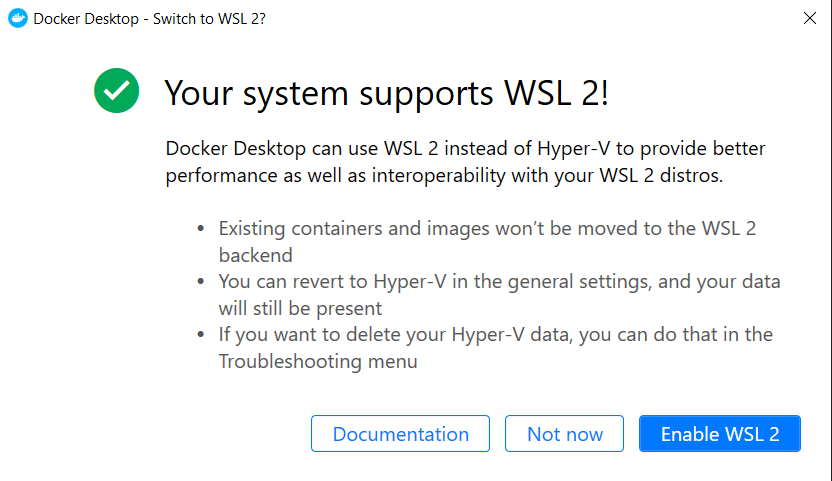

Microsoft's Windows Subsystem for Linux (WSL) 2 [was recently updated](https://devblogs.microsoft.com/commandline/wsl-2-support-is-coming-to-windows-10-versions-1903-and-1909/) to bring support for less-bleeding-edge Windows 10 versions (like 1903 and 1909). WSL2 is a big improvement over the first iteration (particularly with [better Docker support](https://www.docker.com/blog/docker-desktop-wsl-2-backport-update/)) so I was really looking forward to getting WSL2 loaded up on my work laptop.

Here's how.

### WSL2

#### Step Zero: Prereqs
You'll need Windows 10 1903 build 18362 or newer (on x64). You can check by running `ver` from a Command Prompt:
```powershell
C:\> ver
Microsoft Windows [Version 10.0.18363.1082]
```
We're interested in that third set of numbers. 18363 is bigger than 18362 so we're good to go!

#### Step One: Enable the WSL feature
*(Not needed if you've already been using WSL1.)*
You can do this by dropping the following into an elevated Powershell prompt:
```powershell
dism.exe /online /enable-feature /featurename:Microsoft-Windows-Subsystem-Linux /all /norestart
```

#### Step Two: Enable the Virtual Machine Platform feature
Drop this in an elevated Powershell:
```powershell
dism.exe /online /enable-feature /featurename:VirtualMachinePlatform /all /norestart
```
And then reboot (this is still Windows, after all).

#### Step Three: Install the WSL2 kernel update package
Download it from [here](https://wslstorestorage.blob.core.windows.net/wslblob/wsl_update_x64.msi), and double-click the downloaded file to install it.

#### Step Four: Set WSL2 as your default
Open a Powershell window and run:
```powershell
wsl --set-default-version 2
```

#### Step Five: Install a Linux distro, or upgrade an existing one
If you're brand new to this WSL thing, head over to the [Microsoft Store](https://aka.ms/wslstore) and download your favorite Linux distribution. Once it's installed, launch it and you'll be prompted to set up a Linux username and password. 

If you've already got a WSL1 distro installed, first run `wsl -l -v` in Powershell to make sure you know the distro name:
```powershell
PS C:\Users\jbowdre> wsl -l -v
  NAME      STATE           VERSION
* Debian    Running         2
```
And then upgrade the distro to WSL2 with `wsl --set-version <distro_name> 2`:
```powershell
PS C:\Users\jbowdre> wsl --set-version Debian 2
Conversion in progress, this may take a few minutes...
```
Cool!

### Docker
#### Step One: Download
Download Docker Desktop for Windows from [here](https://hub.docker.com/editions/community/docker-ce-desktop-windows/), making sure to grab the "Edge" version since it includes support for the backported WSL2 bits.

#### Step Two: Install
Run the installer, and make sure to tick the box for installing the WSL2 engine.

#### Step Three: Configure Docker Desktop
Launch Docker Desktop from the Start menu, and you should be presented with this friendly prompt:


Hit that big friendly "gimme WSL2" button. Then open the Docker Settings from the system tray, and make sure that **General > Use the WSL 2 based engine** is enabled. Now navigate to **Resources > WSL Integration**, confirm that **Enable integration with my default WSL distro** is enabled as well. Smash the "Apply & Restart" button if you've made any changes.

### Test it!
Fire up a WSL session and confirm that everything is working with `docker run hello-world`:


It's beautiful!