{}
On July 20, 2022, VMware released a [major update](https://blogs.vmware.com/arm/2022/07/20/1-10/) for the ESXi-ARM Fling. Among [other fixes and improvements](https://flings.vmware.com/esxi-arm-edition#changelog), this version enables **in-place ESXi upgrades** and [adds support for the Quartz64's **on-board NIC**](https://twitter.com/jmcwhatever/status/1549935971822706688). To update, I:
1. Wrote the new ISO installer to another USB drive.
2. Attached the installer drive to the USB hub, next to the existing ESXi drive.
3. Booted the installer and selected to upgrade ESXi on the existing device.
4. Powered-off post-install, unplugged the hub, and attached the ESXi drive directly to the USB2 port on the Quart64.
5. Connected the ethernet cable to the onboard NIC.
6. Booted to ESXi.
7. Once booted, I used the DCUI to (re)configure the management network and activate the onboard network adapter.

Now I've got directly-attached USB storage, and the onboard NIC provides gigabit connectivity. I've made a few tweaks to the rest of the article to reflect the lifting of those previous limitations.
{}

Up until this point, [my homelab](/vmware-home-lab-on-intel-nuc-9/) has consisted of just a single Intel NUC9 ESXi host running a bunch of VMs. It's served me well but lately I've been thinking that it would be good to have an additional host for some of my workloads. In particular, I'd like to have a [Tailscale node](/secure-networking-made-simple-with-tailscale/) on my home network which _isn't_ hosted on the NUC so that I can patch ESXi remotely without cutting off my access. I appreciate the small footprint of the NUC so I'm not really interested in a large "grown-up" server at this time. So for now I thought it might be fun to experiment with [VMware's ESXi on ARM fling](https://flings.vmware.com/esxi-arm-edition) which makes it possible to run a full-fledged VMWare hypervisor on a Raspbery Pi.

Of course, I decided to embark upon this project at a time when Raspberry Pis are basically impossible to get. So instead I picked up a [PINE64 Quartz64](https://wiki.pine64.org/wiki/Quartz64) single-board computer (SBC) which seems like a potentially very-capable piece of hardware.... but there is a prominent warning at the bottom of the [store page](https://pine64.com/product/quartz64-model-a-8gb-single-board-computer/):

{}
"The Quartz64 SBC still in early development stage, only suitable for developers and advanced users wishing to contribute to early software development. Both mainline and Rockchip’s BSP fork of Linux have already been booted on the platform and development is proceeding quickly, but it will be months before end-users and industry partners can reliably deploy it. If you need a single board computer for a private or industrial application today, we encourage you to choose a different board from our existing lineup or wait a few months until Quartz64 software reaches a sufficient degree of maturity."
{}

More specifically, for my use case there will be a number of limitations (at least for now - this SBC is still pretty new to the market so hopefully support will be improving further over time):
- ~~The onboard NIC is not supported by ESXi.~~[^v1.10]
- Onboard storage (via eMMC, eSATA, or PCIe) is not supported.
- The onboard microSD slot is only used for loading firmware on boot, not for any other storage.
- Only two (of the four) USB ports are documented to work reliably.
- Of the remaining two ports, the lower USB3 port [shouldn't be depended upon either](https://wiki.pine64.org/wiki/Quartz64_Development#Confirmed_Broken) so I'm really just stuck with a single USB2 interface ~~which will need to handle both networking and storage~~[^v1.10].[^usb3]

All that is to say that (as usual) I'll be embarking upon this project in Hard Mode - and I'll make it extra challenging (as usual) by doing all of the work from a Chromebook. In any case, here's how I managed to get ESXi running on the the Quartz64 SBC and then deploy a small workload.

[^usb3]: Jared McNeill, the maintainer of the firmware image I'm using *just* [pushed a commit](https://github.com/jaredmcneill/quartz64_uefi/commit/4bda76e9fce5ed153ac49fa9d51ff34e5dd56d52) which sounds like it may address this flaky USB3 issue but that was after I had gotten everything else working as described below. I'll check that out once a new release gets published.

[^v1.10]: Fixed in the v1.10 release.
### Bill of Materials
Let's start with the gear (hardware and software) I needed to make this work:

| Hardware | Purpose |
| --- | --- |
| [PINE64 Quartz64 Model-A 8GB Single Board Computer](https://pine64.com/product/quartz64-model-a-8gb-single-board-computer/) | kind of the whole point |
| [ROCKPro64 12V 5A US Power Supply](https://pine64.com/product/rockpro64-12v-5a-us-power-supply/) | provies power for the the SBC |
| [Serial Console “Woodpecker” Edition](https://pine64.com/product/serial-console-woodpecker-edition/) | allows for serial console access |
| [Google USB-C Adapter](https://www.amazon.com/dp/B071G6NLHJ/) | connects the console adapter to my Chromebook |
| [Sandisk 64GB Micro SD Memory Card](https://www.amazon.com/dp/B00M55C1I2) | only holds the firmware; a much smaller size would be fine |
| [Monoprice USB-C MicroSD Reader](https://www.amazon.com/dp/B00YQM8352/) | to write firmware to the SD card from my Chromebook |
| [Samsung MUF-256AB/AM FIT Plus 256GB USB 3.1 Drive](https://www.amazon.com/dp/B07D7Q41PM) | ESXi boot device and local VMFS datastore |
| ~~[Cable Matters 3 Port USB 3.0 Hub with Ethernet](https://www.amazon.com/gp/product/B01J6583NK)~~ | ~~for network connectivity and to host the above USB drive~~[^v1.10] |
| [3D-printed open enclosure for QUARTZ64](https://www.thingiverse.com/thing:5308499) | protect the board a little bit while allowing for plenty of passive airflow |

| Downloads | Purpose |
| --- | --- |
| [ESXi ARM Edition](https://customerconnect.vmware.com/downloads/get-download?downloadGroup=ESXI-ARM) (v1.10) | hypervisor |
| [Tianocore EDK II firmware for Quartz64](https://github.com/jaredmcneill/quartz64_uefi/releases) (2022-07-20) | firmare image |
| [Chromebook Recovery Utility](https://chrome.google.com/webstore/detail/chromebook-recovery-utili/pocpnlppkickgojjlmhdmidojbmbodfm) | easy way to write filesystem images to external media |
| [Beagle Term](https://chrome.google.com/webstore/detail/beagle-term/gkdofhllgfohlddimiiildbgoggdpoea) | for accessing the Quartz64 serial console |

### Preparation
#### Firmware media
The very first task is to write the required firmware image (download [here](https://github.com/jaredmcneill/quartz64_uefi/releases)) to a micro SD card. I used a 64GB card that I had lying around but you could easily get by with a *much* smaller one; the firmware image is tiny, and the card can't be used for storing anything else. Since I'm doing this on a Chromebook, I'll be using the [Chromebook Recovery Utility (CRU)](https://chrome.google.com/webstore/detail/chromebook-recovery-utili/pocpnlppkickgojjlmhdmidojbmbodfm) for writing the images to external storage as described [in another post](/burn-an-iso-to-usb-with-the-chromebook-recovery-utility/).

After downloading [`QUARTZ64_EFI.img.gz`](https://github.com/jaredmcneill/quartz64_uefi/releases/download/2022-07-20/QUARTZ64_EFI.img.gz), I need to get it into a format recognized by CRU and, in this case, that means extracting the gzipped archive and then compressing the `.img` file into a standard `.zip`:
```
gunzip QUARTZ64_EFI.img.gz
zip QUARTZ64_EFI.img.zip QUARTZ64_EFI.img
```

I can then write it to the micro SD card by opening CRU, clicking on the gear icon, and selecting the *Use local image* option.


#### ESXi installation media
I'll also need to prepare the ESXi installation media (download [here](https://customerconnect.vmware.com/downloads/get-download?downloadGroup=ESXI-ARM)). For that, I'll be using a 256GB USB drive. Due to the limited storage options on the Quartz64, I'll be installing ESXi onto the same drive I use to boot the installer so, in this case, the more storage the better. By default, ESXi 7.0 will consume up to 128GB for the new `ESX-OSData` partition; whatever is leftover will be made available as a VMFS datastore. That could be problematic given the unavailable/flaky USB support of the Quartz64. (While you *can* install ESXi onto a smaller drive, down to about ~20GB, the lack of additional storage on this hardware makes it pretty important to take advantage of as much space as you can.)

In any case, to make the downloaded `VMware-VMvisor-Installer-7.0-20133114.aarch64.iso` writeable with CRU all I need to do is add `.bin` to the end of the filename:
```
mv VMware-VMvisor-Installer-7.0-20133114.aarch64.iso{,.bin}
```

Then it's time to write the image onto the USB drive:
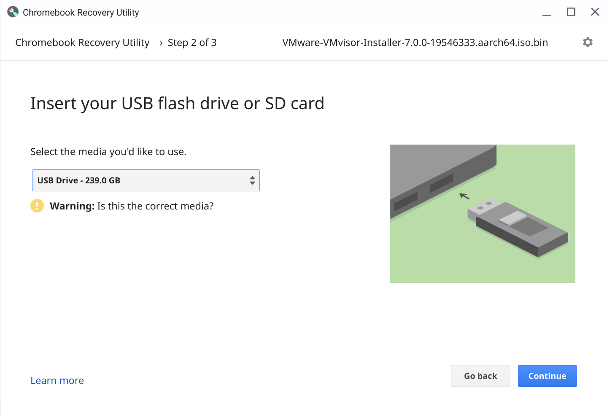


#### Console connection
I'll need to use the Quartz64 serial console interface and ["Woodpecker" edition console USB adapter](https://pine64.com/product/serial-console-woodpecker-edition/) to interact with the board until I get ESXi installed and can connect to it with the web interface or SSH. The adapter comes with a short breakout cable, and I connect it thusly:

| Quartz64 GPIO pin | Console adapter pin | Wire color |
| --- | --- | --- |
| 6 | `GND` | Brown |
| 8 | `RXD` | Red |
| 10 | `TXD` | Orange |

I leave the yellow wire dangling free on both ends since I don't need a `+V` connection for the console to work.
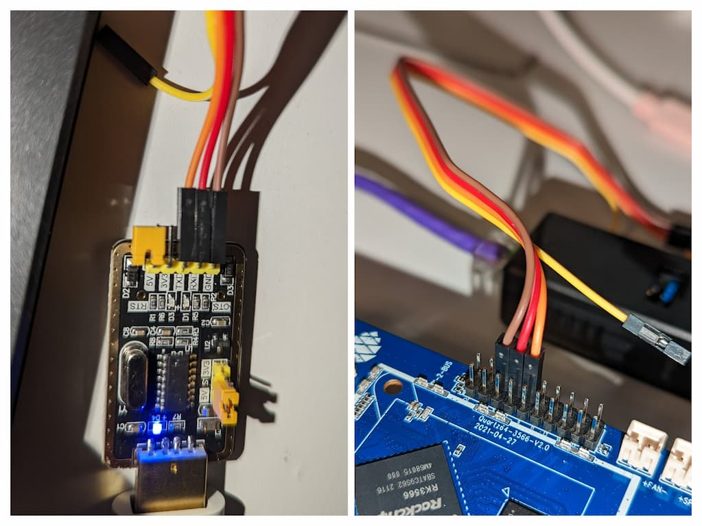

To verify that I've got things working, I go ahead and pop the micro SD card containing the firmware into its slot on the bottom side of the Quartz64 board, connect the USB console adapter to my Chromebook, and open the [Beagle Term](https://chrome.google.com/webstore/detail/beagle-term/gkdofhllgfohlddimiiildbgoggdpoea) app to set up the serial connection.

I'll need to use these settings for the connection (which are the defaults selected by Beagle Term):

| Setting | Value |
| -- | --- |
| Port | `/dev/ttyUSB0` |
| Bitrate | `115200` |
| Data Bit | `8 bit` |
| Parity | `none` |
| Stop Bit | `1` |
| Flow Control | `none` |

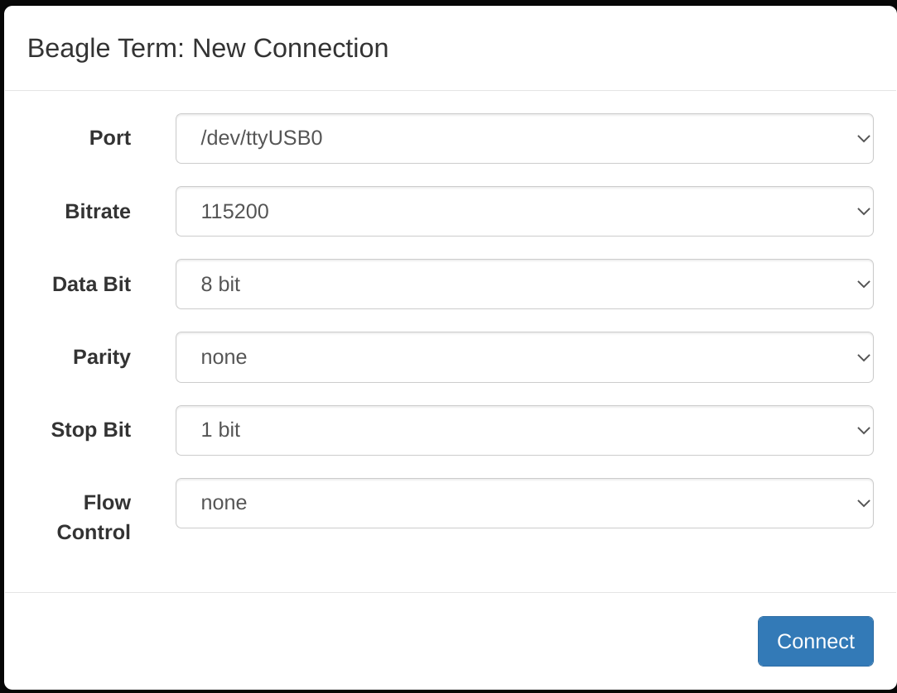

I hit **Connect** and then connect the Quartz64's power supply. I watch as it loads the firmware and then launches the BIOS menu:
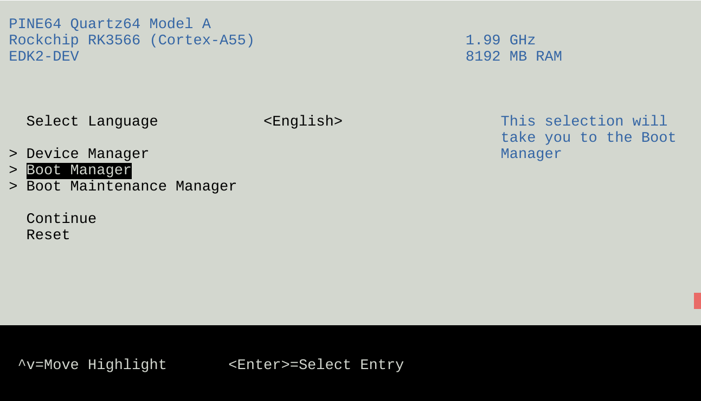

### Host creation
#### ESXi install
Now that I've got everything in order I can start the install. A lot of experimentation on my part confirmed the sad news about the USB ports: of the four USB ports, only the top-right USB2 port works reliably for me. So I connect my ~~USB NIC+hub to that port, and plug in my 256GB drive to the hub~~[^v1.10] 256GB USB drive there. This isn't ideal from a performance aspect, of course, but slow storage is more useful than no storage.

On that note, remember what I mentioned earlier about how the ESXi installer would want to fill up ~128GB worth of whatever drive it targets? The ESXi ARM instructions say that you can get around that by passing the `autoPartitionOSDataSize` advanced option to the installer by pressing `[Shift] + O` in the ESXi bootloader, but the Quartz64-specific instructions say that you can't do that with this board since only the serial console is available... It turns out this is a (happy) lie.

I hooked up a monitor to the board's HDMI port and a USB keyboard to a free port on the hub and verified that the keyboard let me maneuver through the BIOS menu. From here, I hit the **Reset** button on the Quartz64 to restart it and let it boot from the connected USB drive. When I got to the ESXi pre-boot countdown screen, I pressed `[Shift] + O` as instructed and added `autoPartitionOSDataSize=8192` to the boot options. This limits the size of the new-for-ESXi7 ESX-OSData VMFS-L volume to 8GB and will give me much more space for the local datastore.

Beyond that it's a fairly typical ESXi install process:
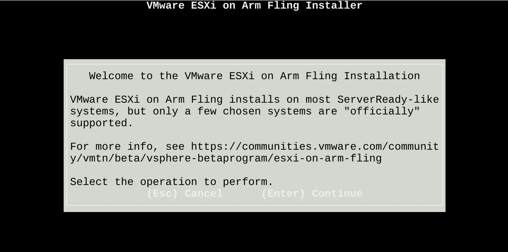


#### Initial configuration
After the installation completed, I rebooted the host and watched for the Direct Console User Interface (DCUI) to come up:


I hit `[F2]` and logged in with the root credentials to get to the System Customization menu:


The host automatically received an IP issued by DHCP but I'd like for it to instead use a static IP. I'll also go ahead and configure the appropriate DNS settings.
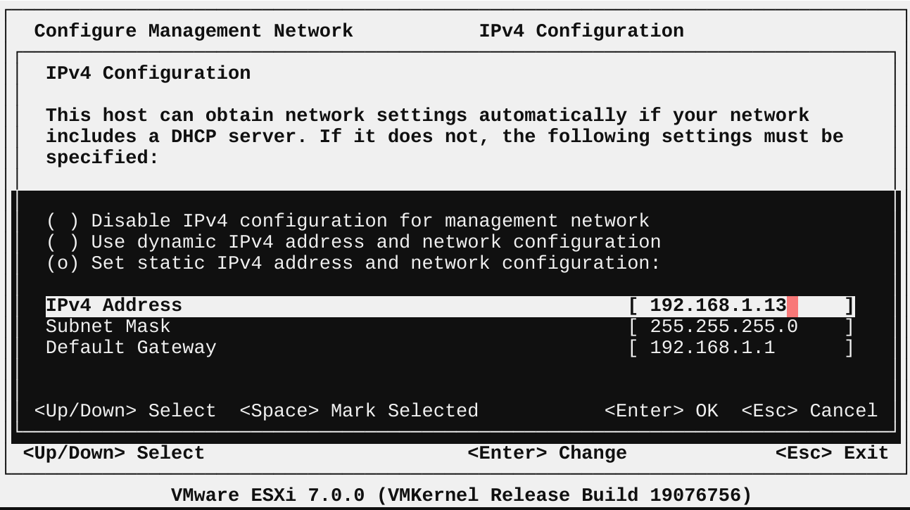
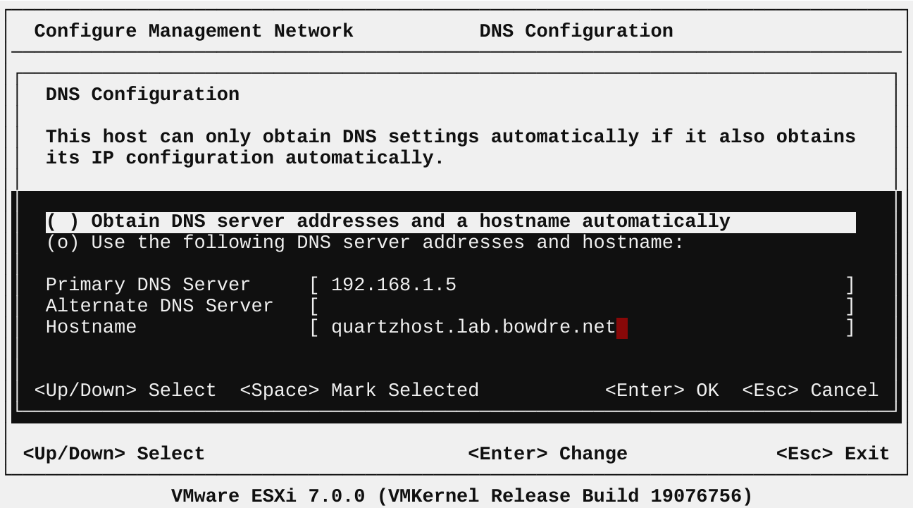

I also create the appropriate matching `A` and `PTR` records in my local DNS, and (after bouncing the management network) I can access the ESXi Embedded Host Client at `https://quartzhost.lab.bowdre.net`:


That's looking pretty good... but what's up with that date and time? Time has kind of lost all meaning in the last couple of years but I'm *reasonably* certain that January 1, 2001 was at least a few years ago. And I know from past experience that incorrect host time will prevent it from being successfully imported to a vCenter inventory.

Let's clear that up by enabling the Network Time Protocol (NTP) service on this host. I'll do that by going to **Manage > System > Time & Date** and clicking the **Edit NTP Settings** button. I don't run a local NTP server so I'll point it at `pool.ntp.org` and set the service to start and stop with the host:


Now I hop over to the **Services** tab, select the `ntpd` service, and then click the **Start** button there. Once it's running, I then *restart* `ntpd` to help encourage the system to update the time immediately.


Once the service is started I can go back to **Manage > System > Time & Date**, click the **Refresh** button, and confirm that the host has been updated with the correct time:


With the time sorted, I'm just about ready to join this host to my vCenter, but first I'd like to take a look at the storage situation - after all, I did jump through those hoops with the installer to make sure that I would wind up with a useful local datastore. Upon going to **Storage > More storage > Devices** and clicking on the single listed storage device, I can see in the Partition Diagram that the ESX-OSData VMFS-L volume was indeed limited to 8GB, and the free space beyond that was automatically formatted as a VMFS datastore:


And I can also take a peek at that local datastore:
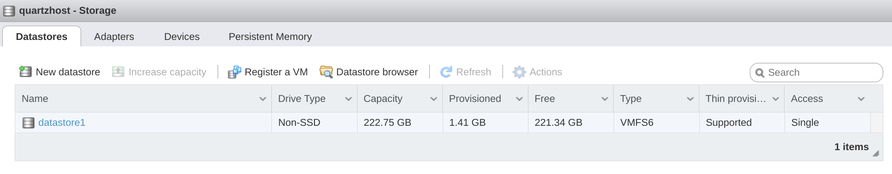

With 200+ gigabytes of free space on the datastore I should have ample room for a few lightweight VMs.

#### Adding to vCenter
Alright, let's go ahead and bring the new host into my vCenter environment. That starts off just like any other host, by right-clicking an inventory location in the *Hosts & Clusters* view and selecting **Add Host**.
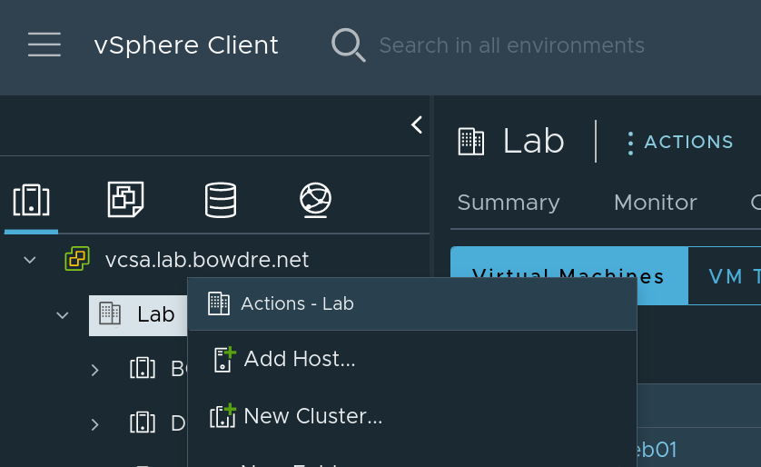

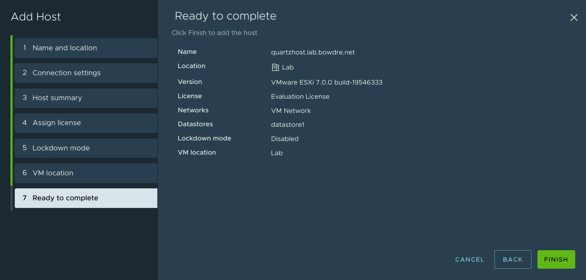


Success! I've now got a single-board hypervisor connected to my vCenter. Now let's give that host a workload.[^workloads]

[^workloads]: Hosts *love* workloads.

### Workload creation
As I mentioned earlier, my initial goal is to deploy a Tailscale node on my new host so that I can access my home network from outside of the single-host virtual lab environment. I've become a fan of using VMware's [Photon OS](https://vmware.github.io/photon/) so I'll get a VM deployed and then install the Tailscale agent.

#### Deploying Photon OS
VMware provides Photon in a few different formats, as described on the [download page](https://github.com/vmware/photon/wiki/Downloading-Photon-OS). I'm going to use the "OVA with virtual hardware v13 arm64" version so I'll kick off that download of `photon_uefi.ova`. I'm actually going to download that file straight to my `deb01` Linux VM:
```shell
wget https://packages.vmware.com/photon/4.0/Rev2/ova/photon_uefi.ova
```
and then spawn a quick Python web server to share it out:
```shell
❯ python3 -m http.server
Serving HTTP on 0.0.0.0 port 8000 (http://0.0.0.0:8000/) ...
```

That will let me deploy from a resource already inside my lab network instead of transferring the OVA from my laptop. So now I can go back to my vSphere Client and go through the steps to **Deploy OVF Template** to the new host, and I'll plug in the URL `http://deb01.lab.bowdre.net:8000/photon_uefi.ova`:


I'll name it `pho01` and drop it in an appropriate VM folder:
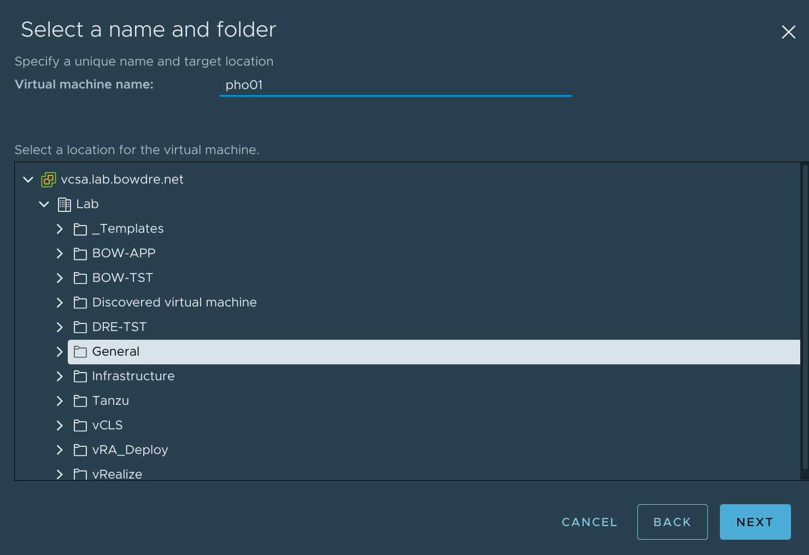

And place it on the new Quartz64 host:


The rest of the OVF deployment is basically just selecting the default options and clicking through to finish it. And then once it's deployed, I'll go ahead and power on the new VM.


#### Configuring Photon
There are just a few things I'll want to configure on this VM before I move on to installing Tailscale, and I'll start out simply by logging in with the remote console.

{}
The default password for Photon's `root` user is `changeme`. You'll be forced to change that at first login.
{}

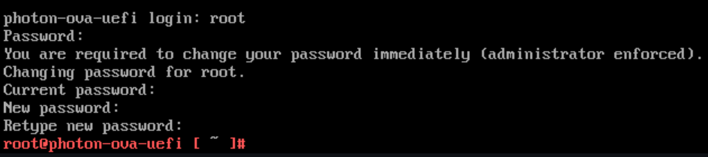

Now that I'm in, I'll set the hostname appropriately:
```bash
hostnamectl set-hostname pho01
```

For now, the VM pulled an IP from DHCP but I would like to configure that statically instead. To do that, I'll create a new interface file:
```bash
cat > /etc/systemd/network/10-static-en.network << "EOF"

[Match]
Name = eth0

[Network]
Address = 192.168.1.17/24
Gateway = 192.168.1.1
DNS = 192.168.1.5
DHCP = no
IPForward = yes

EOF

chmod 644 /etc/systemd/network/10-static-en.network
systemctl restart systemd-networkd
```

I'm including `IPForward = yes` to [enable IP forwarding](https://tailscale.com/kb/1104/enable-ip-forwarding/) for Tailscale.

With networking sorted, it's probably a good idea to check for and apply any available updates:
```bash
tdnf update -y
```

I'll also go ahead and create a normal user account (with sudo privileges) for me to use:
```bash
useradd -G wheel -m john
passwd john
```

Now I can use SSH to connect to the VM and ditch the web console:
```bash
❯ ssh pho01.lab.bowdre.net
Password:
john@pho01 [ ~ ]$ sudo whoami

We trust you have received the usual lecture from the local System
Administrator. It usually boils down to these three things:

    #1) Respect the privacy of others.
    #2) Think before you type.
    #3) With great power comes great responsibility.

[sudo] password for john
root
```

Looking good! I'll now move on to the justification[^justification] for this entire exercise:

[^justification]: Entirely arbitrary and fabricated justification.
#### Installing Tailscale
If I *weren't* doing this on hard mode, I could use Tailscale's [install script](https://tailscale.com/download) like I do on every other Linux system. Hard mode is what I do though, and the installer doesn't directly support Photon OS. I'll instead consult the [manual install instructions](https://tailscale.com/download/linux/static) which tell me to download the appropriate binaries from [https://pkgs.tailscale.com/stable/#static](https://pkgs.tailscale.com/stable/#static). So I'll grab the link for the latest `arm64` build and pull the down to the VM:

```bash
curl https://pkgs.tailscale.com/stable/tailscale_1.22.2_arm64.tgz --output tailscale_arm64.tgz
```

Then I can unpack it:
```bash
sudo tdnf install tar
tar xvf tailscale_arm64.tgz
cd tailscale_1.22.2_arm64/
```

So I've got the `tailscale` and `tailscaled` binaries as well as some sample service configs in the `systemd` directory:
```bash
john@pho01 [ ~/tailscale_1.22.2_arm64 ]$
.:
total 32288
drwxr-x--- 2 john users     4096 Mar 18 02:44 systemd
-rwxr-x--- 1 john users 12187139 Mar 18 02:44 tailscale
-rwxr-x--- 1 john users 20866538 Mar 18 02:44 tailscaled

./systemd:
total 8
-rw-r----- 1 john users 287 Mar 18 02:44 tailscaled.defaults
-rw-r----- 1 john users 674 Mar 18 02:44 tailscaled.service
```

Dealing with the binaries is straight-forward. I'll drop them into `/usr/bin/` and `/usr/sbin/` (respectively) and set the file permissions:
```bash
sudo install -m 755 tailscale /usr/bin/
sudo install -m 755 tailscaled /usr/sbin/
```

Then I'll descend to the `systemd` folder and see what's up:
```bash
john@pho01 [ ~/tailscale_1.22.2_arm64/ ]$ cd systemd/

john@pho01 [ ~/tailscale_1.22.2_arm64/systemd ]$ cat tailscaled.defaults
# Set the port to listen on for incoming VPN packets.
# Remote nodes will automatically be informed about the new port number,
# but you might want to configure this in order to set external firewall
# settings.
PORT="41641"

# Extra flags you might want to pass to tailscaled.
FLAGS=""

john@pho01 [ ~/tailscale_1.22.2_arm64/systemd ]$ cat tailscaled.service
[Unit]
Description=Tailscale node agent
Documentation=https://tailscale.com/kb/
Wants=network-pre.target
After=network-pre.target NetworkManager.service systemd-resolved.service

[Service]
EnvironmentFile=/etc/default/tailscaled
ExecStartPre=/usr/sbin/tailscaled --cleanup
ExecStart=/usr/sbin/tailscaled --state=/var/lib/tailscale/tailscaled.state --socket=/run/tailscale/tailscaled.sock --port $PORT $FLAGS
ExecStopPost=/usr/sbin/tailscaled --cleanup

Restart=on-failure

RuntimeDirectory=tailscale
RuntimeDirectoryMode=0755
StateDirectory=tailscale
StateDirectoryMode=0700
CacheDirectory=tailscale
CacheDirectoryMode=0750
Type=notify

[Install]
WantedBy=multi-user.target
```

`tailscaled.defaults` contains the default configuration that will be referenced by the service, and `tailscaled.service` tells me that it expects to find it at `/etc/defaults/tailscaled`. So I'll copy it there and set the perms:
```bash
sudo install -m 644 tailscaled.defaults /etc/defaults/tailscaled
```

`tailscaled.service` will get dropped in `/usr/lib/systemd/system/`:
```bash
sudo install -m 644 tailscaled.service /usr/lib/systemd/system/
```

Then I'll enable the service and start it:
```bash
sudo systemctl enable tailscaled.service
sudo systemctl start tailscaled.service
```

And finally log in to Tailscale, including my `tag:home` tag for [ACL purposes](/secure-networking-made-simple-with-tailscale/#acls) and a route advertisement for my home network so that my other Tailscale nodes can use this one to access other devices as well:
```bash
sudo tailscale up --advertise-tags "tag:home" --advertise-route "192.168.1.0/24"
```

That will return a URL I can use to authenticate, and I'll then able to to view and manage the new Tailscale node from the `login.tailscale.com` admin portal:
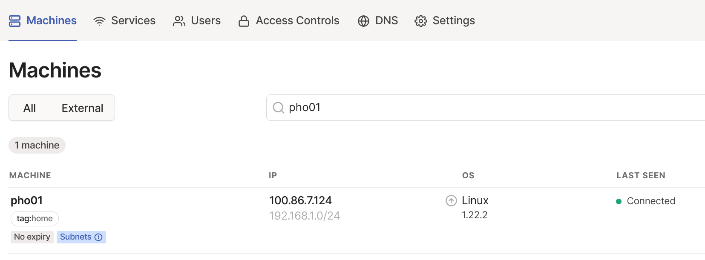

You might remember [from last time](/secure-networking-made-simple-with-tailscale/#subnets-and-exit-nodes) that the "Subnets (!)" label indicates that this node is attempting to advertise a subnet route but that route hasn't yet been accepted through the admin portal. You may also remember that the `192.168.1.0/24` subnet is already being advertised by my `vyos` node:[^hassos]
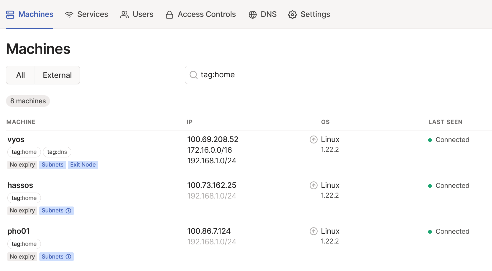

Things could potentially get messy if I have two nodes advertising routes for the same subnet[^failover] so I'm going to use the admin portal to disable that route on `vyos` before enabling it for `pho01`. I'll let `vyos` continue to route the `172.16.0.0/16` subnet (which only exists inside the NUC's vSphere environment after all) and it can continue to function as an Exit Node as well.


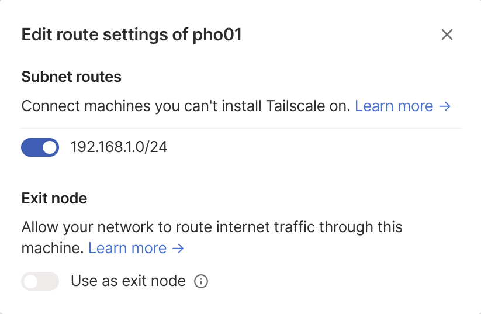

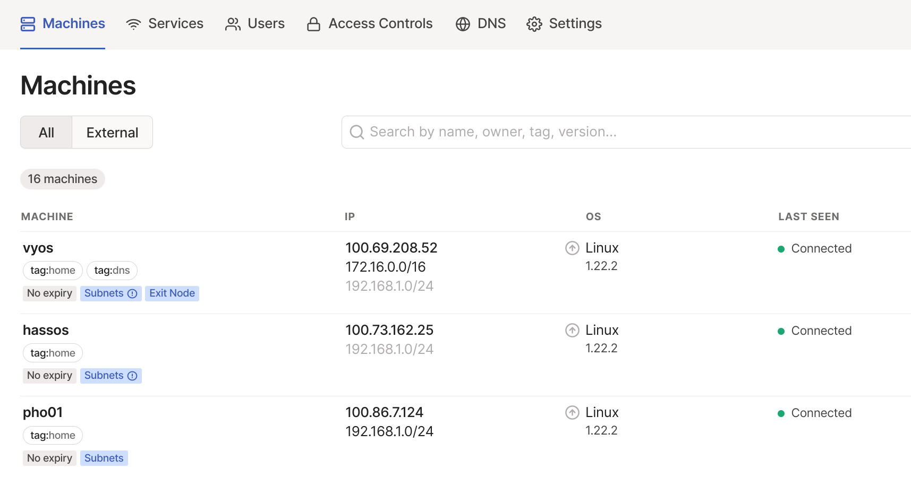

Now I can remotely access the VM (and thus my homelab!) from any of my other Tailscale-enrolled devices!

[^hassos]: The [Tailscale add-on for Home Assistant](https://github.com/hassio-addons/addon-tailscale) also tries to advertise its subnets by default, but I leave that disabled in the admin portal as well.

[^failover]: Tailscale does offer a [subnet router failover feature](https://tailscale.com/kb/1115/subnet-failover/) but it is only available starting on the [Business ($15/month) plan](https://tailscale.com/pricing/) and not the $48/year Personal Pro plan that I'm using.


### Conclusion
I actually received the Quartz64 waay back on March 2nd, and it's taken me until this week to get all the pieces in place and working the way I wanted.


As is so often the case, a lot of time and effort would have been saved if I had RTFM'd[^rtfm] before diving in to the deep end. I definitely hadn't anticipated all the limitations that would come with the Quartz64 SBC before ordering mine. Now that it's done, though, I'm pretty pleased with the setup, and I feel like I learned quite a bit along the way. I keep reminding myself that this is still a very new hardware platform. I'm excited to see how things improve with future development efforts.

[^rtfm]: Read The *Friendly* Manual. Yeah.

