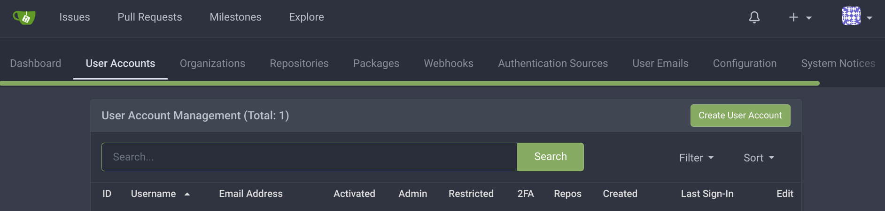
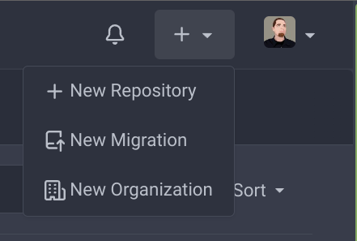
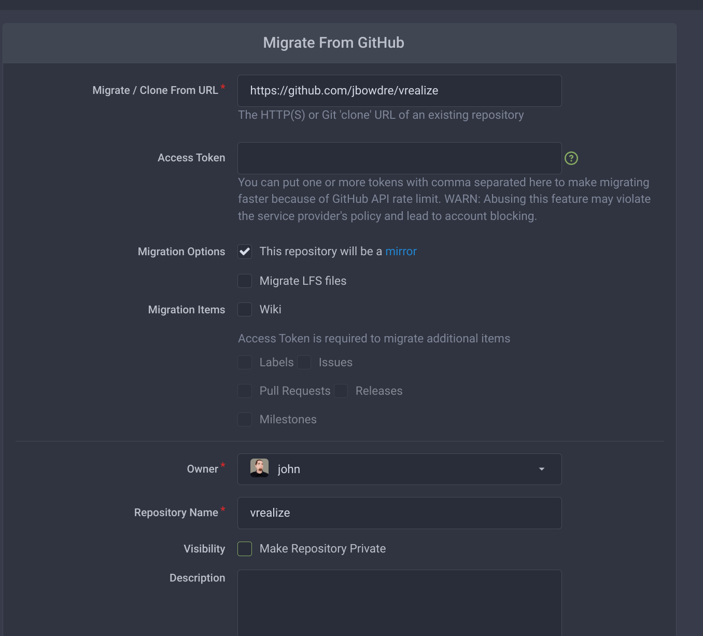
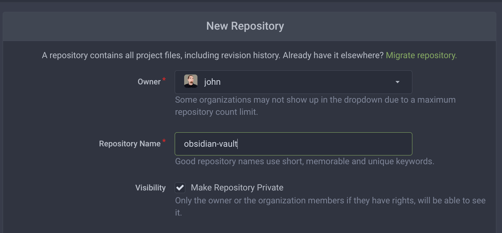
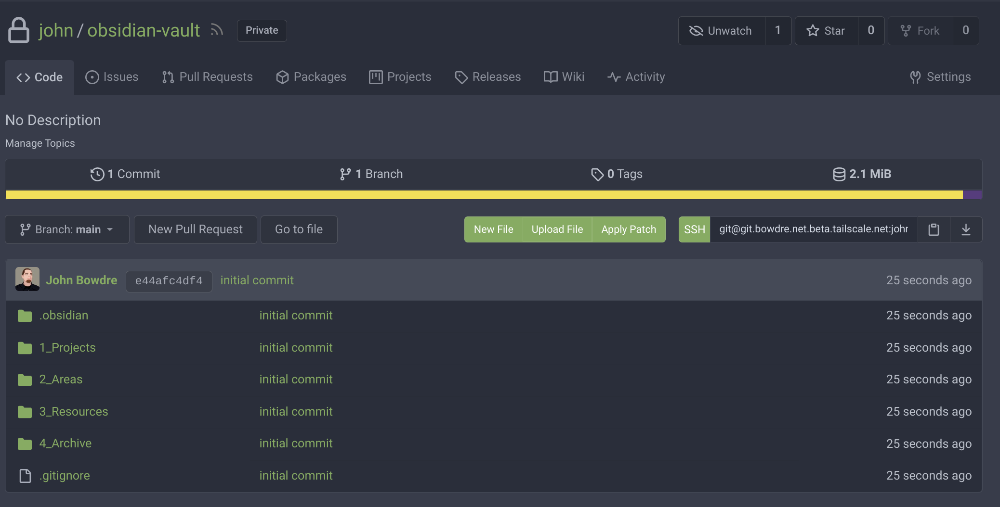

I recently started using [Obsidian](https://obsidian.md/) for keeping notes, tracking projects, and just generally organizing all the information that would otherwise pass into my brain and then fall out the other side. Unlike other similar solutions which operate entirely in *The Cloud*, Obsidian works with Markdown files stored in a local folder[^sync], which I find to be very attractive. Not only will this allow me to easily transfer my notes between apps if I find something I like better than Obsidian, but it also opens the door to using `git` to easily back up all this important information.

Some of the contents might be somewhat sensitive, though, and I'm not sure I'd want to keep that data on a service outside of my control. A self-hosted option would be ideal. Gitlab seemed like an obvious choice, but the resource requirements are a bit higher than would be justified by my single-user use case. I eventually came across [Gitea](https://gitea.io/), a lightweight Git server with a simple web interface (great for a Git novice like myself!) which boasts the ability to run on a Raspberry Pi. This sounded like a great candidate for running on an [Ampere ARM-based compute instance](https://www.oracle.com/cloud/compute/arm/) in my [Oracle Cloud free tier](https://www.oracle.com/cloud/free/) environment!

In this post, I'll describe what I did to get Gitea up and running on a tiny ARM-based cloud server (though I'll just gloss over the cloud-specific configurations), as well as how I'm leveraging [Tailscale](/secure-networking-made-simple-with-tailscale/) to enable SSH Git access without having to expose that service to the internet. I based the bulk of this on the information provided in Gitea's [Install With Docker](https://docs.gitea.io/en-us/install-with-docker/) documentation.


[^sync]: Obsidian *does* offer a paid [Sync](https://obsidian.md/sync) plugin for keeping the content on multiple devices in sync, but it's somewhat spendy at $10 month. And much of the appeal of using a Markdown-based system for managing my notes is being in full control of the content. Plus I wanted an excuse to build a git server.

### Create the server
I'll be deploying this on a cloud server with these specs:

| | |
| --- | --- |
| Shape | `VM.Standard.A1.Flex` |
| Image | Ubuntu 22.04 |
| CPU Count | 1 | 
| Memory (GB) | 6 |
| Boot Volume (GB) | 50 |

I've described the [process of creating a new instance on OCI in a past post](/federated-matrix-server-synapse-on-oracle-clouds-free-tier/#instance-creation) so I won't reiterate that here. The only gotcha this time is switching the shape to `VM.Standard.A1.Flex`; the [OCI free tier](https://docs.oracle.com/en-us/iaas/Content/FreeTier/freetier_topic-Always_Free_Resources.htm) allows two AMD Compute VMs (which I've already used up) as well as *up to four* ARM Ampere A1 instances[^free_ampere].

[^free_ampere]: The first 3000 OCPU hours and 18,000 GB hours per month are free, equivalent to 4 OCPUs and 24 GB of memory allocated however you see fit.

### Prepare the server
Once the server's up and running, I go through the usual steps of applying any available updates:
```bash
sudo apt update
sudo apt upgrade
```

#### Install Tailscale
And then I'll install Tailscale using their handy-dandy bootstrap script:

```bash
curl -fsSL https://tailscale.com/install.sh | sh
```

When I bring up the Tailscale interface, I'll use the `--advertise-tags` flag to identify the server with an [ACL tag](https://tailscale.com/kb/1068/acl-tags/). ([Within my tailnet](/secure-networking-made-simple-with-tailscale/#acls)[^tailnet], all of my other clients are able to connect to devices bearing the `cloud` tag but `cloud` servers can only reach back to other devices for performing DNS lookups.)
```bash
sudo tailscale up --advertise-tags "tag:cloud"
```

[^tailnet]: [Tailscale's term](https://tailscale.com/kb/1136/tailnet/) for the private network which securely links Tailscale-connected devices. 

#### Install Docker
Next I install Docker and `docker-compose`:

```bash
sudo apt install ca-certificates curl gnupg lsb-release
curl -fsSL https://download.docker.com/linux/ubuntu/gpg | sudo gpg --dearmor -o /usr/share/keyrings/docker-archive-keyring.gpg
echo \
  "deb [arch=$(dpkg --print-architecture) signed-by=/usr/share/keyrings/docker-archive-keyring.gpg] https://download.docker.com/linux/ubuntu \
  $(lsb_release -cs) stable" | sudo tee /etc/apt/sources.list.d/docker.list > /dev/null
sudo apt update
sudo apt install docker-ce docker-ce-cli containerd.io docker-compose docker-compose-plugin
```

#### Configure firewall
This server automatically had an iptables firewall rule configured to permit SSH access. For Gitea, I'll also need to configure HTTP/HTTPS access. [As before](/federated-matrix-server-synapse-on-oracle-clouds-free-tier/#firewall-configuration), I need to be mindful of the explicit `REJECT all` rule at the bottom of the `INPUT` chain:

```bash
$ sudo iptables -L INPUT --line-numbers
Chain INPUT (policy ACCEPT)
num  target     prot opt source               destination
1    ts-input   all  --  anywhere             anywhere
2    ACCEPT     all  --  anywhere             anywhere             state RELATED,ESTABLISHED
3    ACCEPT     icmp --  anywhere             anywhere
4    ACCEPT     all  --  anywhere             anywhere
5    ACCEPT     udp  --  anywhere             anywhere             udp spt:ntp
6    ACCEPT     tcp  --  anywhere             anywhere             state NEW tcp dpt:ssh
7    REJECT     all  --  anywhere             anywhere             reject-with icmp-host-prohibited
```

So I'll insert the new rules at line 6:
```bash
sudo iptables -L INPUT --line-numbers
sudo iptables -I INPUT 6 -m state --state NEW -p tcp --dport 80 -j ACCEPT
sudo iptables -I INPUT 6 -m state --state NEW -p tcp --dport 443 -j ACCEPT
```

And confirm that it did what I wanted it to:
```bash
$ sudo iptables -L INPUT --line-numbers
Chain INPUT (policy ACCEPT)
num  target     prot opt source               destination
1    ts-input   all  --  anywhere             anywhere
2    ACCEPT     all  --  anywhere             anywhere             state RELATED,ESTABLISHED
3    ACCEPT     icmp --  anywhere             anywhere
4    ACCEPT     all  --  anywhere             anywhere
5    ACCEPT     udp  --  anywhere             anywhere             udp spt:ntp
6    ACCEPT     tcp  --  anywhere             anywhere             state NEW tcp dpt:https
7    ACCEPT     tcp  --  anywhere             anywhere             state NEW tcp dpt:http
8    ACCEPT     tcp  --  anywhere             anywhere             state NEW tcp dpt:ssh
9    REJECT     all  --  anywhere             anywhere             reject-with icmp-host-prohibited
```

That looks good, so let's save the new rules:
```bash
$ sudo netfilter-persistent save
run-parts: executing /usr/share/netfilter-persistent/plugins.d/15-ip4tables save
run-parts: executing /usr/share/netfilter-persistent/plugins.d/25-ip6tables save
```

{}
Of course I will also need to create matching rules in the cloud firewall, but I'm going not going to detail [those steps](/federated-matrix-server-synapse-on-oracle-clouds-free-tier/#firewall-configuration) again here. And since I've now got Tailscale up and running I can remove the pre-created rule to allow SSH access through the cloud firewall.
{}

### Install Gitea
I'm now ready to move on with installing Gitea itself. 

#### Prepare `git` user
I'll start with creating a `git` user. This account will be set as the owner of the data volume used by the Gitea container, but will also (perhaps more importantly) facilitate [SSH passthrough](https://docs.gitea.io/en-us/install-with-docker/#ssh-container-passthrough) into the container for secure git operations. 

Here's where I create the account and also generate what will become the SSH key used by the git server:
```bash
sudo useradd -s /bin/bash -m git
sudo -u git ssh-keygen -t ecdsa -C "Gitea Host Key"
```

The `git` user's SSH public key gets added as-is directly to that user's `authorized_keys` file:
```bash
sudo -u git cat /home/git/.ssh/id_ecdsa.pub | sudo -u git tee -a /home/git/.ssh/authorized_keys
sudo -u git chmod 600 /home/git/.ssh/authorized_keys
```

When other users add their SSH public keys into Gitea's web UI, those will get added to `authorized_keys` with a little something extra: an alternate command to perform git actions instead of just SSH ones:
```
command="/usr/local/bin/gitea --config=/data/gitea/conf/app.ini serv key-1",no-port-forwarding,no-X11-forwarding,no-agent-forwarding,no-pty <user pubkey>
```

{}
No users have added their keys to Gitea just yet so if you look at `/home/git/.ssh/authorized_keys` right now you won't see this extra line, but I wanted to go ahead and mention it to explain the next step. It'll show up later. I promise. 
{}

So I'll go ahead and create that extra command:
```bash
cat <<"EOF" | sudo tee /usr/local/bin/gitea
#!/bin/sh
ssh -p 2222 -o StrictHostKeyChecking=no git@127.0.0.1 "SSH_ORIGINAL_COMMAND=\"$SSH_ORIGINAL_COMMAND\" $0 $@"
EOF
sudo chmod +x /usr/local/bin/gitea
```

So when I use a `git` command to interact with the server via SSH, the commands will get relayed into the Docker container on port 2222. 

#### Create `docker-compose` definition
That takes care of most of the prep work, so now I'm ready to create the `docker-compose.yaml` file which will tell Docker how to host Gitea. 

I'm going to place this in `/opt/gitea`:
```bash
sudo mkdir -p /opt/gitea
cd /opt/gitea
```

And I want to be sure that my new `git` user owns the `./data` directory which will be where the git contents get stored:
```bash
sudo mkdir data
sudo chown git:git -R data
```

Now to create the file:
```bash
sudo vi docker-compose.yaml
```

The basic contents of the file came from the [Gitea documentation for Installation with Docker](https://docs.gitea.io/en-us/install-with-docker/), but I also included some (highlighted) additional environment variables based on the [Configuration Cheat Sheet](https://docs.gitea.io/en-us/config-cheat-sheet/):

`docker-compose.yaml`:
```yaml {hl_lines=["12-13","19-31",38,43]}
version: "3"

networks:
  gitea:
    external: false

services:
  server:
    image: gitea/gitea:latest
    container_name: gitea
    environment:
      - USER_UID=1003
      - USER_GID=1003
      - GITEA__database__DB_TYPE=postgres
      - GITEA__database__HOST=db:5432
      - GITEA__database__NAME=gitea
      - GITEA__database__USER=gitea
      - GITEA__database__PASSWD=gitea
      - GITEA____APP_NAME=Gitea
      - GITEA__log__MODE=file
      - GITEA__openid__ENABLE_OPENID_SIGNIN=false
      - GITEA__other__SHOW_FOOTER_VERSION=false
      - GITEA__repository__DEFAULT_PRIVATE=private
      - GITEA__repository__DISABLE_HTTP_GIT=true
      - GITEA__server__DOMAIN=git.bowdre.net
      - GITEA__server__SSH_DOMAIN=git.tadpole-jazz.ts.net
      - GITEA__server__ROOT_URL=https://git.bowdre.net/
      - GITEA__server__LANDING_PAGE=explore
      - GITEA__service__DISABLE_REGISTRATION=true
      - GITEA__service_0X2E_explore__DISABLE_USERS_PAGE=true
      - GITEA__ui__DEFAULT_THEME=arc-green

    restart: always
    networks:
      - gitea
    volumes:
      - ./data:/data
      - /home/git/.ssh/:/data/git/.ssh
      - /etc/timezone:/etc/timezone:ro
      - /etc/localtime:/etc/localtime:ro
    ports:
      - "3000:3000"
      - "127.0.0.1:2222:22"
    depends_on:
      - db

  db:
    image: postgres:14
    container_name: gitea_db
    restart: always
    environment:
      - POSTGRES_USER=gitea
      - POSTGRES_PASSWORD=gitea
      - POSTGRES_DB=gitea
    networks:
      - gitea
    volumes:
      - ./postgres:/var/lib/postgresql/data
```
{}
The format of PostgreSQL data changes with new releases, and that means that the data created by different major releases are not compatible. Unless you take steps to upgrade the data format, you'll have problems when a new major release of PostgreSQL arrives. Avoid the headache: pin this to a major version (as I did with `image: postgres:14` above) so you can upgrade on your terms.
{}

Let's go through the extra configs in a bit more detail:
| Variable setting | Purpose |
|:--- |:--- |
|`USER_UID=1003` | User ID of the `git` user on the container host |
|`USER_GID=1003` | GroupID of the `git` user on the container host |
|`GITEA____APP_NAME=Gitea` | Sets the title of the site. I shortened it from `Gitea: Git with a cup of tea` because that seems unnecessarily long. |
|`GITEA__log__MODE=file` | Enable logging |
|`GITEA__openid__ENABLE_OPENID_SIGNIN=false` | Disable signin through OpenID |
|`GITEA__other__SHOW_FOOTER_VERSION=false` | Anyone who hits the web interface doesn't need to know the version |
|`GITEA__repository__DEFAULT_PRIVATE=private` | All repos will default to private unless I explicitly override that |
|`GITEA__repository__DISABLE_HTTP_GIT=true` | Require that all Git operations occur over SSH |
|`GITEA__server__DOMAIN=git.bowdre.net` | Domain name of the server |
|`GITEA__server__SSH_DOMAIN=git.tadpole-jazz.ts.net` | Leverage Tailscale's [MagicDNS](https://tailscale.com/kb/1081/magicdns/) to tell clients how to SSH to the Tailscale internal IP |
|`GITEA__server__ROOT_URL=https://git.bowdre.net/` | Public-facing URL |
|`GITEA__server__LANDING_PAGE=explore` | Defaults to showing the "Explore" page (listing any public repos) instead of the "Home" page (which just tells about the Gitea project) |
|`GITEA__service__DISABLE_REGISTRATION=true` | New users will not be able to self-register for access; they will have to be manually added by the Administrator account that will be created during the initial setup |
|`GITEA__service_0X2E_explore__DISABLE_USERS_PAGE=true` | Don't allow browsing of user accounts |
|`GITEA__ui__DEFAULT_THEME=arc-green` | Default to the darker theme |

Beyond the environment variables, I also defined a few additional options to allow the SSH passthrough to function. Mounting the `git` user's SSH config directory into the container will ensure that user keys defined in Gitea will also be reflected outside of the container, and setting the container to listen on local port `2222` will allow it to receive the forwarded SSH connections:

```yaml
    volumes:
      [...]
      - /home/git/.ssh/:/data/git/.ssh
      [...]
    ports:
      [...]
      - "127.0.0.1:2222:22"
```

With the config in place, I'm ready to fire it up:

#### Start containers
Starting Gitea is as simple as
```bash
sudo docker-compose up -d
```
which will spawn both the Gitea server as well as a `postgres` database to back it. 

Gitea will be listening on port `3000`.... which isn't exposed outside of the VM it's running on so I can't actually do anything with it just yet. Let's see about changing that.

### Configure Caddy reverse proxy
I've [written before](/federated-matrix-server-synapse-on-oracle-clouds-free-tier/#reverse-proxy-setup) about [Caddy server](https://caddyserver.com/) and how simple it makes creating a reverse proxy with automatic HTTPS. While Gitea does include [built-in HTTPS support](https://docs.gitea.io/en-us/https-setup/), configuring that to work within Docker seems like more work to me. 

#### Install Caddy
So exactly how simple does Caddy make this? Well let's start with installing Caddy on the system:

```bash
sudo apt install -y debian-keyring debian-archive-keyring apt-transport-https
curl -1sLf 'https://dl.cloudsmith.io/public/caddy/stable/gpg.key' | sudo gpg --dearmor -o /usr/share/keyrings/caddy-stable-archive-keyring.gpg
curl -1sLf 'https://dl.cloudsmith.io/public/caddy/stable/debian.deb.txt' | sudo tee /etc/apt/sources.list.d/caddy-stable.list
sudo apt update
sudo apt install caddy
```

#### Configure Caddy
Configuring Caddy is as simple as creating a Caddyfile:
```bash
sudo vi /etc/caddy/Caddyfile
```

Within that file, I tell it which fully-qualified domain name(s) I'd like it to respond to (and manage SSL certificates for), as well as that I'd like it to function as a reverse proxy and send the incoming traffic to the same port `3000` that used by the Docker container:
```
git.bowdre.net {
        reverse_proxy localhost:3000
}
```

That's it. I don't need to worry about headers or ACME configurations or anything else. Those three lines are all that's required for this use case. It almost seems too easy!

#### Start Caddy
All that's left at this point is to start up Caddy:
```bash
sudo systemctl enable caddy
sudo systemctl start caddy
sudo systemctl restart caddy
```

I found that the `restart` is needed to make sure that the config file gets loaded correctly. And after a moment or two, I can point my browser over to `https://git.bowdre.net` and see the default landing page, complete with a valid certificate. 

### Configure Gitea
Now that Gitea is installed, I'll need to go through the initial configuration process to actually be able to use it. Fortunately most of this stuff was taken care of by all the environment variables I crammed into the the `docker-compose.yaml` file earlier. All I *really* need to do is create an administrative user:


I can now press the friendly **Install Gitea** button, and after just a few seconds I'll be able to log in with that new administrator account. 

#### Create user account
I don't want to use that account for all my git actions though so I click on the menu at the top right and select the **Site Administration** option:


From there I can navigate to the *User Accounts* tab and use the **Create User Account** button to make a new account:



And then I can log out and log back in with my new non-admin identity!

#### Add SSH public key
Associating a public key with my new Gitea account will allow me to easily authenticate my pushes from the command line. I can create a new SSH public/private keypair by following [GitHub's instructions](https://docs.github.com/en/authentication/connecting-to-github-with-ssh/generating-a-new-ssh-key-and-adding-it-to-the-ssh-agent):
```shell
ssh-keygen -t ed25519 -C "user@example.com"
```

I'll view the contents of the public key - and go ahead and copy the output for future use:
```
; cat ~/.ssh/id_ed25519.pub
ssh-ed25519 AAAAC3NzaC1lZDI1NTE5AAAAIF5ExSsQfr6pAFBEZ7yx0oljSnpnOixvp8DS26STcx2J user@example.com
```

Back in the Gitea UI, I'll click the user menu up top and select **Settings**, then the *SSH / GPG Keys* tab, and click the **Add Key** button:


I can give the key a name and then paste in that public key, and then click the lower **Add Key** button to insert the new key.

To verify that the SSH passthrough magic I [configured earlier](#prepare-git-user) is working, I can take a look at `git`'s `authorized_keys` file:
```shell{hl_lines=3}
; sudo tail -2 /home/git/.ssh/authorized_keys
# gitea public key
command="/usr/local/bin/gitea --config=/data/gitea/conf/app.ini serv key-3",no-port-forwarding,no-X11-forwarding,no-agent-forwarding,no-pty,no-user-rc,restrict ssh-ed25519 AAAAC3NzaC1lZDI1NTE5AAAAIF5ExSsQfr6pAFBEZ7yx0oljSnpnOixvp8DS26STcx2J user@example.com
```

Hey - there's my public key, being preceded by the customized command I defined earlier. There's one last thing I'd like to do before I get to populating my new server with content...

### Configure Fail2ban
I'm already limiting this server's exposure by blocking inbound SSH (except for what's magically tunneled through Tailscale) at the Oracle Cloud firewall, but I still have to have TCP ports `80` and `443` open for the web interface. It would be nice if those web ports didn't get hammered with invalid login attempts.

[Fail2ban](https://www.fail2ban.org/wiki/index.php/Main_Page) can help with that by monitoring log files for repeated authentication failures and then creating firewall rules to block the offender. 

Installing Fail2ban is simple:
```shell
sudo apt update
sudo apt install fail2ban
```

Then I need to tell Fail2ban what to look for when detecting failed logins to Gitea. This can often be a tedious process of crawling through logs looking for example failure messages, but fortunately the [Gitea documentation](https://docs.gitea.io/en-us/fail2ban-setup/) tells me what I need to know.

Specifically, I'll want to watch `log/gitea.log` for messages like the following:
```
2018/04/26 18:15:54 [I] Failed authentication attempt for user from xxx.xxx.xxx.xxx
```
```
2020/10/15 16:08:44 ...s/context/context.go:204:HandleText() [E] invalid credentials from xxx.xxx.xxx.xxx
```

So let's create that filter:
```shell
sudo vi /etc/fail2ban/filter.d/gitea.conf
```
`/etc/fail2ban/filter.d/gitea.conf`:
```
[Definition]
failregex =  .*(Failed authentication attempt|invalid credentials).* from <HOST>
ignoreregex =
```

Next I create the jail, which tells Fail2ban what to do:
```shell
sudo vi /etc/fail2ban/jail.d/gitea.conf
```
`/etc/fail2ban/jail.d/gitea.conf`:
```
[gitea]
enabled = true
filter = gitea
logpath = /opt/gitea/data/gitea/log/gitea.log
maxretry = 5
findtime = 3600
bantime = 86400
action = iptables-allports
```

This configures Fail2ban to watch the log file (`logpath`) inside the data volume mounted to the Gitea container for messages which match the pattern I just configured (`gitea`). If a system fails to log in 5 times (`maxretry`) within 1 hour (`findtime`, in seconds) then the offending IP will be banned for 1 day (`bantime`, in seconds). 

Then I just need to enable and start Fail2ban:
```shell
sudo systemctl enable fail2ban
sudo systemctl start fail2ban
```

To verify that it's working, I can deliberately fail to log in to the web interface and watch `/var/log/fail2ban.log`:
```shell
; sudo tail -f /var/log/fail2ban.log
2022-07-17 21:52:26,978 fail2ban.filter         [36042]: INFO    [gitea] Found ${MY_HOME_IP}| - 2022-07-17 21:52:26
```

Excellent, let's now move on to creating some content.
### Work with Gitea
#### Mirror content from GitHub
As an easy first sync, I'm going to simply link a new repository on this server to an existing one I have at GitHub, namely [this one](https://github.com/jbowdre/vrealize) which I'm using to track some of my vRealize work. I'll set this up as a one-way mirror so that it will automatically pull in any new upstream changes but new commits made through Gitea will stay in Gitea. And I'll do that by clicking the **+** button at the top right and selecting **New Migration**.



Gitea includes support for easy migrations from several content sources:


I pick the GitHub one and then plug in the details of the GitHub repo:


And after just a few moments, all the content from my GitHub repo shows up in my new Gitea one:


You might noticed that I unchecked the *Make Repository Private* option for this one, so feel free to browse the mirrored repo at https://git.bowdre.net/vPotato/vrealize if you'd like to check out Gitea for yourself.

#### Create a new repo
The real point of this whole exercise was to sync my Obsidian vault to a Git server under my control, so it's time to create a place for that content to live. I'll go to the **+** menu again but this time select **New Repository**, and then enter the required information:


Once it's created, the new-but-empty repository gives me instructions on how I can interact with it. Note that the SSH address uses the special `git.tadpole-jazz.ts.net` Tailscale domain name which is only accessible within my tailnet.


Now I can follow the instructions to initialize my local Obsidian vault (stored at `~/obsidian-vault/`) as a git repository and perform my initial push to Gitea:
```shell
cd ~/obsidian-vault/
git init
git add .
git commit -m "initial commit"
git remote add origin git@git.tadpole-jazz.ts.net:john/obsidian-vault.git
git push -u origin main
```

And if I refresh the page in my browser, I'll see all that content which has just been added:


### Conclusion
So now I've got a lightweight, web-enabled, personal git server running on a (free!) cloud server under my control. It's working brilliantly in conjunction with the community-maintained [obsidian-git](https://github.com/denolehov/obsidian-git) plugin for keeping my notes synced across my various computers. On Android, I'm leveraging the free [GitJournal](https://play.google.com/store/apps/details?id=io.gitjournal.gitjournal) app as a simple git client for pulling the latest changes (as described [on another blog I found](https://orth.uk/obsidian-sync/#clone-the-repo-on-your-android-phone-)). 


