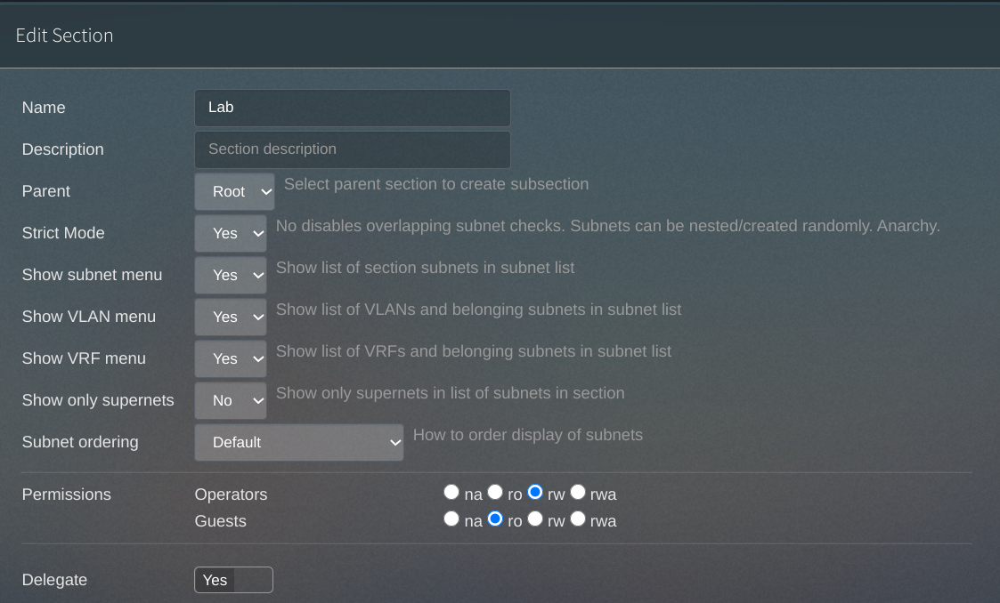

In a [previous post](/vmware-home-lab-on-intel-nuc-9), I described some of the steps I took to stand up a homelab including vRealize Automation (vRA) on an Intel NUC 9. One of my initial goals for that lab was to use it for developing and testing a way for vRA to leverage [phpIPAM](https://phpipam.net/) for static IP assignments. The homelab worked brilliantly for that purpose, and those extra internal networks were a big help when it came to testing. I was able to deploy and configure a new VM to host the phpIPAM instance, install the [VMware vRealize Third-Party IPAM SDK](https://code.vmware.com/web/sdk/1.1.0/vmware-vrealize-automation-third-party-ipam-sdk) on my [Chromebook's Linux environment](/setting-up-linux-on-a-new-lenovo-chromebook-duet-bonus-arm64-complications), develop and build the integration component, import it to my vRA environment, and verify that deployments got addressed accordingly. 

The resulting integration is available on Github [here](https://github.com/jbowdre/phpIPAM-for-vRA8). This was actually the second integration I'd worked on, having fumbled my way through a [Solarwinds integration](https://github.com/jbowdre/SWIPAMforvRA8) earlier last year. [VMware's documentation](https://docs.vmware.com/en/vRealize-Automation/8.3/Using-and-Managing-Cloud-Assembly/GUID-4A5A481C-FC45-47FB-A120-56B73EB28F01.html) on how to build these things is pretty good, but I struggled to find practical information on how a novice like me could actually go about developing the integration. So maybe these notes will be helpful to anyone seeking to write an integration for a different third-party IP Address Management solution.

If you'd just like to import a working phpIPAM integration into your environment without learning how the sausage is made, you can grab my latest compiled package [here](https://github.com/jbowdre/phpIPAM-for-vRA8/releases/latest). You'll probably still want to look through Steps 0-2 to make sure your IPAM instance is set up similarly to mine.

### Step 0: phpIPAM installation and base configuration
Before even worrying about the SDK, I needed to [get a phpIPAM instance ready](https://phpipam.net/documents/installation/). I started with a small (1vCPU/1GB RAM/16GB HDD) VM attached to my "Home" network (`192.168.1.0/24`). I installed Ubuntu 20.04.1 LTS, and then used [this guide](https://computingforgeeks.com/install-and-configure-phpipam-on-ubuntu-debian-linux/) to install phpIPAM. 

Once phpIPAM was running and accessible via the web interface, I then used `openssl` to generate a self-signed certificate to be used for the SSL API connection:
```shell
sudo mkdir /etc/apache2/certificate
cd /etc/apache2/certificate/
sudo openssl req -new -newkey rsa:4096 -x509 -sha256 -days 365 -nodes -out apache-certificate.crt -keyout apache.key
```
I edited the apache config file to bind that new certificate on port 443, and to redirect requests on port 80 to port 443:
```xml
<VirtualHost *:80>
        ServerName ipam.lab.bowdre.net
        Redirect permanent / https://ipam.lab.bowdre.net
</VirtualHost>
<VirtualHost *:443>
        DocumentRoot "/var/www/html/phpipam"
        ServerName ipam.lab.bowdre.net
        <Directory "/var/www/html/phpipam">
                Options Indexes FollowSymLinks
                AllowOverride All
                Require all granted
        </Directory>
        ErrorLog "/var/log/apache2/phpipam-error_log"
        CustomLog "/var/log/apache2/phpipam-access_log" combined
        SSLEngine on
        SSLCertificateFile /etc/apache2/certificate/apache-certificate.crt
        SSLCertificateKeyFile /etc/apache2/certificate/apache.key
</VirtualHost>
```
After restarting apache, I verified that hitting `http://ipam.lab.bowdre.net` redirected me to `https://ipam.lab.bowdre.net`, and that the connection was secured with the shiny new certificate. 

Remember how I've got a "Home" network as well as [several internal networks](/vmware-home-lab-on-intel-nuc-9#networking) which only exist inside the lab environment? I dropped the phpIPAM instance on the Home network to make it easy to connect to, but it doesn't know how to talk to the internal networks where vRA will actually be deploying the VMs. So I added a static route to let it know that traffic to `172.16.0.0/16` would have to go through the Vyos router at `192.168.1.100`.

This is Ubuntu, so I edited `/etc/netplan/99-netcfg-vmware.yaml` to add the `routes` section at the bottom:
```yaml
network:
  version: 2
  renderer: networkd
  ethernets:
    ens160:
      dhcp4: no
      dhcp6: no
      addresses:
        - 192.168.1.14/24
      gateway4: 192.168.1.1
      nameservers:
        search:
          - lab.bowdre.net
        addresses:
          - 192.168.1.5
      routes:
              - to: 172.16.0.0/16
                via: 192.168.1.100
                metric: 100
```
I then ran `sudo netplan apply` so the change would take immediate effect and confirmed the route was working by pinging the vCenter's interface on the `172.16.10.0/24` network:
```
john@ipam:~$ sudo netplan apply
john@ipam:~$ ip route
default via 192.168.1.1 dev ens160 proto static 
172.16.0.0/16 via 192.168.1.100 dev ens160 proto static metric 100 
192.168.1.0/24 dev ens160 proto kernel scope link src 192.168.1.14 
john@ipam:~$ ping 172.16.10.12
PING 172.16.10.12 (172.16.10.12) 56(84) bytes of data.
64 bytes from 172.16.10.12: icmp_seq=1 ttl=64 time=0.282 ms
64 bytes from 172.16.10.12: icmp_seq=2 ttl=64 time=0.256 ms
64 bytes from 172.16.10.12: icmp_seq=3 ttl=64 time=0.241 ms
^C
--- 172.16.10.12 ping statistics ---
3 packets transmitted, 3 received, 0% packet loss, time 2043ms
rtt min/avg/max/mdev = 0.241/0.259/0.282/0.016 ms
```

Now would also be a good time to go ahead and enable cron jobs so that phpIPAM will automatically scan its defined subnets for changes in IP availability and device status. phpIPAM includes a pair of scripts in `INSTALL_DIR/functions/scripts/`: one for discovering new hosts, and the other for checking the status of previously discovered hosts. So I ran `sudo crontab -e` to edit root's crontab and pasted in these two lines to call both scripts every 15 minutes:
```
*/15 * * * * /usr/bin/php /var/www/html/phpipam/functions/scripts/discoveryCheck.php
*/15 * * * * /usr/bin/php /var/www/html/phpipam/functions/scripts/pingCheck.php
```

### Step 1: Configuring phpIPAM API access
Okay, let's now move on to the phpIPAM web-based UI to continue the setup. After logging in at `https://ipam.lab.bowdre.net/`, I clicked on the red **Administration** menu at the right side and selected **phpIPAM Settings**. Under the **Site Settings** section, I enabled the *Prettify links* option, and under the **Feature Settings** section I toggled on the *API* component. I then hit *Save* at the bottom of the page to apply the changes.

Next, I went to the **Users** item on the left-hand menu to create a new user account which will be used by vRA. I named it `vra`, set a password for the account, and made it a member of the `Operators` group, but didn't grant any special module access.


The last step in configuring API access is to create an API key. This is done by clicking the **API** item on that left side menu and then selecting *Create API key*. I gave it the app ID `vra`, granted Read/Write permissions, and set the *App Security* option to "SSL with User token". 


Once we get things going, our API calls will authenticate with the username and password to get a token and bind that to the app ID.

### Step 2: Configuring phpIPAM subnets
Our fancy new IPAM solution is ready to go - except for the whole bit about managing IPs. We need to tell it about the network segments we'd like it to manage. phpIPAM uses "Sections" to group subnets together, so we start by creating a new Section at **Administration > IP related management > Sections**. I named my new section `Lab`, and pretty much left all the default options. Be sure that the `Operators` group has read/write access to this section and the subnets we're going to create inside it!


We should also go ahead and create a Nameserver set so that phpIPAM will be able to tell its clients (vRA) what server(s) to use for DNS. Do this at **Administration > IP related management > Nameservers**. I created a new entry called `Lab` and pointed it at my internal DNS server, `192.168.1.5`. 


Okay, we're finally ready to start entering our subnets at **Administration > IP related management > Subnets**. For each one, I entered the Subnet in CIDR format, gave it a useful description, and associated it with my `Lab` section. I expanded the *VLAN* dropdown and used the *Add new VLAN* option to enter the corresponding VLAN information, and also selected the Nameserver I had just created.

I also enabled the options ~~*Mark as pool*~~, *Check hosts status*, *Discover new hosts*, and *Resolve DNS names*.


{}
Since releasing this integration, I've learned that phpIPAM intends for the `isPool` field to identify networks where the entire range (including the subnet and broadcast addresses) are available for assignment. As a result, I no longer recommend using that field. Instead, consider [creating a custom field](https://github.com/jbowdre/phpIPAM-for-vRA8/blob/main/docs/custom_field.md) for tagging networks for vRA availability.
{}

I then used the *Scan subnets for new hosts* button to run a discovery scan against the new subnet. 


The scan only found a single host, `172.16.20.1`, which is the subnet's gateway address hosted by the Vyos router. I used the pencil icon to edit the IP and mark it as the gateway:


phpIPAM now knows the network address, mask, gateway, VLAN, and DNS configuration for this subnet - all things that will be useful for clients seeking an address. I then repeated these steps for the remaining subnets.


Now for the *real* fun!

### Step 3: Testing the API
Before moving on to developing the integration, it would be good to first get a little bit familiar with the phpIPAM API - and, in the process, validate that everything is set up correctly. First I read through the [API documentation](https://phpipam.net/api/api_documentation/) and some [example API calls](https://phpipam.net/news/api_example_curl/) to get a feel for it. I then started by firing up a `python3` interpreter and defining a few variables as well as importing the `requests` module for interacting with the REST API:
```python
>>> username = 'vra'
>>> password = 'passw0rd'
>>> hostname = 'ipam.lab.bowdre.net'
>>> apiAppId = 'vra'
>>> uri = f'https://{hostname}/api/{apiAppId}/'
>>> auth = (username, password)
>>> import requests
```
Based on reading the API docs, I'll need to use the username and password for initial authentication which will provide me with a token to use for subsequent calls. So I'll construct the URI used for auth, submit a `POST` to authenticate, verify that the authentication was successful (`status_code == 200`), and take a look at the response to confirm that I got a token. (For testing, I'm calling `requests` with `verify=False`; we'll be able to use certificate verification when these calls are made from vRA.)
```python
>>> auth_uri = f'{uri}/user/'
>>> req = requests.post(auth_uri, auth=auth, verify=False)
/usr/lib/python3/dist-packages/urllib3/connectionpool.py:849: InsecureRequestWarning: Unverified HTTPS request is being made. Adding certificate verification is strongly advised. See: https://urllib3.readthedocs.io/en/latest/advanced-usage.html#ssl-warnings
  InsecureRequestWarning)
>>> req.status_code
200
>>> req.json()
{'code': 200, 'success': True, 'data': {'token': 'Q66bVm8FTpnmBEJYhl5I4ITp', 'expires': '2021-02-22 00:52:35'}, 'time': 0.01}
```
Sweet! There's our token! Let's save it to `token` to make it easier to work with:
```python
>>> token = {"token": req.json()['data']['token']}
>>> token
{'token': 'Q66bVm8FTpnmBEJYhl5I4ITp'}
```
Let's see if we can use our new token against the `subnets` controller to get a list of subnets known to phpIPAM:
```python
subnet_uri = f'{uri}/subnets/'
>>> subnets = requests.get(subnet_uri, headers=token, verify=False)
/usr/lib/python3/dist-packages/urllib3/connectionpool.py:849: InsecureRequestWarning: Unverified HTTPS request is being made. Adding certificate verification is strongly advised. See: https://urllib3.readthedocs.io/en/latest/advanced-usage.html#ssl-warnings
  InsecureRequestWarning)
>>> req.status_code
200
>>> subnets.json()
{'code': 200, 'success': True, 'data': [{'id': '7', 'subnet': '192.168.1.0', 'mask': '24', 'sectionId': '1', 'description': 'Home Network', 'linked_subnet': None, 'firewallAddressObject': None, 'vrfId': None, 'masterSubnetId': '0', 'allowRequests': '0', 'vlanId': None, 'showName': '0', 'device': None, 'permissions': [{'group_id': 3, 'permission': '1', 'name': 'Guests', 'desc': 'default Guest group (viewers)', 'members': False}, {'group_id': 2, 'permission': '2', 'name': 'Operators', 'desc': 'default Operator group', 'members': [{'username': 'vra'}]}], 'pingSubnet': '1', 'discoverSubnet': '1', 'resolveDNS': '1', 'DNSrecursive': '0', 'DNSrecords': '0', 'nameserverId': '1', 'scanAgent': '1', 'customer_id': None, 'isFolder': '0', 'isFull': '0', 'isPool': '0', 'tag': '2', 'threshold': '0', 'location': [], 'editDate': '2021-02-21 22:45:01', 'lastScan': '2021-02-21 22:45:01', 'lastDiscovery': '2021-02-21 22:45:01', 'nameservers': {'id': '1', 'name': 'Google NS', 'namesrv1': '8.8.8.8;8.8.4.4', 'description': 'Google public nameservers', 'permissions': '1;2', 'editDate': None}},...
```
Nice! Let's make it a bit more friendly:
```python
>>> subnets = subnets.json()['data']
>>> for subnet in subnets:
...     print("Found subnet: " + subnet['description'])
... 
Found subnet: Home Network
Found subnet: 1610-Management
Found subnet: 1620-Servers-1
Found subnet: 1630-Servers-2
Found subnet: VPN Subnet
Found subnet: 1640-Servers-3
Found subnet: 1650-Servers-4
Found subnet: 1660-Servers-5
```
We're in business! 

Now that I know how to talk to phpIPAM via its RESP API, it's time to figure out how to get vRA to speak that language.

### Step 4: Getting started with the vRA Third-Party IPAM SDK
I downloaded the SDK from [here](https://code.vmware.com/web/sdk/1.1.0/vmware-vrealize-automation-third-party-ipam-sdk). It's got a pretty good [README](https://github.com/jbowdre/phpIPAM-for-vRA8/blob/main/README_VMware.md) which describes the requirements (Java 8+, Maven 3, Python3, Docker, internet access) as well as how to build the package. I also consulted [this white paper](https://docs.vmware.com/en/vRealize-Automation/8.2/ipam_integration_contract_reqs.pdf) which describes the inputs provided by vRA and the outputs expected from the IPAM integration.

The README tells you to extract the .zip and make a simple modification to the `pom.xml` file to "brand" the integration:
```xml
<properties>
    <provider.name>phpIPAM</provider.name>
    <provider.description>phpIPAM integration for vRA</provider.description>
    <provider.version>1.0.3</provider.version>

    <provider.supportsAddressSpaces>false</provider.supportsAddressSpaces>
    <provider.supportsUpdateRecord>true</provider.supportsUpdateRecord>
    <provider.supportsOnDemandNetworks>false</provider.supportsOnDemandNetworks>

    <user.id>1000</user.id>
</properties>
```
You can then kick off the build with `mvn package -PcollectDependencies -Duser.id=${UID}`, which will (eventually) spit out `./target/phpIPAM.zip`. You can then [import the package to vRA](https://docs.vmware.com/en/vRealize-Automation/8.3/Using-and-Managing-Cloud-Assembly/GUID-410899CA-1B02-4507-96AD-DFE622D2DD47.html) and test it against the `httpbin.org` hostname to validate that the build process works correctly. 

You'll notice that the form includes fields for Username, Password, and Hostname; we'll also need to specify the API app ID. This can be done by editing `./src/main/resources/endpoint-schema.json`. I added an `apiAppId` field:
```json
{
   "layout":{
      "pages":[
         {
            "id":"Sample IPAM",
            "title":"Sample IPAM endpoint",
            "sections":[
               {
                  "id":"section_1",
                  "fields":[
                     {
                        "id":"apiAppId",
                        "display":"textField"
                     },
                     {
                        "id":"privateKeyId",
                        "display":"textField"
                     },
                     {
                        "id":"privateKey",
                        "display":"passwordField"
                     },
                     {
                        "id":"hostName",
                        "display":"textField"
                     }
                  ]
               }
            ]
         }
      ]
   },
   "schema":{
      "apiAppId":{
         "type":{
            "dataType":"string"
         },
         "label":"API App ID",
         "constraints":{
            "required":true
         }
      },
      "privateKeyId":{
         "type":{
            "dataType":"string"
         },
         "label":"Username",
         "constraints":{
            "required":true
         }
      },
      "privateKey":{
         "label":"Password",
         "type":{
            "dataType":"secureString"
         },
         "constraints":{
            "required":true
         }
      },
      "hostName":{
         "type":{
            "dataType":"string"
         },
         "label":"Hostname",
         "constraints":{
            "required":true
         }
      }
   },
   "options":{

   }
}
```
{}
Check out the [source on GitHub](https://github.com/jbowdre/phpIPAM-for-vRA8/blob/main/src/main/resources/endpoint-schema.json) to see how I adjusted the schema to support custom field input.
{}

We've now got the framework in place so let's move on to the first operation we'll need to write. Each operation has its own subfolder under `./src/main/python/`, and each contains (among other things) a `requirements.txt` file which will tell Maven what modules need to be imported and a `source.py` file which is where the magic happens.

### Step 5: 'Validate Endpoint' action
We already basically wrote this earlier with the manual tests against the phpIPAM API. This operation basically just needs to receive the endpoint details and credentials from vRA, test the connection against the API, and let vRA know whether or not it was able to authenticate successfully. So let's open `./src/main/python/validate_endpoint/source.py` and get to work.

It's always a good idea to start by reviewing the example payload section so that we'll know what data we have to work with:
```python
'''
Example payload:

"inputs": {
    "authCredentialsLink": "/core/auth/credentials/13c9cbade08950755898c4b89c4a0",
    "endpointProperties": {
      "hostName": "sampleipam.sof-mbu.eng.vmware.com"
    }
  }
'''
```

The `do_validate_endpoint` function has a handy comment letting us know that's where we'll drop in our code:
```python
def do_validate_endpoint(self, auth_credentials, cert):
    # Your implemention goes here

    username = auth_credentials["privateKeyId"]
    password = auth_credentials["privateKey"]

    try:
        response = requests.get("https://" + self.inputs["endpointProperties"]["hostName"], verify=cert, auth=(username, password))
```
The example code gives us a nice start at how we'll get our inputs from vRA. So let's expand that a bit:
```python
def do_validate_endpoint(self, auth_credentials, cert):
    # Build variables
    username = auth_credentials["privateKeyId"]
    password = auth_credentials["privateKey"]
    hostname = self.inputs["endpointProperties"]["hostName"]
    apiAppId = self.inputs["endpointProperties"]["apiAppId"]
```
As before, we'll construct the "base" URI by inserting the `hostname` and `apiAppId`, and we'll combine the `username` and `password` into our `auth` variable:
```python
uri = f'https://{hostname}/api/{apiAppId}/
auth = (username, password)
```
I realized that I'd be needing to do the same authentication steps for each one of these operations, so I created a new `auth_session()` function to do the heavy lifting. Other operations will also need to return the authorization token but for this run we really just need to know whether the authentication was successful, which we can do by checking `req.status_code`.
```python
def auth_session(uri, auth, cert):
    auth_uri = f'{uri}/user/'
    req = requests.post(auth_uri, auth=auth, verify=cert)
    return req
```
And we'll call that function from `do_validate_endpoint()`:
```python
# Test auth connection
try:
    response = auth_session(uri, auth, cert)

    if response.status_code == 200:
        return {
            "message": "Validated successfully",
            "statusCode": "200"
        }
```
You can view the full code [here](https://github.com/jbowdre/phpIPAM-for-vRA8/blob/main/src/main/python/validate_endpoint/source.py). 

After completing each operation, run `mvn package -PcollectDependencies -Duser.id=${UID}` to build again, and then import the package to vRA again. This time, you'll see the new "API App ID" field on the form:


Confirm that everything worked correctly by hopping over to the **Extensibility** tab, selecting **Action Runs** on the left, and changing the **User Runs** filter to say *Integration Runs*. 

Select the newest `phpIPAM_ValidateEndpoint` action and make sure it has a happy green *Completed* status. You can also review the Inputs to make sure they look like what you expected:
```json
{
  "__metadata": {
    "headers": {
      "tokenId": "c/FqqI+i9WF47JkCxBsy8uoQxjyq+nlH0exxLYDRzTk="
    },
    "sourceType": "ipam"
  },
  "endpointProperties": {
    "dcId": "onprem",
    "apiAppId": "vra",
    "hostName": "ipam.lab.bowdre.net",
    "properties": "[{\"prop_key\":\"phpIPAM.IPAM.apiAppId\",\"prop_value\":\"vra\"}]",
    "providerId": "301de00f-d267-4be2-8065-fabf48162dc1",
``` 
And we can see that the Outputs reflect our successful result:
```json
{
  "message": "Validated successfully",
  "statusCode": "200"
}
```

That's one operation in the bank!

### Step 6: 'Get IP Ranges' action
So vRA can authenticate against phpIPAM; next, let's actually query to get a list of available IP ranges. This happens in `./src/main/python/get_ip_ranges/source.py`. We'll start by pulling over our `auth_session()` function and flesh it out a bit more to return the authorization token:
```python
def auth_session(uri, auth, cert):
    auth_uri = f'{uri}/user/'
    req = requests.post(auth_uri, auth=auth, verify=cert)
    if req.status_code != 200:
        raise requests.exceptions.RequestException('Authentication Failure!')
    token = {"token": req.json()['data']['token']}
    return token
```
We'll then modify `do_get_ip_ranges()` with our needed variables, and then call `auth_session()` to get the necessary token:
```python
def do_get_ip_ranges(self, auth_credentials, cert):
    # Build variables
    username = auth_credentials["privateKeyId"]
    password = auth_credentials["privateKey"]
    hostname = self.inputs["endpoint"]["endpointProperties"]["hostName"]
    apiAppId = self.inputs["endpoint"]["endpointProperties"]["apiAppId"]
    uri = f'https://{hostname}/api/{apiAppId}/'
    auth = (username, password)

    # Auth to API
    token = auth_session(uri, auth, cert)
```
We can then query for the list of subnets, just like we did earlier:
```python
# Request list of subnets
subnet_uri = f'{uri}/subnets/'
ipRanges = []
subnets = requests.get(f'{subnet_uri}?filter_by=isPool&filter_value=1', headers=token, verify=cert)
subnets = subnets.json()['data']
 ```
I decided to add the extra `filter_by=isPool&filter_value=1` argument to the query so that it will only return subnets marked as a pool in phpIPAM. This way I can use phpIPAM for monitoring address usage on a much larger set of subnets while only presenting a handful of those to vRA.

{}
I now filter for networks identified by the designated custom field like so:
```python
    # Request list of subnets
    subnet_uri = f'{uri}/subnets/'
    if enableFilter == "true":
      queryFilter = f'filter_by={filterField}&filter_value={filterValue}'
      logging.info(f"Searching for subnets matching filter: {queryFilter}")
    else:
      queryFilter = ''
      logging.info(f"Searching for all known subnets")
    ipRanges = []
    subnets = requests.get(f'{subnet_uri}?{queryFilter}', headers=token, verify=cert)
    subnets = subnets.json()['data']
```
{}

Now is a good time to consult [that white paper](https://docs.vmware.com/en/VMware-Cloud-services/1.0/ipam_integration_contract_reqs.pdf) to confirm what fields I'll need to return to vRA. That lets me know that I'll need to return `ipRanges` which is a list of `IpRange` objects. `IpRange` requires `id`, `name`, `startIPAddress`, `endIPAddress`, `ipVersion`, and `subnetPrefixLength` properties. It can also accept `description`, `gatewayAddress`, and `dnsServerAddresses` properties, among others. Some of these properties are returned directly by the phpIPAM API, but others will need to be computed on the fly. 

For instance, these are pretty direct matches:
```python
ipRange['id'] = str(subnet['id'])
ipRange['description'] = str(subnet['description'])
ipRange['subnetPrefixLength'] = str(subnet['mask'])
```
phpIPAM doesn't return a `name` field but I can construct one that will look like `172.16.20.0/24`:
```python
ipRange['name'] = f"{str(subnet['subnet'])}/{str(subnet['mask'])}"
```

Working with IP addresses in Python can be greatly simplified by use of the `ipaddress` module, so I added an `import ipaddress` statement near the top of the file. I also added it to `requirements.txt` to make sure it gets picked up by the Maven build. I can then use that to figure out the IP version as well as computing reasonable start and end IP addresses:
```python
network = ipaddress.ip_network(str(subnet['subnet']) + '/' + str(subnet['mask']))
ipRange['ipVersion'] = 'IPv' + str(network.version)
ipRange['startIPAddress'] = str(network[1])
ipRange['endIPAddress'] = str(network[-2])
```
I'd like to try to get the DNS servers from phpIPAM if they're defined, but I also don't want the whole thing to puke if a subnet doesn't have that defined. phpIPAM returns the DNS servers as a semicolon-delineated string; I  need them to look like a Python list:
```python
try:
  ipRange['dnsServerAddresses'] = [server.strip() for server in str(subnet['nameservers']['namesrv1']).split(';')]
except:
   ipRange['dnsServerAddresses'] = []
```
I can also nest another API request to find which address is marked as the gateway for a given subnet:
```python
gw_req = requests.get(f"{subnet_uri}/{subnet['id']}/addresses/?filter_by=is_gateway&filter_value=1", headers=token, verify=cert)
if gw_req.status_code == 200:
  gateway = gw_req.json()['data'][0]['ip']
  ipRange['gatewayAddress'] = gateway
```
And then I merge each of these `ipRange` objects into the `ipRanges` list which will be returned to vRA:
```python
ipRanges.append(ipRange)
```
After rearranging a bit and tossing in some logging, here's what I've got:
```python
for subnet in subnets:
    ipRange = {}
    ipRange['id'] = str(subnet['id'])
    ipRange['name'] = f"{str(subnet['subnet'])}/{str(subnet['mask'])}"
    ipRange['description'] = str(subnet['description'])
    logging.info(f"Found subnet: {ipRange['name']} - {ipRange['description']}.")
    network = ipaddress.ip_network(str(subnet['subnet']) + '/' + str(subnet['mask']))
    ipRange['ipVersion'] = 'IPv' + str(network.version)
    ipRange['startIPAddress'] = str(network[1])
    ipRange['endIPAddress'] = str(network[-2])
    ipRange['subnetPrefixLength'] = str(subnet['mask'])
    # return empty set if no nameservers are defined in IPAM
    try:
      ipRange['dnsServerAddresses'] = [server.strip() for server in str(subnet['nameservers']['namesrv1']).split(';')]
    except:
      ipRange['dnsServerAddresses'] = []
    # try to get the address marked as the gateway in IPAM  
    gw_req = requests.get(f"{subnet_uri}/{subnet['id']}/addresses/?filter_by=is_gateway&filter_value=1", headers=token, verify=cert)
    if gw_req.status_code == 200:
      gateway = gw_req.json()['data'][0]['ip']
      ipRange['gatewayAddress'] = gateway
    logging.debug(ipRange)
    ipRanges.append(ipRange)
# Return results to vRA
result = {
    "ipRanges" : ipRanges
}
return result
```
The full code can be found [here](https://github.com/jbowdre/phpIPAM-for-vRA8/blob/main/src/main/python/get_ip_ranges/source.py). You may notice that I removed all the bits which were in the VMware-provided skeleton about paginating the results. I honestly wasn't entirely sure how to implement that, and I also figured that since I'm already limiting the results by the `is_pool` filter I shouldn't have a problem with the IPAM server returning an overwhelming number of IP ranges. That could be an area for future improvement though.

In any case, it's time to once again use `mvn package -PcollectDependencies -Duser.id=${UID}` to fire off the build, and then import `phpIPAM.zip` into vRA. 

vRA runs the `phpIPAM_GetIPRanges` action about every ten minutes so keep checking back on the **Extensibility > Action Runs** view until it shows up. You can then select the action and review the Log to see which IP ranges got picked up:
```log
[2021-02-21 23:14:04,026] [INFO] - Querying for auth credentials
[2021-02-21 23:14:04,051] [INFO] - Credentials obtained successfully!
[2021-02-21 23:14:04,089] [INFO] - Found subnet: 172.16.10.0/24 - 1610-Management.
[2021-02-21 23:14:04,101] [INFO] - Found subnet: 172.16.20.0/24 - 1620-Servers-1.
[2021-02-21 23:14:04,114] [INFO] - Found subnet: 172.16.30.0/24 - 1630-Servers-2.
[2021-02-21 23:14:04,126] [INFO] - Found subnet: 172.16.40.0/24 - 1640-Servers-3.
[2021-02-21 23:14:04,138] [INFO] - Found subnet: 172.16.50.0/24 - 1650-Servers-4.
[2021-02-21 23:14:04,149] [INFO] - Found subnet: 172.16.60.0/24 - 1660-Servers-5.
```
Note that it *did not* pick up my "Home Network" range since it wasn't set to be a pool.

We can also navigate to **Infrastructure > Networks > IP Ranges** to view them in all their glory:


You can then follow [these instructions](https://docs.vmware.com/en/vRealize-Automation/8.3/Using-and-Managing-Cloud-Assembly/GUID-410899CA-1B02-4507-96AD-DFE622D2DD47.html) to associate the external IP ranges with networks available for vRA deployments. 

Next, we need to figure out how to allocate an IP.

### Step 7: 'Allocate IP' action
I think we've got a rhythm going now. So we'll dive in to `./src/main/python/allocate_ip/source.py`, create our `auth_session()` function, and add our variables to the `do_allocate_ip()` function. I also created a new `bundle` object to hold the `uri`, `token`, and `cert` items so that I don't have to keep typing those over and over and over.
```python
def auth_session(uri, auth, cert):
    auth_uri = f'{uri}/user/'
    req = requests.post(auth_uri, auth=auth, verify=cert)
    if req.status_code != 200:
        raise requests.exceptions.RequestException('Authentication Failure!')
    token = {"token": req.json()['data']['token']}
    return token

def do_allocate_ip(self, auth_credentials, cert):
    # Build variables
    username = auth_credentials["privateKeyId"]
    password = auth_credentials["privateKey"]
    hostname = self.inputs["endpoint"]["endpointProperties"]["hostName"]
    apiAppId = self.inputs["endpoint"]["endpointProperties"]["apiAppId"]
    uri = f'https://{hostname}/api/{apiAppId}/'
    auth = (username, password)

    # Auth to API
    token = auth_session(uri, auth, cert)
    bundle = {
      'uri': uri,
      'token': token,
      'cert': cert
    }
```
I left the remainder of `do_allocate_ip()` intact but modified its calls to other functions so that my new `bundle` would be included:
```python
allocation_result = []
try:
    resource = self.inputs["resourceInfo"]
    for allocation in self.inputs["ipAllocations"]:
        allocation_result.append(allocate(resource, allocation, self.context, self.inputs["endpoint"], bundle))
except Exception as e:
    try:
        rollback(allocation_result, bundle)
    except Exception as rollback_e:
       logging.error(f"Error during rollback of allocation result {str(allocation_result)}")
        logging.error(rollback_e)
    raise e
```
I also added `bundle` to the `allocate()` function:
```python
def allocate(resource, allocation, context, endpoint, bundle):

    last_error = None
    for range_id in allocation["ipRangeIds"]:

        logging.info(f"Allocating from range {range_id}")
        try:
            return allocate_in_range(range_id, resource, allocation, context, endpoint, bundle)
        except Exception as e:
            last_error = e
            logging.error(f"Failed to allocate from range {range_id}: {str(e)}")

    logging.error("No more ranges. Raising last error")
    raise last_error
```
The heavy lifting is actually handled in `allocate_in_range()`. Right now, my implementation only supports doing a single allocation so I added an escape in case someone asks to do something crazy like allocate *2* IPs. I then set up my variables:
```python
def allocate_in_range(range_id, resource, allocation, context, endpoint, bundle):
    if int(allocation['size']) ==1:
      vmName = resource['name']
      owner = resource['owner']
      uri = bundle['uri']
      token = bundle['token']
      cert = bundle['cert']
    else:
      # TODO: implement allocation of continuous block of IPs
      pass
    raise Exception("Not implemented")
```
I construct a `payload` that will be passed to the phpIPAM API when an IP gets allocated to a VM:
```python
payload = {
  'hostname': vmName,
  'description': f'Reserved by vRA for {owner} at {datetime.now()}'
}
```
That timestamp will be handy when reviewing the reservations from the phpIPAM side of things. Be sure to add an appropriate `import datetime` statement at the top of this file, and include `datetime` in `requirements.txt`. 

So now we'll construct the URI and post the allocation request to phpIPAM. We tell it which `range_id` to use and it will return the first available IP.
```python
allocate_uri = f'{uri}/addresses/first_free/{str(range_id)}/'
allocate_req = requests.post(allocate_uri, data=payload, headers=token, verify=cert)
allocate_req = allocate_req.json()
```
Per the white paper, we'll need to return `ipAllocationId`, `ipAddresses`, `ipRangeId`, and `ipVersion` to vRA in an `AllocationResult`. Once again, I'll leverage the `ipaddress` module for figuring the version (and, once again, I'll add it as an import and to the `requirements.txt` file).
```python
if allocate_req['success']:
   version = ipaddress.ip_address(allocate_req['data']).version
   result = {
    "ipAllocationId": allocation['id'],
    "ipRangeId": range_id,
    "ipVersion": "IPv" + str(version),
     "ipAddresses": [allocate_req['data']] 
   }
   logging.info(f"Successfully reserved {str(result['ipAddresses'])} for {vmName}.")
else:
   raise Exception("Unable to allocate IP!")

return result
```
I also implemented a hasty `rollback()` in case something goes wrong and we need to undo the allocation:
```python
def rollback(allocation_result, bundle):
    uri = bundle['uri']
    token = bundle['token']
    cert = bundle['cert']
    for allocation in reversed(allocation_result):
        logging.info(f"Rolling back allocation {str(allocation)}")
        ipAddresses = allocation.get("ipAddresses", None)
        for ipAddress in ipAddresses:
          rollback_uri = f'{uri}/addresses/{allocation.get("id")}/'
          requests.delete(rollback_uri, headers=token, verify=cert)

    return
```
The full `allocate_ip` code is [here](https://github.com/jbowdre/phpIPAM-for-vRA8/blob/main/src/main/python/allocate_ip/source.py). Once more, run `mvn package -PcollectDependencies -Duser.id=${UID}` and import the new `phpIPAM.zip` package into vRA. You can then open a Cloud Assembly Cloud Template associated with one of the specified networks and hit the "Test" button to see if it works. You should see a new `phpIPAM_AllocateIP` action run appear on the **Extensibility > Action runs** tab. Check the Log for something like this:
```log
[2021-02-22 01:31:41,729] [INFO] - Querying for auth credentials
[2021-02-22 01:31:41,757] [INFO] - Credentials obtained successfully!
[2021-02-22 01:31:41,773] [INFO] - Allocating from range 12
[2021-02-22 01:31:41,790] [INFO] - Successfully reserved ['172.16.40.2'] for BOW-VLTST-XXX41.
```
You can also check for a reserved address in phpIPAM:


Almost done!

### Step 8: 'Deallocate IP' action
The last step is to remove the IP allocation when a vRA deployment gets destroyed. It starts just like the `allocate_ip` action with our `auth_session()` function and variable initialization:
```python
def auth_session(uri, auth, cert):
    auth_uri = f'{uri}/user/'
    req = requests.post(auth_uri, auth=auth, verify=cert)
    if req.status_code != 200:
      raise requests.exceptions.RequestException('Authentication Failure!')
    token = {"token": req.json()['data']['token']}
    return token

def do_deallocate_ip(self, auth_credentials, cert):
    # Build variables
    username = auth_credentials["privateKeyId"]
    password = auth_credentials["privateKey"]
    hostname = self.inputs["endpoint"]["endpointProperties"]["hostName"]
    apiAppId = self.inputs["endpoint"]["endpointProperties"]["apiAppId"]
    uri = f'https://{hostname}/api/{apiAppId}/'
    auth = (username, password)

    # Auth to API
    token = auth_session(uri, auth, cert)
    bundle = {
      'uri': uri,
      'token': token,
      'cert': cert
    }

    deallocation_result = []
    for deallocation in self.inputs["ipDeallocations"]:
        deallocation_result.append(deallocate(self.inputs["resourceInfo"], deallocation, bundle))

    assert len(deallocation_result) > 0
    return {
        "ipDeallocations": deallocation_result
    }
```
And the `deallocate()` function is basically a prettier version of the `rollback()` function from the `allocate_ip` action:
```python
def deallocate(resource, deallocation, bundle):
    uri = bundle['uri']
    token = bundle['token']
    cert = bundle['cert']
    ip_range_id = deallocation["ipRangeId"]
    ip = deallocation["ipAddress"]

    logging.info(f"Deallocating ip {ip} from range {ip_range_id}")

    deallocate_uri = f'{uri}/addresses/{ip}/{ip_range_id}/'
    requests.delete(deallocate_uri, headers=token, verify=cert)
    return {
        "ipDeallocationId": deallocation["id"],
        "message": "Success"
    }
```
You can review the full code [here](https://github.com/jbowdre/phpIPAM-for-vRA8/blob/main/src/main/python/deallocate_ip/source.py). Build the package with Maven, import to vRA, and run another test deployment. The `phpIPAM_DeallocateIP` action should complete successfully. Something like this will be in the log:
```log
[2021-02-22 01:36:29,438] [INFO] - Querying for auth credentials
[2021-02-22 01:36:29,461] [INFO] - Credentials obtained successfully!
[2021-02-22 01:36:29,476] [INFO] - Deallocating ip 172.16.40.3 from range 12
```
And the Outputs section of the Details tab will show:
```json
{
  "ipDeallocations": [
    {
      "message": "Success",
      "ipDeallocationId": "/resources/network-interfaces/8e149a2c-d7aa-4e48-b6c6-153ed288aef3"
    }
  ]
}
```

### Success!
That's it! You can now use phpIPAM for assigning IP addresses to VMs deployed from vRealize Automation 8.x. VMware provides a few additional operations that could be added to this integration in the future (like updating existing records or allocating entire ranges rather than individual IPs) but what I've written so far satisfies the basic requirements, and it works well for my needs.

And maybe, *just maybe*, the steps I went through developing this integration might help with integrating another IPAM solution.
