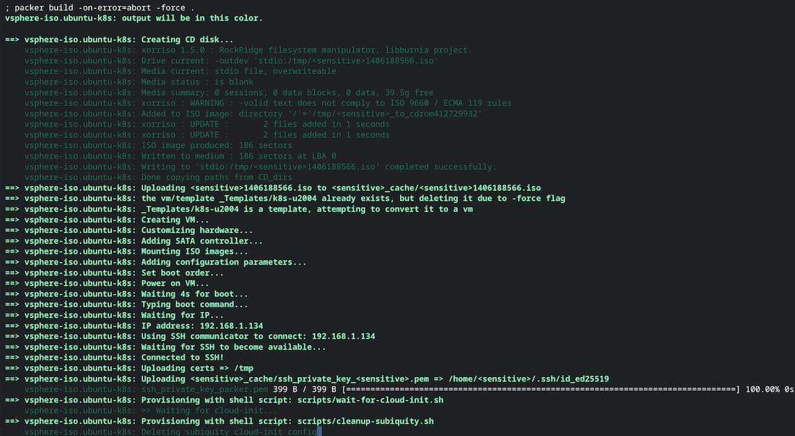
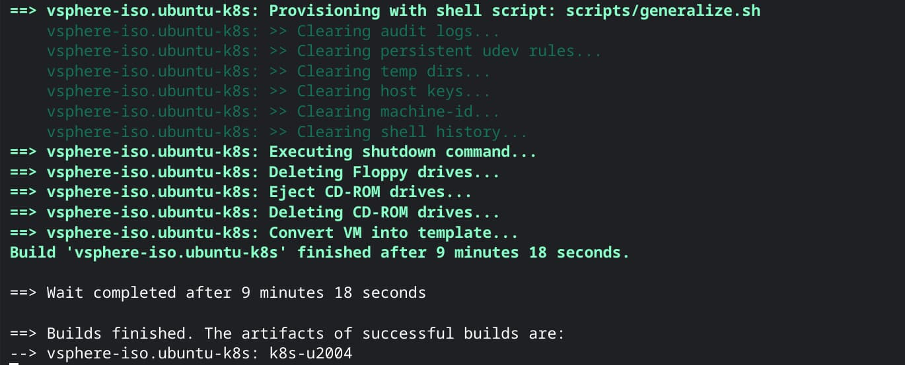

I've been leveraging the open-source Tanzu Community Edition Kubernetes distribution for a little while now, both [in my home lab](/tanzu-community-edition-k8s-homelab) and at work, so I was disappointed to learn that VMware was [abandoning the project](https://github.com/vmware-tanzu/community-edition). TCE had been a pretty good fit for my needs, and now I needed to search for a replacement. VMware is offering a free version of Tanzu Kubernetes Grid as a replacement, but it comes with a license solely for non-commercial use so I wouldn't be able to use it at work. And I'd really like to use the same solution in both environments to make development and testing easier on me.

There are a bunch of great projects for running Kubernetes in development/lab environments, and others optimized for much larger enterprise environments, but I struggled to find a product that felt like a good fit for both in the way TCE was. My workloads are few and pretty simple so most enterprise K8s variants (Tanzu included) would feel like overkill, but I do need to ensure everything remains highly-available in the data centers at work.

Plus, I thought it would be a fun learning experience to roll my own Kubernetes on vSphere!

In the next couple of posts, I'll share the details of how I'm using Terraform to provision production-ready vanilla Kubernetes clusters on vSphere (complete with the vSphere Container Storage Interface plugin!) in a consistent and repeatable way. I also plan to document one of the ways I'm leveraging these clusters, which is using them as a part of a Gitlab CI/CD pipeline to churn out weekly VM template builds so I never again have to worry about my templates being out of date.

I have definitely learned a ton in the process (and still have a lot more to learn), but today I'll start by describing how I'm leveraging Packer to create a single VM template ready to enter service as a Kubernetes compute node.

## What's Packer, and why?
[HashiCorp Packer](https://www.packer.io/) is a free open-source tool designed to create consistent, repeatable machine images. It's pretty killer as a part of a CI/CD pipeline to kick off new builds based on a schedule or code commits, but also works great for creating builds on-demand. Packer uses the [HashiCorp Configuration Language (HCL)](https://developer.hashicorp.com/packer/docs/templates/hcl_templates) to describe all of the properties of a VM build in a concise and readable format. 

You might ask why I would bother with using a powerful tool like Packer if I'm just going to be building a single template. Surely I could just do that by hand, right? And of course, you'd be right - but using an Infrastructure as Code tool even for one-off builds has some pretty big advantages. 

- **It's fast.** Packer is able to build a complete VM (including pulling in all available OS and software updates) in just a few minutes, much faster than I could click through an installer on my own.
- **It's consistent.** Packer will follow the exact same steps for every build, removing the small variations (and typos!) that would surely show up if I did the builds manually.
- **It's great for testing changes.** Since Packer builds are so fast and consistent, it makes it incredibly easy to test changes as I go. I can be confident that the *only* changes between two builds will be the changes I deliberately introduced. 
- **It's self-documenting.** The entire VM (and its guest OS) is described completely within the Packer HCL file(s), which I can review to remember which packages were installed, which user account(s) were created, what partition scheme was used, and anything else I might need to know.
- **It supports change tracking.** A Packer build is just a set of HCL files so it's easy to sync them with a version control system like Git to track (and revert) changes as needed.

Packer is also extremely versatile, and a broad set of [external plugins](https://developer.hashicorp.com/packer/plugins) expand its capabilities to support creating machines for basically any environment. For my needs, I'll be utilizing the [vsphere-iso](https://developer.hashicorp.com/packer/plugins/builders/vsphere/vsphere-iso) builder which uses the vSphere API to remotely build VMs directly on the hypervisors.

Sounds pretty cool, right? I'm not going to go too deep into "how to Packer" in this post, but HashiCorp does provide some [pretty good tutorials](https://developer.hashicorp.com/packer/tutorials) to help you get started.

## Prerequisites
### Install Packer
Before being able to *use* Packer, you have to install it. On Debian/Ubuntu Linux, this process consists of adding the HashiCorp GPG key and software repository, and then simply installing the package:
```shell
curl -fsSL https://apt.releases.hashicorp.com/gpg | sudo apt-key add -
sudo apt-add-repository "deb [arch=amd64] https://apt.releases.hashicorp.com $(lsb_release -cs) main"
sudo apt-get update && sudo apt-get install packer
```

You can learn how to install Packer on other systems by following [this tutorial from HashiCorp](https://developer.hashicorp.com/packer/tutorials/docker-get-started/get-started-install-cli).

### Configure privileges
Packer will need a user account with sufficient privileges in the vSphere environment to be able to create and manage a VM. I'd recommend using an account dedicated to automation tasks, and assigning it the required privileges listed in [the `vsphere-iso` documentation](https://developer.hashicorp.com/packer/plugins/builders/vsphere/vsphere-iso#required-vsphere-privileges).

### Gather installation media
My Kubernetes node template will use Ubuntu 20.04 LTS as the OS so I'll go ahead and download the [server installer ISO](https://releases.ubuntu.com/20.04.5/) and upload it to a vSphere datastore to make it available to Packer. 

## Template build
After the OS is installed and minimimally configured, I'll need to add in Kubernetes components like `containerd`, `kubectl`, `kubelet`, and `kubeadm`, and then apply a few additional tweaks to get it fully ready.

You can see the entirety of my Packer configuration [on GitHub](https://github.com/jbowdre/vsphere-k8s/tree/main/packer), but I'll talk through each file as we go along.

### File/folder layout
After quite a bit of experimentation, I've settled on a preferred way to organize my Packer build files. I've found that this structure makes the builds modular enough that it's easy to reuse components in other builds, but still consolidated enough to be easily manageable. This layout is, of course, largely subjective - it's just what works well *for me*:
```
.
├── certs
│   ├── ca.cer
├── data
│   ├── meta-data
│   └── user-data.pkrtpl.hcl
├── scripts
│   ├── cleanup-cloud-init.sh
│   ├── cleanup-subiquity.sh
│   ├── configure-sshd.sh
│   ├── disable-multipathd.sh
│   ├── disable-release-upgrade-motd.sh
│   ├── enable-vmware-customization.sh
│   ├── generalize.sh
│   ├── install-ca-certs.sh
│   ├── install-k8s.sh
│   ├── persist-cloud-init-net.sh
│   ├── update-packages.sh
│   ├── wait-for-cloud-init.sh
│   └── zero-disk.sh
├── ubuntu-k8s.auto.pkrvars.hcl
├── ubuntu-k8s.pkr.hcl
└── variables.pkr.hcl
```

- The `certs` folder holds the Base64-encoded PEM-formatted certificate of my [internal Certificate Authority](/ldaps-authentication-tanzu-community-edition/#prequisite) which will be automatically installed in the provisioned VM's trusted certificate store. 
- The `data` folder stores files for [generating the `cloud-init` configuration](#user-datapkrtplhcl) that will automate the OS installation and configuration.
- The `scripts` directory holds a [collection of scripts](#post_install_scripts) used for post-install configuration tasks. Sure, I could just use a single large script, but using a bunch of smaller ones helps keep things modular and easy to reuse elsewhere.
- `variables.pkr.hcl` declares [all of the variables](#variablespkrhcl) which will be used in the Packer build, and sets the default values for some of them.
- `ubuntu-k8s.auto.pkrvars.hcl` [assigns values](#ubuntu-k8sautopkrvarshcl) to those variables. This is where most of the user-facing options will be configured, such as usernames, passwords, and environment settings. 
- `ubuntu-k8s.pkr.hcl` is where the [build process](#ubuntu-k8spkrhcl) is actually described.

Let's quickly run through that build process, and then I'll back up and examine some other components in detail.

### `ubuntu-k8s.pkr.hcl`
#### `packer` block
The first block in the file tells Packer about the minimum version requirements for Packer as well as the external plugins used for the build:
```
//  BLOCK: packer
//  The Packer configuration.
packer {
  required_version = ">= 1.8.2"
  required_plugins {
    vsphere     = {
      version   = ">= 1.0.8"
      source    = "github.com/hashicorp/vsphere"
    }
    sshkey      = {
      version   = ">= 1.0.3"
      source    = "github.com/ivoronin/sshkey"
    }
  }
}
```
As I mentioned above, I'll be using the official [`vsphere` plugin](https://github.com/hashicorp/packer-plugin-vsphere) to handle the provisioning on my vSphere environment. I'll also make use of the [`sshkey` plugin](https://github.com/ivoronin/packer-plugin-sshkey) to dynamically generate SSH keys for the build process.

#### `data` block
This section would be used for loading information from various data sources, but I'm only using it for the `sshkey` plugin (as mentioned above). 
```text
// BLOCK: data
// Defines data sources.
data "sshkey" "install" {
  type = "ed25519"
  name = "packer_key"
}
```

This will generate an ECDSA keypair, and the public key will include the identifier `packer_key` to make it easier to manage later on. Using this plugin to generate keys means that I don't have to worry about storing a private key somewhere in the build directory.

#### `locals` block
Locals are a type of Packer variable which aren't explicitly declared in the `variables.pkr.hcl` file. They only exist within the context of a single build (hence the "local" name). Typical Packer variables are static and don't support string manipulation; locals, however, do support expressions that can be used to change their value on the fly. This makes them very useful when you need to combine variables into a single string or concatenate lists of SSH public keys (such as in the highlighted lines):
```text {hl_lines=[10,17]}
//  BLOCK: locals
//  Defines local variables.
locals {
  ssh_public_key        = data.sshkey.install.public_key
  ssh_private_key_file  = data.sshkey.install.private_key_path
  build_tool            = "HashiCorp Packer ${packer.version}"
  build_date            = formatdate("YYYY-MM-DD hh:mm ZZZ", timestamp())
  build_description     = "Kubernetes Ubuntu 20.04 Node template\nBuild date: ${local.build_date}\nBuild tool: ${local.build_tool}"
  iso_paths             = ["[${var.common_iso_datastore}] ${var.iso_path}/${var.iso_file}"]
  iso_checksum          = "${var.iso_checksum_type}:${var.iso_checksum_value}"
  data_source_content   = {
    "/meta-data"            = file("data/meta-data")
    "/user-data"            = templatefile("data/user-data.pkrtpl.hcl", {
      build_username        = var.build_username
      build_password        = bcrypt(var.build_password)
      ssh_keys              = concat([local.ssh_public_key], var.ssh_keys)
      vm_guest_os_language  = var.vm_guest_os_language
      vm_guest_os_keyboard  = var.vm_guest_os_keyboard
      vm_guest_os_timezone  = var.vm_guest_os_timezone
      vm_guest_os_hostname  = var.vm_name
      apt_mirror            = var.cloud_init_apt_mirror
      apt_packages          = var.cloud_init_apt_packages
    })
  }
}
```

This block also makes use of the built-in [`templatefile()` function](https://developer.hashicorp.com/packer/docs/templates/hcl_templates/functions/file/templatefile) to insert build-specific variables into the `user-data` file for [`cloud-init`](https://cloud-init.io/) (more on that in a bit).

#### `source` block
The `source` block tells the `vsphere-iso` builder how to connect to vSphere, what hardware specs to set on the VM, and what to do with the VM once the build has finished (convert it to template, export it to OVF, and so on). 

You'll notice that most of this is just mapping user-defined variables (with the `var.` prefix) to properties used by `vsphere-iso`:

```text
//  BLOCK: source
//  Defines the builder configuration blocks.
source "vsphere-iso" "ubuntu-k8s" {

  // vCenter Server Endpoint Settings and Credentials
  vcenter_server        = var.vsphere_endpoint
  username              = var.vsphere_username
  password              = var.vsphere_password
  insecure_connection   = var.vsphere_insecure_connection

  // vSphere Settings
  datacenter    = var.vsphere_datacenter
  cluster       = var.vsphere_cluster
  datastore     = var.vsphere_datastore
  folder        = var.vsphere_folder

  // Virtual Machine Settings
  vm_name                   = var.vm_name
  vm_version                = var.common_vm_version
  guest_os_type             = var.vm_guest_os_type
  firmware                  = var.vm_firmware
  CPUs                      = var.vm_cpu_count
  cpu_cores                 = var.vm_cpu_cores
  CPU_hot_plug              = var.vm_cpu_hot_add
  RAM                       = var.vm_mem_size
  RAM_hot_plug              = var.vm_mem_hot_add
  cdrom_type                = var.vm_cdrom_type
  remove_cdrom              = var.common_remove_cdrom
  disk_controller_type      = var.vm_disk_controller_type
  storage {
    disk_size               = var.vm_disk_size
    disk_thin_provisioned   = var.vm_disk_thin_provisioned
  }
  network_adapters {
    network                 = var.vsphere_network
    network_card            = var.vm_network_card
  }
  tools_upgrade_policy      = var.common_tools_upgrade_policy
  notes                     = local.build_description
  configuration_parameters  = {
    "devices.hotplug"       = "FALSE"
  }

  // Removable Media Settings
  iso_url                   = var.iso_url
  iso_paths                 = local.iso_paths
  iso_checksum              = local.iso_checksum
  cd_content                = local.data_source_content
  cd_label                  = var.cd_label

  // Boot and Provisioning Settings 
  boot_order        = var.vm_boot_order
  boot_wait         = var.vm_boot_wait
  boot_command      = var.vm_boot_command
  ip_wait_timeout   = var.common_ip_wait_timeout
  shutdown_command  = var.vm_shutdown_command
  shutdown_timeout  = var.common_shutdown_timeout

  // Communicator Settings and Credentials
  communicator              = "ssh"
  ssh_username              = var.build_username
  ssh_private_key_file      = local.ssh_private_key_file
  ssh_clear_authorized_keys = var.build_remove_keys
  ssh_port                  = var.communicator_port
  ssh_timeout               = var.communicator_timeout

  // Snapshot Settings
  create_snapshot   = var.common_snapshot_creation
  snapshot_name     = var.common_snapshot_name

  // Template and Content Library Settings
  convert_to_template   = var.common_template_conversion
  dynamic "content_library_destination" {
    for_each            = var.common_content_library_name != null ? [1] : []
    content {
      library           = var.common_content_library_name
      description       = local.build_description
      ovf               = var.common_content_library_ovf
      destroy           = var.common_content_library_destroy
      skip_import       = var.common_content_library_skip_export
    }
  }

  // OVF Export Settings
  dynamic "export" {
    for_each            = var.common_ovf_export_enabled == true ? [1] : []
    content {     
      name              = var.vm_name
      force             = var.common_ovf_export_overwrite
      options           = [
        "extraconfig"
      ]
      output_directory  = "${var.common_ovf_export_path}/${var.vm_name}"
    }
  }
}
```

#### `build` block
This block brings everything together and executes the build. It calls the `source.vsphere-iso.ubuntu-k8s` block defined above, and also ties in a `file` and a few `shell` provisioners. `file` provisioners are used to copy files (like SSL CA certificates) into the VM, while the `shell` provisioners run commands and execute scripts. Those will be handy for the post-deployment configuration tasks, like updating and installing packages.

```text
//  BLOCK: build
//  Defines the builders to run, provisioners, and post-processors.
build {
  sources = [
    "source.vsphere-iso.ubuntu-k8s"
  ]

  provisioner "file" {
    source      = "certs"
    destination = "/tmp"
  }

  provisioner "shell" {
    execute_command     = "export KUBEVERSION=${var.k8s_version}; bash {{ .Path }}"
    expect_disconnect   = true
    environment_vars    = [
      "KUBEVERSION=${var.k8s_version}"
    ]
    scripts             = var.post_install_scripts
  }

  provisioner "shell" {
    execute_command     = "bash {{ .Path }}"
    expect_disconnect   = true
    scripts             = var.pre_final_scripts
  }
} 
```

So you can see that the `ubuntu-k8s.pkr.hcl` file primarily focuses on the structure and form of the build, and it's written in such a way that it can be fairly easily adapted for building other types of VMs. Very few things in this file would have to be changed since so many of the properties are derived from the variables.

You can view the full file [here](https://github.com/jbowdre/vsphere-k8s/blob/main/packer/ubuntu-k8s.pkr.hcl).

### `variables.pkr.hcl`
Before looking at the build-specific variable definitions, let's take a quick look at the variables I've told Packer that I intend to use. After all, Packer requires that variables be declared before they can be used.

Most of these carry descriptions with them so I won't restate them outside of the code block here:

```text
/*
    DESCRIPTION:
    Ubuntu Server 20.04 LTS variables using the Packer Builder for VMware vSphere (vsphere-iso).
*/

//  BLOCK: variable
//  Defines the input variables.

// vSphere Credentials
variable "vsphere_endpoint" {
  type        = string
  description = "The fully qualified domain name or IP address of the vCenter Server instance. ('vcenter.lab.local')"
}

variable "vsphere_username" {
  type        = string
  description = "The username to login to the vCenter Server instance. ('packer')"
  sensitive   = true
}

variable "vsphere_password" {
  type        = string
  description = "The password for the login to the vCenter Server instance."
  sensitive   = true
}

variable "vsphere_insecure_connection" {
  type        = bool
  description = "Do not validate vCenter Server TLS certificate."
  default     = true
}

// vSphere Settings
variable "vsphere_datacenter" {
  type        = string
  description = "The name of the target vSphere datacenter. ('Lab Datacenter')"
}

variable "vsphere_cluster" {
  type        = string
  description = "The name of the target vSphere cluster. ('cluster-01')"
}

variable "vsphere_datastore" {
  type        = string
  description = "The name of the target vSphere datastore. ('datastore-01')"
}

variable "vsphere_network" {
  type        = string
  description = "The name of the target vSphere network. ('network-192.168.1.0')"
}

variable "vsphere_folder" {
  type        = string
  description = "The name of the target vSphere folder. ('_Templates')"
}

// Virtual Machine Settings
variable "vm_name" {
  type        = string
  description = "Name of the new VM to create."
}

variable "vm_guest_os_language" {
  type        = string
  description = "The guest operating system lanugage."
  default     = "en_US"
}

variable "vm_guest_os_keyboard" {
  type        = string
  description = "The guest operating system keyboard input."
  default     = "us"
}

variable "vm_guest_os_timezone" {
  type        = string
  description = "The guest operating system timezone."
  default     = "UTC"
}

variable "vm_guest_os_type" {
  type        = string
  description = "The guest operating system type. ('ubuntu64Guest')"
}

variable "vm_firmware" {
  type        = string
  description = "The virtual machine firmware. ('efi-secure'. 'efi', or 'bios')"
  default     = "efi-secure"
}

variable "vm_cdrom_type" {
  type        = string
  description = "The virtual machine CD-ROM type. ('sata', or 'ide')"
  default     = "sata"
}

variable "vm_cpu_count" {
  type        = number
  description = "The number of virtual CPUs. ('2')"
}

variable "vm_cpu_cores" {
  type        = number
  description = "The number of virtual CPUs cores per socket. ('1')"
}

variable "vm_cpu_hot_add" {
  type        = bool
  description = "Enable hot add CPU."
  default     = true
}

variable "vm_mem_size" {
  type        = number
  description = "The size for the virtual memory in MB. ('2048')"
}

variable "vm_mem_hot_add" {
  type        = bool
  description = "Enable hot add memory."
  default     = true
}

variable "vm_disk_size" {
  type        = number
  description = "The size for the virtual disk in MB. ('61440' = 60GB)"
  default     = 61440
}

variable "vm_disk_controller_type" {
  type        = list(string)
  description = "The virtual disk controller types in sequence. ('pvscsi')"
  default     = ["pvscsi"]
}

variable "vm_disk_thin_provisioned" {
  type        = bool
  description = "Thin provision the virtual disk."
  default     = true
}

variable "vm_disk_eagerly_scrub" {
  type        = bool
  description = "Enable VMDK eager scrubbing for VM."
  default     = false
}

variable "vm_network_card" {
  type        = string
  description = "The virtual network card type. ('vmxnet3' or 'e1000e')"
  default     = "vmxnet3"
}

variable "common_vm_version" {
  type        = number
  description = "The vSphere virtual hardware version. (e.g. '19')"
}

variable "common_tools_upgrade_policy" {
  type        = bool
  description = "Upgrade VMware Tools on reboot."
  default     = true
}

variable "common_remove_cdrom" {
  type        = bool
  description = "Remove the virtual CD-ROM(s)."
  default     = true
}

// Template and Content Library Settings
variable "common_template_conversion" {
  type        = bool
  description = "Convert the virtual machine to template. Must be 'false' for content library."
  default     = false
}

variable "common_content_library_name" {
  type        = string
  description = "The name of the target vSphere content library, if used. ('Lab-CL')"
  default     = null
}

variable "common_content_library_ovf" {
  type        = bool
  description = "Export to content library as an OVF template."
  default     = false
}

variable "common_content_library_destroy" {
  type        = bool
  description = "Delete the virtual machine after exporting to the content library."
  default     = true
}

variable "common_content_library_skip_export" {
  type        = bool
  description = "Skip exporting the virtual machine to the content library. Option allows for testing / debugging without saving the machine image."
  default     = false
}

// Snapshot Settings
variable "common_snapshot_creation" {
  type        = bool
  description = "Create a snapshot for Linked Clones."
  default     = false
}

variable "common_snapshot_name" {
  type        = string
  description = "Name of the snapshot to be created if create_snapshot is true."
  default     = "Created By Packer"
}

// OVF Export Settings
variable "common_ovf_export_enabled" {
  type        = bool
  description = "Enable OVF artifact export."
  default     = false
}

variable "common_ovf_export_overwrite" {
  type        = bool
  description = "Overwrite existing OVF artifact."
  default     = true
}

variable "common_ovf_export_path" {
  type        = string
  description = "Folder path for the OVF export."
}

// Removable Media Settings
variable "common_iso_datastore" {
  type        = string
  description = "The name of the source vSphere datastore for ISO images. ('datastore-iso-01')"
}

variable "iso_url" {
  type        = string
  description = "The URL source of the ISO image. ('https://releases.ubuntu.com/20.04.5/ubuntu-20.04.5-live-server-amd64.iso')"
}

variable "iso_path" {
  type        = string
  description = "The path on the source vSphere datastore for ISO image. ('ISOs/Linux')"
}

variable "iso_file" {
  type        = string
  description = "The file name of the ISO image used by the vendor. ('ubuntu-20.04.5-live-server-amd64.iso')"
}

variable "iso_checksum_type" {
  type        = string
  description = "The checksum algorithm used by the vendor. ('sha256')"
}

variable "iso_checksum_value" {
  type        = string
  description = "The checksum value provided by the vendor."
}

variable "cd_label" {
  type        = string
  description = "CD Label"
  default     = "cidata"
}

// Boot Settings
variable "vm_boot_order" {
  type        = string
  description = "The boot order for virtual machines devices. ('disk,cdrom')"
  default     = "disk,cdrom"
}

variable "vm_boot_wait" {
  type        = string
  description = "The time to wait before boot."
}

variable "vm_boot_command" {
  type        = list(string)
  description = "The virtual machine boot command."
  default     = []
}

variable "vm_shutdown_command" {
  type        = string
  description = "Command(s) for guest operating system shutdown."
  default     = null
}

variable "common_ip_wait_timeout" {
  type        = string
  description = "Time to wait for guest operating system IP address response."
}

variable "common_shutdown_timeout" {
  type        = string
  description = "Time to wait for guest operating system shutdown."
}

// Communicator Settings and Credentials
variable "build_username" {
  type        = string
  description = "The username to login to the guest operating system. ('admin')"
}

variable "build_password" {
  type        = string
  description = "The password to login to the guest operating system."
  sensitive   = true
}

variable "build_password_encrypted" {
  type        = string
  description = "The encrypted password to login the guest operating system."
  sensitive   = true
  default     = null
}

variable "ssh_keys" {
  type        = list(string)
  description = "List of public keys to be added to ~/.ssh/authorized_keys."
  sensitive   = true
  default     = []
}

variable "build_remove_keys" {
  type        = bool
  description = "If true, Packer will attempt to remove its temporary key from ~/.ssh/authorized_keys and /root/.ssh/authorized_keys"
  default     = true
}

// Communicator Settings
variable "communicator_port" {
  type        = string
  description = "The port for the communicator protocol."
}

variable "communicator_timeout" {
  type        = string
  description = "The timeout for the communicator protocol."
}

variable "communicator_insecure" {
  type        = bool
  description = "If true, do not check server certificate chain and host name"
  default     = true
}

variable "communicator_ssl" {
  type        = bool
  description = "If true, use SSL"
  default     = true
}

// Provisioner Settings
variable "cloud_init_apt_packages" {
  type        = list(string)
  description = "A list of apt packages to install during the subiquity cloud-init installer."
  default     = []
}

variable "cloud_init_apt_mirror" {
  type        = string
  description = "Sets the default apt mirror during the subiquity cloud-init installer."
  default     = ""
}

variable "post_install_scripts" {
  type        = list(string)
  description = "A list of scripts and their relative paths to transfer and run after OS install."
  default     = []
}

variable "pre_final_scripts" {
  type        = list(string)
  description = "A list of scripts and their relative paths to transfer and run before finalization."
  default     = []
}

// Kubernetes Settings
variable "k8s_version" {
  type        = string
  description = "Kubernetes version to be installed. Latest stable is listed at https://dl.k8s.io/release/stable.txt"
  default     = "1.25.3"
}
```

The full `variables.pkr.hcl` can be viewed [here](https://github.com/jbowdre/vsphere-k8s/blob/main/packer/variables.pkr.hcl).

### `ubuntu-k8s.auto.pkrvars.hcl`
Packer automatically knows to load variables defined in files ending in `*.auto.pkrvars.hcl`. Storing the variable values separately from the declarations in `variables.pkr.hcl` makes it easier to protect sensitive values. 

So I'll start by telling Packer what credentials to use for connecting to vSphere, and what vSphere resources to deploy to:
```text
/*
    DESCRIPTION:
    Ubuntu Server 20.04 LTS Kubernetes node variables used by the Packer Plugin for VMware vSphere (vsphere-iso).
*/

// vSphere Credentials
vsphere_endpoint            = "vcsa.lab.bowdre.net"
vsphere_username            = "packer"
vsphere_password            = "VMware1!"
vsphere_insecure_connection = true

// vSphere Settings
vsphere_datacenter = "NUC Site"
vsphere_cluster    = "nuc-cluster"
vsphere_datastore  = "nuchost-local"
vsphere_network    = "MGT-Home 192.168.1.0"
vsphere_folder     = "_Templates"
```

I'll then describe the properties of the VM itself:
```text
// Guest Operating System Settings
vm_guest_os_language = "en_US"
vm_guest_os_keyboard = "us"
vm_guest_os_timezone = "America/Chicago"
vm_guest_os_type = "ubuntu64Guest"

// Virtual Machine Hardware Settings
vm_name                   = "k8s-u2004"
vm_firmware               = "efi-secure"
vm_cdrom_type             = "sata"
vm_cpu_count              = 2
vm_cpu_cores              = 1
vm_cpu_hot_add            = true
vm_mem_size               = 2048
vm_mem_hot_add            = true
vm_disk_size              = 30720
vm_disk_controller_type   = ["pvscsi"]
vm_disk_thin_provisioned  = true
vm_network_card           = "vmxnet3"
common_vm_version           = 19
common_tools_upgrade_policy = true
common_remove_cdrom         = true
```

Then I'll configure Packer to convert the VM to a template once the build is finished:
```text
// Template and Content Library Settings
common_template_conversion         = true
common_content_library_name        = null
common_content_library_ovf         = false
common_content_library_destroy     = true
common_content_library_skip_export = true

// OVF Export Settings
common_ovf_export_enabled   = false
common_ovf_export_overwrite = true
common_ovf_export_path      = ""
```

Next, I'll tell it where to find the Ubuntu 20.04 ISO I downloaded and placed on a datastore, along with the SHA256 checksum to confirm its integrity:
```text
// Removable Media Settings
common_iso_datastore    = "nuchost-local"
iso_url                 = null
iso_path                = "_ISO"
iso_file                = "ubuntu-20.04.5-live-server-amd64.iso"
iso_checksum_type       = "sha256"
iso_checksum_value      = "5035be37a7e9abbdc09f0d257f3e33416c1a0fb322ba860d42d74aa75c3468d4"
```

And then I'll specify the VM's boot device order, as well as the boot command that will be used for loading the `cloud-init` coniguration into the Ubuntu installer:
```text
// Boot Settings
vm_boot_order       = "disk,cdrom"
vm_boot_wait        = "4s"
vm_boot_command = [
    "<esc><wait>",
    "linux /casper/vmlinuz --- autoinstall ds=\"nocloud\"",
    "<enter><wait>",
    "initrd /casper/initrd",
    "<enter><wait>",
    "boot",
    "<enter>"
  ]
```

Once the installer is booted and running, Packer will wait until the VM is available via SSH and then use these credentials to log in. (How will it be able to log in with those creds? We'll take a look at the `cloud-init` configuration in just a minute...)

```text
// Communicator Settings
communicator_port       = 22
communicator_timeout    = "20m"
common_ip_wait_timeout  = "20m"
common_shutdown_timeout = "15m"
vm_shutdown_command     = "sudo /usr/sbin/shutdown -P now"
build_remove_keys       = false
build_username          = "admin"
build_password          = "VMware1!"
ssh_keys                = [
  "ssh-ed25519 AAAAC3NzaC1lZDI1NTE5AAAAIOpLvpxilPjpCahAQxs4RQgv+Lb5xObULXtwEoimEBpA builder"
]
```

Finally, I'll create two lists of scripts that will be run on the VM once the OS install is complete. The `post_install_scripts` will be run immediately after the operating system installation. The `update-packages.sh` script will cause a reboot, and then the set of `pre_final_scripts` will do some cleanup and prepare the VM to be converted to a template. 

The last bit of this file also designates the desired version of Kubernetes to be installed.
```text
// Provisioner Settings
post_install_scripts = [
  "scripts/wait-for-cloud-init.sh",
  "scripts/cleanup-subiquity.sh",
  "scripts/install-ca-certs.sh",
  "scripts/disable-multipathd.sh",
  "scripts/disable-release-upgrade-motd.sh",
  "scripts/persist-cloud-init-net.sh",
  "scripts/configure-sshd.sh",
  "scripts/install-k8s.sh",
  "scripts/update-packages.sh"
]

pre_final_scripts = [
  "scripts/cleanup-cloud-init.sh",
  "scripts/enable-vmware-customization.sh",
  "scripts/zero-disk.sh",
  "scripts/generalize.sh"
]

// Kubernetes Settings
k8s_version = "1.25.3"
```

You can find an full example of this file [here](https://github.com/jbowdre/vsphere-k8s/blob/main/packer/ubuntu-k8s.example.pkrvars.hcl).

### `user-data.pkrtpl.hcl`
Okay, so we've covered the Packer framework that creates the VM; now let's take a quick look at the `cloud-init` configuration that will allow the OS installation to proceed unattended. 

See the bits that look `${ like_this }`? Those place-holders will take input from the [`locals` block of `ubuntu-k8s.pkr.hcl`](#locals-block) mentioned above. So that's how all the OS properties will get set, including the hostname, locale, LVM partition layout, username, password, and SSH keys.

```yaml
#cloud-config
autoinstall:
  version: 1
  early-commands:
    - sudo systemctl stop ssh
  locale: ${ vm_guest_os_language }
  keyboard:
    layout: ${ vm_guest_os_keyboard }
  network:
    network:
      version: 2
      ethernets:
        mainif:
          match:
            name: e*
          critical: true
          dhcp4: true
          dhcp-identifier: mac
  ssh:
    install-server: true
    allow-pw: true
%{ if length( apt_mirror ) > 0 ~}
  apt:
    primary:
      - arches: [default]
        uri: "${ apt_mirror }"
%{ endif ~}
%{ if length( apt_packages ) > 0 ~}
  packages:
%{ for package in apt_packages ~}
    - ${ package }
%{ endfor ~}
%{ endif ~}
  storage:
    config:
      - ptable: gpt
        path: /dev/sda
        wipe: superblock
        type: disk
        id: disk-sda
      - device: disk-sda
        size: 1024M
        wipe: superblock
        flag: boot
        number: 1
        grub_device: true
        type: partition
        id: partition-0
      - fstype: fat32
        volume: partition-0
        label: EFIFS
        type: format
        id: format-efi
      - device: disk-sda
        size: 1024M
        wipe: superblock
        number: 2
        type: partition
        id: partition-1
      - fstype: xfs
        volume: partition-1
        label: BOOTFS
        type: format
        id: format-boot
      - device: disk-sda
        size: -1
        wipe: superblock
        number: 3
        type: partition
        id: partition-2
      - name: sysvg
        devices:
          - partition-2
        type: lvm_volgroup
        id: lvm_volgroup-0
      - name: home
        volgroup: lvm_volgroup-0
        size: 4096M
        wipe: superblock
        type: lvm_partition
        id: lvm_partition-home
      - fstype: xfs
        volume: lvm_partition-home
        type: format
        label: HOMEFS
        id: format-home
      - name: tmp
        volgroup: lvm_volgroup-0
        size: 3072M
        wipe: superblock
        type: lvm_partition
        id: lvm_partition-tmp
      - fstype: xfs
        volume: lvm_partition-tmp
        type: format
        label: TMPFS
        id: format-tmp
      - name: var
        volgroup: lvm_volgroup-0
        size: 4096M
        wipe: superblock
        type: lvm_partition
        id: lvm_partition-var
      - fstype: xfs
        volume: lvm_partition-var
        type: format
        label: VARFS
        id: format-var
      - name: log
        volgroup: lvm_volgroup-0
        size: 4096M
        wipe: superblock
        type: lvm_partition
        id: lvm_partition-log
      - fstype: xfs
        volume: lvm_partition-log
        type: format
        label: LOGFS
        id: format-log
      - name: audit
        volgroup: lvm_volgroup-0
        size: 4096M
        wipe: superblock
        type: lvm_partition
        id: lvm_partition-audit
      - fstype: xfs
        volume: lvm_partition-audit
        type: format
        label: AUDITFS
        id: format-audit
      - name: root
        volgroup: lvm_volgroup-0
        size: -1
        wipe: superblock
        type: lvm_partition
        id: lvm_partition-root
      - fstype: xfs
        volume: lvm_partition-root
        type: format
        label: ROOTFS
        id: format-root
      - path: /
        device: format-root
        type: mount
        id: mount-root
      - path: /boot
        device: format-boot
        type: mount
        id: mount-boot
      - path: /boot/efi
        device: format-efi
        type: mount
        id: mount-efi
      - path: /home
        device: format-home
        type: mount
        id: mount-home
      - path: /tmp
        device: format-tmp
        type: mount
        id: mount-tmp
      - path: /var
        device: format-var
        type: mount
        id: mount-var
      - path: /var/log
        device: format-log
        type: mount
        id: mount-log
      - path: /var/log/audit
        device: format-audit
        type: mount
        id: mount-audit
  user-data:
    package_upgrade: true
    disable_root: true
    timezone: ${ vm_guest_os_timezone }
    hostname: ${ vm_guest_os_hostname }
    users:
      - name: ${ build_username }
        passwd: "${ build_password }"
        groups: [adm, cdrom, dip, plugdev, lxd, sudo]
        lock-passwd: false
        sudo: ALL=(ALL) NOPASSWD:ALL
        shell: /bin/bash
%{ if length( ssh_keys ) > 0 ~}
        ssh_authorized_keys:
%{ for ssh_key in ssh_keys ~}
          - ${ ssh_key }
%{ endfor ~}    
%{ endif ~}
```

View the full file [here](https://github.com/jbowdre/vsphere-k8s/blob/main/packer/data/user-data.pkrtpl.hcl). (The `meta-data` file is [empty](https://github.com/jbowdre/vsphere-k8s/blob/main/packer/data/meta-data), by the way.)


### `post_install_scripts`
After the OS install is completed, the `shell` provisioner will connect to the VM through SSH and run through some tasks. Remember how I keep talking about this build being modular? That goes down to the scripts, too, so I can use individual pieces in other builds without needing to do a lot of tweaking.

You can find all of the scripts [here](https://github.com/jbowdre/vsphere-k8s/tree/main/packer/scripts).

#### `wait-for-cloud-init.sh`
This simply holds up the process until the `/var/lib/cloud//instance/boot-finished` file has been created, signifying the completion of the `cloud-init` process:
```shell
#!/bin/bash -eu
echo '>> Waiting for cloud-init...'
while [ ! -f /var/lib/cloud/instance/boot-finished ]; do 
  sleep 1
done
```

#### `cleanup-subiquity.sh`
Next I clean up any network configs that may have been created during the install process:
```shell
#!/bin/bash -eu
if [ -f /etc/cloud/cloud.cfg.d/99-installer.cfg ]; then 
  sudo rm /etc/cloud/cloud.cfg.d/99-installer.cfg
  echo 'Deleting subiquity cloud-init config'
fi

if [ -f /etc/cloud/cloud.cfg.d/subiquity-disable-cloudinit-networking.cfg ]; then 
  sudo rm /etc/cloud/cloud.cfg.d/subiquity-disable-cloudinit-networking.cfg
  echo 'Deleting subiquity cloud-init network config'
fi
```

#### `install-ca-certs.sh`
The [`file` provisioner](#build-block) mentioned above helpfully copied my custom CA certs to the `/tmp/certs/` folder on the VM; this script will install them into the certificate store:
```shell
#!/bin/bash -eu
echo '>> Installing custom certificates...'
sudo cp /tmp/certs/* /usr/local/share/ca-certificates/
cd /usr/local/share/ca-certificates/
for file in *.cer; do
  sudo mv -- "$file" "${file%.cer}.crt"
done
sudo /usr/sbin/update-ca-certificates
```

#### `disable-multipathd.sh`
This disables `multipathd`:
```shell
#!/bin/bash -eu
sudo systemctl disable multipathd
echo 'Disabling multipathd'
```

#### `disable-release-upgrade-motd.sh`
And this one disable the release upgrade notices that would otherwise be displayed upon each login:
```shell
#!/bin/bash -eu
echo '>> Disabling release update MOTD...'
sudo chmod -x /etc/update-motd.d/91-release-upgrade
```

#### `persist-cloud-init-net.sh`
I want to make sure that this VM keeps the same IP address following the reboot that will come in a few minutes, so I 'll set a quick `cloud-init` option to help make sure that happens:
```shell
#!/bin/sh -eu
echo '>> Preserving network settings...'
echo 'manual_cache_clean: True' | sudo tee -a /etc/cloud/cloud.cfg
```

#### `configure-sshd.sh`
Then I just set a few options for the `sshd` configuration, like disabling root login:

```shell
#!/bin/bash -eu
echo '>> Configuring SSH'
sudo sed -i 's/.*PermitRootLogin.*/PermitRootLogin no/' /etc/ssh/sshd_config
sudo sed -i 's/.*PubkeyAuthentication.*/PubkeyAuthentication yes/' /etc/ssh/sshd_config
sudo sed -i 's/.*PasswordAuthentication.*/PasswordAuthentication yes/' /etc/ssh/sshd_config
```

#### `install-k8s.sh`
This script is a little longer and takes care of all the Kubernetes-specific settings and packages that will need to be installed on the VM.

First I enable the required `overlay` and `br_netfilter` modules:
```shell
#!/bin/bash -eu
echo ">> Installing Kubernetes components..."

# Configure and enable kernel modules
echo ".. configure kernel modules"
cat << EOF | sudo tee /etc/modules-load.d/containerd.conf
overlay
br_netfilter
EOF

sudo modprobe overlay
sudo modprobe br_netfilter
```

Then I'll make some networking tweaks to enable forwarding and bridging:
```shell
# Configure networking
echo ".. configure networking"
cat << EOF | sudo tee /etc/sysctl.d/99-kubernetes-cri.conf
net.bridge.bridge-nf-call-iptables = 1
net.ipv4.ip_forward = 1
net.bridge.bridge-nf-call-ip6tables = 1
EOF

sudo sysctl --system
```

Next, set up `containerd` as the container runtime:
```shell
# Setup containerd
echo ".. setup containerd"
sudo apt-get update && sudo apt-get install -y containerd apt-transport-https jq
sudo mkdir -p /etc/containerd
sudo containerd config default | sudo tee /etc/containerd/config.toml
sudo systemctl restart containerd
```

Then disable swap:
```shell
# Disable swap
echo ".. disable swap"
sudo sed -i '/[[:space:]]swap[[:space:]]/ s/^\(.*\)$/#\1/g' /etc/fstab
sudo swapoff -a
```

Next I'll install the Kubernetes components and (crucially) `apt-mark hold` them so they won't be automatically upgraded without it being a coordinated change:
```shell
# Install Kubernetes
echo ".. install kubernetes version ${KUBEVERSION}"
sudo curl -fsSLo /usr/share/keyrings/kubernetes-archive-keyring.gpg https://packages.cloud.google.com/apt/doc/apt-key.gpg
echo "deb [signed-by=/usr/share/keyrings/kubernetes-archive-keyring.gpg] https://apt.kubernetes.io/ kubernetes-xenial main" | sudo tee /etc/apt/sources.list.d/kubernetes.list
sudo apt-get update && sudo apt-get install -y kubelet="${KUBEVERSION}"-00 kubeadm="${KUBEVERSION}"-00 kubectl="${KUBEVERSION}"-00
sudo apt-mark hold kubelet kubeadm kubectl
```

#### `update-packages.sh`
Lastly, I'll be sure to update all installed packages (excepting the Kubernetes ones, of course), and then perform a reboot to make sure that any new kernel modules get loaded:
```shell
#!/bin/bash -eu
echo '>> Checking for and installing updates...'
sudo apt-get update && sudo apt-get -y upgrade
echo '>> Rebooting!'
sudo reboot
```

### `pre_final_scripts`
After the reboot, all that's left are some cleanup tasks to get the VM ready to be converted to a template and subsequently cloned and customized.

#### `cleanup-cloud-init.sh`
I'll start with cleaning up the `cloud-init` state:
```shell
#!/bin/bash -eu
echo '>> Cleaning up cloud-init state...'
sudo cloud-init clean -l
```

#### `enable-vmware-customization.sh`
And then be (re)enable the ability for VMware to be able to customize the guest successfully:
```shell
#!/bin/bash -eu
echo '>> Enabling legacy VMware Guest Customization...'
echo 'disable_vmware_customization: true' | sudo tee -a /etc/cloud/cloud.cfg
sudo vmware-toolbox-cmd config set deployPkg enable-custom-scripts true
```

#### `zero-disk.sh`
I'll also execute this handy script to free up unused space on the virtual disk. It works by creating a file which completely fills up the disk, and then deleting that file:
```shell
#!/bin/bash -eu
echo '>> Zeroing free space to reduce disk size'
sudo sh -c 'dd if=/dev/zero of=/EMPTY bs=1M || true; sync; sleep 1; sync'
sudo sh -c 'rm -f /EMPTY; sync; sleep 1; sync'
```

#### `generalize.sh`
Lastly, let's do a final run of cleaning up logs, temporary files, and unique identifiers that don't need to exist in a template. This script will also remove the SSH key with the `packer_key` identifier since that won't be needed anymore.
```shell
#!/bin/bash -eu
# Prepare a VM to become a template.

echo '>> Clearing audit logs...'
sudo sh -c 'if [ -f /var/log/audit/audit.log ]; then 
  cat /dev/null > /var/log/audit/audit.log 
  fi'
sudo sh -c 'if [ -f /var/log/wtmp ]; then 
  cat /dev/null > /var/log/wtmp
  fi'
sudo sh -c 'if [ -f /var/log/lastlog ]; then
  cat /dev/null > /var/log/lastlog
  fi'
sudo sh -c 'if [ -f /etc/logrotate.conf ]; then
  logrotate -f /etc/logrotate.conf 2>/dev/null
  fi'
sudo rm -rf /var/log/journal/*
sudo rm -f /var/lib/dhcp/*
sudo find /var/log -type f -delete

echo '>> Clearing persistent udev rules...'
sudo sh -c 'if [ -f /etc/udev/rules.d/70-persistent-net.rules ]; then
  rm /etc/udev/rules.d/70-persistent-net.rules
  fi'

echo '>> Clearing temp dirs...'
sudo rm -rf /tmp/*
sudo rm -rf /var/tmp/*

echo '>> Clearing host keys...'
sudo rm -f /etc/ssh/ssh_host_*

echo '>> Removing Packer SSH key...'
sed -i '/packer_key/d' ~/.ssh/authorized_keys

echo '>> Clearing machine-id...'
sudo truncate -s 0 /etc/machine-id
if [ -f /var/lib/dbus/machine-id ]; then
  sudo rm -f /var/lib/dbus/machine-id
  sudo ln -s /etc/machine-id /var/lib/dbus/machine-id
fi

echo '>> Clearing shell history...'
unset HISTFILE
history -cw
echo > ~/.bash_history
sudo rm -f /root/.bash_history
```

### Kick out the jams (or at least the build)
Now that all the ducks are nicely lined up, let's give them some marching orders and see what happens. All I have to do is open a terminal session to the folder containing the `.pkr.hcl` files, and then run the Packer build command:

```shell
packer packer build -on-error=abort -force .
```

{}
The `-on-error=abort` option makes sure that the build will abort if any steps in the build fail, and `-force` tells Packer to delete any existing VMs/templates with the same name as the one I'm attempting to build.
{}

And off we go! Packer will output details as it goes which makes it easy to troubleshoot if anything goes wrong.


In this case, though, everything works just fine, and I'm met with a happy "success" message!


And I can pop over to vSphere to confirm that everything looks right:


## Next steps
My brand new `k8s-u2004` template is ready for use! In the next post, I'll walk through the process of *manually* cloning this template to create my Kubernetes nodes, initializing the cluster, and installing the vSphere integrations. After that process is sorted out nicely, we'll take a look at how to use Terraform to do it all automagically. Stay tuned!