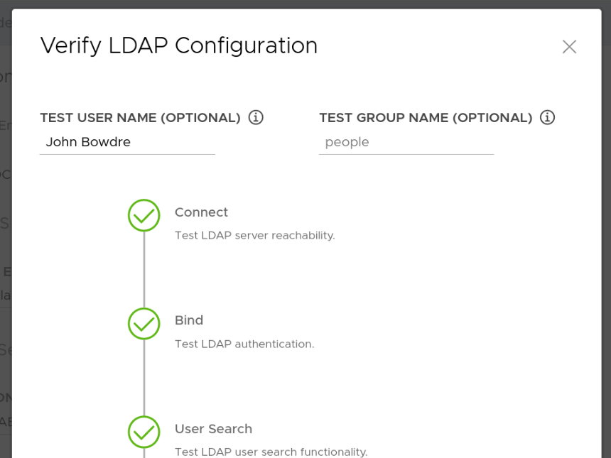

Not long ago, I [deployed a Tanzu Community Edition Kubernetes cluster in my homelab](/tanzu-community-edition-k8s-homelab/), and then I fumbled through figuring out how to [log into it from a different device](/logging-in-tce-cluster-from-new-device/) than the one I'd used for deploying the cluster from the `tanzu` cli. That setup works great for playing with Kubernetes in my homelab but I'd love to do some Kubernetes with my team at work and I really need the ability to authenticate multiple users with domain credentials for that.

The TCE team has created a [rather detailed guide](https://tanzucommunityedition.io/docs/latest/vsphere-ldap-config/) for using the [Pinniped](https://pinniped.dev/) and [Dex](https://dexidp.io/docs/kubernetes/) packages[^packages] to provide LDAPS authentication when TCE is connected with the NSX Advanced Load Balancer. This guide got me *most* of the way toward a working solution but I had to make some tweaks along the way (particularly since I'm not using NSX-ALB). I took notes as I worked through it, though, so here I'll share what it actually took to make this work in my environment.

[^packages]: Per VMware, "Pinniped provides the authentication service, which uses Dex to connect to identity providers such as Active Directory."
### Prequisite
In order to put the "Secure" in LDAPS, I need to make sure my Active Directory domain controller is configured for that, and that means also creating a Certificate Authority for issuing certificates. I followed the steps [here](http://vcloud-lab.com/entries/windows-2016-server-r2/configuring-secure-ldaps-on-domain-controller) to get this set up in my homelab. I can then point my browser to `http://win01.lab.bowdre.net/certsrv/certcarc.asp` to download the base64-encoded CA certificate since I'll need that later.


With that sorted, I'm ready to move on to creating a new TCE cluster with an LDAPS identity provider configured.
### Cluster creation
The [cluster deployment steps](/tanzu-community-edition-k8s-homelab/#management-cluster) are very similar to what I did last time so I won't repeat all those instructions here. The only difference is that this time I don't skip past the Identity Management screen; instead, I'll select the LDAPS radio button and get ready to fill out the form.

#### Identity management configuration


**LDAPS Identity Management Source**
| Field | Value | Notes |
| ---   | ---   | ----  |
| LDAPS Endpoint | `win01.lab.bowdre.net:636` | LDAPS interface of my AD DC |
| BIND DN | `CN=LDAP Bind,OU=Users,OU=BOW,OU=LAB,DC=lab,DC=bowdre,DC=net` | DN of an account with LDAP read permissions |
| BIND Password | `*******` | Password for that account |

**User Search Attributes**
| Field | Value | Notes |
| ---   | ---   | ---   |
| Base DN | `OU=LAB,DC=lab,DC=bowdre,DC=net` | DN for the top-level OU containing my users |
| Filter | `objectClass=(person)` | |
| Username | `sAMAccountName` | I want to auth as `john` rather than `john@lab.bowdre.net` (`userPrincipalName`) |

**Group Search Attributes**
| Field | Value | Notes |
| ---   | ---   | ---   |
| Base DN | `OU=LAB,DC=lab,DC=bowdre,DC=net` | DN for OU containing my users |
| Filter | `(objectClass=group)` | |
| Name Attribute | `cn` | Common Name |
| User Attribute | `DN` | Distinguished Name (capitalization matters!) | 
| Group Attribute | `member:1.2.840.113556.1.4.1941:` | Used to enumerate which groups a user is a member of[^member] |

And I'll copy the contents of the base64-encoded CA certificate I downloaded earlier and paste them into the Root CA Certificate field.


Before moving on, I can use the **Verify LDAP Configuration** button to quickly confirm that the connection is set up correctly. (I discovered that it doesn't honor the attribute selections made on the previous screen so I have to search for my Common Name (`John Bowdre`) instead of my username (`john`), but this at least lets me verify that the connection and certificate are working correctly.)


I can then click through the rest of the wizard but (as before) I'll stop on the final review page. Despite entering everything correctly in the wizard I'll actually need to make a small edit to the deployment configuration YAML so I make a note of its location and copy it to a file called `tce-mgmt-deploy.yaml` in my working directory so that I can take a look.


#### Editing the cluster spec
Remember that awkward `member:1.2.840.113556.1.4.1941:` attribute from earlier? Here's how it looks within the TCE cluster-defining YAML:
```yaml
LDAP_GROUP_SEARCH_BASE_DN: OU=LAB,DC=lab,DC=bowdre,DC=net
LDAP_GROUP_SEARCH_FILTER: (objectClass=group)
LDAP_GROUP_SEARCH_GROUP_ATTRIBUTE: 'member:1.2.840.113556.1.4.1941:'
LDAP_GROUP_SEARCH_NAME_ATTRIBUTE: cn
LDAP_GROUP_SEARCH_USER_ATTRIBUTE: DN
```

That `:` at the end of the line will cause problems down the road - specifically when the deployment process creates the `dex` app which handles the actual LDAPS authentication piece. Cumulative hours of [troubleshooting](#troubleshooting-notes) (and learning!) eventually revealed to me that something along the way had choked on that trailing colon and inserted this into the `dex` configuration:
```yaml
userMatchers:
- userAttr: DN
  groupAttr: 
    member:1.2.840.113556.1.4.1941: null
```

It *should* look like this instead:
```yaml
userMatchers:
- userAttr: DN
  groupAttr: 'member:1.2.840.113556.1.4.1941:'
```

That error prevents `dex` from starting correctly so the authentication would never work. I eventually figured out that using the `|` character to define the attribute as a [literal scalar](https://yaml.org/spec/1.2.2/#812-literal-style) would help to get around this issue so I changed the cluster YAML to look like this:
```yaml
LDAP_GROUP_SEARCH_BASE_DN: OU=LAB,DC=lab,DC=bowdre,DC=net
LDAP_GROUP_SEARCH_FILTER: (objectClass=group)
LDAP_GROUP_SEARCH_GROUP_ATTRIBUTE: |
  'member:1.2.840.113556.1.4.1941:'
LDAP_GROUP_SEARCH_NAME_ATTRIBUTE: cn
LDAP_GROUP_SEARCH_USER_ATTRIBUTE: DN
```

[^member]: Setting this to just `member` would work, but it wouldn't return any nested group memberships. I struggled with this for a long while until I came across a [post from Brian Ragazzi](https://brianragazzi.wordpress.com/2020/05/12/configure-tanzu-kubernetes-grid-to-use-active-directory/) which mentioned using `member:1.2.840.113556.1.4.1941:` instead. This leverages a special [LDAP matching rule OID](https://docs.microsoft.com/en-us/windows/win32/adsi/search-filter-syntax) to expand the nested groups.

#### Deploying the cluster
That's the only thing I need to manually edit so now I can go ahead and create the cluster with:
```
tanzu management-cluster create tce-mgmt -f tce-mgmt-deploy.yaml
```

This will probably take 10-15 minutes to deploy so it's a great time to go top off my coffee.


And we're back - and with a friendly success message in the console:
```
You can now access the management cluster tce-mgmt by running 'kubectl config use-context tce-mgmt-admin@tce-mgmt'
Management cluster created!

You can now create your first workload cluster by running the following:
  tanzu cluster create [name] -f [file]

Some addons might be getting installed! Check their status by running the following:

  kubectl get apps -A
```

I obediently follow the instructions to switch to the correct context and verify that the addons are all running:
```bash
❯ kubectl config use-context tce-mgmt-admin@tce-mgmt
Switched to context "tce-mgmt-admin@tce-mgmt".

❯ kubectl get apps -A
NAMESPACE    NAME                   DESCRIPTION           SINCE-DEPLOY   AGE
tkg-system   antrea                 Reconcile succeeded   5m2s           11m
tkg-system   metrics-server         Reconcile succeeded   39s            11m
tkg-system   pinniped               Reconcile succeeded   4m55s          11m
tkg-system   secretgen-controller   Reconcile succeeded   65s            11m
tkg-system   tanzu-addons-manager   Reconcile succeeded   70s            11m
tkg-system   vsphere-cpi            Reconcile succeeded   32s            11m
tkg-system   vsphere-csi            Reconcile succeeded   66s            11m
```

### Post-deployment tasks

I've got a TCE cluster now but it's not quite ready for me to authenticate with my AD credentials just yet. 

#### Load Balancer deployment
The [guide I'm following from the TCE site](https://tanzucommunityedition.io/docs/latest/vsphere-ldap-config/) assumes that I'm using NSX-ALB in my environment, but I'm not. So, [as before](/tanzu-community-edition-k8s-homelab/#deploying-kube-vip-as-a-load-balancer), I'll need to deploy [Scott Rosenberg's `kube-vip` Carvel package](https://github.com/vrabbi/tkgm-customizations):

```bash
git clone https://github.com/vrabbi/tkgm-customizations.git
cd tkgm-customizations/carvel-packages/kube-vip-package
kubectl apply -n tanzu-package-repo-global -f metadata.yml
kubectl apply -n tanzu-package-repo-global -f package.yaml
cat << EOF > values.yaml
vip_range: 192.168.1.64-192.168.1.70
EOF
tanzu package install kubevip -p kubevip.terasky.com -v 0.3.9 -f values.yaml
```

#### Modifying services to use the Load Balancer
With the load balancer in place, I can follow the TCE instruction to modify the Pinniped and Dex services to switch from the `NodePort` type to the `LoadBalancer` type so they can be easily accessed from outside of the cluster. This process starts by creating a file called `pinniped-supervisor-svc-overlay.yaml` and pasting in the following overlay manifest:

```yaml
#@ load("@ytt:overlay", "overlay")
#@overlay/match by=overlay.subset({"kind": "Service", "metadata": {"name": "pinniped-supervisor", "namespace": "pinniped-supervisor"}})
---
#@overlay/replace
spec:
  type: LoadBalancer
  selector:
    app: pinniped-supervisor
  ports:
    - name: https
      protocol: TCP
      port: 443
      targetPort: 8443

#@ load("@ytt:overlay", "overlay")
#@overlay/match by=overlay.subset({"kind": "Service", "metadata": {"name": "dexsvc", "namespace": "tanzu-system-auth"}}), missing_ok=True
---
#@overlay/replace
spec:
  type: LoadBalancer
  selector:
    app: dex
  ports:
    - name: dex
      protocol: TCP
      port: 443
      targetPort: https
```

This overlay will need to be inserted into the `pinniped-addon` secret which means that the contents need to be converted to a base64-encoded string:
```bash
❯ base64 -w 0 pinniped-supervisor-svc-overlay.yaml
I0AgbG9hZCgi[...]==
```
{}
The `-w 0` / `--wrap=0` argument tells `base64` to *not* wrap the encoded lines after a certain number of characters. If you leave this off, the string will get a newline inserted every 76 characters, and those linebreaks would make the string a bit more tricky to work with. Avoid having to clean up the output afterwards by being more specific with the request up front!
{}

I'll copy the resulting base64 string (which is much longer than the truncated form I'm using here), and paste it into the following command to patch the secret (which will be named after the management cluster name so replace the `tce-mgmt` part as appropriate):
```bash
❯ kubectl -n tkg-system patch secret tce-mgmt-pinniped-addon -p '{"data": {"overlays.yaml": "I0AgbG9hZCgi[...]=="}}'
secret/tce-mgmt-pinniped-addon patched
```

I can watch as the `pinniped-supervisor` and `dexsvc` services get updated with the new service type:
```bash
❯ kubectl get svc -A -w
NAMESPACE               NAME                    TYPE            CLUSTER-IP       EXTERNAL-IP    PORT(S)           
pinniped-supervisor     pinniped-supervisor     NodePort        100.65.185.82    <none>         443:31234/TCP     
tanzu-system-auth       dexsvc                  NodePort        100.70.238.106   <none>         5556:30167/TCP    
tkg-system              packaging-api           ClusterIP       100.65.185.94    <none>         443/TCP           
tanzu-system-auth       dexsvc                  LoadBalancer    100.70.238.106   <pending>      443:30167/TCP     
pinniped-supervisor     pinniped-supervisor     LoadBalancer    100.65.185.82    <pending>      443:31234/TCP     
pinniped-supervisor     pinniped-supervisor     LoadBalancer    100.65.185.82    192.168.1.70   443:31234/TCP     
tanzu-system-auth       dexsvc                  LoadBalancer    100.70.238.106   192.168.1.64   443:30167/TCP     
```

I'll also need to restart the `pinniped-post-deploy-job` job to account for the changes I just made; that's accomplished by simply deleting the existing job. After a few minutes a new job will be spawned automagically. I'll just watch for the new job to be created:
```bash
❯ kubectl -n pinniped-supervisor delete jobs pinniped-post-deploy-job
job.batch "pinniped-post-deploy-job" deleted

❯ kubectl get jobs -A -w
NAMESPACE             NAME                       COMPLETIONS   DURATION   AGE
pinniped-supervisor   pinniped-post-deploy-job   0/1                      0s
pinniped-supervisor   pinniped-post-deploy-job   0/1                      0s
pinniped-supervisor   pinniped-post-deploy-job   0/1           0s         0s
pinniped-supervisor   pinniped-post-deploy-job   1/1           9s         9s
```

### Authenticating
Right now, I've got all the necessary components to support LDAPS authentication with my TCE management cluster but I haven't done anything yet to actually define who should have what level of access. To do that, I'll create a `ClusterRoleBinding`.

I'll toss this into a file I'll call `tanzu-admins-crb.yaml`:
```yaml
kind: ClusterRoleBinding
apiVersion: rbac.authorization.k8s.io/v1
metadata:
  name: tanzu-admins
subjects:
  - kind: Group
    name: Tanzu-Admins
    apiGroup:
roleRef:
  kind: ClusterRole
  name: cluster-admin
  apiGroup: rbac.authorization.k8s.io
```

I have a group in Active Directory called `Tanzu-Admins` which contains a group called `vRA-Admins`, and that group contains my user account (`john`). It's a roundabout way of granting access for a single user in this case but it should help to confirm that nested group memberships are being enumerated properly. 

Once applied, users within that group will be granted the `cluster-admin` role[^roles].

Let's do it:
```bash
❯ kubectl apply -f tanzu-admins-crb.yaml
clusterrolebinding.rbac.authorization.k8s.io/tanzu-admins created
```

Thus far, I've been using the default administrator context to interact with the cluster. Now it's time to switch to the non-admin context:
```bash
❯ tanzu management-cluster kubeconfig get
You can now access the cluster by running 'kubectl config use-context tanzu-cli-tce-mgmt@tce-mgmt'

❯ kubectl config use-context tanzu-cli-tce-mgmt@tce-mgmt
Switched to context "tanzu-cli-tce-mgmt@tce-mgmt".
```

After assuming the non-admin context, the next time I try to interact with the cluster it should kick off the LDAPS authentication process. It won't look like anything is happening in the terminal:
```bash
❯ kubectl get nodes

```

But it will shortly spawn a browser page prompting me to log in:


Doing so successfully will yield:


And the `kubectl` command will return the expected details:
```bash
❯ kubectl get nodes
NAME                            STATUS   ROLES                  AGE   VERSION
tce-mgmt-control-plane-v8l8r    Ready    control-plane,master   29h   v1.21.5+vmware.1
tce-mgmt-md-0-847db9ddc-5bwjs   Ready    <none>                 28h   v1.21.5+vmware.1
```


So I've now successfully logged in to the management cluster as a non-admin user with my Active Directory credentials. Excellent!

[^roles]: You can read up on some other default user-facing roles [here](https://kubernetes.io/docs/reference/access-authn-authz/rbac/#user-facing-roles). 

### Sharing access
To allow other users to log in this way, I'd need to give them a copy of the non-admin `kubeconfig`, which I can get by running `tanzu management-cluster config get --export-file tce-mgmt-config` to export it into a file named `tce-mgmt-config`. They could use [whatever method they like](https://kubernetes.io/docs/concepts/configuration/organize-cluster-access-kubeconfig/) to merge this in with their existing `kubeconfig`.

{}
Other users hoping to work with a Tanzu Community Edition cluster will also need to install the Tanzu CLI tool in order to authenticate in this way. Installation instructions can be found [here](https://tanzucommunityedition.io/docs/latest/cli-installation/).
{}

### Deploying a workload cluster
At this point, I've only configured authentication for the management cluster - not the workload cluster. The TCE community docs cover what's needed to make this configuration available in the workload cluster as well [here](https://tanzucommunityedition.io/docs/latest/vsphere-ldap-config/#configuration-steps-on-the-workload-cluster). [As before](/tanzu-community-edition-k8s-homelab/#workload-cluster), I created the deployment YAML for the workload cluster by copying the management cluster's deployment YAML and changing the `CLUSTER_NAME` and `VSPHERE_CONTROL_PLANE_ENDPOINT` values accordingly. This time I also deleted all of the `LDAP_*` and `OIDC_*` lines, but made sure to preserve the `IDENTITY_MANAGEMENT_TYPE: ldap` one. 

I was then able to deploy the workload cluster with:
```bash
❯ tanzu cluster create --file tce-work-deploy.yaml
Validating configuration...
Creating workload cluster 'tce-work'...
Waiting for cluster to be initialized...
cluster control plane is still being initialized: WaitingForControlPlane
cluster control plane is still being initialized: ScalingUp
Waiting for cluster nodes to be available...
Waiting for addons installation...
Waiting for packages to be up and running...

Workload cluster 'tce-work' created
```

Access the admin context:
```bash
❯ tanzu cluster kubeconfig get --admin tce-work
Credentials of cluster 'tce-work' have been saved
You can now access the cluster by running 'kubectl config use-context tce-work-admin@tce-work'

❯ kubectl config use-context tce-work-admin@tce-work
Switched to context "tce-work-admin@tce-work".
```

Apply the same ClusterRoleBinding from before[^crb]:
```bash
❯ kubectl apply -f tanzu-admins-crb.yaml
clusterrolebinding.rbac.authorization.k8s.io/tanzu-admins created
```

And finally switch to the non-admin context and log in with my AD account:
```bash
❯ tanzu cluster kubeconfig get tce-work
ℹ  You can now access the cluster by running 'kubectl config use-context tanzu-cli-tce-work@tce-work'

❯ kubectl config use-context tanzu-cli-tce-work@tce-work
Switched to context "tanzu-cli-tce-work@tce-work".

❯ kubectl get nodes
NAME                            STATUS   ROLES                  AGE   VERSION
tce-work-control-plane-zts6r    Ready    control-plane,master   12m   v1.21.5+vmware.1
tce-work-md-0-bcfdc4d79-vn9xb   Ready    <none>                 11m   v1.21.5+vmware.1
```

Now I can *Do Work*!


{}
VMware [points out](https://tanzucommunityedition.io/docs/latest/verify-deployment/#configure-dhcp-reservations-for-the-control-plane-nodes-vsphere-only) that it's important to create DHCP reservations for the IP addresses which were dynamically assigned to the control plane nodes in both the management and workload clusters so be sure to take care of that before getting too involved in "Work".
{}

[^crb]: Or a different one. In reality, you probably don't want the same users having the same levels of access on both the management and workload clusters. But I stuck with just the one here for now.
### Troubleshooting notes
It took me quite a bit of trial and error to get this far and (being a k8s novice) even more time figuring out how to even troubleshoot the problems I was encountering. So here are a few tips that helped me out.

#### Checking and modifying `dex` configuration
I  had a lot of trouble figuring out how to correctly format the `member:1.2.840.113556.1.4.1941:` attribute in the LDAPS config so that it wouldn't get split into multiple attributes due to the trailing colon - and it took me forever to discover that was even the issue. What eventually did the trick for me was learning that I could look at (and modify!) the configuration for the `dex` app with:

```bash
❯ kubectl -n tanzu-system-auth edit configmaps dex
[...]
            groupSearch:
                baseDN: OU=LAB,DC=lab,DC=bowdre,DC=net
                filter: (objectClass=group)
                nameAttr: cn
                scope: sub
                userMatchers:
                    - userAttr: DN
                      groupAttr: 'member:1.2.840.113556.1.4.1941:'
            host: win01.lab.bowdre.net:636
[...]
```

This let me make changes on the fly until I got a working configuration and then work backwards from there to format the initial input correctly.

#### Reviewing `dex` logs
Authentication attempts (at least on the LDAPS side of things) will show up in the logs for the `dex` pod running in the `tanzu-system-auth` namespace. This is a great place to look to see if the user isn't being found, credentials are invalid, or the groups aren't being enumerated correctly:

```bash
❯ kubectl -n tanzu-system-auth get pods
NAME                   READY   STATUS    RESTARTS   AGE
dex-7bf4f5d4d9-k4jfl   1/1     Running   0          40h

❯ kubectl -n tanzu-system-auth logs dex-7bf4f5d4d9-k4jfl
# no such user
{"level":"info","msg":"performing ldap search OU=LAB,DC=lab,DC=bowdre,DC=net sub (\u0026(objectClass=person)(sAMAccountName=johnny))","time":"2022-03-06T22:29:57Z"}
{"level":"error","msg":"ldap: no results returned for filter: \"(\u0026(objectClass=person)(sAMAccountName=johnny))\"","time":"2022-03-06T22:29:57Z"}
#invalid password
{"level":"info","msg":"performing ldap search OU=LAB,DC=lab,DC=bowdre,DC=net sub (\u0026(objectClass=person)(sAMAccountName=john))","time":"2022-03-06T22:30:45Z"}
{"level":"info","msg":"username \"john\" mapped to entry CN=John Bowdre,OU=Users,OU=BOW,OU=LAB,DC=lab,DC=bowdre,DC=net","time":"2022-03-06T22:30:45Z"}
{"level":"error","msg":"ldap: invalid password for user \"CN=John Bowdre,OU=Users,OU=BOW,OU=LAB,DC=lab,DC=bowdre,DC=net\"","time":"2022-03-06T22:30:45Z"}
# successful login
{"level":"info","msg":"performing ldap search OU=LAB,DC=lab,DC=bowdre,DC=net sub (\u0026(objectClass=person)(sAMAccountName=john))","time":"2022-03-06T22:31:21Z"}
{"level":"info","msg":"username \"john\" mapped to entry CN=John Bowdre,OU=Users,OU=BOW,OU=LAB,DC=lab,DC=bowdre,DC=net","time":"2022-03-06T22:31:21Z"}
{"level":"info","msg":"performing ldap search OU=LAB,DC=lab,DC=bowdre,DC=net sub (\u0026(objectClass=group)(member:1.2.840.113556.1.4.1941:=CN=John Bowdre,OU=Users,OU=BOW,OU=LAB,DC=lab,DC=bowdre,DC=net))","time":"2022-03-06T22:31:21Z"}
{"level":"info","msg":"login successful: connector \"ldap\", username=\"john\", preferred_username=\"\", email=\"CN=John Bowdre,OU=Users,OU=BOW,OU=LAB,DC=lab,DC=bowdre,DC=net\", groups=[\"vRA-Admins\" \"Tanzu-Admins\"]","time":"2022-03-06T22:31:21Z"}
```

#### Clearing pinniped sessions
I couldn't figure out an elegant way to log out so that I could try authenticating as a different user, but I did discover that information about authenticated sessions get stored in `~/.config/tanzu/pinniped/sessions.yaml`. The sessions expired after a while but until that happens I'm able to keep on interacting with `kubectl` - and not given an option to re-authenticate even if I wanted to. 

So in lieu of a handy logout option, I was able to remove the cached sessions by deleting the file:
```bash
rm ~/.config/tanzu/pinniped/sessions.yaml
```

That let me use `kubectl get nodes` to trigger the authentication prompt again.

### Conclusion
So this is a pretty basic walkthrough of how I set up my Tanzu Community Edition Kubernetes clusters for Active Directory authentication in my homelab. I feel like I've learned a lot more about TCE specifically and Kubernetes in general through this process, and I'm sure I'll learn more in the future as I keep experimenting with the setup. 