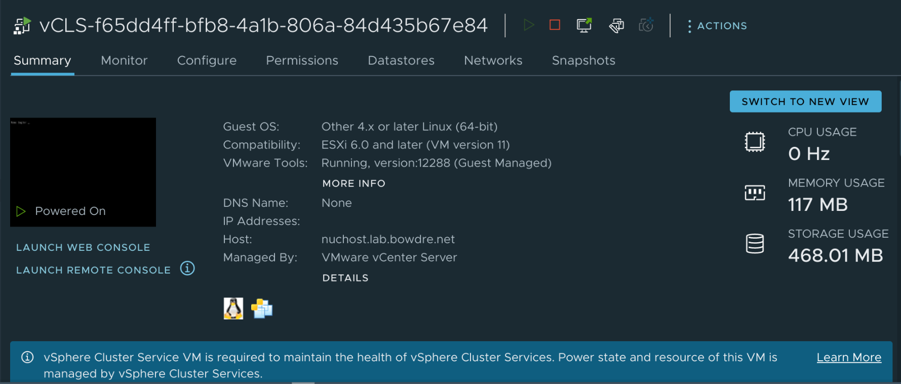
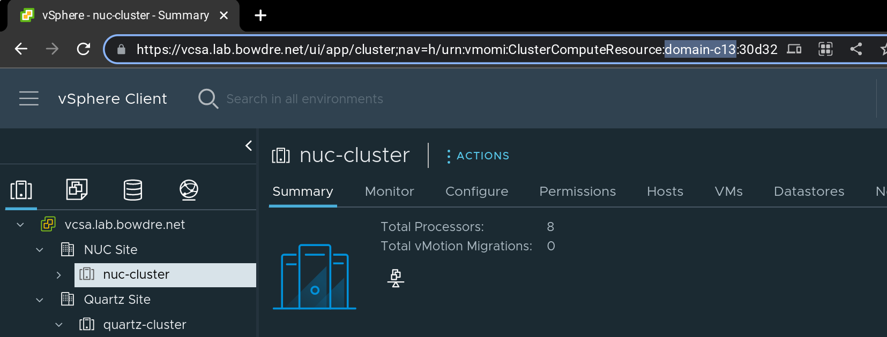
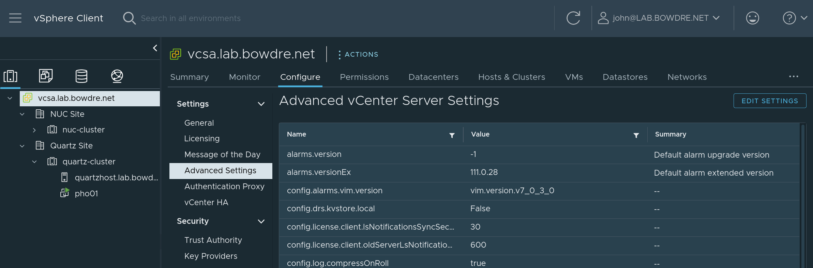
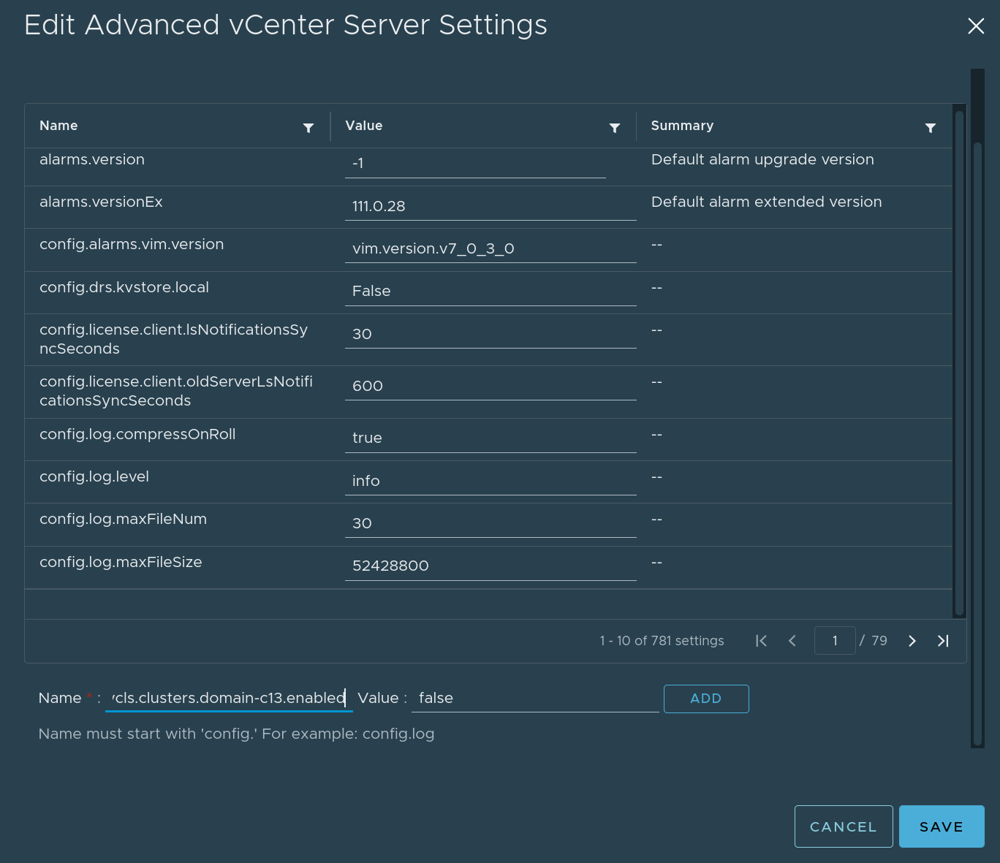
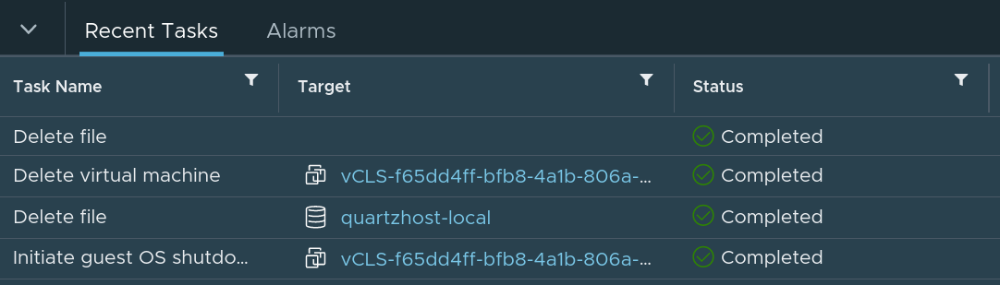
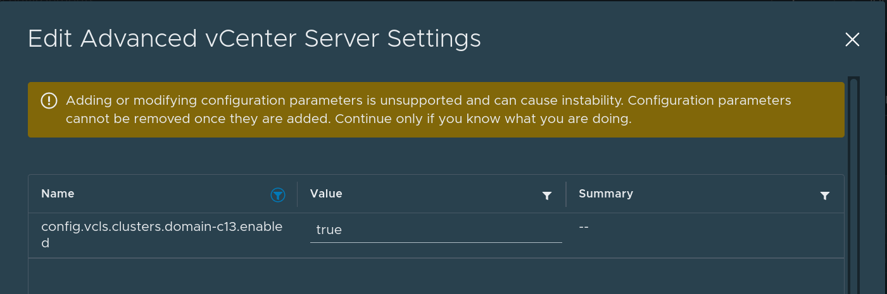
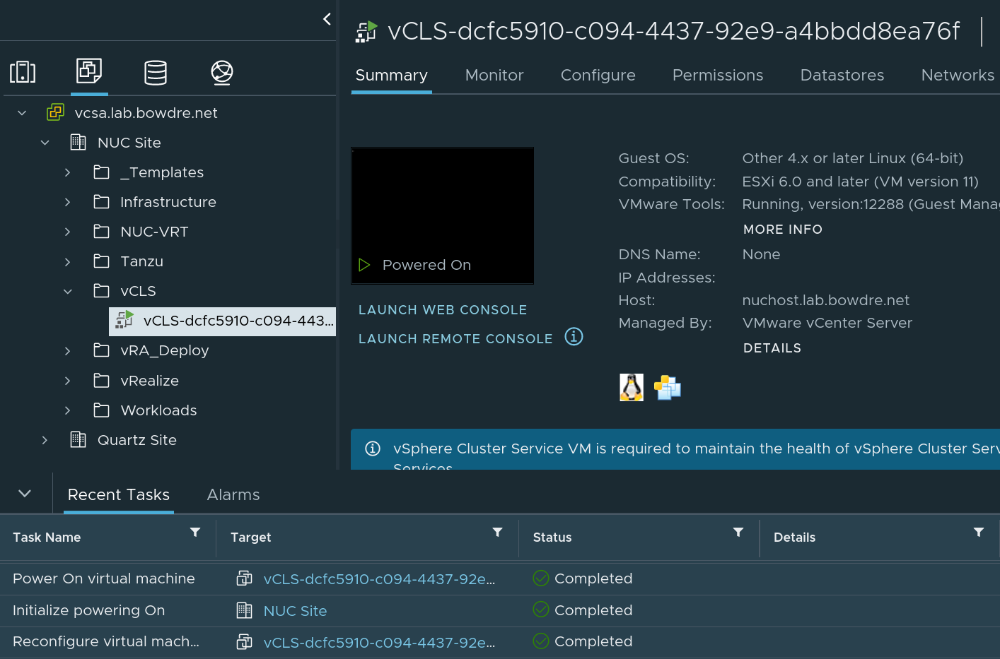

Way back in 2020, VMware released vSphere 7 Update 1 and introduced the new [vSphere Clustering Services (vCLS)](https://core.vmware.com/resource/introduction-vsphere-clustering-service-vcls) to improve how cluster services like the Distributed Resource Scheduler (DRS) operate. vCLS deploys lightweight agent VMs directly on the cluster being managed, and those VMs provide a decoupled and distributed control plane to offload some of the management responsibilities from the vCenter server. 

That's very cool, particularly in large continent-spanning environments or those which reach into multiple clouds, but it may not make sense to add those additional workloads in resource-constrained homelabs[^esxi-arm]. And while the vCLS VMs are supposed to be automagically self-managed, sometimes things go a little wonky and that management fails to function correctly, which can negatively impact DRS. Recovering from such a scenario is complicated by the complete inability to manage the vCLS VMs through the vSphere UI.

[^esxi-arm]: Or when [running the ESXi-ARM Fling](/esxi-arm-on-quartz64/), where the vCLS VMs aren't able to be created and will just [fill up the Tasks list with failures](https://flings.vmware.com/esxi-arm-edition/bugs/1099).

Fortunately there's a somewhat-hidden way to disable (and re-enable) vCLS on a per-cluster basis, and it's easy to do once you know the trick. This can help if you want to permanently disable vCLS (like in a lab environment) or if you just need to turn it off and on again[^off-and-on] to clean up and redeploy uncooperative agent VMs.

{}
Disabling vCLS will break DRS, and could have other unintended side effects. Don't do this in prod if you can avoid it.
{}

[^off-and-on]: 

### Find the cluster's domain ID
It starts with determining the affected cluster's domain ID, which is very easy to do once you know where to look. Simply browse to the cluster object in the vSphere inventory, and look at the URL:

That `ClusterComputeResource:domain-c13` portion tells me exactly what I need to know: the ID for the `NUC Cluster` is `domain-c13`. 

### Disable vCLS for a cluster
With that information gathered, you're ready to do the deed. Select the vCenter object in your vSphere inventory, head to the **Configure** tab, and open the **Advanced Settings** item. 

Now click the **Edit Settings** button to open the editor panel. You'll need to create a new advanced setting so scroll to the bottom of the panel and enter:

| Setting Name | Value |
|:--- |:--- |
| `config.vcls.clusters.domain-[id].enabled` | `false` |

Then click **Add** and **Save** to apply the change.

Within moments, the vCLS VM(s) will be powered off and deleted:

### Re-enable vCLS
If you need to bring back vCLS (such as when troubleshooting a problematic cluster), that's as simple as changing the advanced setting again:

| Setting Name | Value |
|:--- |:--- |
| `config.vcls.clusters.domain-[id].enabled` | `true` |

And the VM(s) will be automatically recreated as needed:

