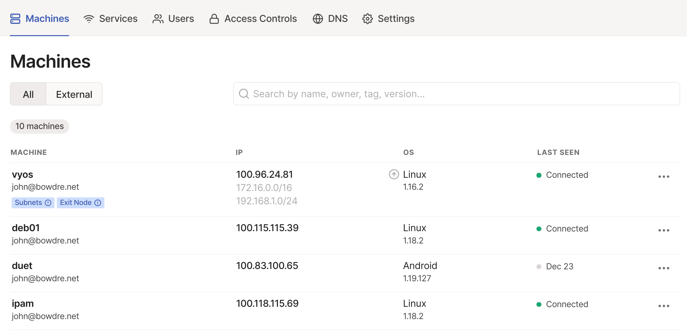
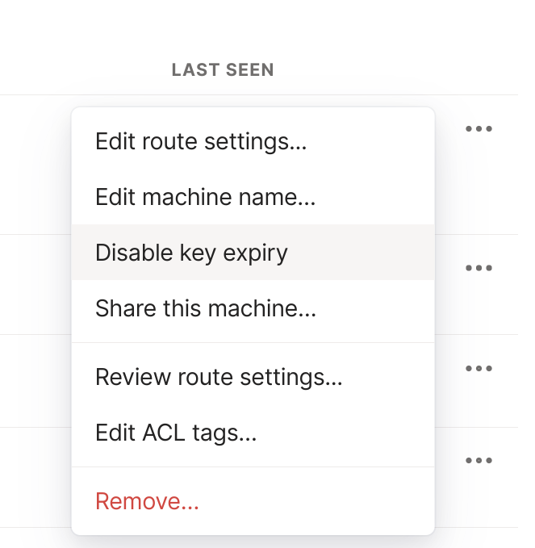
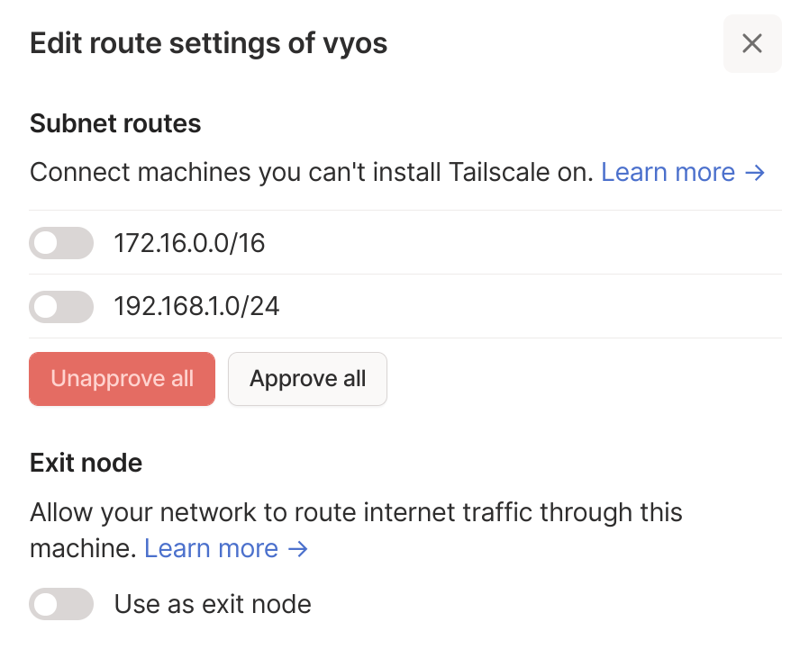
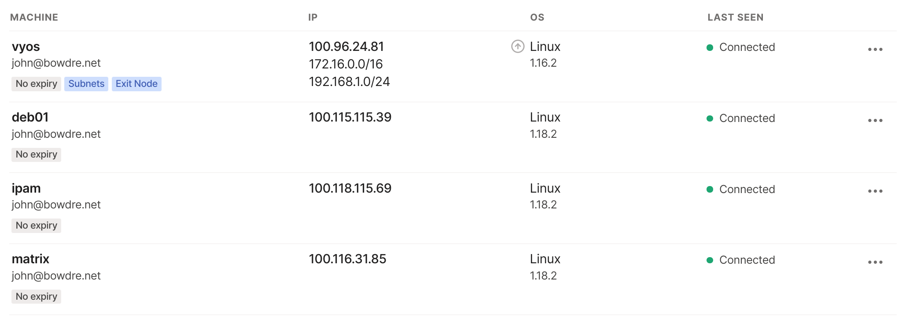
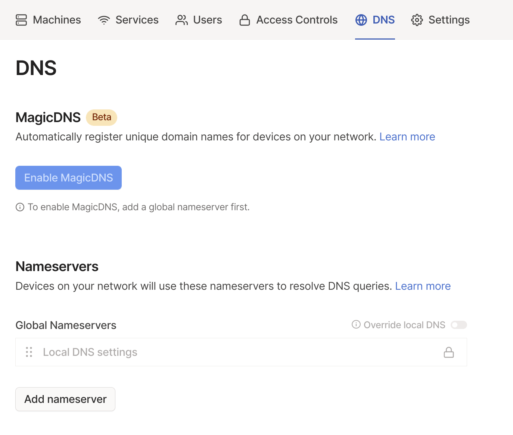
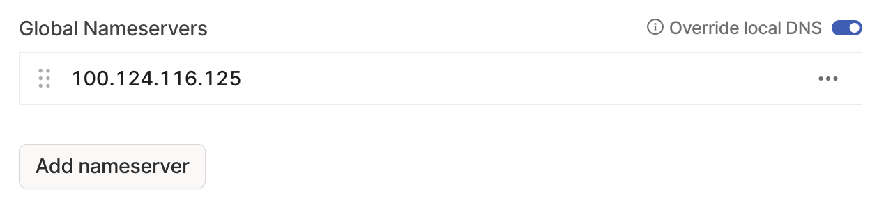
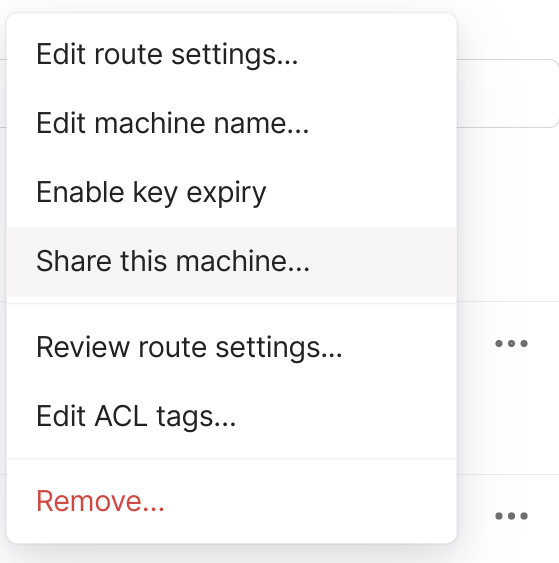
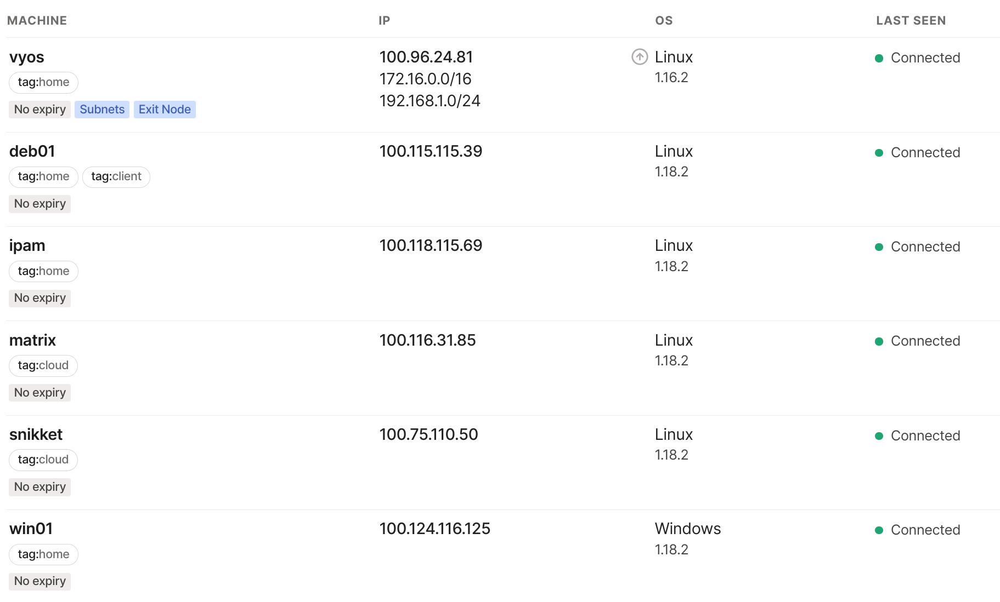

Not all that long ago, I shared about a [somewhat-complicated WireGuard VPN setup](/cloud-based-wireguard-vpn-remote-homelab-access/) that I had started using to replace my previous OpenVPN solution. I raved about WireGuard's speed, security, and flexible (if complex) Cryptokey Routing, but adding and managing peers with WireGuard is a fairly manual (and tedious) process. And while I thought I was pretty clever for using a WireGuard peer in GCP to maintain a secure tunnel into my home network without having to punch holes through my firewall, routing all my traffic through The Cloud wasn't really optimal[^egress_fees].

And then I discovered [Tailscale](https://tailscale.com/), which is built on the WireGuard protocol with an additional control plane on top. It delivers the same high security and high speed but dramatically simplifies the configuration and management of peer devices, and also adds in some other handy features like easy-to-configure [Access Control Lists (ACLs)](https://tailscale.com/kb/1018/acls/) to restrict traffic between peers and a [MagicDNS](https://tailscale.com/kb/1081/magicdns/) feature to automatically register DNS records for connected devices so you don't have to keep up with their IPs.

There's already a great write-up (from the source!) on [How Tailscale Works](https://tailscale.com/blog/how-tailscale-works/), and it's really worth a read so I won't rehash it fully here. The tl;dr though is that Tailscale makes securely connecting remote systems incredibly easy, and it lets those systems connect with each other directly ("mesh") rather than needing traffic to go through a single VPN endpoint ("hub-and-spoke"). It uses a centralized coordination server to *coordinate* the complicated key exchanges needed for all members of a Tailscale network (a "[tailnet](https://tailscale.com/kb/1136/tailnet/)") to trust each other, and this removes the need for a human to manually edit configuration files on every existing device just to add a new one to the mix. Tailscale also leverages [magic :tada:](https://tailscale.com/blog/how-nat-traversal-works/) to allow Tailscale nodes to communicate with each other without having to punch holes in firewall configurations or forward ports or anything else tedious and messy. (And in case that the typical NAT traversal techniques don't work out, Tailscale created the Detoured Encrypted Routing Protocol (DERP[^derp]) to make sure Tailscale can still function seamlessly even on extremely restrictive networks that block UDP entirely or otherwise interfere with NAT traversal.)

{}
It's a no-brainer solution for remote access, but it's important to note that Tailscale is not a VPN *service*; it won't allow you to internet anonymously or make it appear like you're connecting from a different country (unless you configure a Tailscale Exit Node hosted somewhere in The Cloud to do just that). 
{}

Tailscale's software is [open-sourced](https://github.com/tailscale) so you *could* host your own Tailscale control plane and web front end, but much of the appeal of Tailscale is how easy it is to set up and use. To that end, I'm using the Tailscale-hosted option. Tailscale offers a very generous free Personal tier which supports a single admin user, 20 connected devices, 1 subnet router, plus all of the bells and whistles, and the company also sells [Team, Business, and Enterprise plans](https://tailscale.com/pricing/) if you need more users, devices, subnet routers, or additional capabilities[^personal_pro].

Tailscale provides surprisingly-awesome documentation, and the [Getting Started with Tailscale](https://tailscale.com/kb/1017/install/) article does a great job of showing how easy it is to get up and running with just three steps:
1. Sign up for an account
2. Add a machine to your network
3. Add another machine to your network (repeat until satisfied)

This post will start there but then also expand some of the additional features and capabilities that have me so excited about Tailscale.

[^egress_fees]: Plus the GCP egress charges started to slowly stack up to a few ones of dollars each month.
[^derp]: May I just say that I *love* this acronym?
[^personal_pro]: There's also a reasonably-priced Personal Pro option which comes with 100 devices, 2 routers, and custom auth periods for $48/year. I'm using that since it's less than I was going to spend on WireGuard egress through GCP and I want to support the project in a small way.

### Getting started
The first step in getting up and running with Tailscale is to sign up at [https://login.tailscale.com/start](https://login.tailscale.com/start). You'll need to use an existing Google, Microsoft, or GitHub account to sign up, which also lets you leverage the 2FA and other security protections already enabled on those accounts. 

Once you have a Tailscale account, you're ready to install the Tailscale client. The [download page](https://tailscale.com/download) outlines how to install it on various platforms, and also provides a handy-dandy one-liner to install it on Linux:

```bash
curl -fsSL https://tailscale.com/install.sh | sh
```

After the install completes, it will tell you exactly what you need to do next:

```
Installation complete! Log in to start using Tailscale by running:

sudo tailscale up
```

There are also Tailscale apps available for [iOS](https://tailscale.com/download/ios) and [Android](https://tailscale.com/download/android) - and the Android app works brilliantly on Chromebooks too!

#### Basic `tailscale up`
Running `sudo tailscale up` then reveals the next step:

```bash
❯ sudo tailscale up

To authenticate, visit:

        https://login.tailscale.com/a/1872939939df
```

I can copy that address into a browser and I'll get prompted to log in to my Tailscale account. And that's it. Tailscale is installed, configured to run as a service, and connected to my Tailscale account. This also creates my tailnet.

That was pretty easy, right? But what about if I can't easily get to a web browser from the terminal session on a certain device? No worries, `tailscale up` has a flag for that:

```bash
sudo tailscale up --qr
```

That will convert the URL to a QR code that I can scan from my phone.

#### Advanced `tailscale up`
There are a few additional flags that can be useful under certain situations:

- `--advertise-exit-node` to tell the tailnet that this could be used as an exit node for internet traffic
```bash
sudo tailscale up --advertise-exit-node
```
- `--advertise-routes` to let the node perform subnet routing functions to provide connectivity to specified local subnets
```bash
sudo tailscale up --advertise-routes "192.168.1.0/24,172.16.0.0/16"
```
- `--advertise-tags`[^tags] to associate the node with certain tags for ACL purposes (like `tag:home` to identify stuff in my home network and `tag:cloud` to label external cloud-hosted resources)
```bash
sudo tailscale up --advertise-tags "tag:cloud"
```
- `--hostname` to manually specific a hostname to use within the tailnet
```bash
sudo tailscale up --hostname "tailnode"
```
- `--shields-up` to block incoming traffic
```bash
sudo tailscale up --shields-up
```

These flags can also be combined with each other:
```bash
sudo tailscale up --hostname "tailnode" --advertise-exit-node --qr
```

[^tags]: Before being able to assign tags at the command line, you must first define tag owners who can manage the tag. On a personal account, you've only got one user to worry with but you still have to set this up first. I'll go over this in a bit but here's [the documentation](https://tailscale.com/kb/1068/acl-tags/#defining-a-tag) if you want to skip ahead.

#### Sidebar: Tailscale on VyOS
Getting Tailscale on [my VyOS virtual router](/vmware-home-lab-on-intel-nuc-9/#vyos) was unfortunately a little more involved than [leveraging the built-in WireGuard capability](/cloud-based-wireguard-vpn-remote-homelab-access/#configure-vyos-router-as-wireguard-peer). I found the [vyos-tailscale](https://github.com/DMarby/vyos-tailscale) project to help with building a customized VyOS installation ISO with the `tailscaled` daemon added in. I was then able to copy the ISO over to my VyOS instance and install it as if it were a [standard upgrade](https://docs.vyos.io/en/latest/installation/update.html). I could then bring up the interface, advertise my home networks, and make it available as an exit node with:
```bash
sudo tailscale up --advertise-exit-node --advertise-routes "192.168.1.0/24,172.16.0.0/16"
```

#### Other `tailscale` commands
Once there are a few members, I can use the `tailscale status` command to see a quick overview of the tailnet:
```bash
❯ tailscale status
100.115.115.39  deb01                john@        linux   -
100.118.115.69  ipam                 john@        linux   -
100.116.90.109  johns-iphone         john@        iOS     -
100.116.31.85   matrix               john@        linux   -
100.114.140.112 pixel6pro            john@        android -
100.94.127.1    pixelbook            john@        android -
100.75.110.50   snikket              john@        linux   -
100.96.24.81    vyos                 john@        linux   -
100.124.116.125 win01                john@        windows -
```

Without doing any other configuration beyond just installing Tailscale and connecting it to my account, I can now easily connect from any of these devices to any of the other devices using the listed Tailscale IP[^magicdns]. Entering `ssh 100.116.31.85` will connect me to my Matrix server.

`tailscale ping` lets me check the latency between two Tailscale nodes at the Tailscale layer; the first couple of pings will likely be delivered through a nearby DERP server until the NAT traversal magic is able to kick in:

```bash
❯ tailscale ping snikket
pong from snikket (100.75.110.50) via DERP(nyc) in 34ms
pong from snikket (100.75.110.50) via DERP(nyc) in 35ms
pong from snikket (100.75.110.50) via DERP(nyc) in 35ms
pong from snikket (100.75.110.50) via [PUBLIC_IP]:41641 in 23ms
```

The `tailscale netcheck` command will give me some details about my local Tailscale node, like whether it's able to pass UDP traffic, which DERP server is the closest, and the latency to all Tailscale DERP servers:

```bash
❯ tailscale netcheck

Report:
        * UDP: true
        * IPv4: yes, [LOCAL_PUBLIC_IP]:52661
        * IPv6: no
        * MappingVariesByDestIP: false
        * HairPinning: false
        * PortMapping:
        * Nearest DERP: Chicago
        * DERP latency:
                - ord: 23.4ms  (Chicago)
                - dfw: 26.8ms  (Dallas)
                - nyc: 28.6ms  (New York City)
                - sea: 71.5ms  (Seattle)
                - sfo: 77.8ms  (San Francisco)
                - lhr: 102.2ms (London)
                - fra: 114.8ms (Frankfurt)
                - sao: 133.1ms (São Paulo)
                - tok: 154.9ms (Tokyo)
                - syd: 215.3ms (Sydney)
                - sin: 243.7ms (Singapore)
                - blr: 244.6ms (Bangalore)
```

[^magicdns]: I could also connect using the Tailscale hostname, if [MagicDNS](https://tailscale.com/kb/1081/magicdns/) is enabled - but I'm getting ahead of myself.

### Tailscale management
Now that the Tailscale client is installed on my devices and I've verified that they can talk to each other, it might be a good time to *log in* at [`login.tailscale.com`](https://login.tailscale.com/) to take a look at the Tailscale admin console.


#### Subnets and Exit Nodes
See how the `vyos` node has little labels on it about "Subnets (!)" and "Exit Node (!)"? The exclamation marks are there because the node is *advertising* subnets and its exit node eligibility, but those haven't actually been turned on it. To enable the `vyos` node to function as a subnet router (for the `172.16.0.0/16` and `192.168.1.0/24` networks listed beneath its Tailscale IP) and as an exit node (for internet-bound traffic from other Tailscale nodes), I need to click on the little three-dot menu icon at the right edge of the row and select the "Edit route settings..." option.




Now I can approve the subnet routes (individually or simultaneously and at the same time) and allow the node to route traffic to the internet as well[^exit_node].


Cool! But now that's giving me another warning...

[^exit_node]: Once subnets are allowed, they're made available to all members of the tailnet so that traffic destined for those networks can be routed accordingly. Clients will need to opt-in to using the Exit Node though; I typically only do that when I'm on a wireless network I don't control and want to make sure that no one can eavesdrop on my internet traffic, but I like to have that option available for when I need it.

#### Key expiry
By default, Tailscale [expires each node's encryption keys every 180 days](https://tailscale.com/kb/1028/key-expiry/). This improves security (particularly over vanilla WireGuard, which doesn't require any key rotation) but each node will need to reauthenticate (via `tailscale up`) in order to get a new key. It may not make sense to do that for systems acting as subnet routers or exit nodes since they would stop passing all Tailscale traffic once the key expires. That would also hurt for my cloud servers which are *only* accessible via Tailscale; if I can't log in through SSH (since it's blocked at the firewall) then I can't reauthenticate Tailscale to regain access. For those systems, I can click that three-dot menu again and select the "Disable key expiry" option. I tend to do this for my "always on" tailnet members and just enforce the key expiry for my "client" type devices which could potentially be physically lost or stolen.



#### Configuring DNS
It's great that all my Tailscale machines can talk to each other directly by their respective Tailscale IP addresses, but who wants to keep up with IPs? I sure don't. Let's do some DNS. I'll start out by clicking on the [DNS](https://login.tailscale.com/admin/dns) tab in the admin console.


I need to add a Global Nameserver before I can enable MagicDNS so I'll click on the appropriate button to enter in the *Tailscale IP*[^dns_ip] of my home DNS server (which is using [NextDNS](https://nextdns.io/) as the upstream resolver). 


I'll also enable the toggle to "Override local DNS" to make sure all queries from connected clients are going through this server (and thus extend the NextDNS protection to all clients without having to configure them individually).


I can also define search domains to be used for unqualified DNS queries by adding another name server with the same IP address, enabling the "Restrict to search domain" option, and entering the desired domain:


This will let me resolve hostnames when connected remotely to my lab without having to type the domain suffix (ex, `vcsa` versus `vcsa.lab.bowdre.net`).

And, finally, I can click the "Enable MagicDNS" button to turn on the magic. This adds a new nameserver with a private Tailscale IP which will resolve Tailscale hostnames to their internal IP addresses. 


Now I can log in to my Matrix server by simply typing `ssh matrix`. Woohoo!

[^dns_ip]: Using the Tailscale IP will allow queries to go straight to the DNS server without having to go through the VyOS router first. Configuring my clients to use a tailnet node for DNS queries also has the added benefit of sending that traffic through the encrypted tunnels instead of across the internet in the clear. I get secure DNS without having to configure secure DNS!

### Access control
Right now, all of my Tailscale nodes can access all of my other Tailscale nodes. That's certainly very convenient, but I'd like to break things up a bit. I can use access control policies to define which devices should be able to talk to which other devices, and I can use [ACL tags](https://tailscale.com/kb/1068/acl-tags/) to logically group resources together to make this easier.

#### Tags
I'm going to use three tags in my tailnet:
1. `tag:home` to identify servers in my home network which will have access to all other servers.
2. `tag:cloud` to identify my cloud servers which will only have access to other cloud servers.
3. `tag:client` to identify client-type devices which will be able to access all nodes in the tailnet.

Before I can actually apply these tags to any of my machines, I first need to define `tagOwners` for each tag which will determine which users (in my organization of one) will be able to use the tags. This is done by editing the policy file available on the [Access Controls](https://login.tailscale.com/admin/acls) tab of the admin console. 

This ACL file uses a format called [HuJSON](https://github.com/tailscale/hujson), which is basically JSON but with support for inline comments and with a bit of leniency when it comes to trailing commas. That makes a config file that is easy for both humans and computers to parse.

I'm going to start by creating a group called `admins` and add myself to that group. This isn't strictly necessary since I am the only user in the organization, but I feel like it's a nice practice anyway. Then I'll add the `tagOwners` section to map each tag to its owner, the new group I just created:

```json
{
  "groups": {
    "group:admins": ["john@example.com"],
  },
  "tagOwners": {
    "tag:home": ["group:admins"],
    "tag:cloud": ["group:admins"],
    "tag:client": ["group:admins"]
  }
}
```

Now I have two options for applying tags to devices. I can either do it from the admin console, or by passing the `--advertise-tags` flag to the `tailscale up` CLI command. I touched on the CLI approach earlier so I'll go with the GUI approach this time. It's simple - I just go back to the [Machines](https://login.tailscale.com/admin/machines) tab, click on the three-dot menu button for a machine, and select the "Edit ACL tags..." option.


I can then pick the tag (or tags!) I want to apply:


The applied tags have now replaced the owner information which was previously associated with each machine:


#### ACLs
By default, Tailscale implements an implicit "Allow All" ACL. As soon as you start modifying the ACL, though, that switches to an implicit "Deny All". So I'll add new rules to explicitly state what communication should be permitted and everything else will be blocked.

Each ACL rule consists of four named parts:
1. `action` - what to do with the traffic, the only valid option is `allow`.
2. `users` - a list of traffic sources, can be specific users, Tailscale IPs, hostnames, subnets, groups, or tags.
3. `proto` - (optional) protocol for the traffic which should be permitted.
4. `ports` - a list of destinations (and optional ports).

So I'll add this to the top of my policy file:
```json
{
  "acls": [
    {
      // home servers can access other servers
      "action": "accept",
      "users": ["tag:home"],
      "ports": [
        "tag:home:*",
        "tag:cloud:*"
        ]
    },
    {
      // clients can access everything
      "action": "accept",
      "users": ["tag:client"],
      "ports": ["*:*"]
    }
  ]
}
```

This policy becomes active as soon as I click the Save button at the bottom of the page, and I notice a problem very shortly. Do you see it?

Earlier I configured Tailscale to force all nodes to use my home DNS server for resolving all queries, and I just set an ACL which prevents my cloud servers from talking to my home servers... which includes the DNS server. I can think of two ways to address this:
1. Re-register the servers by passing the `--accept-dns=false` flag to `tailscale up` so they'll ignore the DNS configured in the admin console.
2. Add a new ACL rule to allow DNS traffic to reach the DNS server from the cloud.

Option 2 sounds better to me so that's what I'm going to do. Instead of putting an IP address directly into the ACL rule I'd rather use a hostname, and unfortunately the Tailscale host names aren't available within ACL rule declarations. But I can define a host alias in the policy to map a friendly name to the IP:
```json
{
  "hosts": {
    "win01": "100.124.116.125"
  }
}
```

And I can then create a new rule for `"users": ["tag:cloud"]` to add an exception for `win01:53`:
```json
{
  "acls": [
    {
      // cloud servers can only access other cloud servers plus my internal DNS server
      "action": "accept",
      "users": ["tag:cloud"],
      "ports": [
        "win01:53"
      ]
    }
  ]
}
```

And that gets DNS working again for my cloud servers while still serving the results from my NextDNS configuration. Here's the complete policy configuration:

```json
{
  "acls": [
    {
      // home servers can access other servers
      "action": "accept",
      "users": ["tag:home"],
      "ports": [
        "tag:home:*",
        "tag:cloud:*"
        ]
    },
    {
      // cloud servers can only access my internal DNS server
      "action": "accept",
      "users": ["tag:cloud"],
      "ports": [
        "win01:53"
      ]
    },      
    {
      // clients can access everything
      "action": "accept",
      "users": ["tag:client"],
      "ports": ["*:*"]
    }
  ],
  "hosts": {
    "win01": "100.124.116.125"
  },
  "groups": {
    "group:admins": ["john@example.com"],
  },
  "tagOwners": {
    "tag:home": ["group:admins"],
    "tag:cloud": ["group:admins"],
    "tag:client": ["group:admins"]
  }
}
```

### Wrapping up
This post has really only scratched the surface on the cool capabilities provided by Tailscale. I didn't even get into its options for [enabling HTTPS with valid certificates](https://tailscale.com/kb/1153/enabling-https/), [custom DERP servers](https://tailscale.com/kb/1118/custom-derp-servers/), [sharing tailnet nodes with other users](https://tailscale.com/kb/1084/sharing/), or [file transfer using Taildrop](https://tailscale.com/kb/1106/taildrop/). The [Next Steps](https://tailscale.com/kb/1017/install/#next-steps) section of the official Getting Started doc has some other cool ideas for Tailscale-powered use cases, and there are a ton more listed in the [Solutions](https://tailscale.com/kb/solutions/) and [Guides](https://tailscale.com/kb/guides/) categories as well.

It's amazing to me that a VPN solution can be this simple to set up and manage while still offering such incredible flexibility. **Tailscale is proof that secure networking doesn't have to be hard.**