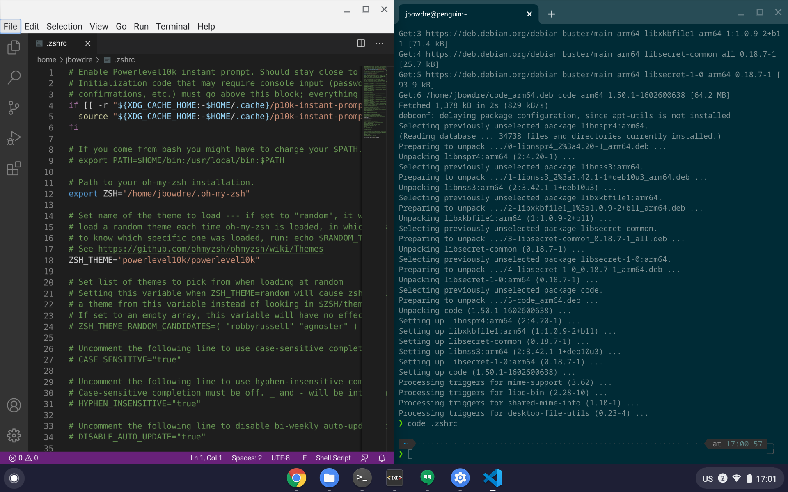
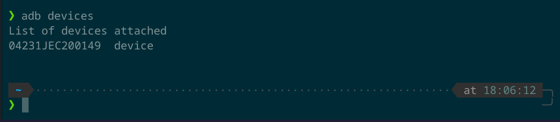

I've [written in the past](/3d-modeling-and-printing-on-chrome-os) about the Linux setup I've been using on my Pixel Slate. My Slate's keyboard stopped working over the weekend, though, and there don't seem to be any replacements (either Google or Brydge) to be found. And then I saw that [Walmart had the 64GB Lenovo Chromebook Duet temporarily marked down](https://twitter.com/johndotbowdre/status/1320733614426988544) to a mere $200 - just slightly more than the Slate's *keyboard* originally cost. So I jumped on that deal, and the little Chromeblet showed up today.


I'll be putting the Duet through the paces in the coming days to see if/how it can replace my now-tablet-only Slate, but first things first: I need Linux. And this may be a little bit different than the setup on the Slate since the Duet's Mediatek processor uses the aarch64/arm64 architecture instead of amd64. (And while I'm writing these steps specific to the Duet, the same steps should work on basically any arm64 Chromebook.)

So journey with me as I get this little guy set up!

### Installing Linux
This part is dead simple. Just head into **Settings > Linux (Beta)** and hit the **Turn on** button:


Click **Next**, review the options for username and initial disk size (which can be easily increased later so there's no real need to change it right now), and then select **Install**:


It takes just a few minutes to download and initialize the `termina` VM and then create the default `penguin` container:


You're ready to roll once the Terminal opens and gives you a prompt:


Your first action should be to go ahead and install any patches:
```shell
sudo apt update
sudo apt upgrade
```

### Zsh, Oh My Zsh, and powerlevel10k theme
I've been really getting into this shell setup recently so let's go on and make things comfortable before we move on too much further. Getting `zsh` is straight forward:
```shell
sudo apt install zsh
```
Go ahead and launch `zsh` (by typing '`zsh`') and go through the initial setup wizard to configure preferences for things like history, completion, and other settings. I leave history on the defaults, enable the default completion options, switch the command-line editor to `vi`-style, and enable both `autocd` and `appendhistory`. Once you're back at the (new) `penguin%` prompt we can move on to installing the [Oh My Zsh plugin framework](https://github.com/ohmyzsh/ohmyzsh).

Just grab the installer script like so:
```shell
wget https://raw.githubusercontent.com/ohmyzsh/ohmyzsh/master/tools/install.sh
```
Review it if you'd like (and you should! *Always* review code before running it!!), and then execute it:
```shell
sh install.sh
```
When asked if you'd like to change your default shell to `zsh` now, **say no**. This is because it will prompt for your password, but you probably don't have a password set on your brand-new Linux (Beta) account and that just makes things complicated. We'll clear this up later, but for now just check out that slick new prompt:


Oh My Zsh is pretty handy because you can easily enable [additional plugins](https://github.com/ohmyzsh/ohmyzsh/tree/master/plugins) to make your prompt behave exactly the way you want it to. Let's spruce it up even more with the [powerlevel10k theme](https://github.com/romkatv/powerlevel10k)!
```shell
git clone --depth=1 https://github.com/romkatv/powerlevel10k.git ${ZSH_CUSTOM:-$HOME/.oh-my-zsh/custom}/themes/powerlevel10k
```
Now we just need to edit `~/.zshrc` to point to the new theme:
```shell
sed -i s/^ZSH_THEME=.\*$/ZSH_THEME='"powerlevel10k\/powerlevel10k"'/ ~/.zshrc
```
We'll need to launch another instance of `zsh` for the theme change to take effect so first lets go ahead and manually set `zsh` as our default shell. We can use `sudo` to get around the whole "don't have a password set" inconvenience:
```shell
sudo chsh -s /bin/zsh [username]
```
Now close out the terminal and open it again, and you should be met by the powerlevel10k configurator which will walk you through getting things set up:


This theme is crazy-configurable, but fortunately the configurator wizard does a great job of helping you choose the options that work best for you.
I pick the Classic prompt style, Unicode character set, Dark prompt color, 24-hour time, Angled separators, Sharp prompt heads, Flat prompt tails, 2-line prompt height, Dotted prompt connection, Right prompt frame, Sparse prompt spacing, Fluent prompt flow, Enabled transient prompt, Verbose instant prompt, and (finally) Yes to apply the changes.

Looking good!

### Visual Studio Code
I'll need to do some light development work so VS Code is next on the hit list. You can grab the installer [here](https://code.visualstudio.com/Download#) or just copy/paste the following to stay in the Terminal. Definitely be sure to get the arm64 version!
```shell
curl -L https://aka.ms/linux-arm64-deb > code_arm64.deb
sudo apt install ./code_arm64.deb
```
VS Code should automatically appear in the Chromebook's Launcher, or you can use it to open a file directly with `code [filename]`:

Nice!

### Android platform tools (adb and fastboot)
I sometimes don't want to wait for my Pixel to get updated naturally, so I love using `adb sideload` to manually update my phones. Here's what it takes to set that up. Installing adb is as simple as `sudo apt install adb`. To use it, enable the USB Debugging Developer Option on your phone, and then connect the phone to the Chromebook. You'll get a prompt to connect the phone to Linux:


Once you connect the phone to Linux, check the phone to approve the debugging connection. You can then issue `adb devices` to verify the phone is connected:


*I've since realized that the platform-tools (adb/fastboot) available in the repos are much older than what are required for flashing a factory image or sideloading an OTA image to a modern Pixel phone. This'll do fine for installing APKs either to your Chromebook or your phone, but I had to pull out my trusty Pixelbook to flash GrapheneOS to my Pixel 4a.*

### Microsoft PowerShell and VMware PowerCLI
*[Updated 5/20/2021 with Microsoft's newer instructions]*
I'm working on setting up a [VMware homelab on an Intel NUC 9](https://twitter.com/johndotbowdre/status/1317558182936563714) so being able to automate things with PowerCLI will be handy.

PowerShell for ARM is still in an early stage so while [it is supported](https://docs.microsoft.com/en-us/powershell/scripting/install/installing-powershell-core-on-linux?view=powershell-7.2#support-for-arm-processors) it must be installed manually. Microsoft has instructions for installing PowerShell from binary archives [here](https://docs.microsoft.com/en-us/powershell/scripting/install/installing-powershell-core-on-linux?view=powershell-7.2#linux), and I grabbed the latest `-linux-arm64.tar.gz` release I could find [here](https://github.com/PowerShell/PowerShell/releases).
```shell
curl -L -o /tmp/powershell.tar.gz https://github.com/PowerShell/PowerShell/releases/download/v7.2.0-preview.5/powershell-7.2.0-preview.5-linux-arm64.tar.gz
sudo mkdir -p /opt/microsoft/powershell/7
sudo tar zxf /tmp/powershell.tar.gz -C /opt/microsoft/powershell/7
sudo chmod +x /opt/microsoft/powershell/7/pwsh
sudo ln -s /opt/microsoft/powershell/7/pwsh /usr/bin/pwsh
```
You can then just run `pwsh`:

That was the hard part. To install PowerCLI into your new Powershell environment, just run `Install-Module -Name VMware.PowerCLI` at the `PS >` prompt, and accept the warning about installing a module from an untrusted repository.

I'm planning to use PowerCLI against my homelab without trusted SSL certificates so (note to self) I need to run `Set-PowerCLIConfiguration -InvalidCertificateAction Ignore` before I try to connect.


Woot!

### Docker
The Linux (Beta) environment consists of a hardened virtual machine (named `termina`) running an LXC Debian container (named `penguin`). Know what would be even more fun? Let's run some other containers inside our container!

The docker installation has a few prerequisites:
```shell
sudo apt install \
    apt-transport-https \
    ca-certificates \
    curl \
    gnupg-agent \
    software-properties-common
```
Then we need to grab the Docker repo key:
```shell
curl -fsSL https://download.docker.com/linux/debian/gpg | sudo apt-key add -
```
And then we can add the repo:
```shell
sudo add-apt-repository \
   "deb [arch=arm64] https://download.docker.com/linux/debian \
   $(lsb_release -cs) \
   stable"
```
And finally update the package cache and install `docker` and its friends:
```shell
sudo apt update
sudo apt install docker-ce docker-ce-cli containerd.io
```

Xzibit would be proud!

### 3D printing utilities
Just like [last time](/3d-modeling-and-printing-on-chrome-os), I'll want to be sure I can do light 3D part design and slicing on this Chromebook. Once again, I can install FreeCAD with `sudo apt install freecad`, and this time I didn't have to implement any workarounds for graphical issues:


Unfortunately, though, I haven't found a slicer application compiled with support for aarch64/arm64. There's a *much* older version of Cura available in the default Debian repos but it crashes upon launch. Neither Cura nor PrusaSlicer (or the Slic3r upstream) offer arm64 releases.

So while I can use the Duet for designing 3D models, I won't be able to actually prepare those models for printing without using another device. I'll need to keep looking for another solution here. (If you know of an option I've missed, please let me know!)

### Jupyter Notebook
I came across [a Reddit post](https://www.reddit.com/r/Crostini/comments/jnbqv3/successfully_running_jupyter_notebook_on_samsung/) today describing how to install `conda` and get a Jupyter Notebook running on arm64 so I had to give it a try. It actually wasn't that bad!

The key is to grab the appropriate version of [conda Miniforge](https://github.com/conda-forge/miniforge), make it executable, and run the installer:
```shell
wget https://github.com/conda-forge/miniforge/releases/latest/download/Miniforge3-Linux-aarch64.sh
chmod +x Miniforge3-Linux-aarch64.sh
./Miniforge3-Linux-aarch64.sh
```
Exit the terminal and relaunch it, and then install Jupyter:
```shell
conda install -c conda-forge notebook
```

You can then launch the notebook with `jupyter notebook` and it will automatically open up in a Chrome OS browser tab:


Cool! Now I just need to learn what I'm doing with Jupyter - but at least I don't have an excuse about "my laptop won't run it".


### Wrap-up
I'm sure I'll be installing a few more utilities in the coming days but this covers most of my immediate must-have Linux needs. I'm eager to see how this little Chromeblet does now that I'm settled in.
