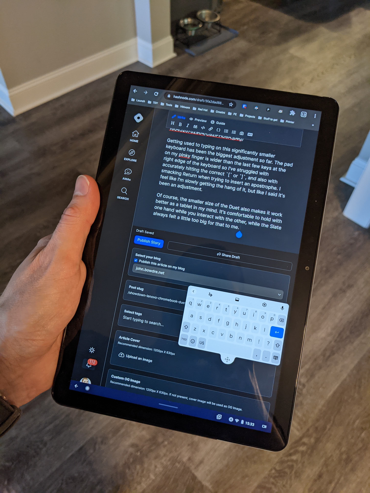

Okay, okay, this isn't actually going to be a comparison review between the two wildly-mismatched-but-also-kind-of-similar [Chromeblets](https://www.reddit.com/r/chromeos/comments/bp1nwo/branding/), but rather a (hopefully) brief summary of my experience moving from an $800 Pixel Slate + $200 Google keyboard to a Lenovo Chromebook Duet I picked up on sale for just $200.

### Background
Up until last week, I'd been using the Slate as my primary personal computing device for the previous 20 months or so, mainly in laptop mode (as opposed to tablet mode). I do a lot of casual web browsing, and I spend a significant portion of my free time helping other users on Google's product support forums as a part of the [Google Product Experts program](https://productexperts.withgoogle.com/what-it-is). I also work a lot with the  [Chrome OS Linux (Beta) environment](/setting-up-linux-on-a-new-lenovo-chromebook-duet-bonus-arm64-complications), but I avoid Android apps as much as I can. And I also used the Slate for a bit of Stadia gaming when I wasn't near a Chromecast.

So the laptop experience is generally more important to me than the tablet one. I need to be able to work with a large number of browser tabs, but I don't typically need to do any heavy processing directly on the computer. 

I was pretty happy with the Slate, but its expensive keyboard stopped working recently and replacements aren't really available anywhere. Remember, laptop mode is key for my use case so the Pixel Slate became instantly unusable to me. 

### Size
When you put these machines side by side, the first difference that jumps out is the size disparity. The 12.3" Pixel Slate is positively massive next to the 10.1" Lenovo Duet.

The Duet is physically smaller so the display itself is of course smaller. I had a brief moment of panic when I first logged in and the setup wizard completely filled the screen. Dialing Chrome OS's display scaling down to 80% strikes a good balance for me between fonts being legible while still displaying enough content to be worthwhile. It can get a bit tight when you've got windows docked side-by-side but I'm getting by okay.

Of course, the smaller size of the Duet also makes it work better as a tablet in my mind. It's comfortable enough to hold with one hand while you interact with the other, whereas the Slate always felt a little too big for that to me. 

### Keyboard
A far more impactful size difference is the keyboards though. The Duet keyboard gets a bit cramped, particularly over toward the right side (you know, those pesky braces and semicolons that are *never* needed when coding):

Getting used to typing on this significantly smaller keyboard has been the biggest adjustment so far. The pad on my pinky finger is wider than the last few keys at the right edge of the keyboard so I've struggled with accurately hitting the correct `[` or `]`, and also with smacking Return (and inevitably sending a malformed chat message) when trying to insert an apostrophe. I feel like I'm slowly getting the hang of it, but like I said, it's been an adjustment. 

### Cover

The Pixel Slate's keyboard + folio cover is a single (floppy) piece. The keyboard connects to contacts on the bottom edge of the Slate, and magnets hold it in place. The rear cover then folds and sticks to the back of the Slate with magnets to prop up the tablet in different angles. The magnet setup means you can smoothly transition it through varying levels of tilt, which is pretty nice. But being a single piece means the keyboard might get in the way if you're trying to use it as just a propped-up tablet. And the extra folding in the back takes up a bit of space so the Slate may not work well as a laptop on your actual lap.

The Duet's rear cover has a fabric finish kind of similar to the cases Google offers for their phones, and it provides a great texture for holding the tablet. It sticks to the back of the Duet through the magic of magnets, and the lower half of it folds out to create a really sturdy kickstand. And it's completely separate from the keyboard which is great for when you're using the Duet as a tablet (either handheld or propped up for watching a movie or gaming with Stadia). 

And this little kickstand can go *low*, much lower than the Slate. This makes it perfect for my late-night Stadia sessions while sitting in bed. I definitely prefer this approach compared to what Google did with the Pixel Slate.

### Performance
The Duet does struggle a bit here. It's basically got a [smartphone processor](https://www.notebookcheck.net/Mediatek-Helio-P60T-Processor-Benchmarks-and-Specs.470711.0.html) and half the RAM of the Slate. Switching between windows and tabs sometimes takes an extra moment or two to catch up (particularly if said tab has been silently suspended in the background). Similarly, working with Linux apps is just a bit slower than you'd like it to be. Still, I've spent a bit more than a week now with the Duet as my go-to computer and it's never really been slow enough to bother me. 

That arm64 processor does make finding compatible Linux packages a little more difficult than it's been on amd64 architectures but a [little bit of digging](/setting-up-linux-on-a-new-lenovo-chromebook-duet-bonus-arm64-complications) will get past that limitation in most cases. 

The upside of that smartphone processor is that the battery life is *insane*. After about seven hours of light usage today I'm sitting at 63% - with an estimated nine hours remaining. This thing keeps going and going, even while Stadia-ing for hours. Being able to play Far Cry 5 without being tethered to a wall is so nice.

### Fingerprint sensor
The Duet doesn't have one, and that makes me sad.

### Conclusion
The Lenovo Chromebook Duet is an incredible little Chromeblet for the price. It clearly can't compete with the significantly-more-expensive Google Pixel Slate *on paper*, but I'm finding its size to be fantastic for the sort of on-the-go computing I do a lot of. It works better as a lap-top laptop, works better as a tablet in my hand, works better for playing Stadia in bed, and just feels more portable. It's a little sluggish at times and the squished keyboard takes some getting used to but overall I'm pretty happy with this move.
