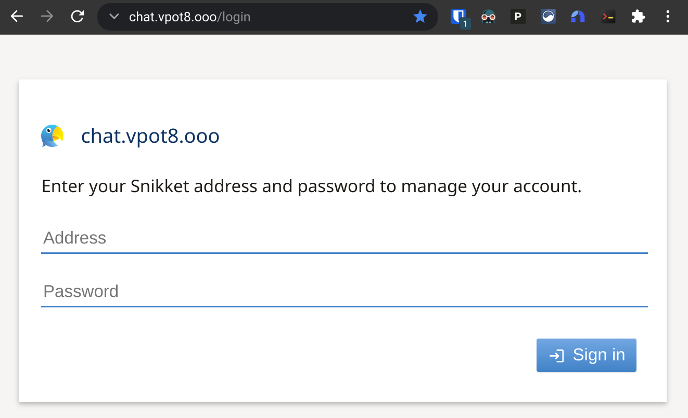
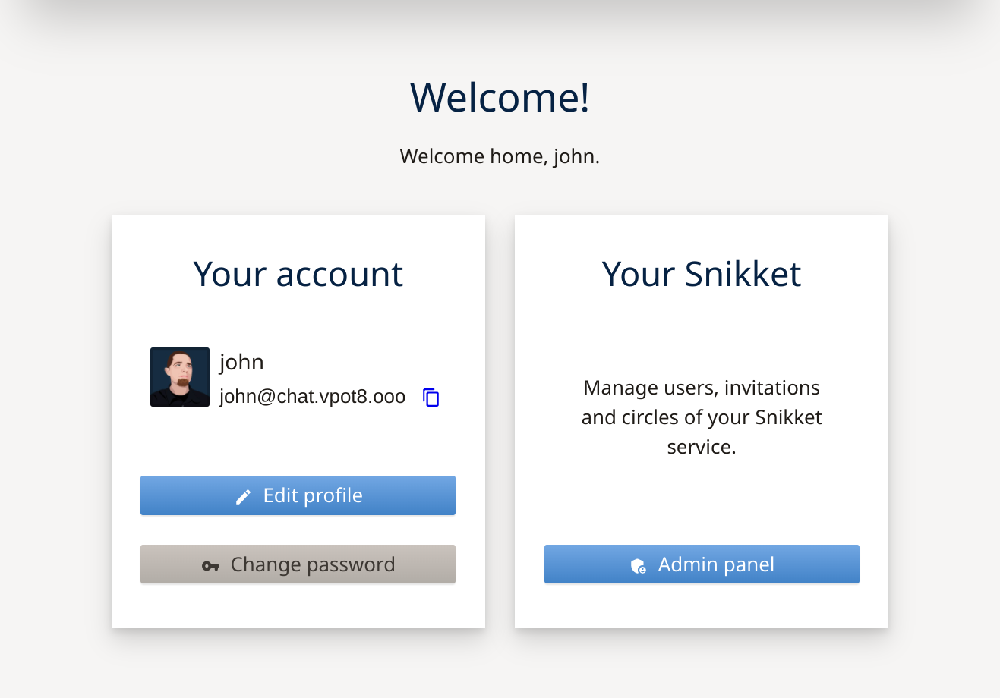
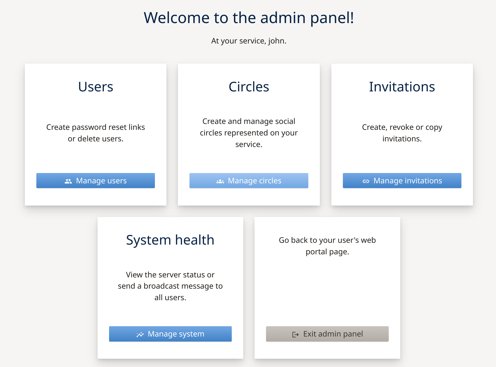
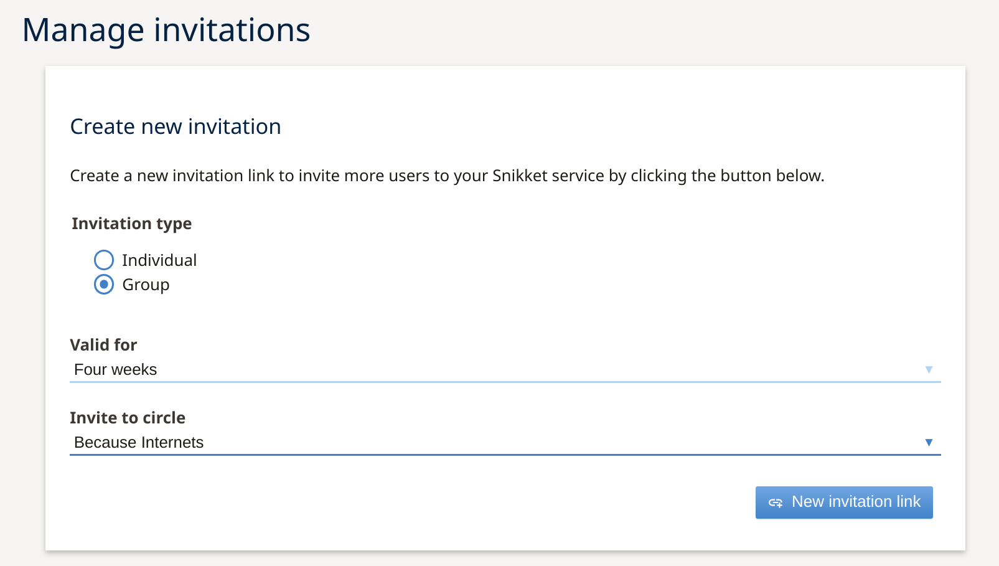
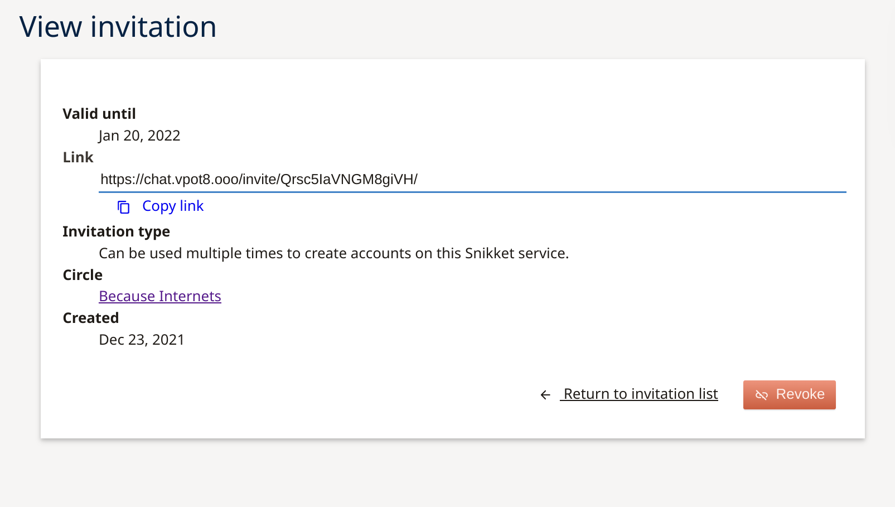

**Non-technical users deserve private communications, too.**

I shared a [few months back](/federated-matrix-server-synapse-on-oracle-clouds-free-tier/) about the steps I took to deploy my own [Matrix](https://matrix.org/) homeserver instance, and I've happily been using the [Element](https://element.io/) client for secure end-to-end encrypted chats with a small group of my technically-inclined friends. Being able to have private conversations without having to trust a single larger provider (unlike like Signal or WhatsApp) is pretty great. Of course, many Matrix users just create accounts directly on the matrix.org homeserver which kind of hurts the "decentralized" aspect of the network, and relatively few bother with hosting their own homeserver. There are also multiple options for homeserver software and dozens of Matrix clients each with their own set of features and limitations. As a result, an individual's experience with Matrix could vary wildly depending on what combination of softwares they are using. And it can be difficult to get non-technical users (like my family) on board with a new communication platform when iMessage works just fine[^1].

I recently came across the [Snikket project](https://snikket.org/), which [aims](https://snikket.org/about/goals/) to make decentralized end-to-end encrypted personal messaging simple and accessible for *everyone*, with an emphasis on providing a consistent experience across the network. Snikket does this by maintaining a matched set of server and client[^2] software with feature and design parity, making it incredibly easy to deploy and manage the server, and simplifying user registration with invite links. In contrast to Matrix, Snikket does not operate an open server on which users can self-register but instead requires users to be invited to a hosted instance. The idea is that a server would be used by small groups of family and friends where every user knows (and trusts!) the server operator while also ensuring the complete decentralization of the network[^3].

How simple is the server install?

Seriously, their [4-step quick-start guide](https://snikket.org/service/quickstart/) is so good that I didn't feel the need to do a blog post about my experience. I've now been casually using Snikket for a bit over month and remain very impressed both by the software and the project itself, and have even deployed a new Snikket instance for my family to use. My parents were actually able to join the chat without any issues, which is a testament to how easy it is from a user perspective too.

A few days ago I migrated my original Snikket instance from Google Cloud (GCP) to the same Oracle Cloud Infrastructure (OCI) virtual server that's hosting my Matrix homeserver so I thought I might share some notes first on the installation process. At the end, I'll share the tweaks which were needed to get Snikket to run happily alongside Matrix.

[^1]: `John laughed at a message.`
[^2]: Snikket currently has clients for [Android](https://play.google.com/store/apps/details?id=org.snikket.android) and [iOS](https://apps.apple.com/us/app/snikket/id1545164189) with plans to add a web client in the future.
[^3]: That said, Snikket is built on the [XMPP messaging standard](https://xmpp.org/) which means it can inter-operate with other XMPP-based chat networks, servers, and clients - though of course the best experience will be had between Snikket servers and clients.

### Infrastructure setup
You can refer to my notes from last time for details on how I [created the Ubuntu 20.04 VM](/federated-matrix-server-synapse-on-oracle-clouds-free-tier/#instance-creation) and [configured the firewall rules](/federated-matrix-server-synapse-on-oracle-clouds-free-tier/#firewall-configuration) both at the cloud infrastructure level as well as within the host using `iptables`. Snikket does need a few additional [firewall ports](https://github.com/snikket-im/snikket-server/blob/master/docs/advanced/firewall.md) beyond what was needed for my Matrix setup:

| Port(s) | Transport | Purpose |
| --- | --- | --- |
| `80, 443` | TCP | Web interface and group file sharing |
| `3478-3479` | TCP/UDP | Audio/Video data proxy negotiation and discovery ([STUN/TURN](https://www.twilio.com/docs/stun-turn/faq)) |
| `5349-5350` | TCP/UDP | Audio/Video data proxy negotiation and discovery (STUN/TURN over TLS) |
| `5000` | TCP | File transfer proxy |
| `5222` | TCP | Connections from clients |
| `5269` | TCP | Connections from other servers |
| `60000-60100`[^4] | UDP | Audio/Video data proxy (TURN data) |

As a gentle reminder, Oracle's `iptables` configuration inserts a `REJECT all` rule at the bottom of each chain. I needed to make sure that each of my `ALLOW` rules get inserted above that point. So I used `iptables -L INPUT --line-numbers` to identify which line held the `REJECT` rule, and then used `iptables -I INPUT [LINE_NUMBER] -m state --state NEW -p [PROTOCOL] --dport [PORT] -j ACCEPT` to insert the new rules above that point.
```bash
sudo iptables -I INPUT 9 -m state --state NEW -p tcp --dport 80 -j ACCEPT
sudo iptables -I INPUT 9 -m state --state NEW -p tcp --dport 443 -j ACCEPT
sudo iptables -I INPUT 9 -m state --state NEW -p tcp --dports 3478-3479 -j ACCEPT
sudo iptables -I INPUT 9 -m state --state NEW -p tcp -m multiport --dports 3478-3479 -j ACCEPT
sudo iptables -I INPUT 9 -m state --state NEW -p tcp -m multiport --dports 3478,3479 -j ACCEPT
sudo iptables -I INPUT 9 -m state --state NEW -p tcp --dport 5000 -j ACCEPT
sudo iptables -I INPUT 9 -m state --state NEW -p tcp --dport 5222 -j ACCEPT
sudo iptables -I INPUT 9 -m state --state NEW -p tcp --dport 5269 -j ACCEPT
sudo iptables -I INPUT 9 -m state --state NEW -p udp -m multiport --dports 3478,3479 -j ACCEPT
sudo iptables -I INPUT 9 -m state --state NEW -p udp -m multiport --dports 5349,5350 -j ACCEPT
sudo iptables -I INPUT 9 -m state --state NEW -p udp -m multiport --dports 60000:60100 -j ACCEPT
```

Then to verify the rules are in the right order:
```bash
$ sudo iptables -L INPUT --line-numbers -n
Chain INPUT (policy ACCEPT)
num  target     prot opt source               destination
1    ts-input   all  --  0.0.0.0/0            0.0.0.0/0
2    ACCEPT     all  --  0.0.0.0/0            0.0.0.0/0            state RELATED,ESTABLISHED
3    ACCEPT     icmp --  0.0.0.0/0            0.0.0.0/0
4    ACCEPT     all  --  0.0.0.0/0            0.0.0.0/0
5    ACCEPT     udp  --  0.0.0.0/0            0.0.0.0/0            udp spt:123
6    ACCEPT     tcp  --  0.0.0.0/0            0.0.0.0/0            state NEW tcp dpt:22
7    ACCEPT     tcp  --  0.0.0.0/0            0.0.0.0/0            state NEW tcp dpt:443
8    ACCEPT     tcp  --  0.0.0.0/0            0.0.0.0/0            state NEW tcp dpt:80
9    ACCEPT     udp  --  0.0.0.0/0            0.0.0.0/0            state NEW multiport dports 5349,5350
10   ACCEPT     udp  --  0.0.0.0/0            0.0.0.0/0            state NEW multiport dports 60000:60100
11   ACCEPT     udp  --  0.0.0.0/0            0.0.0.0/0            state NEW multiport dports 3478,3479
12   ACCEPT     tcp  --  0.0.0.0/0            0.0.0.0/0            state NEW tcp dpt:5269
13   ACCEPT     tcp  --  0.0.0.0/0            0.0.0.0/0            state NEW tcp dpt:5222
14   ACCEPT     tcp  --  0.0.0.0/0            0.0.0.0/0            state NEW tcp dpt:5000
15   ACCEPT     tcp  --  0.0.0.0/0            0.0.0.0/0            state NEW multiport dports 3478,3479
16   REJECT     all  --  0.0.0.0/0            0.0.0.0/0            reject-with icmp-host-prohibited
```

Before moving on, it's important to save them so the rules will persist across reboots!
```bash
$ sudo netfilter-persistent save
run-parts: executing /usr/share/netfilter-persistent/plugins.d/15-ip4tables save
run-parts: executing /usr/share/netfilter-persistent/plugins.d/25-ip6tables save
```

I also needed to create three DNS records with my domain registrar:
```
# Domain                TTL   Class   Type      Target
chat.vpota.to           300   IN      A         132.145.174.39
groups.vpota.to         300   IN      CNAME     chat.vpota.to
share.vpota.to          300   IN      CNAME     chat.vpota.to
```

[^4]: By default Snikket can use any UDP port in the range `49152-65535` for TURN call data but restricting it to 100 ports [should be sufficient](https://github.com/snikket-im/snikket-server/blob/master/docs/advanced/firewall.md#how-many-ports-does-the-turn-service-need) for most small servers.

### Install `docker` and `docker-compose`
Snikket is distributed as a set of docker containers which makes it super easy to get up and running on basically any Linux system. But, of course, you'll first need to [install `docker`](https://docs.docker.com/engine/install/ubuntu/)

```bash
# Update package index
sudo apt update
# Install prereqs
sudo apt install ca-certificates curl gnupg lsb-release
# Add docker's GPG key
curl -fsSL https://download.docker.com/linux/ubuntu/gpg | sudo gpg --dearmor -o /usr/share/keyrings/docker-archive-keyring.gpg
# Add the docker repo
echo \
  "deb [arch=$(dpkg --print-architecture) signed-by=/usr/share/keyrings/docker-archive-keyring.gpg] https://download.docker.com/linux/ubuntu \
  $(lsb_release -cs) stable" | sudo tee /etc/apt/sources.list.d/docker.list > /dev/null
# Refresh the package index with the new repo added
sudo apt update
# Install docker
sudo apt install docker-ce docker-ce-cli containerd.io
```

And install `docker-compose` also to simplify the container management:

```bash
# Download the docker-compose binary
sudo curl -L "https://github.com/docker/compose/releases/download/1.29.2/docker-compose-$(uname -s)-$(uname -m)" -o /usr/local/bin/docker-compose
# Make it executable
sudo chmod +x /usr/local/bin/docker-compose
```

Now we're ready to...

### Install Snikket
This starts with just making a place for Snikket to live:

```bash
sudo mkdir /etc/snikket
cd /etc/snikket
```

And then grabbing the Snikket `docker-compose` file:

```bash
sudo curl -o docker-compose.yml https://snikket.org/service/resources/docker-compose.beta.yml
```

And then creating a very minimal configuration file:

```bash
sudo vi snikket.conf
```

A basic config only needs two parameters:

| Parameter | Description |
| --- | --- |
| `SNIKKET_DOMAIN` | The fully-qualified domain name that clients will connect to |
| `SNIKKET_ADMIN_EMAIL` | An admin contact for the server |

That's it.

In my case, I'm going to add two additional parameters to restrict the UDP TURN port range that I set in my firewalls above.

So here's my config:

```
SNIKKET_DOMAIN=chat.vpota.to
SNIKKET_ADMIN_EMAIL=ops@example.com

# Limit UDP port range
SNIKKET_TWEAK_TURNSERVER_MIN_PORT=60000
SNIKKET_TWEAK_TURNSERVER_MAX_PORT=60100
```

### Start it up!
With everything in place, I can start up the Snikket server:

```bash
sudo docker-compose up -d
```

This will take a moment or two to pull down all the required container images, start them, and automatically generate the SSL certificates. Very soon, though, I can point my browser to `https://chat.vpota.to` and see a lovely login page - complete with an automagically-valid-and-trusted certificate:


Of course, I don't yet have a way to log in, and like I mentioned earlier Snikket doesn't offer open user registration. Every user (even me, the admin!) has to be invited. Fortunately I can generate my first invite directly from the command line:

```bash
sudo docker exec snikket create-invite --admin --group default
```

That command will return a customized invite link which I can copy and paste into my browser.


If I've got a mobile device handy, I can go ahead and install the client there to get started; the app will even automatically generate a secure password[^6] so that I (and my users) don't have to worry about it. Otherwise, clicking the **register an account manually** link at the bottom of the screen lets me create a username and password directly.

With shiny new credentials in hand, I can log in at the web portal to manage my account or access the the admin panel.

[^6]: It's also easy for the administrator to generate password reset links for users who need a new password.



### Invite more users
Excellent, I've got a private chat server but no one to chat privately with[^7]. Time to fix that, eh? I *could* use that `docker exec snikket create-invite` command line again to create another invite link, but I think I'll do that through the admin panel instead.


Before I get into the invite process, I'm going to take a brief detour to discuss *circles*. For those of you who didn't make a comfortable (though short-lived) home on Google+[^8], Snikket uses the term circle to refer to social circles within a local community. Each server gets a circle created by default, and new users will be automatically added to that circle. Users within the same circle will appear in each other's contact list and will also be added into a group chat together.

It might make sense to use circles to group users based on how they know each other. There could be a circle for family, a circle for people who work(ed) together, a circle for the members of a club, and a circle for The Gang that gets together every couple of weeks for board games.

The **Manage circles** button lets you, well, manage circles: create them, add/remove users to them, delete them, whatever. I just created a new circle called "Because Internets".


That yellow link icon in the **Actions** column will generate a one-time use link that could be used to invite an individual user to create an account on the server and join the selected circle.

Instead, I'll go back to the admin area and click on the **Manage invitations** button, which will give me a bit more control over how the invite works.


As you can see, this page includes a toggle to select the invitation type:
- **Individual** invitations are single-use links so should be used for inviting one user at a time.
- **Group** invitation links can be used multiple times by multiple users.

Whichever type is selected, I also need to select the time period for which the invitation link will be valid as well as which circle anyone who accepts the invitation will be added to. And then I can generate and share the new invite link as needed.


[^7]: The ultimate in privacy?
[^8]: Too soon? Yep. Still too soon.

### Advanced configuration
Okay, so that covers everything that's needed for a standard Snikket installation in OCI. The firewall configuration in particular would have been much simpler in GCP (where I could have used `ufw`) but I still think it's overall pretty straight forward. But what about my case where I wanted to put Snikket on the same server as my Matrix instance? Or the steps I needed to move Snikket from the GCP server onto the OCI server?

Let's start with adjusting the Caddy reverse proxy to accomodate Snikket since that will be needed before I can start Snikket on the new server.

#### Caddy reverse proxy
Remember [Caddy](https://caddyserver.com/) from [last time](/federated-matrix-server-synapse-on-oracle-clouds-free-tier/#reverse-proxy-setup)? It's a super-handy easy-to-configure web server, and it greatly simplified the reverse proxy configuration needed for my Matrix instance.

One of the really cool things about Caddy is that it automatically generates SSL certificates for any domain name you tell it to serve (as long as the domain ownership can be validated through the [ACME](https://en.wikipedia.org/wiki/Automated_Certificate_Management_Environment) challenge process, of course). But Snikket already handles its own certificates so I'll need to make sure that Caddy doesn't get in the way of those challenges.

Fortunately, the [Snikket reverse proxy documentation](https://github.com/snikket-im/snikket-server/blob/master/docs/advanced/reverse_proxy.md#basic) was recently updated with a sample config for making this happen. Matrix and Snikket really only overlap on ports `80` and `443` so those are the only ports I'll need to handle, which lets me go for the "Basic" configuration instead of the "Advanced" one. I can just adapt the sample config from the documentation and add that to my existing `/etc/caddy/Caddyfile` alongside the config for Matrix:

```
http://chat.vpota.to,
http://groups.chat.vpota.to,
http://share.chat.vpota.to {
        reverse_proxy localhost:5080
}

chat.vpota.to,
groups.chat.vpota.to,
share.chat.vpota.to {
         reverse_proxy https://localhost:5443 {
                transport http {
                        tls_insecure_skip_verify
                }
        }
}

matrix.bowdre.net {
        reverse_proxy /_matrix/* http://localhost:8008
        reverse_proxy /_synapse/client/* http://localhost:8008
}

bowdre.net {
        route {
                respond /.well-known/matrix/server `{"m.server": "matrix.bowdre.net:443"}`
                redir https://virtuallypotato.com
        }
}
```

So Caddy will be listening on port `80` for traffic to `http://chat.vpota.to`, `http://groups.chat.vpota.to`, and `http://share.chat.vpota.to`, and will proxy that HTTP traffic to the Snikket instance on port `5080`. Snikket will automatically redirect HTTP traffic to HTTPS except in the case of the required ACME challenges so that the certs can get renewed. It will also listen on port `443` for traffic to the same hostnames and will pass that into Snikket on port `5443` *without verifying certs* between the backside of the proxy and the front side of Snikket. This is needed since there isn't an easy way to get Caddy to trust the certificates used internally by Snikket[^10].

And then any traffic to `matrix.bowdre.net` or `bowdre.net` still gets handled as described in that other post.

Did you notice that Snikket will need to get reconfigured to listen on `5080` and `5443` now? We'll get to that in just a minute. First, let's get the data onto the new server.

[^10]: Remember that both Caddy and Snikket are managing their own fully-valid certificates in this scenario, but they don't necessarily know that about each other.

#### Migrating a Snikket instance
Since Snikket is completely containerized, moving between hosts is a simple matter of transferring the configuration and data.

The Snikket team has actually put together a couple of scripts to assist with [backing up](https://github.com/snikket-im/snikket-selfhosted/blob/main/scripts/backup.sh) and [restoring](https://github.com/snikket-im/snikket-selfhosted/blob/main/scripts/restore.sh) an instance. I just adapted the last line of each to do what I needed:

```bash
sudo docker run --rm --volumes-from=snikket \
  -v "/home/john/snikket-backup/":/backup debian:buster-slim \
  tar czf /backup/snikket-"$(date +%F-%H%m)".tar.gz /snikket
```

That will drop a compressed backup of the `snikket_data` volume into the specified directory, `/home/john/snikket-backup/`. While I'm at it, I'll also go ahead and copy the `docker-compose.yml` and `snikket.conf` files from `/etc/snikket/`:

```bash
$ sudo cp -a /etc/snikket/* /home/john/snikket-backup/
$ ls -l /home/john/snikket-backup/
total 1728
-rw-r--r-- 1 root root     993 Dec 19 17:47 docker-compose.yml
-rw-r--r-- 1 root root 1761046 Dec 19 17:46 snikket-2021-12-19-1745.tar.gz
-rw-r--r-- 1 root root     299 Dec 19 17:47 snikket.conf
```

And I can then zip that up for easy transfer:
```bash
tar cvf /home/john/snikket-backup.tar.gz /home/john/snikket-backup/
```

This would be a great time to go ahead and stop this original Snikket instance. After all, nothing that happens after the backup was exported is going to carry over anyway.

```bash
sudo docker-compose down
```
{}
This is also a great time to update the `A` record for `chat.vpota.to` so that it points to the new server. It will need a little bit of time for the change to trickle out, and the updated record really needs to be in place before starting Snikket on the new server so that there aren't any certificate problems.
{}


Now I just need to transfer the archive from one server to the other. I've got [Tailscale](https://tailscale.com/)[^11] running on my various cloud servers so that they can talk to each other through a secure WireGuard tunnel (remember [WireGuard](/cloud-based-wireguard-vpn-remote-homelab-access/)?) without having to open any firewall ports between them, and that means I can just use `scp` to transfer the file without any fuss. I can even leverage Tailscale's [Magic DNS](https://tailscale.com/kb/1081/magicdns/) feature to avoid worrying with any IPs, just the hostname registered in Tailscale (`chat-oci`):

```bash
scp /home/john/snikket-backup.tar.gz chat-oci:/home/john/
```

Next, I SSH in to the new server and unzip the archive:

```bash
$ ssh snikket-oci-server
$ tar xf snikket-backup.tar.gz
$ cd snikket-backup
$ ls -l
total 1728
-rw-r--r-- 1 root root     993 Dec 19 17:47 docker-compose.yml
-rw-r--r-- 1 root root 1761046 Dec 19 17:46 snikket-2021-12-19-1745.tar.gz
-rw-r--r-- 1 root root     299 Dec 19 17:47 snikket.conf
```

Before I can restore the content of the `snikket-data` volume on the new server, I'll need to first go ahead and set up Snikket again. I've already got `docker` and `docker-compose` installed from when I installed Matrix so I'll skip to creating the Snikket directory and copying in the `docker-compose.yml` and `snikket.conf` files.

```bash
sudo mkdir /etc/snikket
sudo cp docker-compose.yml /etc/snikket/
sudo cp snikket.conf /etc/snikket/
cd /etc/snikket
```

Before I fire this up on the new host, I need to edit the `snikket.conf` to tell Snikket to use those different ports defined in the reverse proxy configuration using [a couple of `SNIKKET_TWEAK_*` lines](https://github.com/snikket-im/snikket-server/blob/master/docs/advanced/reverse_proxy.md#snikket):

```
SNIKKET_DOMAIN=chat.vpota.to
SNIKKET_ADMIN_EMAIL=ops@example.com

SNIKKET_TWEAK_HTTP_PORT=5080
SNIKKET_TWEAK_HTTPS_PORT=5443
SNIKKET_TWEAK_TURNSERVER_MIN_PORT=60000
SNIKKET_TWEAK_TURNSERVER_MAX_PORT=60100
```

Alright, let's start up the Snikket server:
```bash
sudo docker-compose up -d
```

After a moment or two, I can point a browser to `https://chat.vpota.to` and see the login screen (with a valid SSL certificate!) but I won't actually be able to log in. As far as Snikket is concerned, this is a brand new setup.

Now I can borrow the last line from the [`restore.sh` script](https://github.com/snikket-im/snikket-selfhosted/blob/main/scripts/restore.sh) to bring in my data:

```bash
sudo docker run --rm --volumes-from=snikket \
  --mount type=bind,source="/home/john/snikket-backup/snikket-2021-12-19-1745.tar.gz",destination=/backup.tar.gz \
  debian:buster-slim \
  bash -c "rm -rf /snikket/*; tar xvf /backup.tar.gz -C /"
```

If I refresh the login page I can now log back in with my account and verify that everything is just the way I left it back on that other server:


And I can open the Snikket client on my phone and get back to chatting - this migration was a success!

[^11]: More on how I use Tailscale [here](/secure-networking-made-simple-with-tailscale/)!
