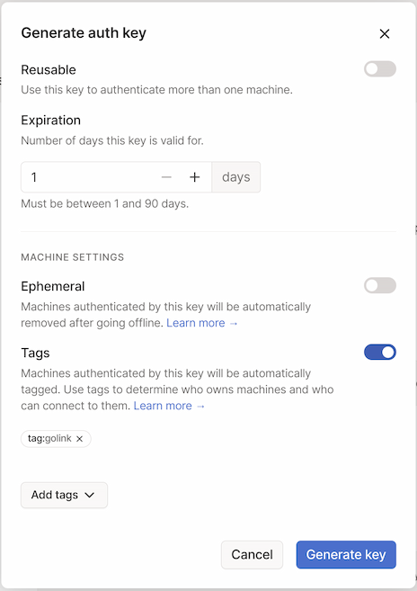
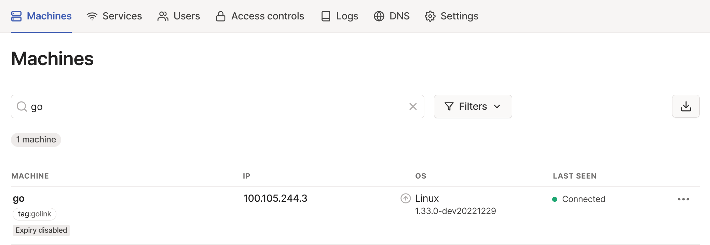
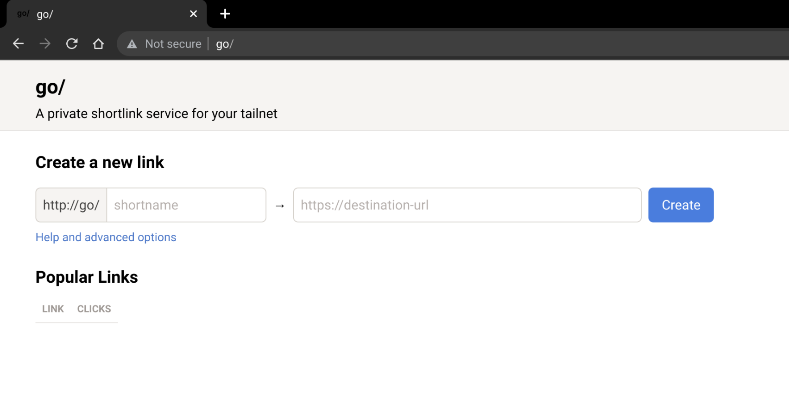
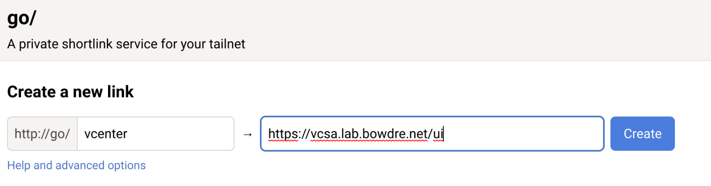

I've shared in the past about how I use [custom search engines in Chrome](/abusing-chromes-custom-search-engines-for-fun-and-profit/) as quick web shortcuts. And I may have mentioned [my love for Tailscale](/tags/tailscale/) a time or two as well. Well I recently learned of a way to combine these two passions: [Tailscale golink](https://github.com/tailscale/golink). The [golink announcement post on the Tailscale blog](https://tailscale.com/blog/golink/) offers a great overview of the service:
> Using golink, you can create and share simple go/name links for commonly accessed websites, so that anyone in your network can access them no matter the device they’re on — without requiring browser extensions or fiddling with DNS settings. And because golink integrates with Tailscale, links are private to users in your tailnet without any separate user management, logins, or security policies.

And these go links don't have to be simply static shortcuts either; they can also conditionally insert text into the target URL. That lets the shortcuts work similarly to my custom search engines in Chrome, but they are available on *any* device in my tailnet rather than just those that run Chrome. The shortcuts even work from command-line utilities like `curl`, provided that you pass a flag like `-L` to follow redirects.


Sounds great - but how do you actually make golink available on your tailnet? Well, here's what I did to deploy the [golink Docker image](https://github.com/tailscale/golink/pkgs/container/golink) on a [Photon OS VM I set up running on my Quartz64 running ESXi-ARM](/esxi-arm-on-quartz64/#workload-creation).

### Tailnet prep
There are three things I'll need to do in the Tailscale admin portal before moving on:
#### Create an ACL tag
I assign ACL tags to devices in my tailnet based on their location and/or purpose, and I'm then able to use those in a policy to restrict access between certain devices. To that end, I'm going to create a new `tag:golink` tag for this purpose. Creating a new tag in Tailscale is really just going to the [Access Controls page of the admin console](https://login.tailscale.com/admin/acls) and editing the policy to specify a `tagOwner` who is permitted to assign the tag:
```text {hl_lines=[11]}
	"groups":
		"group:admins": ["john@example.com"],
	},
	"tagOwners": {
		"tag:home":   ["group:admins"],
		"tag:cloud":  ["group:admins"],
		"tag:client": ["group:admins"],
		"tag:dns":    ["group:admins"],
		"tag:rsync":  ["group:admins"],
		"tag:funnel": ["group:admins"],
		"tag:golink": ["group:admins"],
	},
```

#### Configure ACL access
This step is really only necessary since I've altered the default Tailscale ACL and prevent my nodes from communicating with each other unless specifically permitted. I want to make sure that everything on my tailnet can access golink:

```text
"acls": [
		{
			// make golink accessible to everything
			"action": "accept",
			"users":  ["*"],
			"ports": [
				"tag:golink:80",
			],
		},
  ...
	],
```

#### Create an auth key
The last prerequisite task is to create a new authentication key that the golink container can use to log in to Tailscale since I won't be running `tailscale` interactively. This can easily be done from the [Settings page](https://login.tailscale.com/admin/settings/keys). I'll go ahead and set the key to expire in 1 day (since I'm going to use it in just a moment), make sure that the Ephemeral option is _disabled_ (since I don't want the new node to lose its authorization once it disconnects), and associate it with my new `tag:golink` tag.



Applying that tag does two things for me: (1) it makes it easy to manage access with the ACL policy file edited above, and (2) it automatically sets it so that the node's token won't automatically expire. Once it's auth'd and connected to my tailnet, it'll stay there.

After clicking the **Generate key** button, the key will be displayed. This is the only time it will be visible so be sure to copy it somewhere safe!


### Docker setup
The [golink repo](https://github.com/tailscale/golink) offers this command for running the container:
```shell
docker run -it --rm ghcr.io/tailscale/golink:main
```

The doc also indicates that I can pass the auth key to the golink service via the `TS_AUTHKEY` environment variable, and that all the configuration will be stored in `/home/nonroot` (which will be owned by uid/gid `65532`). I'll take this knowledge and use it to craft a `docker-compose.yml` to simplify container management.

```shell
mkdir -p golink/data
cd golink
chmod 65532:65532 data
vi docker-compose.yaml
```

```yaml
# golink docker-compose.yaml
version: '3'
services:
  golink:
    container_name: golink
    restart: unless-stopped
    image: ghcr.io/tailscale/golink:main
    volumes:
      - './data:/home/nonroot'
    environment:
      - TS_AUTHKEY=MY_TS_AUTHKEY
```

I can then start the container with `sudo docker-compose up -d`, and check the Tailscale admin console to see that the new machine was registered successfully:


And I can point a web browser to `go/` and see the (currently-empty) landing page:


{}
The `TS_AUTHKEY` is only needed for this initial authentication; now that the container is connected to my Tailnet I can remove that line from the `docker-compose.yaml` file to avoid having a sensitive credential hanging around. Future (re)starts of the container will use the token stored in the golink database.
{}

### Get go'ing
Getting started with golink is pretty simple - just enter a shortname and a destination:


So now when I enter `go/vcenter` it will automatically take me to the vCenter in my homelab. That's handy... but we can do better. You see, golink also supports Go template syntax, which allows it to behave a bit like those custom search engines I mentioned earlier.

I can go to `go/.detail/LINK_NAME` to edit the link, so I hit up `go/.detail/vcenter` and add a bit to the target URL:
```
https://vcsa.lab.bowdre.net/ui/{{with .Path}}app/search?query={{.}}&searchType=simple{{end}}
```

Now if I just enter `go/vcenter` I will go to the vSphere UI, while if I enter something like `go/vcenter/vm_name` I will instead be taken directly to the corresponding search results.

Some of my other golinks:

| Shortlink | Destination URL | Description |
| --- | --- | --- |
| `code` | `https://github.com/search?type=code&q=user:jbowdre{{with .Path}}+{{.}}{{end}}` | searches my code on Github |
| `ipam` | `https://ipam.lab.bowdre.net/{{with .Path}}tools/search/{{.}}{{end}}` | searches my lab phpIPAM instance |
| `pdb` | `https://www.protondb.com/{{with .Path}}search?q={{.}}{{end}}` | searches [protondb](https://www.protondb.com/), super-handy for checking game compatibility when [Tailscale is installed on a Steam Deck](https://tailscale.com/blog/steam-deck/) |
| `tailnet` | `https://login.tailscale.com/admin/machines?q={{.Path}}` | searches my Tailscale admin panel for a machine name |
| `vpot8` | `https://www.virtuallypotato.com/{{with .Path}}search?query={{.}}{{end}}` | searches this here site |
| `sho` | `https://www.shodan.io/{{with .Path}}search?query={{.}}{{end}}` | searches Shodan for interesting internet-connected systems |
| `tools` | `https://neeva.com/spaces/m_Bhx8tPfYQbOmaW1UHz-3a_xg3h2amlogo2GzgD` | shortcut to my [Tech Toolkit space](https://neeva.com/spaces/m_Bhx8tPfYQbOmaW1UHz-3a_xg3h2amlogo2GzgD) on Neeva |
| `randpass` | `https://www.random.org/passwords/?num=1\u0026len=24\u0026format=plain\u0026rnd=new` | generates a random 24-character string suitable for use as a password (`curl`-friendly) |
| `wx` | `https://wttr.in/{{ .Path }}` | local weather report based on geolocation or weather for a designated city (`curl`-friendly) |

#### Back up and restore
You can browse to `go/.export` to see a JSON-formatted listing of all configured shortcuts - or, if you're clever, you could do something like `curl http://go/.export -o links.json` to download a copy.

To restore, just pass `--snapshot /path/to/links.json` when starting golink. What I usually do is copy the file into the `data` folder that I'm mounting as a Docker volume, and then just run:
```shell
sudo docker exec golink /golink --sqlitedb /home/nonroot/golink.db --snapshot /home/nonroot/links.json
```

### Conclusion
This little golink utility has been pretty handy on my Tailnet so far. It seems so simple, but I'm really impressed by how well it works. If you happen to try it out, I'd love to hear how you're putting it to use.