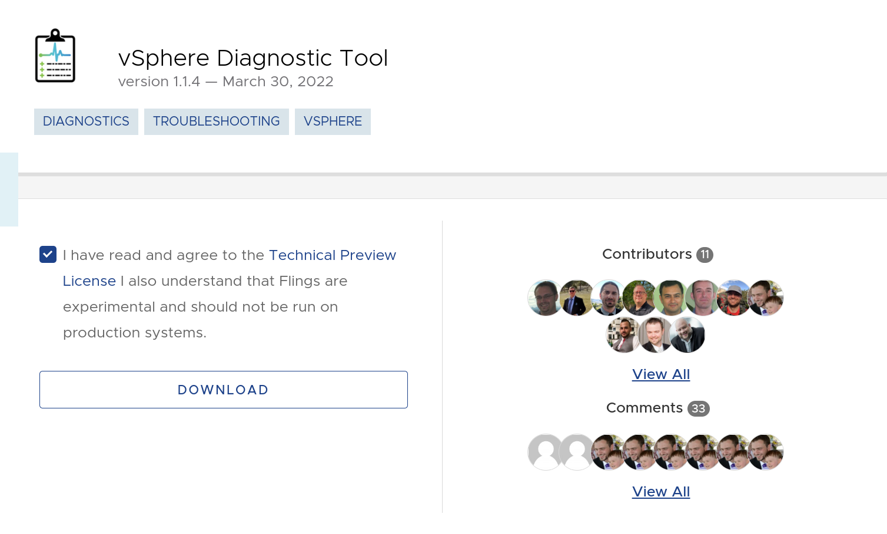

VMware vCenter does wonders for abstracting away the layers of complexity involved in managing a large virtual infrastructure, but when something goes wrong it can be challenging to find exactly where the problem lies. And it can be even harder to proactively address potential issues before they occur. 

Fortunately there's a super-handy utility which can making diagnosing vCenter significantly easier, and it comes in the form of the [vSphere Diagnostic Tool Fling](https://flings.vmware.com/vsphere-diagnostic-tool). VDT is a Python script which can be run directly on a vCenter Server appliance (version 6.5 and newer) to quickly check for problems and misconfigurations affecting:
- vCenter Basic Info
- Lookup Service
- Active Directory
- vCenter Certificates 
- Core Files
- Disk Health
- vCenter DNS 
- vCenter NTP 
- vCenter Port 
- Root Account 
- vCenter Services 
- VCHA

For any problems which are identified, VDT will provide simple instructions and/or links to Knowledge Base articles for more detailed instructions on how to proceed with resolving the issues. Sounds pretty useful, right? And yet, somehow, I keep forgetting that VDT is a thing. So here's a friendly reminder to myself of how to obtain and use VDT to fix vSphere woes. Let's get started.

### 1. Obtain
Obtaining the vSphere Diagnostic Tool is very easy. Just point a browser to https://flings.vmware.com/vsphere-diagnostic-tool, tick the box to agree to the Technical Preview License, and click the big friendly **Download** button.


It will show up in `.zip` format.

### 2. Deploy
This needs to be run directly on the vCenter appliance so you'll need to copy the `.zip` package onto that server. [Secure Copy Protocol (SCP)](https://en.wikipedia.org/wiki/Secure_copy_protocol) is a great way to make that happen. By default, though, the VCSA uses a limited Appliance Shell which won't allow for file transfers. Fortunately it's easy to [follow this KB](https://kb.vmware.com/s/article/2100508) to switch that to a more conventional `bash` shell:

1. SSH to the VCSA.
2. Execute `shell` to launch the `bash` shell.
3. Execute `chsh -s /bin/bash` to set `bash` as the default shell.


Once that's done, just execute this on your local workstation to copy the `.zip` from your `~/Downloads/` folder to the VCSA's `/tmp/` directory:
```shell
scp ~/Downloads/vdt-v1.1.4.zip root@vcsa.lab.bowdre.net:/tmp/
```

### 3. Extract
Now pop back over to an SSH session to the VCSA, extract the `.zip`, and get ready for action:
```shell
root@VCSA [ ~ ]# cd /tmp

root@VCSA [ /tmp ]# unzip vdt-v1.1.4.zip
Archive:  vdt-v1.1.4.zip
3557676756cffd658fd61aab5a6673269104e83c
  creating: vdt-v1.1.4/
  ...
  inflating: vdt-v1.1.4/vdt.py

root@VCSA [ /tmp ]# cd vdt-v1.1.4/
```

### 4. Execute
Now for the fun part:
```shell
root@VCSA [ /tmp/vdt-v1.1.4 ]# python vdt.py
_________________________
   RUNNING PULSE CHECK

Today: Sunday, August 28 19:53:00
Version: 1.1.4
Log Level: INFO

Provide password for administrator@vsphere.local:
```

After entering the SSO password, VDT will run for a few minutes and generate an on-screen report of its findings. Reports can also be found in the `/var/log/vmware/vdt/` directory.

### 5. Review
Once the script has completed, it's time to look through the results and fix whatever can be found. As an example, here are some of the findings from my _deliberately-broken-for-the-purposes-of-this-post_ vCenter:

#### Hostname/PNID mismatch
```log {hl_lines=[8,9,23,24]}
   VCENTER BASIC INFO
BASIC:
        Current Time: 2022-08-28 19:54:08.370889
        vCenter Uptime: up 2 days
        vCenter Load Average: 0.26, 0.19, 0.12
        Number of CPUs: 2
        Total Memory: 11.71
        vCenter Hostname: VCSA
        vCenter PNID: vcsa.lab.bowdre.net
        vCenter IP Address: 192.168.1.12
        Proxy Configured: "no"
        NTP Servers: pool.ntp.org
        vCenter Node Type: vCenter with Embedded PSC
        vCenter Version: 7.0.3.00800 - 20150588
DETAILS:
        vCenter SSO Domain: vsphere.local
        vCenter AD Domain: No DOMAIN
        Number of ESXi Hosts: 2
        Number of Virtual Machines: 25
        Number of Clusters: 1
        Disabled Plugins: None

[FAIL]  The hostname and PNID do not match!
        Please see https://kb.vmware.com/s/article/2130599 for more details.
```
Silly me - I must have changed the hostname at some point, which is not generally a Thing Which Should Be done. I can quickly [consult the referenced KB](https://kb.vmware.com/s/article/2130599) to figure out how to fix my mistake using the `/opt/vmware/share/vami/vami_config_net` utility.

#### Missing DNS
```log {hl_lines=[3,4,5,12,13]}
Nameserver Queries
192.168.1.5
 [FAIL] DNS with UDP - unable to resolve vcsa to 192.168.1.12
 [FAIL] Reverse DNS - unable to resolve 192.168.1.12 to vcsa
 [FAIL] DNS with TCP - unable to resolve vcsa to 192.168.1.12

 Commands used:
  dig +short <fqdn> <nameserver>
  dig +noall +answer -x <ip> <namserver>
  dig +short +tcp <fqdn> <nameserver>

RESULT: [FAIL]
Please see KB: https://kb.vmware.com/s/article/54682
```
Whoops - I guess I should go recreate the appropriate DNS records.

#### Old core files
```log
   CORE FILE CHECK
INFO:
These core files are older than 72 hours.  consider deleting them
at your discretion to reduce the size of log bundles.
  FILES:
        /storage/core/core.SchedulerCron.p.11919 Size: 34.36MB Last Modified: 2022-08-03T22:28:01
        /storage/core/core.python.1445 Size: 20.8MB Last Modified: 2022-08-03T22:13:37
        /storage/core/core.python.27513 Size: 41.12MB Last Modified: 2022-07-28T04:43:55
        /storage/core/core.ParGC.6 Size: 802.82MB Last Modified: 2022-07-28T04:38:54
        /storage/core/core.python.12536 Size: 39.82MB Last Modified: 2022-07-28T04:18:41
        /storage/core/core.python.50223 Size: 281.55MB Last Modified: 2022-07-13T22:22:13
        /storage/core/core.lsassd.56082 Size: 256.82MB Last Modified: 2022-07-13T22:16:53
        /storage/core/core.SchedulerCron.p.21078 Size: 29.52MB Last Modified: 2022-06-25T11:05:01
        /storage/core/core.python.19815 Size: 25.44MB Last Modified: 2022-06-25T11:03:06
        /storage/core/core.python.51946 Size: 25.8MB Last Modified: 2022-06-18T10:22:08
        /storage/core/core.python.40291 Size: 25.44MB Last Modified: 2022-06-13T11:21:26
        /storage/core/core.python.14872 Size: 43.97MB Last Modified: 2022-06-13T10:35:04
        /storage/core/core.python.11833 Size: 20.71MB Last Modified: 2022-06-13T10:30:01
        /storage/core/core.python.35275 Size: 42.87MB Last Modified: 2022-06-13T07:17:27
        /storage/core/core.VM.6 Size: 1.21GB Last Modified: 2022-06-13T00:38:56
[INFO]  Number of core files: 15
```
Those core files can be useful for investigating specific issues, but holding on to them long-term doesn't really do much good. _After checking to be sure I don't need them_, I can get rid of them all pretty easily like so:

```shell
find /storage/core/ -name "core.*" -type f -mtime +3 -exec rm {} \;
```

#### NTP status
```log
   VC NTP CHECK
[FAIL] NTP and Host time are both disabled!
```
Oh yeah, let's turn that back on with `systemctl start ntpd`.

#### Account status
```log
   Root Account Check
[FAIL]  Root password expires in 13 days
        Please search for 'Change the Password of the Root User'
        in vCenter documentation.
```
That's a good thing to know. I'll [take care of that](https://docs.vmware.com/en/VMware-vSphere/7.0/com.vmware.vsphere.vcenter.configuration.doc/GUID-48BAF973-4FD3-4FF3-B1B6-5F7286C9B59A.html) while I'm thinking about it.

```shell
chage -M -1 -E -1 root
```

#### Recheck
Now that I've corrected these issues, I can run VDT again to confirm that everything is back in a good state:

```log {hl_lines=[8,9,"25-27",32,35,"55-56",59]}
   VCENTER BASIC INFO
  BASIC:
        Current Time: 2022-08-28 20:13:25.192503
        vCenter Uptime: up 2 days
        vCenter Load Average: 0.28, 0.14, 0.10
        Number of CPUs: 2
        Total Memory: 11.71
        vCenter Hostname: vcsa.lab.bowdre.net
        vCenter PNID: vcsa.lab.bowdre.net
        vCenter IP Address: 192.168.1.12
        Proxy Configured: "no"
        NTP Servers: pool.ntp.org
        vCenter Node Type: vCenter with Embedded PSC
        vCenter Version: 7.0.3.00800 - 20150588
DETAILS:
        vCenter SSO Domain: vsphere.local
        vCenter AD Domain: No DOMAIN
        Number of ESXi Hosts: 2
        Number of Virtual Machines: 25
        Number of Clusters: 1
        Disabled Plugins: None
[...]
Nameserver Queries
192.168.1.5
 [PASS] DNS with UDP - resolved vcsa.lab.bowdre.net to 192.168.1.12
 [PASS] Reverse DNS - resolved 192.168.1.12 to vcsa.lab.bowdre.net
 [PASS] DNS with TCP - resolved vcsa.lab.bowdre.net to 192.168.1.12
 Commands used:
  dig +short <fqdn> <nameserver>
  dig +noall +answer -x <ip> <namserver>
  dig +short +tcp <fqdn> <nameserver>
RESULT: [PASS]
[...]
   CORE FILE CHECK
[PASS]  Number of core files: 0
[PASS]  Number of hprof files: 0
[...]
NTP Status Check
+-----------------------------------LEGEND-----------------------------------+
| remote: NTP peer server                                                    |
| refid: server that this peer gets its time from                            |
| when: number of seconds passed since last response                         |
| poll: poll interval in seconds                                             |
| delay: round-trip delay to the peer in milliseconds                        |
| offset: time difference between the server and client in milliseconds      |
+-----------------------------------PREFIX-----------------------------------+
| * Synchronized to this peer                                                |
| # Almost synchronized to this peer                                         |
| + Peer selected for possible synchronization                               |
| – Peer is a candidate for selection                                        |
| ~ Peer is statically configured                                            |
+----------------------------------------------------------------------------+
     remote           refid      st t when poll reach   delay   offset  jitter
==============================================================================
*104.171.113.34  130.207.244.240  2 u    1   64   17   16.831  -34.597   0.038
RESULT: [PASS]
[...]
   Root Account Check
[PASS]  Root password never expires
```
All better!

### Conclusion
The vSphere Diagnostic Tool makes a great addition to your arsenal of troubleshooting skills and utilities. It makes it easy to troubleshoot errors which might occur in your vSphere environment, as well as to uncover dormant issues which could cause serious problems in the future. 