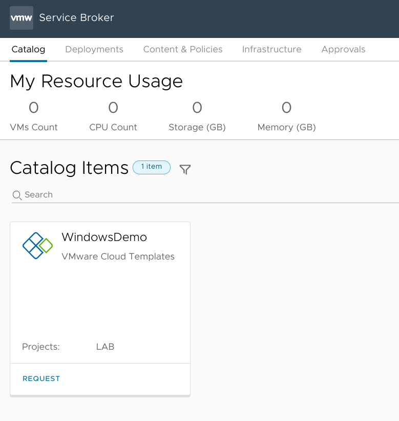
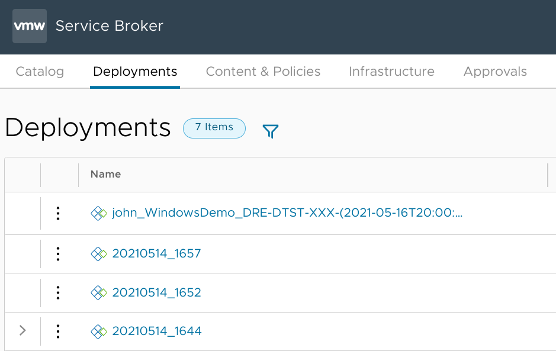

My [last post in this series](/vra8-custom-provisioning-part-three) marked the completion of the vRealize Orchestrator workflow that I use for pre-provisioning tasks, namely generating a unique *sequential* hostname which complies with a defined naming standard and doesn't conflict with any existing records in vSphere, Active Directory, or DNS. That takes care of many of the "back-end" tasks for a simple deployment. 

This post will add in some "front-end" operations, like creating a customized VM request form in Service Broker and dynamically populating a drop-down with a list of networks available at the user-selected deployment site. I'll also take care of some housekeeping items like automatically generating a unique deployment name. 

### Getting started with Service Broker Custom Forms
So far, I've been working either in the Cloud Assembly or Orchestrator UIs, both of which are really geared toward administrators. Now I'm going to be working with Service Broker which will provide the user-facing front-end. This is where "normal" users will be able to submit provisioning requests without having to worry about any of the underlying infrastructure or orchestration. 

Before I can do anything with my Cloud Template in the Service Broker UI, though, I'll need to release it from Cloud Assembly. I do this by opening the template on the *Design* tab and clicking the *Version* button at the bottom of the screen. I'll label this as `1.0` and tick the checkbox to *Release this version to the catalog*. 


I can then go to the Service Broker UI and add a new Content Source for my Cloud Assembly templates.


After hitting the *Create & Import* button, all released Cloud Templates in the selected Project will show up in the Service Broker *Content* section:


In order for users to deploy from this template, I also need to go to *Content Sharing*, select the Project, and share the content. This can be done either at the Project level or by selecting individual content items. 


That template now appears on the Service Broker *Catalog* tab:


That's cool and all, and  I could go ahead and request a deployment off of that catalog item right now - but I'm really interested in being able to customize the request form. I do that by clicking on the little three-dot menu icon next to the Content entry and selecting the *Customize form* option.


When you start out, the custom form kind of jumbles up the available fields. So I'm going to start by dragging-and-dropping the fields to resemble the order defined in the Cloud Template:


In addition to rearranging the request form fields, Custom Forms also provide significant control over how the form behaves. You can change how a field is displayed, define default values, make fields dependent upon other fields and more. For instance, all of my templates and resources belong to a single project so making the user select the project (from a set of 1) is kind of redundant. Every deployment has to be tied to a project so I can't just remove that field, but I can select the "Project" field on the canvas and change its *Visibility* to "No" to hide it. It will silently pass along the correct project ID in the background without cluttering up the form.


How about that Deployment Name field? In my tests, I'd been manually creating a string of numbers to uniquely identify the deployment, but I'm not going to ask my users to do that. Instead, I'll leverage another great capability of Custom Forms - tying a field value to a result of a custom vRO action!

### Automatic deployment naming
*[Update] I've since come up with what I think is a better approach to handling this. Check it out [here](/vra8-automatic-deployment-naming-another-take)!*

That means it's time to dive back into the vRealize Orchestrator interface and whip up a new action for this purpose. I created a new action within my existing `net.bowdre.utility` module called `createDeploymentName`. 


A good deployment name *must* be globally unique, and it would be great if it could also convey some useful information like who requested the deployment, which template it is being deployed from, and the purpose of the server. The `siteCode (String)`, `envCode (String)`, `functionCode (String)`, and `appCode (String)` variables from the request form will do a great job of describing the server's purpose. I can also pass in some additional information from the Service Broker form like `catalogItemName (String)` to get the template name and `requestedByName (String)` to identify the user making the request. So I'll set all those as inputs to my action:


I also went ahead and specified that the action will return a String.

And now for the code. I really just want to mash all those variables together into a long string, and I'll also add a timestamp to make sure each deployment name is truly unique.

```js
//  JavaScript: createDeploymentName
//    Inputs: catalogItemName (String), requestedByName (String), siteCode (String), 
//        envCode (String), functionCode (String), appCode (String)
//    Returns: deploymentName (String)

var deploymentName = ''

// we don't want to evaluate this until all requested fields have been completed
if (catalogItemName != '' && requestedByName != null && siteCode != null && envCode != null && functionCode != null && appCode != null) {
    var date = new Date()
    deploymentName = requestedByName + "_" + catalogItemName + "_" + siteCode + "-" + envCode.substring(0,1) + functionCode + "-" + appCode.toUpperCase() + "-(" + date.toISOString() + ")"
    System.debug("Returning deploymentName: " + deploymentName)
}
return deploymentName
```

With that sorted, I can go back to the Service Broker interface to modify the custom form a bit more. I select the "Deployment Name" field and click over to the Values tab on the right. There, I set the *Value source* to "External source" and *Select action* to the new action I just created, `net.bowdre.utility/createDeploymentName`. (If the action doesn't appear in the search field, go to *Infrastructure > Integrations > Embedded-VRO* and click the "Start Data Collection" button to force vRA to update its inventory of vRO actions and workflows.) I then map all the action's inputs to properties available on the request form.


The last step before testing is to click that *Enable* button to activate the custom form, and then the *Save* button to save my work. So did it work? Let's head to the *Catalog* tab and open the request:


Cool! So it's dynamically generating the deployment name based on selections made on the form. Now that it works, I can go back to the custom form and set the "Deployment Name" field to be invisible just like the "Project" one.

### Per-site network selection
So far, vRA has been automatically placing VMs on networks based solely on  [which networks are tagged as available](/vra8-custom-provisioning-part-one#using-tags-for-resource-placement)  for the selected site. I'd like to give my users a bit more control over which network their VMs get attached to, particularly as some networks may be set aside for different functions or have different firewall rules applied.

As a quick recap, I've got five networks available for vRA, split across my two sites using tags:

|Name |Subnet |Site |Tags |
| --- | --- | --- | --- |
| d1620-Servers-1 | 172.16.20.0/24 | BOW | `net:bow` |
| d1630-Servers-2 | 172.16.30.0/24 | BOW | `net:bow` |
| d1640-Servers-3 | 172.16.40.0/24 | BOW | `net:bow` |
| d1650-Servers-4 | 172.16.50.0/24 | DRE | `net:dre` |
| d1660-Servers-5 | 172.16.60.0/24 | DRE | `net:dre` |

I'm going to add additional tags to these networks to further define their purpose.

|Name |Purpose |Tags |
| --- | --- | --- | 
| d1620-Servers-1 |Management | `net:bow`, `net:mgmt` |
| d1630-Servers-2 | Front-end | `net:bow`, `net:front` |
| d1640-Servers-3 | Back-end | `net:bow`, `net:back` |
| d1650-Servers-4 | Front-end | `net:dre`, `net:front` |
| d1660-Servers-5 |  Back-end | `net:dre`, `net:back` |

I *could* just use those tags to let users pick the appropriate network, but I've found that a lot of times users don't know why they're picking a certain network, they just know the IP range they need to use. So I'll take it a step further and add a giant tag to include the Site, Purpose, and Subnet, and this is what will ultimately be presented to the users:

|Name |Tags |
| --- | --- | 
| d1620-Servers-1 | `net:bow`, `net:mgmt`, `net:bow-mgmt-172.16.20.0` |
| d1630-Servers-2 | `net:bow`, `net:front`, `net:bow-front-172.16.30.0` |
| d1640-Servers-3 | `net:bow`, `net:back`, `net:bow-back-172.16.40.0` |
| d1650-Servers-4 | `net:dre`, `net:front`, `net:dre-front-172.16.50.0` |
| d1660-Servers-5 | `net:dre`, `net:back`, `net:dre-back-172.16.60.0` |


So I can now use a single tag to positively identify a single network, as long as I know its site and either its purpose or its IP space. I'll reference these tags in a vRO action that will populate a dropdown in the request form with the available networks for the selected site. Unfortunately I couldn't come up with an easy way to dynamically pull the tags into vRO so I create another Configuration Element to store them:


This gets filed under the existing `CustomProvisioning` folder, and I name it `networksPerSite`. Each site gets a new variable of type `Array/string`. The name of the variable matches the site ID, and the contents are just the tags minus the `net:` prefix. 

I created a new action named (appropriately) `getNetworksForSite`. This will accept `siteCode (String)` as its input from the Service Broker request form, and will return an array of strings containing the available networks.


```js
// JavaScript: getNetworksForSite
//    Inputs: siteCode (String)
//    Returns: site.value (Array/String)

// Get networksPerSite configurationElement
var category = Server.getConfigurationElementCategoryWithPath("CustomProvisioning")
var elements = category.configurationElements
for (var i in elements) {
    if (elements[i].name == "networksPerSite") {
        var networksPerSite = elements[i]
    }
}

// Lookup siteCode and find available networks
try {
    var site = networksPerSite.getAttributeWithKey(siteCode)
} catch (e) {
    System.debug("Invalid site.");
} finally {
    return site.value
}
```

Back in Cloud Assembly, I edit the Cloud Template to add an input field called `network`:

```yaml
inputs:
  [...]
  network:
    type: string
    title: Network
  [...]
```

and update the resource configuration for the network entity to constrain it based on `input.network` instead of `input.site` as before:

```yaml
resources:
  Cloud_vSphere_Machine_1:
    type: Cloud.vSphere.Machine
    properties:
      <...>
      networks:
        - network: '${resource.Cloud_vSphere_Network_1.id}'
          assignment: static
      constraints:
        - tag: 'comp:${to_lower(input.site)}'
  Cloud_vSphere_Network_1:
    type: Cloud.vSphere.Network
    properties:
      networkType: existing
      constraints:
        # - tag: 'net:${to_lower(input.site)}'
        - tag: 'net:${input.network}'
```

Remember that the `networksPerSite` configuration element contains the portion of the tags *after* the `net:` prefix so that's why I include the prefix in the constraint tag here. I just didn't want it to appear in the selection dropdown.

After making this change to the Cloud Template I use the "Create Version" button again to create a new version and tick the option to release it so that it can be picked up by Service Broker.


Back on the Service Broker UI, I hit my `LAB` Content Source again to Save & Import the new change, and then go to customize the form for `WindowsDemo` again. After dragging-and-dropping the new `Network` field onto the request form blueprint, I kind of repeat the steps I used for adjusting the Deployment Name field earlier. On the Appearance tab I set it to be a DropDown, and on the Values tab I set it to an external source, `net.bowdre.utility/getNetworksForSite`. This action only needs a single input so I map `Site` on the request form to the `siteCode` input.


Now I can just go back to the Catalog tab and request a new deployment to check out my--


Oh yeah. That vRO action gets called as soon as the request form loads - before selecting the required site code as an input. I could modify the action so that returns an empty string if the site hasn't been selected yet, but I'm kind of lazy so I'll instead just modify the custom form so that the Site field defaults to the `BOW` site. 


*Now* I can open up the request form and see how well it works:


Noice!

### Putting it all together now
At this point, I'll actually kick off a deployment and see how everything works out.


After hitting Submit, I can see that this deployment has a much more friendly name than the previous ones:


And I can also confirm that the VM got named appropriately (based on the [naming standard I implemented earlier](vra8-custom-provisioning-part-two)), and it also got placed on the `172.16.60.0/24` network I selected.


Very slick. And I think that's a great stopping point for today.

Coming up, I'll describe how I create AD computer objects in site-specific OUs, add notes and custom attributes to the VM in vSphere, and optionally create static DNS records on a Windows DNS server. 