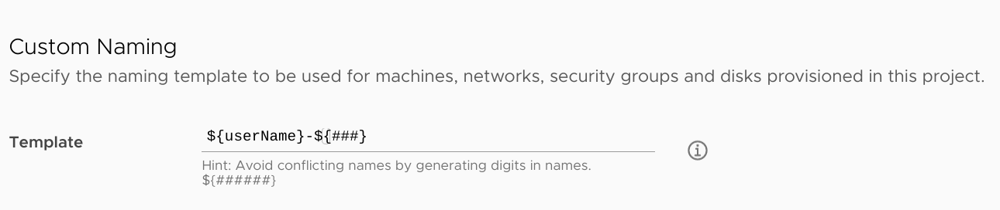
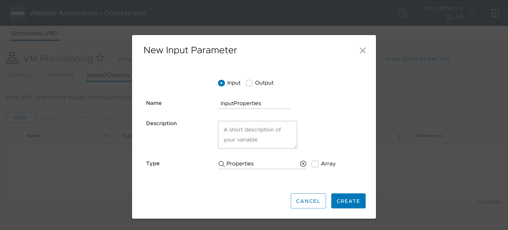
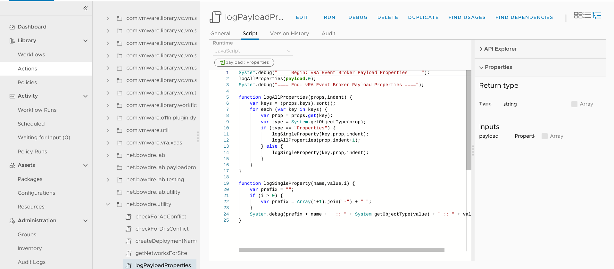
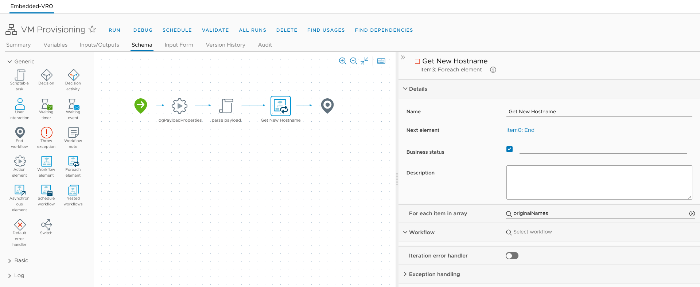
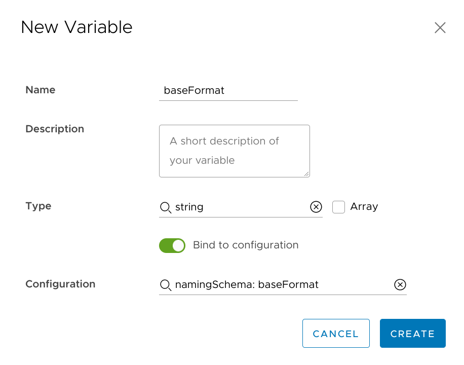
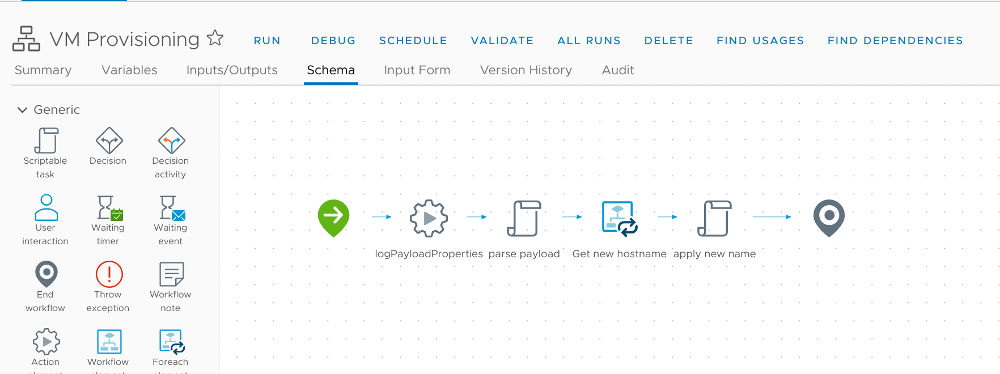

We [last left off this series](/vra8-custom-provisioning-part-one) after I'd set up vRA, performed a test deployment off of a minimal cloud template, and then enhanced the simple template to use vRA tags to let the user specify where a VM should be provisioned. But these VMs have kind of dumb names; right now, they're just getting named after the user who requests it + a random couple of digits, courtesy of a simple [naming template defined on the project's Provisioning page](https://docs.vmware.com/en/vRealize-Automation/8.3/Using-and-Managing-Cloud-Assembly/GUID-AD400ED7-EB3A-4D36-B9A7-81E100FB3003.html?hWord=N4IghgNiBcIHZgLYEs4HMQF8g):


I could use this naming template to *almost* accomplish what I need from a naming solution, but I don't like that the numbers are random rather than an sequence (I want to deploy `server001` followed by `server002` rather than `server343` followed by `server718`). And it's not enough for me that a VM's name be unique just within the scope of vRA - the hostname should be unique across my entire environment. 

So I'm going to have to get my hands dirty and develop a new solution using vRealize Orchestrator. For right now, it should create a name for a VM that fits a defined naming schema, while also ensuring that the name doesn't already exist within vSphere. (I'll add checks against Active Directory and DNS in the next post.)

### What's in a name?
For my environment, servers should be named like `BOW-DAPP-WEB001` where:
- `BOW` indicates the site code.
- `D` describes the environment, Development in this case.
- `APP` designates the server's function; this one is an application server.
- `WEB` describes the primary application running on the server; this one hosts a web server.
- `001` is a three-digit sequential designation to differentiate between similar servers.

So in vRA's custom naming template syntax, this could look something like:
- `${site}-${environment}${function}-${application}${###}`

Okay, this plan is coming together. 

### Adding more inputs to the cloud template
I'll start by adding those fields as inputs on my cloud template.

I already have a `site` input at the top of the template, used for selecting the deployment location. I'll leave that there:

```yaml
inputs:
  site:
    type: string
    title: Site
    enum:
      - BOW
      - DRE
```

I'll add the rest of the naming components below the prompts for image selection and size, starting with a dropdown of environments to pick from:

```yaml
  environment:
    type: string
    title: Environment
    enum:
      - Development
      - Testing
      - Production
    default: Development
```

And a dropdown for those function options:

```yaml
  function:
    type: string
    title: Function Code
    oneOf:
      - title: Application (APP)
        const: APP
      - title: Desktop (DSK)
        const: DSK
      - title: Network (NET)
        const: NET
      - title: Service (SVS)
        const: SVS
      - title: Testing (TST)
        const: TST
    default: TST
```

And finally a text entry field for the application descriptor. Note that this one includes the `minLength` and `maxLength` constraints to enforce the three-character format.

```yaml
  app:
    type: string
    title: Application Code
    minLength: 3
    maxLength: 3
    default: xxx
```

*We won't discuss what kind of content this server is going to host...*

I then need to map these inputs to the resource entity at the bottom of the template so that they can be passed to vRO as custom properties. All of these are direct mappings except for `environment` since I only want the first letter. I use the `substring()` function to achieve that, but wrap it in a conditional so that it won't implode if the environment hasn't been picked yet. I'm also going to add in a `dnsDomain` property that will be useful later when I need to query for DNS conflicts.

```yaml
resources:
  Cloud_vSphere_Machine_1:
    type: Cloud.vSphere.Machine
    properties:
      image: '${input.image}'
      flavor: '${input.size}'
      site: '${input.site}'
      environment: '${input.environment != "" ? substring(input.environment,0,1) : ""}'
      function: '${input.function}'
      app: '${input.app}'
      dnsDomain: lab.bowdre.net
```

So here's the complete template:

```yaml
formatVersion: 1
inputs:
  site:
    type: string
    title: Site
    enum:
      - BOW
      - DRE
  image:
    type: string
    title: Operating System
    oneOf:
      - title: Windows Server 2019
        const: ws2019
    default: ws2019
  size:
    title: Resource Size
    type: string
    oneOf:
      - title: 'Micro [1vCPU|1GB]'
        const: micro
      - title: 'Tiny [1vCPU|2GB]'
        const: tiny
      - title: 'Small [2vCPU|2GB]'
        const: small
    default: small
  environment:
    type: string
    title: Environment
    enum:
      - Development
      - Testing
      - Production
    default: Development
  function:
    type: string
    title: Function Code
    oneOf:
      - title: Application (APP)
        const: APP
      - title: Desktop (DSK)
        const: DSK
      - title: Network (NET)
        const: NET
      - title: Service (SVS)
        const: SVS
      - title: Testing (TST)
        const: TST
    default: TST
  app:
    type: string
    title: Application Code
    minLength: 3
    maxLength: 3
    default: xxx
resources:
  Cloud_vSphere_Machine_1:
    type: Cloud.vSphere.Machine
    properties:
      image: '${input.image}'
      flavor: '${input.size}'
      site: '${input.site}'
      environment: '${input.environment != "" ? substring(input.environment,0,1) : ""}'
      function: '${input.function}'
      app: '${input.app}'
      dnsDomain: lab.bowdre.net
      networks:
        - network: '${resource.Cloud_vSphere_Network_1.id}'
          assignment: static
      constraints:
        - tag: 'comp:${to_lower(input.site)}'
  Cloud_vSphere_Network_1:
    type: Cloud.vSphere.Network
    properties:
      networkType: existing
      constraints:
        - tag: 'net:${to_lower(input.site)}'
```

Great! Here's what it looks like on the deployment request:


...but the deployed VM got named `john-329`. Why?


Oh yeah, I need to create a thing that will take these naming elements, mash them together, check for any conflicts, and then apply the new name to the VM. vRealize Orchestrator, it's your time!

### Setting up vRO config elements
When I first started looking for a naming solution, I found a [really handy blog post from Michael Poore](https://blog.v12n.io/custom-naming-in-vrealize-automation-8x-1/) that described his solution to doing custom naming. I wound up following his general approach but had to adapt it a bit to make the code work in vRO 8 and to add in the additional checks I wanted. So credit to Michael for getting me pointed in the right direction!

I start by hopping over to the Orchestrator interface and navigating to the Configurations section. I'm going to create a new configuration folder named `CustomProvisioning` that will store all the Configuration Elements I'll use to configure my workflows on this project. 


Defining certain variables within configurations separates those from the workflows themselves, making the workflows much more portable. That will allow me to transfer the same code between multiple environments (like my homelab and my lab environment at work) without having to rewrite a bunch of hardcoded values. 

Now I'll create a new configuration within the new folder. This will hold information about the naming schema so I name it `namingSchema`. In it, I create two strings to define the base naming format (up to the numbers on the end) and full name format (including the numbers). I define `baseFormat` and `nameFormat` as templates based on what I put together earlier.


I also create another configuration named `computerNames`. When vRO picks a name for a VM, it will record it here as a `number` variable named after the "base name" (`BOW-DAPP-WEB`) and the last-used sequence as the value (`001`). This will make it quick-and-easy to see what the next VM should be named. For now, though, I just need the configuration to not be empty so I add a single variable named `sample` just to take up space.


Okay, now it's time to get messy.

### The vRO workflow
Just like with the configuration elements, I create a new workflow folder named `CustomProvisioning` to keep all my workflows together. And then I make a `VM Provisioning` workflow that will be used for pre-provisioning tasks.


On the Inputs/Outputs tab of the workflow, I create a single input named `inputProperties` of type `Properties` which will hold all the information about the deployment coming from the vRA side of things.


#### Logging the input properties
The first thing I'll want this workflow to do (particularly for testing) is to tell me about the input data from vRA. That will help to eliminate a lot of guesswork. I could just write a script within the workflow to do that, but creating it as a separate action will make it easier to reuse in other workflows. Behold, the `logPayloadProperties` action (nested within the `net.bowdre.utility` module which contains some spoilers for what else is to come!):


This action has a single input, a `Properties` object named `payload`. (By the way, vRO is pretty particular about variable typing  so going forward I'll reference variables as `variableName (type)`.) Here's the JavaScript that will basically loop through each element and write the contents to the vRO debug log:

```js
// JavaScript: logPayloadProperties
//    Inputs: payload (Properties)
//    Outputs: none

System.debug("==== Begin: vRA Event Broker Payload Properties ====");
logAllProperties(payload,0);
System.debug("==== End: vRA Event Broker Payload Properties ====");

function logAllProperties(props,indent) {
    var keys = (props.keys).sort();
    for each (var key in keys) {
        var prop = props.get(key);
        var type = System.getObjectType(prop);
        if (type == "Properties") {
            logSingleProperty(key,prop,indent);
            logAllProperties(prop,indent+1);
        } else {
            logSingleProperty(key,prop,indent);
        }
    }
}

function logSingleProperty(name,value,i) {
    var prefix = "";
    if (i > 0) {
        var prefix = Array(i+1).join("-") + " ";
    }
    System.debug(prefix + name + " :: " + System.getObjectType(value) + " :: " + value);
}
```

Going back to my VM Provisioning workflow, I drag an Action Element onto the canvas and tie it to my new action, passing in `inputProperties (Properties)` as the input:


#### Event Broker Subscription
And at this point I save the workflow. I'm not finished with it - not by a long shot! - but this is a great place to get the workflow plumbed up to vRA and run a quick test. So I go to the vRA interface, hit up the Extensibility tab, and create a new subscription. I name it "VM Provisioning" and set it to fire on the "Compute allocation" event, which will happen right before the VM starts getting created. I link in my VM Provisioning workflow, and also set this as a blocking execution so that no other/future workflows will run until this one completes. 


Alrighty, let's test this and see if it works. I head back to the Design tab and kick off another deployment.


I'm going to go grab some more coffee while this runs.


And we're back! Now that the deployment completed successfully, I can go back to the Orchestrator view and check the Workflow Runs section to confirm that the VM Provisioning workflow did fire correctly. I can click on it to get more details, and the Logs tab will show me all the lovely data logged by the `logPayloadProperties` action running from the workflow.


That information can also be seen on the Variables tab:


A really handy thing about capturing the data this way is that I can use the Run Again or Debug button to execute the vRO workflow again without having to actually deploy a new VM from vRA. This will be great for testing as I press onward.

(Note that I can't actually edit the workflow directly from this workflow run; I have to go back into the workflow itself to edit it, but then I can re-run the run and it will execute the new code with the already-stored variables.)

#### Wrapper workflow
I'm going to use this VM Provisioning workflow as a sort of top-level wrapper. This workflow will have a task to parse the payload and grab the variables that will be needed for naming a VM, and it will also have a task to actually rename the VM, but it's going to delegate the name generation to another nested workflow. Making the workflows somewhat modular will make it easier to make changes in the future if needed.

Anyway, I drop a Scriptable Task item onto the workflow canvas to handle parsing the payload - I'll call it `parse payload` - and pass it `inputProperties (Properties)` as its input.


The script for this is pretty straight-forward:

```js
// JavaScript: parse payload
//    Inputs: inputProperties (Properties)
//    Outputs: requestProperties (Properties), originalNames (Array/string)

var customProperties = inputProperties.customProperties || new Properties();
var requestProperties = new Properties();

requestProperties.site = customProperties.site;
requestProperties.environment = customProperties.environment;
requestProperties.function = customProperties.function;
requestProperties.app = customProperties.app;
requestProperties.dnsDomain = customProperties.dnsDomain;

System.debug("requestProperties: " + requestProperties)

originalNames = inputProperties.resourceNames || new Array();
System.debug("Original names: " + originalNames)
```

It creates a new `requestProperties (Properties)` variable to store the limited set of properties that will be needed for naming - `site`, `environment`, `function`, and `app`. It also stores a copy of the original `resourceNames (Array/string)`, which will be useful when we need to replace the old name with the new one. To make those two new variables accessible to other parts of the workflow, I'll need to also create the variables at the workflow level and map them as outputs of this task:


I'll also drop in a "Foreach Element" item, which will run a linked workflow once for each item in an input array (`originalNames (Array/string)` in this case). I haven't actually created that nested workflow yet so I'm going to skip selecting that for now.


The final step of this workflow will be to replace the existing contents of `resourceNames (Array/string)` with the new name. 

I'll do that with another scriptable task element, named `Apply new names`, which takes `inputProperties (Properties)` and `newNames (Array/string)` as inputs. It will return `resourceNames (Array/string)` as a *workflow output* back to vRA. vRA will see that `resourceNames` has changed and it will update the name of the deployed resource (the VM) accordingly.

{}
To easily create a new workflow output and bind it to a task's output, click the task's **Add New** option like usual:

Select **Output** at the top of the *New Variable* dialog and the complete the form with the other required details:

{}


And here's the script for that task:

```js
// JavaScript: Apply new names
//    Inputs: inputProperties (Properties), newNames (Array/string)
//    Outputs: resourceNames (Array/string)

resourceNames = inputProperties.get("resourceNames");
for (var i = 0; i < newNames.length; i++) {
    System.log("Replacing resourceName '" + resourceNames[i] + "' with '" + newNames[i] + "'");
    resourceNames[i] = newNames[i];
}
```

Now's a good time to save this workflow (ignoring the warning about it failing validation for now), and create a new workflow that the VM Provisioning workflow can call to actually generate unique hostnames.

### Nested workflow
I'm a creative person so I'm going to call this workflow "Generate unique hostname". It's going to receive `requestProperties (Properties)` as its sole input, and will return `nextVmName (String)` as its sole output.


I will also need to bind a couple of workflow variables to those configuration elements I created earlier. This is done by creating the variable as usual (`baseFormat (string)` in this case), toggling the "Bind to configuration" option, and then searching for the appropriate configuration. It's important to make sure the selected type matches that of the configuration element - otherwise it won't show up in the list.


I do the same for the `nameFormat (string)` variable as well.


#### Task: create lock
Okay, on to the schema. This workflow may take a little while to execute, and it would be bad if another deployment came in while it was running - the two runs might both assign the same hostname without realizing it. Fortunately vRO has a locking system which can be used to avoid that. Accordingly, I'll add a scriptable task element to the canvas and call it `create lock`. It will have two inputs used for identifying the lock so that it can be easily removed later on, so I create a new variable `lockOwner (string)` with the value `eventBroker` and another named `lockId (string)` set to `namingLock`.


The script is very short:

```js
// JavaScript: create lock
//    Inputs: lockOwner (String), lockId (String)
//    Outputs: none

System.debug("Creating lock...")
LockingSystem.lockAndWait(lockId, lockOwner)
```

#### Task: generate hostnameBase
We're getting to the meat of the operation now - another scriptable task named `generate hostnameBase` which will take the naming components from the deployment properties and stick them together in the form defined in the `nameFormat (String)` configuration. The inputs will be the existing `nameFormat (String)`, `requestProperties (Properties)`, and `baseFormat (String)` variables, and it will output new `hostnameBase (String)` ("`BOW-DAPP-WEB`") and `digitCount (Number)` ("`3`", one for each `#` in the format) variables. I'll also go ahead and initialize `hostnameSeq (Number)` to `0` to prepare for a later step.


```js
// JavaScript: generate hostnameBase
//    Inputs: nameFormat (String), requestProperties (Properties), baseFormat (String)
//    Outputs: hostnameBase (String), digitCount (Number), hostnameSeq (Number)

hostnameBase = baseFormat;
digitCount = nameFormat.match(/(#)/g).length;
hostnameSeq = 0;

// Get request keys and drop them into the template
for each (var key in requestProperties.keys) {
    var propValue = requestProperties.get(key);
    hostnameBase = hostnameBase.replace("{{" + key + "}}", propValue);
}

// Remove leading/trailing special characters from hostname base
hostnameBase = hostnameBase.toUpperCase();
hostnameBase = hostnameBase.replace(/([-_]$)/g, "");
hostnameBase = hostnameBase.replace(/^([-_])/g, "");
System.debug("Hostname base: " + hostnameBase)
```

#### Interlude: connecting vRO to vCenter
Coming up, I'm going to want to connect to vCenter so I can find out if there are any existing VMs with a similar name. I'll use the vSphere vCenter Plug-in which is included with vRO to facilitate that, but that means I'll first need to set up that connection. So I'll save the workflow I've been working on (save early, save often) and then go run the preloaded "Add a vCenter Server instance" workflow. The first page of required inputs is pretty self-explanatory:


On the connection properties page, I unchecked the per-user connection in favor of using a single service account, the same one that I'm already using for vRA's connection to vCenter.


After successful completion of the workflow, I can go to Administration > Inventory and confirm that the new endpoint is there:


I've only got the one vCenter in my lab. At work, I've got multiple vCenters so I would need to repeat these steps to add each of them as an endpoint. 

#### Task: prepare vCenter SDK connection
Anyway, back to my "Generate unique hostname" workflow, where I'll add another scriptable task to prepare the vCenter SDK connection. This one doesn't require any inputs, but will output an array of `VC:SdkConnection` objects:


```js
// JavaScript: prepare vCenter SDK connection
//    Inputs: none
//    Outputs: sdkConnections (Array/VC:SdkConnection)

sdkConnections = VcPlugin.allSdkConnections
System.log("Preparing vCenter SDK connection...")
```

#### ForEach element: search VMs by name
Next, I'm going to drop another ForEach element onto the canvas. For each vCenter endpoint in `sdkConnections (Array/VC:SdkConnection)`, it will execute the workflow titled "Get virtual machines by name with PC". I map the required `vc` input to `*sdkConnections (VC:SdkConnection)`, `filter` to `hostnameBase (String)`, and skip `rootVmFolder` since I don't care where a VM resides. And I create a new `vmsByHost (Array/Array)` variable to hold the output.


#### Task: unpack results for all hosts
That `vmsByHost (Array/array)` object contains any and all VMs which match `hostnameBase (String)`, but they're broken down by the host they're running on. So I use a scriptable task to convert that array-of-arrays into a new array-of-strings containing just the VM names.


```js
// JavaScript: unpack results for all hosts
//    Inputs: vmsByHost (Array/Array)
//    Outputs: vmNames (Array/string)

var vms = new Array();
vmNames = new Array();

for (host in vmsByHost) {
    var a = vmsByHost[host]
    for (vm in a) {
        vms.push(a[vm])
    }
}
vmNames = vms.map(function(i) {return (i.displayName).toUpperCase()})
```

#### Task: generate hostnameSeq & candidateVmName
This scriptable task will check the `computerNames` configuration element we created earlier to see if we've already named a VM starting with `hostnameBase (String)`. If such a name exists, we'll increment the number at the end by one, and return that as a new `hostnameSeq (Number)` variable; if it's the first of its kind, `hostnameSeq (Number)` will be set to `1`. And then we'll combine `hostnameBase (String)` and `hostnameSeq (Number)` to create the new `candidateVmName (String)`. If things don't work out, this script will throw `errMsg (String)` so I need to add that as an output exception binding as well.


```js
// JavaScript: generate hostnameSeq & candidateVmName
//    Inputs: hostnameBase (String), digitCount (Number)
//    Outputs: hostnameSeq (Number), computerNames (ConfigurationElement), candidateVmName (String)

// Get computerNames configurationElement, which lives in the 'CustomProvisioning' folder
//    Specify a different path if the CE lives somewhere else
var category = Server.getConfigurationElementCategoryWithPath("CustomProvisioning")
var elements = category.configurationElements
for (var i in elements) {
    if (elements[i].name == "computerNames") {
        computerNames = elements[i]
    }
}

// Lookup hostnameBase and increment sequence value 
try {
    var attribute = computerNames.getAttributeWithKey(hostnameBase);
    hostnameSeq = attribute.value;
    System.debug("Found " + attribute.name + " with sequence " + attribute.value)
} catch (e) {
    System.debug("Hostname base " + hostnameBase + " does not exist, it will be created.")
} finally {
    hostnameSeq++;
    if (hostnameSeq.toString().length > digitCount) {
        errMsg = 'All out of potential VM names, aborting...';
        throw(errMsg);
    }
    System.debug("Adding " + hostnameBase + " with sequence " + hostnameSeq)
    computerNames.setAttributeWithKey(hostnameBase, hostnameSeq)
}

// Convert number to string and add leading zeroes
var hostnameNum = hostnameSeq.toString();
var leadingZeroes = new Array(digitCount - hostnameNum.length + 1).join("0");
hostnameNum = leadingZeroes + hostnameNum;

// Produce our candidate VM name
candidateVmName = hostnameBase + hostnameNum;
candidateVmName = candidateVmName.toUpperCase();
System.log("Proposed VM name: " + candidateVmName)
```

#### Task: check for VM name conflicts
Now that I know what I'd like to try to name this new VM, it's time to start checking for any potential conflicts. So this task will compare my `candidateVmName (String)` against the existing `vmNames (Array/string)` to see if there are any collisions. If there's a match, it will set a new variable called `conflict (Boolean)` to `true` and also report the issue through the `errMsg (String)` output exception binding. Otherwise it will move on to the next check.


```js
// JavaScript: check for VM name conflicts
//    Inputs: candidateVmName (String), vmNames (Array/string)
//    Outputs: conflict (Boolean)

for (i in vmNames) {
    if (vmNames[i] == candidateVmName) {
        conflict = true;
        errMsg = "Found a conflicting VM name!"
        System.warn(errMsg)
        throw(errMsg)
    }
}
System.log("No VM name conflicts found for " + candidateVmName)
```

#### Conflict resolution
So what happens if there *is* a naming conflict? This solution wouldn't be very flexible if it just gave up as soon as it encountered a problem. Fortunately, I planned for this - all I need to do in the event of a conflict is to run the `generate hostnameSeq & candidateVmName` task again to increment `hostnameSeq (Number)` by one, use that to create a new `candidateVmName (String)`, and then continue on with the checks. 

So far, all of the workflow elements have been connected with happy blue lines which show the flow when everything is going according to the plan. Remember that `errMsg (String)` from the last task? When that gets thrown, the flow will switch to follow an angry dashed red line (if there is one). After dropping a new scriptable task onto the canvas, I can click on the blue line connecting it to the previous item and then click the red X to make it go away.


I can then drag the new element away from the "everything is fine" flow, and connect it to the `check for VM name conflict` element with that angry dashed red line. Once `conflict resolution` completes (successfully), a happy blue line will direct the flow back to `generate hostnameSeq & candidateVmName` so that the sequence can be incremented and the checks performed again. And finally, a blue line will connect the `check for VM name conflict` task's successful completion to the end of the workflow:


All this task really does is clear the `conflict (Boolean)` flag so that's the only output.

```js
// JavaScript: conflict resolution
//    Inputs: none
//    Outputs: conflict (Boolean)

System.log("Conflict encountered, trying a new name...")
conflict = false;
```

So if `check VM name conflict` encounters a collision with an existing VM name it will set `conflict (Boolean) = true;` and throw `errMsg (String)`, which will divert the flow to the `conflict resolution` task. That task will clear the `conflict (Boolean)` flag and return flow to `generate hostnameSeq & candidateVmName`, which will attempt to increment `hostnameSeq (Number)`. Not that this task doesn't have a dashed red line escape route; if it needs to throw `errMsg (String)` because of exhausting the number pool it will abort the workflow entirely.

#### Task: return nextVmName
Assuming that everything has gone according to plan and the workflow has avoided any naming conflicts, it will need to return `nextVmName (String)` back to the `VM Provisioning` workflow. That's as simple as setting it to the last value of `candidateVmName (String)`:


```js
// JavaScript: return nextVmName
//    Inputs: candidateVmName (String)
//    Outputs: nextVmName (String)

nextVmName = candidateVmName;
System.log(" ***** Selecting [" + nextVmName + "] as the next VM name ***** ")
```

#### Task: remove lock
And we should also remove that lock that we created at the start of this workflow. 


```js
// JavaScript remove lock
//    Inputs: lockId (String), lockOwner (String)
//    Outputs: none

System.debug("Releasing lock...")
LockingSystem.unlock(lockId, lockOwner)
```

Done! Well, mostly. Right now the workflow only actually releases the lock if it completes successfully. Which brings me to:

#### Default error handler
I can use a default error handler to capture an abort due to running out of possible names, release the lock (with an exact copy of the `remove lock` task), and return (failed) control back to the parent workflow.


Because the error handler will only fire when the workflow has failed catastrophically, I'll want to make sure the parent workflow knows about it. So I'll set the end mode to "Error, throw an exception" and bind it to that `errMsg (String)` variable to communicate the problem back to the parent. 


#### Finalizing the VM Provisioning workflow
When I had dropped the foreach workflow item into the VM Provisioning workflow earlier, I hadn't configured anything but the name. Now that the nested workflow is complete, I need to fill in the blanks:


So for each item in `originalNames (Array/string)`, this will run the workflow named `Generate unique hostname`. The input to the workflow will be `requestProperties (Properties)`, and the output will be `newNames (Array/string)`. 


### Putting it all together now
Hokay, so. I've got configuration elements which hold the template for how I want servers to be named and also track which names have been used. My cloud template asks the user to input certain details which will be used to create a useful computer name. And I've added an extensibility subscription in Cloud Assembly which will call this vRealize Orchestrator workflow before the VM gets created:


This workflow first logs all the properties obtained from the vRA side of things, then parses the properties to grab the necessary details. It then passes that information to a nested workflow actually generate the hostname. Once it gets a result, it updates the deployment properties with the new name so that vRA can configure the VM accordingly.

The nested workflow is a bit more complicated:


It first creates a lock to ensure there won't be multiple instances of this workflow running simultaneously, and then processes data coming from the "parent" workflow to extract the details needed for this workflow. It smashes together the naming elements (site, environment, function, etc) to create a naming base, then connects to each defined vCenter to compile a list of any VMs with the same base. The workflow then consults a configuration element to see which (if any) similar names have already been used, and generates a suggested VM name based on that. It then consults the existing VM list to see if there might be any collisions; if so, it flags the conflict and loops back to generate a new name and try again. Once the conflicts are all cleared, the suggested VM name is made official and returned back up to the VM Provisioning workflow.

Cool. But does it actually work?

### Testing
Remember how I had tested my initial workflow just to see which variables got captured? Now that the workflow has a bit more content, I can just re-run it without having to actually provision a new VM. After doing so, the logging view reports that it worked!


I can also revisit the `computerNames` configuration element to see the new name reflected there:


If I run the workflow again, I should see `DRE-DTST-XXX002` assigned, and I do!


And, finally, I can go back to vRA and request a new VM and confirm that the name gets correctly applied to the VM.


It's so beautiful!

### Wrap-up
At this point, I'm tired of typing and I'm sure you're tired of reading. In the next installment, I'll go over how I modify this workflow to also check for naming conflicts in Active Directory and DNS. That sounds like it should be pretty simple but, well, you'll see. 

See you then!